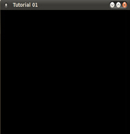

#第一课 Create a Window  
##Background  

OpenGL 标准没有指定任何用于建立和使用窗口的 API。在x系统中提供 OpenGL 的接口为 GLX。Windows 提供 WGL 而 MacOS 提供 CGL。为了建立一个能够显示图像的窗口，我们直接使用这些接口，这样就不用关心在不同操作系统中的具体实现细节。我们这里使用的库叫 ‘OpenGL utility library’ 简称 GLUT。它为窗口的管理、事件处理、IO 控制和一些其他的设备管理提供了一个简单的 API。此外，GLUT 是跨平台的，这使移植更方便。SDL 和GLFW 可代替 GLUT。

##Source walkthrough  

```
glutInit(&argc,argv);
```  

这个函数是为了初始化 GLUT。里面的参数可以直接从命令行中得到，同时可以包含其他有用的选项比如 '-sync' 和 '-gldebug'，这样可以自动的检查GL的错误并独立的显示它们。

```
glutInitDisplayMode(GLUT_DOUBLE | GLUT_RGBA);
```  

现在我们学习设置一些 GLUT 的参数，GLUT_DOUBLE 设置双缓冲（double buffering，即当一个 buffer 显示的时候，另一个 buffer 用来绘制）和 color buffer，后者是大多数渲染结束的地方（比如屏幕）。后面章节中我们经常用到这两个和其他的参数。

```
glutInitWindowSize(1024, 768);    
glutInitWindowPosition(100, 100);  
glutCreateWindow("Tutorial 01");
```

这些函数设置了窗口的参数（包括窗口大小、窗口位置以及窗口标题）并创建窗口。  

```
glutDisplayFunc(RenderSceneCB);
```

因为我们工作在一个窗口系统中，可以通过事件回调函数与运行中的项目进行交互。GLUT 可以和基本的窗口系统进行交互，并且提供给我们一些回调函数。在这里我们仅仅使用了一个主回调函数，这个主回调函数完成了一帧中的所有渲染工作。这个函数被 GLUT 内部循环不断的调用。  

```
glClearColor(0.0f,0.0f, 0.0f, 0.0f);
```

在 OpenGL 中，这是我们第一次遇到 ‘state’ 这个概念。提出 ‘state’ 的原因是：渲染是一个复杂的任务，不能够像对待一个接受参数的函数命令（设计良好的函数不会有太多参数）一样对待它。你需要去指定 shaders、buffers 和各种可以影响渲染过程的属性。此外，你会经常需要让几个渲染操作有同样的设置（比如，如果你从未禁用深度测试的功能，那就不用在每次渲染调用的时候去设置它）。这就是为什么 “大部分渲染操作的配置是通过设置 OpenGL 状态机内的属性和参数值来完成，而渲染命令仅能使用跟绘制的顶点的个数和初始偏移量有关的个别参数” 的原因。在调用一个状态改变函数之后（改变 OpenGL 的状态），这个状态将保持不变直到用不同的参数值再次调用此函数。上面这个函数是用来设置清除帧缓存（后面介绍）时要用到的颜色。颜色有四个通道（RGBA），而且它被指定为 0.0 – 1.0 之间标准化的值。  

```
glutMainLoop();
```

这个函数调用将控制传递给 GLUT，并且开启了它自己内部的循环。在这个循环中，它监听来自窗口系统的事件并通过我们设置的回调函数传递给 GLUT。在本例子中，GLUT只调用我们定义用来显示窗口的回调函数（RenderSceneCB），以使我们能渲染帧。
 
```
glClear(GL_COLOR_BUFFER_BIT);
glutSwapBuffers();
```

第一个函数的功能仅仅就是清除帧缓存（使用我们在上面指定过的颜色）。第二个函数调用是为了告诉 GLUT 在 backbuffer 和 frontbuffer 之间进行交换。在通过帧回调函数的下一个循环中，我们将场景渲染到当前的 frontbuffer 中，而 backbuffer 将被显示。  

##Operation Resuls


