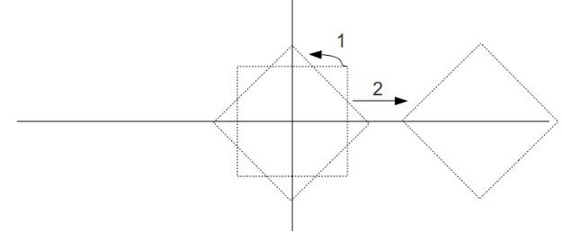
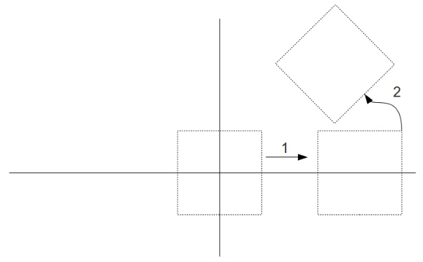

#第十一课 矩阵连乘
##Background
在前几章中我们学习了一些变换，通过它们我们能将3D世界中的物体灵活的变换到任意位置。之后我们还要学习两个变换（相机控制和透视投影），但是正如你可能已经猜到的，我们需要一个变换的组合。在很多情况下，你需要缩放物体以适应你的 3D 世界的尺寸，将其旋转到需要的方向，平移到某处等等。直到现在，我们每次都只能使用一个单一的变换。为了实现上述一系列的变换，我们需要用顶点坐标与第一个变换矩阵相乘，然后将前面的结果与下一个的变换矩阵相乘。如此持续到所有的变换矩阵都应用到顶点上面。要实现这个效果，最简单的办法就是向着色器提供所有的变换矩阵并依次让他们做相乘运算。然而，这种方法非常低效，因为对于顶点来说所有的变换矩阵都是一样的，而改变的只是顶点的位置而已。幸运的是，线性代数提供了一套规则使得我们的处理变得简单。这个规则告诉我们，给定一组矩阵 M0...Mn 和一个向量 V，以下式子恒成立： 

Mn * Mn-1 * ... * M0 * V = (Mn* Mn-1 * ... * M0) * V

所以如果我们计算：

N = Mn * Mn-1 * ... * M0

然后：

Mn * Mn-1 * ... * M0 * V = N * V

这意味着我们可以直接将 N 计算出来，然后将其作为一致变量传递到着色器和每个顶点相乘。这就要求 GPU 对每个顶点只进行一次矩阵或者向量的相乘。

当我们生成 N 时你是怎么安排矩阵相乘的顺序的？需要注意的是向量会首先和最右边的矩阵相乘（本例中是M0）。然后从右向左，向量依次被每个矩阵变换。在3D图形中，你常常会希望先缩放物体然后旋转、平移，然后应用相机变换，最后经过透视投影变换到2D屏幕上。让我们看看如果你先旋转再平移这会发生什么：  



现在我们再看看先平移再旋转发生了什么:  
  



正如你看到的，在世界坐标系中，当你先平移物体后很难设置它的位置，因为如果你将其从原点移开然后再旋转，它会围绕着原点旋转，这实际上相当于你再次平移了这个物体。一般情况下，你都不会想出现这样的二次平移，所以我们可以通过先旋转然后平移的方法，断开这两种操作的依赖关系。这就是为什么建模应围绕原点并且越对称越好。这样当你缩放或者旋转物体时都没有副作用，而且被旋转或缩放的物体仍然会保持对称。

既然我们已经开始处理多个矩阵的变换，那么我们最好扔掉直接在渲染函数中更新矩阵的习惯，这个方法效果不怎么好还容易出错。取而代之我们引入了管线类。在这个类中我们使用一个简单的 API 来封装平移、旋转以及缩放矩阵的运算的具体细节。在设置了其内部所有的参数后，我们可以获得多个矩阵运算的最后结果矩阵。这个矩阵可直接被送到着色器中。

##代码  

```
 #defineToRadian(x) ((x) * M_PI / 180.0f)
 #define ToDegree(x) ((x) *180.0f / M_PI)
```

在这章我们开始使用角度的弧度值。碰巧的是，标准C语言库里面也使用弧度作为参数。上面的宏命令将角度和弧度互换。  

```
inline Matrix4foperator*(const Matrix4f& Right) const
{
    Matrix4fRet;
    for(unsigned int i = 0 ; i < 4 ; i++) 
    {
       for (unsigned int j = 0 ; j < 4 ; j++) {
           Ret.m[i][j] = m[i][0] * Right.m[0][j] +
                  m[i][1]* Right.m[1][j] +
                  m[i][2] * Right.m[2][j]+
                  m[i][3] * Right.m[3][j];
      }
    }
    returnRet;
}
```  

重载\*号运算符用于矩阵相乘，正如你看到的，在矩阵相乘运算中，我们使用左边矩阵每一行与右边矩阵的相应列进行点成操作。这个操作在管线类的实现上至关重要。

```
class Pipeline
{
       public:
              Pipeline()
              { ...  }
              void Scale(floatScaleX, float ScaleY, float ScaleZ)
              { ... }
              void WorldPos(float x,float y, float z)
              { ... }
              void Rotate(floatRotateX, float RotateY, float RotateZ)
              { ... }
              const Matrix4f*GetTrans();
       private:
              Vector3f m_scale;
              Vector3f m_worldPos;
              Vector3f m_rotateInfo;
              Matrix4fm_transformation;
};
```

管道类抽象了对对象进行矩阵变换的所有细节。这里有三个私有成员向量来储存对象的缩放、世界坐标位置和旋转轴。另外还有API来设置他们，以及一个用来得到代表这些变换的最终矩阵的函数。  

```
const Matrix4f*Pipeline::GetTrans()
{
       Matrix4f ScaleTrans, RotateTrans, TranslationTrans;
       InitScaleTransform(ScaleTrans);
       InitRotateTransform(RotateTrans);
       InitTranslationTransform(TranslationTrans);
       m_transformation = TranslationTrans * RotateTrans *ScaleTrans;
       return &m_transformation;
}
```

这个函数根据当前的对象信息的配置初始化了三个互不相关的矩阵，在这个函数中这三个变换矩阵被一个一个相乘起来，并返回最后的结果。请注意这个顺序是硬编码的。如果你需要一些灵活性，你可以使用一个位掩码来指明顺序。也需要注意它总是将最后的变换矩阵储存下来作为成员变量。如果上次调用过此函数后配置没有发生变化，你可以尝试来优化这个函数，比如生活通过设置一个标记来检查矩阵是否发生变化，如果没有则可以直接返回储存的矩。

这个函数使用三个私有函数，在每个函数中都通过我们在前面介绍的方法来生成不同的变换矩阵。接下来的章节中，这个类将被扩展来处理相机控制和透视投影。

 
```
Pipeline p;
p.Scale(sinf(Scale * 0.1f),sinf(Scale * 0.1f), sinf(Scale * 0.1f));
p.WorldPos(sinf(Scale),0.0f, 0.0f);
p.Rotate(sinf(Scale) *90.0f, sinf(Scale) * 90.0f, sinf(Scale) * 90.0f);
glUniformMatrix4fv(gWorldLocation,1, GL_TRUE, (const GLfloat*)p.GetTrans());
```

这些是渲染函数的变化。我们指定一个管线类对象，配置它并且将结果矩阵传递到着色器。我们也可以修改这些参数，在最后的图像中来看看它们的效果。  

