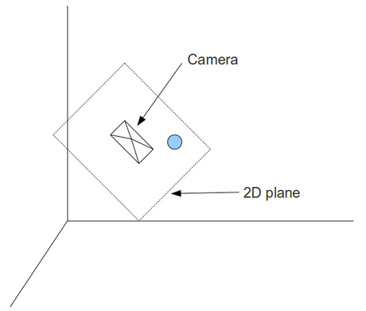
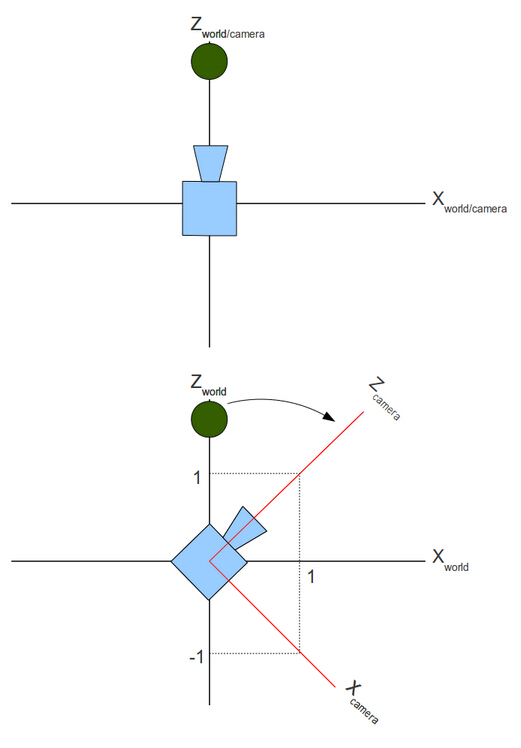
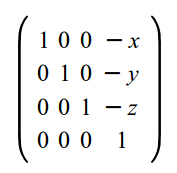
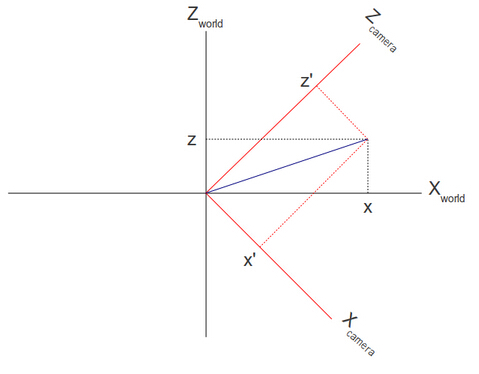
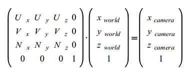
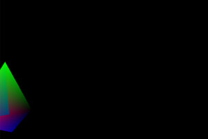

#第十三课 相机空间
##背景
在前面的内容中我们看见两种类型的顶点变换。第一种类型的变换是改变对象的位置（平移、旋转）或者尺寸（放缩）。这些变换允许我们在 3D 世界中把一个对象放在任何位置。第二种类型的变换是透视投影变换，把在 3D 世界坐标系下的顶点投影到 2D 世界坐标系下（比如一个平面上）。一旦坐标变换为 2D 坐标，那么我们非常容易的就能将这些 2D 坐标映射到屏幕坐标系下，根据这些屏幕坐标系下的坐标以及其对应的拓扑结构，光栅化器对他们进行光栅化以得到对应的图元。

在之前的所有章节中我们还没接触过相机，我们都是默认相机位于 3D 空间的原点。事实上，我们希望能够自由的控制相机，这样就能把它放在 3D 世界的任何位置，并将顶点投影到在相机正前方的 2D 平面上。这样就能够反映出相机和屏幕上的对象之间的正确的位置关系。

在下面这幅图片中，我们从相机的背面看过去。在相机前面有一个虚拟的 2D 平面，球被投影到该平面上。相机是倾斜着的，所以这个 2D平面也是倾斜着的。由于相机视角的限制，最终能显示到屏幕上的内容只是 2D 平面的一个矩形部分，在该矩形的外部的所有东西都将被减掉。我们的目标就是把这个矩形中的内容渲染到我们的屏幕上。  



理论上我们可以生成这样的变换矩阵，实现把一个位于 3D 空间中的对象投影到坐落在世界坐标系任意位置的相机正前方的 2D 平面上，然而，这其中的数学变换会比我们之前遇见的要复杂很多。而当相机被置于 3D 世界坐标系的原点并且朝着 Z 轴时，整个投影过程就简单了很多。比如，一个对象位于（0，0，5）处，同时相机位于（0，0，1）处并且朝向 Z 轴的负方向。如果我们把相机和对象都朝着原点移动一个单位，这时两者的相对距离和方向（就相机的方向而言）时保持不变的，而区别只是相机此时位于原点。如果我们用这种方法对场景中的所有对象进行处理，使得在保证相机与场景中对象相对位置不变的前提下将相机移动到原点并且朝向 Z 轴负方向，这样我们就能使用上一节中介绍的内容对场景中的对象进行投影并将其渲染到屏幕上。

上面的例子很简单，因为相机的方向已经沿着 Z 轴负方向，并且通常相机的朝向都是沿着坐标轴的。但是如果相机指向其他方向将会发生什么呢？看下面的图片。简单的说，这是一个 2D 坐标系统，我们沿着 Y 轴的负方向观察。  




相机原本是朝向 Z 轴的负方向的，但是之后顺时针旋转了 45 度。就如你看到的，相机定义它自己的坐标系统，这个坐标系可能与世界坐标系相同（上面的图片），也可能不同（下面的图片）。所以实际上同时存在两个坐标系统。即一个用来指定对象的世界坐标系，和一个与相机的“轴”(target, up and right)对齐的相机坐标系统。这两个坐标系就是我们所知的**世界空间**和**相机/视图**空间。

上图中，绿球位于世界坐标系中的（0，y，z）。而对于相机空间来说，它位于坐标系的左上角（换言之，它位于 X 轴的负半轴，Z 轴的正半轴），我们要做的就是找到绿球在相机空间中的位置。此时我们可以先简单的不用去管世界空间，仅仅关注相机空间。在相机空间中，相机位于原点方向，指向Z轴负方向，对象直接放置在相机空间中，这样我们就可以用我们学过的方法来对对象进行渲染。

相机顺时针旋转了45度相当于绿球逆时针旋转了45度，相机的移动也同时可以看成是将对象沿着相反的方向移动。所以总的来说，我们需要增加两个新的变换，并将它们加入我们已有的变换管线中。我们需要，在让相机移动到原点的过程中保持对象和相机之间相对位置不变，同时也需要让对象沿着与相机旋转方向的反方向旋转。

移动相机是非常简单的。如果相机位于（x，y，z），那么平移变换就是（-x，-y，-y）。原因很明显——相机在世界坐标系下用向量（x，y，z）做平移变换，所以想要将相机移动回原点，那么我们就可以使用此向量的相反向量进行平移。变换矩阵如下所示：  



平移之后，下一步是将相机的朝向旋转到世界坐标系中指定的位置。我们想要找到位于世界坐标系下的顶点在相机定义的坐标系下位置。所以实际的问题是:我们如何从一个坐标系转换到另一个坐标系？  

再看看上面的图，我们发现世界坐标系是由三个线性无关的向量(1，0，0), (0，1，0) 和 (0，0，1)定义的。线性无关意思是我们找不到不全为 0 的三个变量 x，y，z 使得 x\*(1,0,0) + y\*(0,1,0) + z\*(0,0,1) = (0,0,0)。用几何术语来说，这意味着这三个向量中的任意两个都可以确定一个垂直于第三个向量的平面。通过上面的图我们很容易可以看出相机坐标系是由向量(1,0,-1), (0,1,0), (1,0,1)确定的。标准化这些向量后，这些向量变为(0.7071，0，-0.7071)，(0，1，0) 和(0.7071，0，0.7071)。

下面的图片展示了同一个向量在两个不同的坐标系之下的表示方式：  



现在我们知道了在世界坐标系中如何得到代表相机空间坐标轴的单位向量，也知道了在世界坐标系空间中向量的位置(x,y,z)，而我们要找的是向量(x',y',z')。我们可以利用点积的一个叫做“标量投影”的属性来对此进行计算，标量投影是通过将一个任意的向量A和一个单位向量B进行点积运算，最后得到 A 向量在 B 向量的方向上的投影。在上面的例子中，如果我们让向量(x，y，z)和代表相机 X 轴的单位向量进行点积运算，那么我们将得到 x' 值，通过同样的方法我们可以得到 y'，z'。(x',y',z')就是(x,y,z)在相机空间中的位置。 

现在就让我们来看看如何将上述的推理变成一个完成的解决方案。这里我们使用“UVN相机”来表示相机坐标系，这个方法的原理是相机坐标系可以看成是由下面三个向量组成的：

1. N – 由相机指向它的目标的向量。在一些3D的文献中也被称为'look at'。这个向量对应于Z轴。
2. V – 直立时，这个向量是竖直向上指向天空的。如果你正在编写飞机模拟仿真的程序并且飞机是翻转的，那么这个向量刚好是朝向地面的。这个向量对应于Y轴。
3. U – 这个向量从相机指向其右侧。它对应于X轴。

为了把一个位置向量从世界坐标系空间变换到由 UVN 向量定义的相机坐标系空间中，我们需要在位置向量和 UVN 向量之间进行一个点乘运算，它们的运算可以通过下面这个矩阵实现：  



这一节的代码中，你将会注意到着色器中的全局变量 'gWorld' 已经被重命名为 'gWVP'，WVP 代表 World-View-Projection。

##代码

在这一节中我决定做一个小的设计改变，把一些基本的矩阵操作代码从 Pipeline 类中移到 Matrix4f 类中。Pipeline 类通过调用 Matrix4f 类的方法来对各种变换矩阵进行初始化并最终生成一个完整的变换矩阵。  

```
(pipeline.h:85)
struct { 
    Vector3f Pos; 
    Vector3f Target;
    Vector3f Up;
} m_camera;
```

Pipeline 类有一些新的成员变量来储存相机参数。注意相机参数中缺少 'U' 轴。它将通过在 target 和 up 之间通过叉乘计算得到。此外这里有一个新的函数 SetCamera 来传递这些值。

```
(math3d.h:21)
Vector3fVector3f::Cross(const Vector3f& v) const
{
const float _x = y * v.z - z * v.y;
const float _y = z * v.x - x * v.z;
const float _z = x * v.y - y * v.x;
return Vector3f(_x, _y, _z);
}
```

Vector3f 类中有一个新的方法来计算两个 Vector3f 对象的叉积。两个向量的叉积会产生一个新的向量，这个新的向量垂直于前面两个向量所构成的平面。想对叉乘有更多的了解，你可以参考在维基百科（[Wikipedia](https://en.wikipedia.org/wiki/Cross_product)）。

```
(math3d.h:30)
Vector3f&Vector3f::Normalize()
{
const float Length = sqrtf(x * x + y* y + z * z);
x /= Length;
y /= Length;
z /= Length;
return *this;
}
```

为了生成 UVN 矩阵我们需要让这些向量成为单位向量。这个操作术语称作是向量的标准化，它的计算方法使让每个向量除以其自身的模。

```
(math3d.cpp:84)
voidMatrix4f::InitCameraTransform(const Vector3f& Target, const Vector3f&Up)
{
Vector3f N = Target;
N.Normalize();
Vector3f U = Up;
U.Normalize();
U = U.Cross(Target);
Vector3f V = N.Cross(U);
m[0][0] = U.x; m[0][1] = U.y; m[0][2]= U.z; m[0][3] = 0.0f;
m[1][0] = V.x; m[1][1] = V.y; m[1][2]= V.z; m[1][3] = 0.0f;
m[2][0] = N.x; m[2][1] = N.y; m[2][2]= N.z; m[2][3] = 0.0f;
m[3][0] = 0.0f; m[3][1] = 0.0f;m[3][2] = 0.0f; m[3][3] = 1.0f;
}
```

这个函数用于初始化相机变换矩阵，这个矩阵稍后会在 pipeline 类中使用，UVN 矩阵由 U，V，N 向量组成。因为顶点的位置向量将在矩阵的右边被乘（作为一列）。这相当于是在 U，V，N 向量和位置向量之间做点乘，通过这个运算这将生成三个标量值，这三个值就是在相机坐标系下顶点的 X，Y，Z 坐标的值。  

这个函数需要一个 target 向量和 up 向量作为参数。 “right” 向量可以通过这两个向量的叉乘得到。因为不确定参数是否为单位向量，所以我们标准化这些向量。在生成 U 向量后，我们还需要通过 target 向量和 right 向量之间进行叉乘来重新计算 up 向量。在后面我们开始移动相机的时候，将会发现重新计算 up 向量的原因，只更新 target 向量而 up 向量保持不变是较为简单的。然而，这意味着在 target 和 up 向量之间的角度将不是 90 度，导致这个坐标系统变得无效。通过计算 right 向量和 up 向量，我们将的得到一个每一对轴之间的角度都是 90 度的坐标系统。  

```
(pipeline.cpp:22)
constMatrix4f* Pipeline::GetTrans()
{
Matrix4f ScaleTrans, RotateTrans,TranslationTrans, CameraTranslationTrans, CameraRotateTrans,PersProjTrans;
ScaleTrans.InitScaleTransform(m_scale.x,m_scale.y, m_scale.z);
RotateTrans.InitRotateTransform(m_rotateInfo.x,m_rotateInfo.y, m_rotateInfo.z);
TranslationTrans.InitTranslationTransform(m_worldPos.x,m_worldPos.y, m_worldPos.z);
CameraTranslationTrans.InitTranslationTransform(-m_camera.Pos.x,-m_camera.Pos.y, -m_camera.Pos.z);
CameraRotateTrans.InitCameraTransform(m_camera.Target,m_camera.Up);
PersProjTrans.InitPersProjTransform(m_persProj.FOV,m_persProj.Width, m_persProj.Height, m_persProj.zNear, m_persProj.zFar);
m_transformation = PersProjTrans *CameraRotateTrans * CameraTranslationTrans * TranslationTrans *
RotateTrans * ScaleTrans;
return &m_transformation;
}
```

在这个获得最终的完整的矩阵的函数中，我们对其进行一些更新，现在我们只是新增了两个关于相机的新的矩阵它就已经变得相当复杂了。在完成了世界坐标系下的变换（对象的缩放，旋转，平移）后，我们通过移动相机到原点开始了对相机的变换，这个平移变换通过使用相机位置向量的反向量完成的，即所以如果相机在（1，2，3），那么为了让相机回到原点我们需要把相机沿（-1，-2，-3）这个向量移动。之后我们基于相机的 target 和 up 向量而生成相机的旋转矩阵。那么相机部分的变换就完成了，最后我们就得到了位于相机坐标系下的顶点坐标。

```
(tutorial13.cpp:76)
Vector3fCameraPos(1.0f, 1.0f, -3.0f);
Vector3fCameraTarget(0.45f, 0.0f, 1.0f);
Vector3fCameraUp(0.0f, 1.0f, 0.0f);
p.SetCamera(CameraPos,CameraTarget, CameraUp);
```

在主渲染循环中我们使用新的方法。我们将相机沿着 Z 轴负方向移动 3 个单位，然后将其稍向右和向上移动，up 向量我们简单的指定其指向 Y 轴的正半轴。相机的朝向我们设置为朝着 Z 轴的正方向并稍向右偏移。我们把所有的这些向量传递到 Pipeline 对象中，Pipeline 类将处理接下来的工作。

##操作结果
