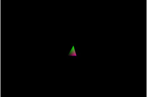

#第十四课 相机控制（一）
##背景
在之前的教程中我们学习了如果当相机不位于初始位置时，如何使得得场景中的物体正确的投影到屏幕上面，那么我们下一步就应该学着去控制这个相机，使得相机可以在场景中自由移动。我们可以用鼠标和键盘控制相机——鼠标控制视口方向，键盘控制相机的位置。这些都和第一人称视角相似，这一节我们主要来学习鼠标和键盘对相机的控制。

我们仍然使用上下左右四个方向键。记住，我们的相机的变换取决于相机的位置、target 向量和 up 向量。当我们使用键盘移动相机时，我们只改变了我们的位置信息。上下左右的操作不会导致相机倾斜或旋转，所以 target 向量和 up 向量都不会受到影响。

由于要捕捉到键盘的按键信息，所以我们这里用到另一个 GLUT API：glutSpecialFunc（）。当一个“特定”按键被按下时，并且我们之前为这个按键注册了一个回调函数，那么 glutSpecialFunc 就会去调用这个回调函数作为对这个按键按下的响应。这些特定的键包括：功能键、方向键和 PAGE-UP / PAGE-DOWN / HOME/END / INSERT 键。如果你想要捕获常规键（字符或者数字），那么请使用 glutKeyboardFunc（）。

##代码
相机的功能封装在相机类内。这个类存储相机的属性，并且可以通过接收到的移动事件改变这些属性。管线类获取这些属性并通过它们产生变换矩阵。

```
(Camera.h)
class Camera
{
public:
    Camera();
    Camera(const Vector3f& Pos, const Vector3f& Target, const Vector3f& Up);
    bool OnKeyboard(int Key);
    const Vector3f& GetPos() const
    const Vector3f& GetTarget() const
    const Vector3f& GetUp() const
private:
    Vector3f m_pos;
    Vector3f m_target;
    Vector3f m_up;
};
```

这里我们声明了一个相机类，它存储着创建视口变换矩阵所需要的三个属性——位置向量、target 向量 和 up 向量。有两个构造函数。默认构造函数简单地将相机摆放在从原点并且朝向 Z 轴负方向，up 向量指向 “天空”（0,1,0）。此外我们还可以使用其带有形参的构造函数来创建一个具有特定属性值的相机。OnKeyboard() 函数里面实现了相机对于键盘事件的处理，它返回一个布尔值用来显示该事件是否被相机响应。如果点击的按键与我们定义的响应事件相关，则返回 true，否则返回 false。  

```
(Camera.cpp:42)
bool Camera::OnKeyboard(int Key)
{
    bool Ret = false;
    switch (Key) {
    case GLUT_KEY_UP:
    {
        m_pos += (m_target * StepSize);
        Ret = true;
    }
    break;
    case GLUT_KEY_DOWN:
    {
        m_pos -= (m_target * StepSize);
        Ret = true;
    }
    break;
    case GLUT_KEY_LEFT:
    {
        Vector3f Left = m_target.Cross(m_up);
        Left.Normalize();
        Left *= StepSize;
        m_pos += Left;
        Ret = true;
    }
    break;
    case GLUT_KEY_RIGHT:
    {
        Vector3f Right = m_up.Cross(m_target);
        Right.Normalize();
        Right *= StepSize;
        m_pos += Right;
        Ret = true;
    }
    break;
    }
    return Ret;
}
```

这个函数根据键盘事件对相机进行移动。GLUT 定义了与方向键相应的宏命令，而上面的switch语句正是基于此。不幸的是，这些宏定义的类型都是只是“int”类型，而不是枚举类型。

向前向后的移动是最简单的，因为移动总是沿着 target 向量，我们就只需要让当前位置加上或者减去 target 向量就可以了，target 向量本身不改变。注意，在加上或者减去target 向量之前，我们用一个叫做 “StepSize” 的常数来缩放它。对所有的方向键，我们都做如此处理。StepSize 提供了一个改变相机移动速度的方法（在后面我们也许将会把这个值添加到类属性中）。为使步长一致，我们要确保我们总是乘上单位长度的向量（即我们必须确保 target 向量和 up 向量是单位长度的）。

向侧面移动则有些复杂，因为它是沿着垂直于 target 向量和 up 向量所确定的平面的矢量的移动。这个平面将三维空间分成了两个部分，并且有两个向量垂直于它，且方向相反。我们称其中的一个向量为 “left” ，另一个为 “right” 。这两个向量是由 target 向量和 up  向量的叉乘两种不同情况得到——target × up 和 up × target （叉积运算没有交换律——也就是说，在叉积运算中，改变参数的顺序会得到不同的结果）。得到left / right向量之后，我们先将其规范化，之后再用 StepSize 缩放，最后添加到 position变量里面（使相机向左右方向移动）。此外，target 向量和 up 向量不会受到影响。

注意，这个函数的内部操作里使用了一些新的运算符，比如 “+=” 和“-=”，这些都在 Vector3f 类中进行了重载。

```
(tutorial14.cpp:73)
static void SpecialKeyboardCB(int Key, int x, int y)
{
    GameCamera.OnKeyboard(Key);
}
static void InitializeGlutCallbacks()
{
    glutDisplayFunc(RenderSceneCB);
    glutIdleFunc(RenderSceneCB);
    glutSpecialFunc(SpecialKeyboardCB);
}
```

这里，我们注册一个新的回调函数来处理键盘事件,在按键被触发的时候，回调函数接收按键按下的信息，并且把这个事件传递给成相机类的一个实例，这个实例早已在全局变量中进行了定义。

```
(tutorial14.cpp:55)
p.SetCamera(GameCamera.GetPos(), GameCamera.GetTarget(), GameCamera.GetUp());
```

以前，我们在管线类中用硬编码的方式来初始化相机参数。现在，我们不再使用这些向量，而是从Camera类直接获取相机属性。

##操作结果
