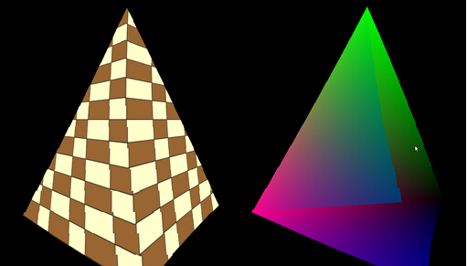
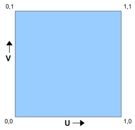
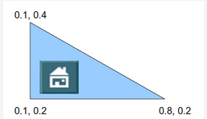
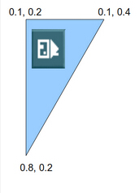
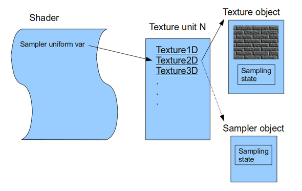
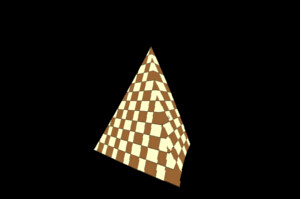

#第十六课 基本的纹理贴图
##Background
纹理贴图就是将任意一种类型的图片应用到 3D 模型的一个或多个面上。图片（也可以称之为纹理）内容可以是任何东西，但是他们一般都是一些比如砖，叶子，地面等的图案，纹理贴图增加了场景的真实性。例如，对比下面的两幅图片。  



为了实现纹理贴图，你需要进行三个步骤：将图片加载到 OpenGL 中；定义模型顶点的纹理坐标（以对其进行贴图）；用纹理坐标对图片进行采样操作进而得到像素颜色。因为我们可能会对三角形进行缩放，旋转，平移，并最终投影到屏幕上，所以它最终显示到屏幕上的方式是多种多样的，并且由于相机参数的不同看起来也会有很大差异。GPU 需要做的就是让图片跟随着三角形的顶点而运动而使场景看上去真实可信。为了实现这些功能，开发者为每个顶点绑定一个纹理坐标。当 GPU 光栅化这些三角形的时候，它会对整个三角形表面的纹理坐标进行插值计算，之后在片元着色器中我们将这些纹理坐标映射到纹理上，这个行为被称为‘采样’。采样的结果是产生纹素（纹理中的），纹素通常都包含一种颜色，我们将这个从纹理中提取出来的颜色绘制到对应的屏幕像素上实现对模型的着色。在接下来的章节中将会看到一个纹理像素可以包含不同类型的数据，并且用于产生多种效果。

OpenGL 支持多种类型的纹理比如 1D，2D，3D，立方体纹理等等，不同类型的纹理可被用于不同的技术中。这里我们选择使用 2D 纹理，一个 2D 纹理可以有任意的高度和宽度，但必须是在规定的范围之内。用高度 /* 宽度可以得到纹理的像素值。但是我们不会用这个高度值和宽度值来作为定点的纹理坐标，因为那样做局限性太大，因为如果用不同 width / height 的纹理替换原来的纹理时，我们就必须更新所有顶点的纹理坐标。理想的做法是只更新纹理但不更新纹理坐标，因而所有纹理坐标是被指定在 ‘纹理空间’（规范化的范围是[0，1]）中的。这表示纹理坐标通常都是一个小数，让它乘以纹理的宽度 / 高度就得到了纹理中该像素的坐标。例如，如果一个纹理坐标为[0.5，0.1]，纹理的宽度为 320，高度为 200，那么这个像素的坐标是（160，20）（0.5 * 320 = 160 ， 0.1 * 200 = 20）。

通常习惯用法是使用 U 和 V 作为纹理空间的轴，U 对应于在 2D 笛卡尔坐标系中的 X 轴，V 则对应 Y 轴。OpenGL 认为 U 轴的方向是从左指向右，V 轴上的值从下指向上。如下图:  



这幅图片表示纹理坐标系，你可以看见纹理坐标系的原点在左下角。U 轴向右逐渐变大，V 轴向上逐渐变大。现在考虑有一个三角形，且其纹理坐标如下定义：  



假设我们在模型上应用了一个纹理，并且使用这些纹理坐标，我们得到了一个如上图所示的一个结果。现在这个三角形经过许多变换，在进行光栅化的时候，它看起来如下:  



如你所看见的，纹理坐标作为定点的核心属性，在各种变换过程中并不改变。当对纹理进行纹理坐标插值时，大部分像素会得到与原来的图片中相同的纹理坐标（它们相对于顶点来说相对位置没有改变），并且因为三角形是不断运动的，所以贴在它上面的纹理也跟着做同样的运动。这意味着原来的三角形旋转，放大，缩小，纹理也紧跟着这样变换。注意也有改变纹理坐标的方法，这是为了在表面对纹理进行移动或其他处理，但是现在我们不讨论这一情况。

另一个与纹理相关的重要概念是 ‘过滤’。我们已经讨论过了如何把纹理坐标映射到一个纹素上。在纹理上纹素的位置总是被指定为整数，但是如果纹理坐标（记住纹理坐标总是在 0 到 1 之间）映射到纹理上的位置为(152.34，745.14)将会发生什么呢？最容易的想到的就是四舍五入到(152,745). 嗯，这种方法确实有效并且会提供一个精确的结果，不过在某些情况下这个效果不怎么好。一个更好的方法是取四个相邻的纹素位置如（(152，745), (153，745), (152，744) 和(153，744)），在它们的颜色之间做线性插值。这个线性插值的结果一定要反应出每个纹素点与(152.34，745.14)之间的相对距离之间的关系。最靠近(152.34，745.14)的纹素对最终得到的结果影响最大，而远一点的坐标对最终得到的结果影响就小一些，这种办法看上去会比之前的那种方法更好。 

这种确定最终纹素值的方法被称为过滤。那种简单的通过四舍五入的方式得到纹素的方法叫做 ‘nearest filtering’ ，而刚刚我们介绍的更复杂一点的方法叫做‘linear filtering’。‘nearest filtering’另外一个名字是‘point filtering’。OpenGL 支持多种类型的过滤，你可以选择这其中的一种。通常要得到更好的过滤结果需要更多的 GPU 运算资源，并且对帧速率有一定的影响。选择过滤方法应考虑过滤效果与目标平台的性能之间的平衡。

既然我们已经理解了纹理坐标的概念，现在让我们现在看看 OpenGL 中的纹理映射是如何完成的。要在 OpenGL 中进行纹理贴图，我们需要弄清楚这几个概念：**纹理对象**，**纹理单元**，**采样器对象**，**采样器一致变量**。

纹理对象包含它本身纹理图片的数据，比如纹素。纹理可以是不同的类型的（1D，2D等等），分别有不同维度。其底层数据类型有不同的格式（RGB，RGBA等等）。OpenGL 提供一个方法，用来指定数据和上述所有属性在内存中的开始地址，并将数据加载进入 GPU。也有很多其他的参数你可以控制，比如控制过滤类型等等。与顶点缓冲区对象类似，纹理对象也有一个句柄。在创建句柄和加载纹理数据和参数后，你可以通过将不同的纹理句柄绑定到 OpenGl 的状态机上来实现纹理的切换，这样你就不需要重新将数据加载进 GPU 中。而且从此，确保数据在渲染开始之前被及时的加载进入 GPU 就成为了 OpenGL 驱动程序的工作。

纹理对象并不是直接被绑定到着色器（实际采样的地方），而是被绑定到一个纹理单元，纹理单元的索引会被传递到着色器中。所以着色器是通过纹理单元来访问纹理对象。OpenGL 中通常可以有多个纹理单元，具体的个数取决于你显卡的性能。为了绑定一个纹理对象 A 到纹理单元 0，首先你需要确定纹理单元 0 被激活，之后再绑定纹理对象 A。你现在可以激活纹理单元 1 并给它绑定一个不同的（甚至是相同的）纹理对象。此时纹理单元 0 仍然保持与纹理对象 A 的绑定。  

事实上每一个纹理单元可以同时绑定多个不同的纹理对象，前提是这几个纹理对象的类型是不同的。纹理对象的类型被称为纹理对象的 ‘target’。当你绑定一个纹理对象到一个纹理单元时，你可以为其指定 target（1D,2D等等）。所以你可以将纹理对象 A 的 target 设定为 1D ，纹理对象 B 的 target 可以设定为 2D，这样这两个纹理对象就可以绑定到同一个纹理单元。

采样操作通常发生在片元着色器的内部，并有一个特殊的函数来实现采样操作。采样函数需要知道纹理单元的句柄，因为着色器中可能会有多个纹理单元，OpenGL提供了一系列的 uniform 变量来存放从程序中传入的纹理单元变量，这些变量根据纹理的 target 不同分为：'sampler1D', 'sampler2D', 'sampler3D', 'samplerCube'等等。你可以按需要定义多个采样器一致变量，然后通过程序将每个纹理单元的值分配给每个一致变量。当你通过采样器变量来调用采样函数时，相应的纹理单元（和纹理对象）就会被使用。

最后一个概念就是**采样器对象**，不要将他与**采样一致变量**混淆！它们两个是完全不相关的东西，区别在于纹理对象既包含纹理数据，又包含设置采样操作的参数，这些参数是采样状态的一部分。然而你也可以自己建立一个采样器对象，并对它的采样参数进行设置，并把它绑定到纹理单元。这样做之后，之前在纹理对象中定义的采样状态将会被覆盖。这里先不用担心，因为现在我们不会用到采样器对象，但是我们需要知道它的存在。 

下面的一幅图中总结了我们上面介绍的纹理的概念之间的关系:



##代码
OpenGL 可以从内存中加载不同类型的纹理数据，但是却不提供将纹理文件加载到内存的功能（如PNG、JPG图片文件），我们可以使用一个扩展库来完成这些工作，这里我们使用 ImageMagick 来加载图片文件，它是一个免费的软件库，可以支持许多图片类型并且支持跨平台。

大部分处理纹理的操作都被封装在下面这个类：

```
(ogldev_texture.h:27)
class Texture
{
public:
   Texture(GLenum TextureTarget, const std::string& FileName);
   bool Load();
   void Bind(GLenum TextureUnit);
};
```

当创建一个纹理对象的时候，你需要指定一个 target（这里我们使用 GL_TEXTURE_2D ）和文件名，之后调用Load()函数来加载纹理,但是这可能会调用失败，比如文件不存在或者 ImageMagick 遇到其他错误。当你想要使用一个具体纹理对象时，你需要将它绑定到一个纹理单元上。

```
(ogldev_texture.cpp:31)
try {
   m_pImage = new Magick::Image(m_fileName);
   m_pImage->write(&m_blob, "RGBA");
}
catch (Magick::Error& Error) {
   std::cout << "Error loading texture '" <<m_fileName << "': " << Error.what() << std::endl;
   return false;
}
```

我们通过上面的代码使用 ImageMagick 从文件中加载纹理到内存，为加载进 OpenGL 中做准备。我们先用文件名实例化一个 Magic::Image 对象。它会将纹理加载进内存中。但是这些数据是ImageMagick 私有的，不能被 OpenGL 直接使用。下一步我们以 RGBA（红，绿，蓝和alpha通道）格式把图片数据写入 Magic:: Blob 对象中。BLOB（二进制大型对象）是一种非常有用的机制，它以外部项目可以使用的方式存储内存中已编码的图片。如果存在错误，将会抛出异常，所以我们需要做好准备。

```
(ogldev_texture.cpp:40)
glGenTextures(1,&m_textureObj);
```

这个 OpenGL 函数非常相似于 glGenBuffers()。它生成指定数目的的纹理对象并将其句柄储存在 GLuint 数组指针中（第二个参数就是）。在这里我们只需要一个对象。

```
(ogldev_texture.cpp:41)
glBindTexture(m_textureTarget,m_textureObj);
```

接下来我们将调用几个与纹理对象相关的函数，这种调用形式非常类似于我们在使用顶点缓冲区时所做的工作，OpenGL 需要知道要操作哪个纹理对象，这就是glBindTexture() 函数的目的。它告诉 OpenGL 在接下来纹理的相关调用中涉及到的是哪个纹理，直到一个新的纹理对象被绑定时才发生变化。除了纹理对象的句柄（第二个参数），它还需要指定纹理 target（可能是 GL\_TEXTURE\_1D，GL\_TEXTURE\_2D 等等），你可以同时将不同的纹理对象绑定在不同的 target 上。在代码中，target 是作为构造函数的参数被传递进去的（此处我们用 GL_TEXTURE_2D ）。

```
(ogldev_texture.cpp:42)
glTexImage2D(m_textureTarget, 0, GL_RGBA, m_pImage->columns(),m_pImage->rows(), 0, GL_RGBA, GL_UNSIGNED_BYTE, m_blob.data());
```

这个相当复杂的函数用来加载纹理对象的主要部分（即纹理数据）。OpenGL 中有多个 glTexImage* 函数并且每一个函数都可以指定不同的 target。纹理 target 总是第一个参数。第二个参数是 LOD(Level-Of-Detail），一个纹理对象可以包含同一个纹理的多个不同分辨率版本，这就是 mip-mapping。每一个 mip-map 有着一个不同的 LOD 值，从 0（代表最高的分辨率）开始，随分辨率降低 LOD 值增大。现在我们只有一个 mip-map，所以传入0 。

下一个参数是 OpenGL 储存纹理数据的内部格式。例如，你可以传入有着四个颜色通道（RGBA）的纹理，但是如果你指定参数为 GL\_RED，那么你得到的纹理只有红色通道。我们使用 GL\_RGBA 来得到完整的纹理颜色。接下来两个参数是纹理的宽度和高度（按像素来说）。当加载纹理时，ImageMagick 顺便为我们把这两个值存了下来，而我们通过 Image::columns()/rows() 来获取高度宽度。第5个参数是边框的宽度，现在我们设为0.

最后三个参数指定纹理数据来源，分别是格式，类型和内存地址。数据格式用于确定需要使用的颜色通道的个数，需要与我们写入内存中的 BLOB 中的数据进行匹配；类型描述每一个通道的基本数据类型；OpenGL 支持很多数据类型，但是在 ImageMagickBLOB 中，每个通道都是一个字节，所以我们使用 GL\_UNSIGNED_BYTE；最后一个参数是实际数据的内存地址，通过 Blob::data() 函数从 BLOB 中获取。

```
(ogldev_texture.cpp:43)
glTexParameterf(m_textureTarget, GL_TEXTURE_MIN_FILTER, GL_LINEAR);
glTexParameterf(m_textureTarget, GL_TEXTURE_MAG_FILTER, GL_LINEAR);
```

函数 glTexParameterf 用于控制纹理的采样操作，这些都是纹理采样状态机的一部分。这里我们为纹理的放大和缩小设置滤波参数。每个纹理有给定的宽度和高度，但是纹理却经常被用在与纹理本身的尺寸不相称的三角形上。在一般情况下纹理都会比实际的三角形偏大或者偏小。在这种情况下，我们可以通过对滤波的设置来决定如何对纹理进行放大或者缩小操作来匹配三角形的尺寸。当光栅化的三角形比纹理大时（比如三角形非常靠近相机）我们必须用一个纹理像素覆盖三角形的几个像素（放大）。当三角形比纹理小的时候（比如三角形离相机比较远），几个纹理像素被三角形上的一个像素覆盖（缩小）。这里我这两种情况我们都选择线性插值过滤类型。就如之前我们见过的，线性插值通过对采集目标纹素周围的纹素，并且基于到目标纹素的距离来对周围的纹素进行颜色混合。

```
(ogldev_texture.cpp:49)
void Texture::Bind(GLenum TextureUnit)
{
   glActiveTexture(TextureUnit);
   glBindTexture(m_textureTarget, m_textureObj);
}
```

随着我们的 3D 程序变得越来越复杂，在一个渲染循环中的不同 DrawCall 中会用到许多不同的纹理，所有在 DrawCall之前，我们需要将在绘制中药用到的纹理对象绑定到我们想要的纹理单元上，这样片元着色器才能对其进行采样。这个函数使用纹理单元的枚举值( GL\_TEXTURE0，GL\_TEXTURE1, 等等)作为参数。使用 glActiveTexture() 来激活纹理单元，之后将纹理对象绑定到纹理单元上。这个对象将一直被绑定在这个纹理单元上直到有其他纹理对象被绑定到这个纹理单元上。

```
(shader.vs)
 #version 330
layout (location = 0) in vec3 Position;
layout (location = 1) in vec2 TexCoord;
uniform mat4 gWVP;
out vec2 TexCoord0;
void main()
{
   gl_Position = gWVP * vec4(Position, 1.0);
   TexCoord0 = TexCoord;
};
```

这是更新了之后的顶点着色器，它新增了一个叫做 TexCoord（一个 2D 向量）的输入参数。在顶点着色器中并不输出颜色，而是直接将其传递给片元着色器。光栅器通过对顶点的纹理坐标进行插值，从而得到面上各个片元的纹理坐标，并以此纹理坐标来从纹理中获得片元的颜色值。

```
(shader.fs)
in vec2 TexCoord0;
out vec4 FragColor;
uniform sampler2D gSampler;
void main()
{
    FragColor = texture2D(gSampler, TexCoord0.xy);
};
```

这是更新后的片元着色器，它有一个输入变量叫做 TexCoord0。TexCoord0 包含了我们从顶点着色器中经插值得到的纹理坐标。还有一个一致变量叫 gSampler（sampler2D 类型），这是一个采样器一致变量。应用程序需要给这个变量设置纹理单元的值，以使片元着色器能够通过这个采样器访问纹理。在主函数中则只做了一件事——通过 OpenGL 内部的 texture2D 函数对纹理进行采样。第一个参数是采样器一致变量，第二个参数是纹理坐标。在经过过滤之后，将返回采样获得的纹素（在这里纹素中包含的是颜色）。这是在这一节中这就是我们的片元最终获得的颜色值。下一节中我们将看到光照参数对片元颜色的一些简单影响。

```
(tutorial16.cpp:128)
Vertex Vertices[4] = { 
    Vertex(Vector3f(-1.0f, -1.0f, 0.5773f), Vector2f(0.0f, 0.0f)),
    Vertex(Vector3f(0.0f, -1.0f, -1.15475), Vector2f(0.5f, 0.0f)),
    Vertex(Vector3f(1.0f, -1.0f, 0.5773f), Vector2f(1.0f, 0.0f)),
    Vertex(Vector3f(0.0f, 1.0f, 0.0f), Vector2f(0.5f, 1.0f))
};
```

在这一章之前，我们的顶点缓冲区仅仅是连续的 Vector3f 结构体（包含 position ）序列。现在我们的 'Vertex' 结构体不仅包括 position，还包括纹理坐标（Vector2f）。

```
(tutorial16.cpp:80)
...
glEnableVertexAttribArray(1);
...
glVertexAttribPointer(0, 3, GL_FLOAT, GL_FALSE, sizeof(Vertex), 0);
glVertexAttribPointer(1, 2, GL_FLOAT, GL_FALSE, sizeof(Vertex), (constGLvoid*)12);
...
pTexture->Bind(GL_TEXTURE0);
...
glDisableVertexAttribArray(1);
```

这是我们的渲染循环中的改变。首先我们通过 glEnableVertexAttribArray(1) 来启用纹理属性，之前我们已经用通样的方式启用了顶点的位置属性。这刚好对应于在顶点着色器中的布局声明。接下来我们调用 glVertexAttribPointer 来指明纹理坐标在顶点缓冲区的位置。纹理坐标由两个浮点型数据组成，刚好和第二个，第三个参数对应。注意一下第五个参数，这是 Vertex 结构体（包括位置坐标和纹理坐标）的大小。这个参数告诉 OpenGL 顶点缓冲区中相邻顶点之间同一属性之间间隔的字节数。在我们的例子中，缓冲区内储存顺序为: pos0, texturecoords0, pos1, texturecoords1 等等。在之前的章节中，我们只有位置信息，所以参数设置为0或者sizeof(Vector3f)是可以的。但是现在我们有超过一个属性，所以间隔只能是 Vertex 结构体的字节数。最后一个参数是从 Vertex 结构体的开始位置到纹理属性位置间的偏移量。为使函数得到预期的偏移量，我们必须进行强制类型转换 GLvoid*。

在绘图命令调用之前，我们得先将纹理绑定到我们所希望的纹理单元上。这里我们只用一个纹理，所以绑定到任何一个纹理单元都是可以的。我们只需要保证将绑定了纹理的纹理单元传递给着色器即可（看下面）。在绘图命令调用之后，我们禁用纹理属性。

```
(tutorial16.cpp:253)
glFrontFace(GL_CW);
glCullFace(GL_BACK);
glEnable(GL_CULL_FACE);
```

这些 OpenGL 函数的调用与纹理贴图并没有直接关系，而仅仅是使效果看起来更好。我们启用了背面剔除，这是一个常用的优化 —— 在进入繁重的光栅化进程之前去掉不需要的三角形，因为一个物体有 50% 的面通常是看不到的（人、车和房子等的背面）。glFrontFace() 函数告诉 OpenGL 三角形的顶点按顺时针方向指定（顺时针方向为正面），也就是说当你看着三角形正面时，你会发现在顶点缓冲区中该三角形的顶点是按顺时针排列的。glCullFace() 告诉 GPU 要剔除三角形的背面，这意味着一个对象的内部是不需要被渲染的。最终背面剔除被启用（默认是关闭的）。注意在这一节中，我逆转了底部三角形顶点索引的顺序。因为之前的顺序使我们的三角形看起来好像是面对着金字塔的内部的。
 
```
(tutorial16.cpp:262)
glUniform1i(gSampler,0);
```

这里将我们将要用到的纹理单元的传递到着色器内的采样器一致变量中。'gSampler' 是一个一致变量地址，它的值在之前通过使用 glGetUniformLocation() 函数获得到。注意这里用的是纹理单元真正的索引值，而不是 OpenGL 的枚举 GL_TEXTURE0 值。

```
(tutorial16.cpp:264)
pTexture = newTexture(GL_TEXTURE_2D, "test.png");
if(!pTexture->Load()) {
    return 1;
}
```

这里我们定义一个纹理对象并加载它。被这一节的源代码使用的是 'test.png'，但是 ImageMagick 应该能够处理几乎所有的文件。

练习：如果你运行这一节的代码，你将会注意到金字塔的面不是完全相同的。试着理解为什么会发生这种情况，并考虑如何才能使它们相同。

##操作结果
