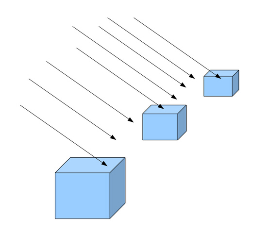
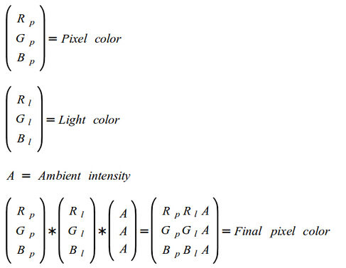
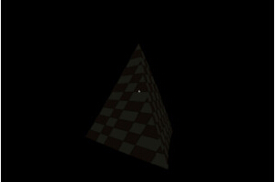

#第十七课 环境光（Ambient Lighting）
##背景
光照是 3D 图形学的最重要的研究领域之一。对光照得体的模拟会使渲染的场景增加很多视觉吸引力。之所以使用“模拟”这个词是因为你无法完全准确的计算出光在自然界中的表现。真正的光是由大量的称为“光子”的粒子组成的，并且同时表现出波和粒子的特性（光的“波粒二象性”）。如果你在程序中试图序计算每一个光子的作用，那么你将很快用光电脑的计算力。

因此，这些年来出现了一些光照模型，它们可以近似的模拟自然界中光照的部分效果。随着 3D 图形学领域的发展和计算机计算能力的提高，这些光照模型变得越来越复杂。在接下来的几章教程中我们将完成对基础光照模型的学习，这些模型虽然实现起来比较简单，不过对场景的整体效果的提升会有很大的提升。

基本的光照模型叫做 “环境光/漫反射光/镜面反射光”（'Ambient / Diffuse / Specular'）。环境光是当你在平常晴天时在室外看到的光的类型。虽然太阳的光线在一天的不同时刻以不同角度照射这个世界，但是大多数的东西都是可见的，即使它们在阴影中。因为光线能从任何物体上反弹，最终照射到所有物体，所以不被太阳光直接照射的物体也会被照亮。从这个角度来说上，甚至是房间里的灯泡也像表现得如同太阳一样传播环境光，因为如果房间不是很大的话，每一件物体都会被均等的照亮。环境光被描述为没有原点，没有方向，并且对场景中的所有物体都有相同效果的光。

漫反射光强调了光线照射到物体表面的角度与物体被照亮程度的关系。物体有光照射的一面比另一面（不直接面向光源的一面）更亮。我们只看到太阳散播的环境光没有明确的方向，然而，在太阳光中也有漫反射光。当他照射到一个高的建筑物的时候你通常能看到建筑物的一侧比另一侧亮一些。漫反射光的最重要的特性就是他的方向。

镜面反射光相对于光本身更强调是物体的属性。当光线以特定的角度照射物体时，反射光使物体的某一部分闪光，而观察者只有从特定的方向看过去才能看见这个闪光。金属材质的物体经常会有一些镜面反射特性。例如，晴天的时候一辆汽车的边缘会闪闪发光。计算镜面反射光照不仅需要考虑光照射的方向（并且反射），也要考虑观察者的位置。

在 3D 应用程序中，你通常不需直接创建环境、漫反射、或镜面反射光。相反的，我们要使用光源，例如太阳（在室外）、一个灯泡（在室内）或者一个手电筒（在洞穴）。不同的光源类型有不同的环境光、漫反射光、镜面反射光强度组合和一些其他的特性。例如，手电筒有一个锥形的光束，距离较远的物体根本不会被照亮。

在以下的教程中我们将会使用一些比较实用的光源类型，同时学习基础光照模型。

我们将从一种叫做“平行光”的光源开始。平行光有方向但是没有具体的原点。这就意味着所有的光线彼此平行。光线的方向由一个向量确定，这个向量用来计算在场景中所有物体表面上的光，无论他们的位置在哪里。太阳光很好的符合了平行光的特性。如果你尝试计算太阳光照射两个相邻的建筑的光线的入射角度，你会得到两个几乎完全一样的值（即他们之间的不同仅仅是一个微小的分数）。这是因为太阳距离地球大概 1.5 亿千米远的地方，因此，我们简单地忽略它的位置而只需考虑它的方向。

平行光的另一个特性是无论与发光的物体距离多远，他的亮度都保持相同。这和我们在接下来的教程中学习的另一个光源 —— 点光源不同。点光源随着距离增大亮度变得越来越弱（例如灯泡）。

下面这张图片阐明了平行光的特性：



我们已经看到在太阳中既有环境光也有漫反射光。我们在这一部分中讲述环境光，而在下一章中学习漫反射光。

在之前的教程中我们学习了如何从纹理中提取像素的颜色。颜色有三个通道（红、绿和蓝），每一个通道都是一个字节。这就意味着颜色取值范围是0到255。通道之间不同的组合可以产生不同的颜色。当所有的通道都为 0 时颜色为黑色。当他们都为 255 时颜色为白色。其他的颜色在两者之间。通过以相同的缩放因子同时缩放三个颜色通道的值，我们可以得到相同的颜色，只不过其明暗度不一样（取决于缩放因子）

当白光接触物体表面，反射的光仅仅是物体表面的颜色。反射光可能会比物体本来的颜色亮或者暗一点，这取决于光源的强度，不过还是相同的基色。如果光源是纯粹的红色（255，0，0），反射光只能是红色中的某一类型。这是因为纯红光没有绿色和蓝色通道可以从物体表面反射回来。如果物体表面是纯蓝色，则最终结果是纯黑色。基本原则是光线只能暴露出对象的实际颜色，而不能给它“上色”。

我们将光源的颜色指定为三个取值在【 0-1 】之间的浮点值。通过将光的颜色和对象的颜色相乘我们将得到反射的颜色。然而，我们也要考虑环境光的强度。因此，我们设定环境光的强度为一个范围在【 0-1 】之间的单独的浮点值，将它与我们刚刚计算得到所有通道的反射光相乘。下面的方程式总结了环境光的计算：



Pixel—像素   ambient intensity--环境光强度

在本次的教程代码实例中你可以通过按 “A”和 “S” 键来增加或者减小环境光的强度，以观察光照对在之前的教程中创建的纹理金字塔的影响。这只是平行光的环境光的部分，而其方向的因素还没有涉及。在下一章我们学习漫反射光时将会用上它。在本章中你会看到无论你在哪里看金字塔，它的亮度都相同。

很多人认为要尽量避免环境光，因为它看起来有些虚假，而且其简单的实现方式对于场景的真实性也没有太大的贡献。通过使用一些更好的方法例如全局光照，我们可以消除对环境光的需求，因为（使用全局光照）从物体反射出来而照射到其他对象的光一样可以被考虑进去。因为我们还没有那么深入，你通常需要一些少量的环境光，以避免物体的一面被照亮而另外一个面完全黑暗。天色渐晚的时候，为了使光看起来更好，我们需要进行大量的调整参数和协调工作。

##代码

随着时间的推移，我们的代码已经变得越来越复杂，而且这种趋势仍会持续。在本节教程中，除了实现环境光，我们也对代码做了大规模重构。我们将会把以后章节的代码放在一个更好的位置。主要改变如下：

1.将着色器的管理封装到 Technique 类中，包括编译和链接等操作。从现在开始我们将通过从 Technique 类继承，来实现一些效果。

2.将 GLUT 初始化和 callback 管理移动到 GLUTBacked 组件中。这个组件注册自己来接收来自 GLUT 的 callback 调用并通过名为 ICallbacks 的 C++ 接口把他们发送给应用应用程序。

3.将全局变量和 main.cpp 文件中的变量移动到一个可被看做是“应用类”的类中。以后我们将把它扩展成一个为所有应用提供常用功能的基类。这种方法在许多的游戏引擎和框架中很受欢迎。

这个教程中的大多数的代码（除了光照中特定的代码）并不是新的，而仅仅是根据以上的设计原则的重新布局，因此只对新的头文件进行说明。

```
(glut_backend.h:24)
void GLUTBackendInit(int argc, char** argv);
bool GLUTBackendCreateWindow(unsigned intWidth, unsigned int Height, unsigned int bpp, bool isFullScreen, const char*pTitle);
```
GLUT 很多特定的代码都被移动到一个叫做"GLUT backend"的组件，这个组件使我们能更容易的进行 GLUT 的初始化和使用上面的 GLUTBackendCreateWindow 函数创建窗口。

```
(glut_backend.h:28)
void GLUTBackendRun(ICallbacks* pCallbacks);
```

在初始化 GLUT 和创建窗口后，下一步是使用上面的封装函数执行 GLUT 主循环。在这里新增加的 ICallbacks 接口对注册 GLUT 回调函数有所帮助。相对于让每一个 application 本身注册 callbacks，GLUT backend 组件注册自己的私有函数，并且将事件传送给上面函数调用所指定的对象。主应用程序通常会自行实现此接口，并在调用 GLUTBackendRun 时把自己作为一个参数传进去。

```
[cpp] view plaincopy
(technique.h:25)  
class Technique  
{  
public:  
   Technique();  
   ~Technique();  
   virtual bool Init();  
   void Enable();  
protected:  
   bool AddShader(GLenum ShaderType, const char* pShaderText);  
   bool Finalize();  
   GLint GetUniformLocation(const char* pUniformName);  
private:  
   GLuint m_shaderProg;  
   typedef std::list<GLuint> ShaderObjList;  
   ShaderObjList m_shaderObjList;  
};   
```

在之前的教程中编译和链接着色器的所有苦差事都是应用程序的一部分责任。technique 基类通过对这些功能进行封装，而使得派生类能集中精力于实现核心效果）。每一个 technique 首先必须通过调用 Init() 函数初始化。派生的 technique 必须调用基类的 Init()（用来创建OpenGL程序对象），并且可以在这里添加自己特有的初始化功能。  

在创建和初始化 technique 对象之后，接下来通常让派生 technique 类对着色器程序调用 AddShader() 函数。最后，Finalize() 函数用于链接对象。Enable() 实际上是对 glUseProgram() 函数的封装，所以当你要切换 technique 对象或者调用绘制函数之前都需要调用它。  

这个类跟踪中间级的编译对象，并且在链接之后使用 glDeleteShader() 将他们删除。这有助于减少你的应用程序消耗的资源。为了实现更好的性能，OpenGL 应用程序通常在加载时编译所有的着色器，而不是在运行的时候。通过在链接后立即移除对象，有助于你的程序减少 OpenGL 资源消耗。程序对象本身使用 glDeleteProgram() 在析构函数中删除。

```
[cpp] view plaincopy
(tutorial17.cpp:49)  
class Tutorial17 : public ICallbacks  
{  
public:  
    Tutorial17()  
    {  
        ...  
    }  
    ~Tutorial17()  
    {  
        ...  
    }  
    bool Init()  
    {  
        ...  
    }  
    void Run()  
    {  
       GLUTBackendRun(this);  
    }  
    virtual void RenderSceneCB()  
    {  
        ...  
    }  
    virtual void IdleCB()  
    {  
        ...  
    }  
    virtual void SpecialKeyboardCB(int Key, int x, int y)  
    {  
        ...  
    }  
    virtual void KeyboardCB(unsigned char Key, int x, int y)  
    {  
        ...  
    }  
    virtual void PassiveMouseCB(int x, int y)  
    {  
        ...  
    }  
private:  
    void CreateVertexBuffer()  
    {  
        ...  
    }  
    void CreateIndexBuffer()  
    {  
        ...  
    }  
    GLuint m_VBO;  
    GLuint m_IBO;  
    LightingTechnique* m_pEffect;  
    Texture* m_pTexture;  
    Camera* m_pGameCamera;  
    float m_scale;  
    DirectionalLight m_directionalLight;  
};   
```

这是主应用类的架构，封装了我们已经熟悉的代码。Init() 负责创建效果、加载纹理和创建顶点/索引缓存。Run() 函数调用 GLUTBackendRun() 并且把对象本身作为一个参数传入。此外，所有以前定义的全局变量现在都是这个类的私有属性。

```
(lighting_technique.h:25)
struct DirectionalLight
{
    Vector3f Color;
    float AmbientIntensity;
};
```

这是平行光定义的开始。目前为止，只有环境光部分存在，而平行光本身还未涉及。当我们在下一个教程中学习漫反射光时我们将会增加平行光。在这个结构中包括两个方面——颜色和环境光强度。颜色决定了对象的哪些颜色通道以何种强度可以被反射回来。例如，如果颜色是(1.0, 0.5, 0.0)，那么之后对象的红色通道将会得到充分的反射，绿色通道将会被缩减到一半，蓝色通道将会被完全丢掉。这是因为一个对象只能反射入射光（光源不同——他们反射的光需要分开处理）。对于太阳光的颜色通常是纯粹的白色(1.0, 1.0, 1.0)。

AmbientIntensity 指出了光的昏暗或明亮程度。强度 1.0，你可以获得纯粹的白色，那样的话对象将被充分的照亮，或者定义为 0.1，那样的话对象可见但是看起来非常的暗。

```
[cpp] view plaincopy
(lighting_technique.h:31)  
class LightingTechnique : public Technique  
{  
public  
    LightingTechnique();  
    virtual bool Init();  
    void SetWVP(const Matrix4f& WVP);  
    void SetTextureUnit(unsigned int TextureUnit);  
    void SetDirectionalLight(const DirectionalLight& Light);  
private:  
    GLuint m_WVPLocation;  
    GLuint m_samplerLocation;  
    GLuint m_dirLightColorLocation;  
    GLuint m_dirLightAmbientIntensityLocation;  
};   
```

这是我们第一次使用 technique 类来写写着色器程序，LightingTechnique 是一个派生类，通过使用基类提供的编译和链接常用功能而实现照明。在创建对象后必须调用 Init() 函数，它仅仅调用 Technique::AddShader() 和 Techique::Finalize() 来生成 GLSL 程序

```
[cpp] view plaincopy
(lighting.fs)  
 #version 330  
in vec2 TexCoord0;  
out vec4 FragColor;  
struct DirectionalLight  
{  
    vec3 Color;  
    float AmbientIntensity;  
};  
uniform DirectionalLight gDirectionalLight;  
uniform sampler2D gSampler;  
void main()  
{  
    FragColor = texture2D(gSampler, TexCoord0.xy) *  
            vec4(gDirectionalLight.Color, 1.0f) *  
            gDirectionalLight.AmbientIntensity;  
}  
```

在本章中顶点着色器保持不变，它和往常一样传递位置（在将它乘以WVP矩阵之后）和纹理坐标到片元着色器中。所有的新的逻辑都在片元着色器中实现。在这里新增的内容是用 “struct” 关键字定义平行光。正如你看到的，这个关键字和在 C/C++ 中的使用方法几乎一样。这个结构体和我们在应用程序代码中一样，而且我们必须这样，以使应用程序和着色器就可以传递数据。  

现在有一个新的 DirectionalLight 类型的一致变量需要由程序更新。这个变量用于像素最终颜色的计算。和以前一样，我们对纹理采样得到基本颜色。然后按上述的公式我们把它与颜色和环境光强度相乘。这总结了环境光的计算。 

```
(lighting_technique.cpp:89)
m_WVPLocation = GetUniformLocation("gWVP");
m_samplerLocation = GetUniformLocation("gSampler");
m_dirLightColorLocation= =GetUniformLocation("gDirectionalLight.Color");
m_dirLightAmbientIntensityLocation= =GetUniformLocation("gDirectionalLight.AmbientIntensity");
```

为了使程序能够将数据传递给一致变量中，我们需要分别得到结构体中两个变量的位置。LightingTechnique 类定义了四个用于存放一致变量地址的变量，用于与顶点和片元着色器中的一致变量传递数据。我们之前获得过 WVP 和 sampler 变量的地址。颜色和环境光强度变量的地址用上面我们看到的方式获得——通过指定着色器中的一致变量的名字，后面跟随一个点，然后是在结构本身的成员变量的名字。设置这些变量的数据的方式和设置其他变量一样。LightingTechnique 类提供了两个方法来设置平行光参数和 WVP 矩阵。第 17 章中的类在每次调用绘制命令前之前先调用他们以更新这些值。

这章你可以分别使用 “a” 和 “s” 键来增强和减弱环境光强度。可以参照 Tutorial17 这个类中的 KeyboardCB() 函数来看它是如何完成的。

##操作结果
