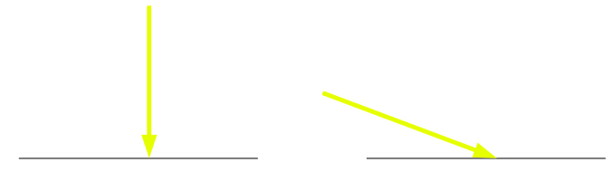
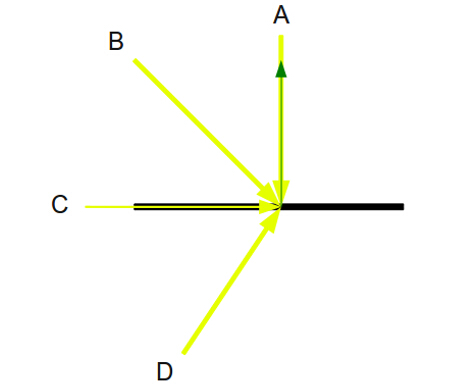
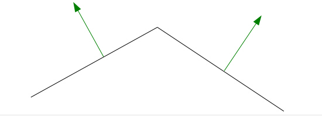
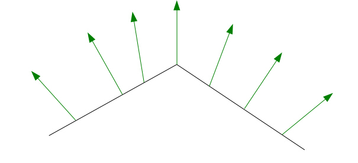
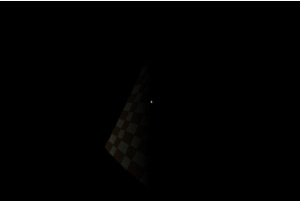

#第十八课 漫反射光
##背景
环境光和漫反射光的主要不同是，漫反射光的计算需要依靠光线方向而环境光完全忽略了它！当只有环境光时整个场景被均等照亮，漫反射光会使物体面对光的部分比背对光的部分更加明亮。

此外漫反射光还增加了一些新的计算,光线的入射角决定了表面的亮度。通过下面的图片来演示这个概念：



让我们假设两条光线的强度是一样的，而唯一不一样的是它们入射的方向。在漫反射光照模型中，左边物体的表面比右边亮，因为左边的表面相比右边的表面来说，光线是以更为为锐利的角度照射的。事实上，左边的物体的表面应该是所有情况下最亮的，因为光垂直的照射到物体表面，此时入射角为 0 度。  

漫反射光模型实际上是基于 Lambert 的 cosine 定律的，其内容是从表面反射的光线的强度直接与观察者的视线和法线夹角的余弦值成正比。注意这里我们做了点改变，用光的方向来代替观察者的视线。  

为了计算在漫反射模型中光的强度，我们将简单地使用光线与表面法线的夹角的余弦值（鉴于 Lambert 的余弦定律提到的是更为普遍的 “定向比例（directionaly proportional）”概念）。看看下面的图片：



我们看见四条光线以不同角度照射物体表面。表面的法线是从表面射出的绿色箭头。 A 光线有最大的强度，它与法线的夹角是 0，所以它的余弦值是1。这意味着当我们将光线的三个通道（从0到1的三个通道）的强度和表面颜色相乘后，接下来我们要乘以 1。这是我们得到的最强的漫反射光。B 光线以 0 到 90 度内的一个角度照射物体表面。这意味着 B 光线与法线的夹角是在 0 到 90 之内，他的余弦值也是在 0 到 1 之内。我们将以该角度的余弦值缩放上面所说的相乘结果，这意味着 B 光线的漫反射强度将肯定低于 A 光线。  

对于 C 光线和 D 光线情况变得不一样了。C 光线直接从物体表面的一边以成 0 角度直射过去。C 光线与法线的夹角是 90 度，余弦值为 0。C 光线产生的结果对表面的漫反射效果没有任何影响。D 的光线方向与法线法线方向成钝角，其余弦值为负，在-1到0之间。这意味着 Ｄ 跟 C 一样对表面的漫反射效果没有影响。   

从上面的描述来看我们得出一个重要的结论：为了对物体表面的明亮度产生影响，我们的光线入射方向和法线所成的角度要在 0 到 90 度之内，但是不包括 90 度。  

我们可以看到在漫反射光的计算中，法线扮演了很重要的角色。上面的例子很简单，将物体表面看成是一条线，而且只有一条法线需要考虑！在现实世界中，我们的对象是由多个多边形组成的，并且每个多边形的法线与其相邻多边形的有所不同。下面是一个例子：



因为对于同一个多边形来说整个面的法线是一样的，如果以这个法线信息在顶点着色器中计算平面的漫反射光，三角形的所有三个顶点会有相同的颜色，并且这个颜色也是整个三角形的颜色。然而，这看起来并不是很好。我们将有一堆多边形，它们每个的颜色与其相邻多边形的都不大一样，我们希望能够看到边沿的颜色如何渐变。这个确实可以得到改善。  

要实现上面的效果，其技巧是使用众所周知的“顶点法线”概念。顶点法线是所有共享此顶点的三角形的法线的平均值。我们只是将顶点法线作为一个属性传入片元着色器，而不是让顶点着色器来计算漫反射光。对于每一个三角形光栅化程序将得到三个不同的法线，并且需要在它们之间进行插值。对于每一个像素，程序都会调用片元着色器并对其使用其相应的法线来进行光照计算。然后我们可以在每个片元中使用此特定法线来计算漫反射光。产生的光照效果在整个三角形表面和相邻三角形之间都有很好的过渡。这个技术被称为 Phong Shading.下图是在插值之后顶点法线的样子：



剩下的需要考虑的是漫反射光的计算在哪个坐标系下进行。顶点和其法线一直在局部坐标系中指明，并且通过我们提供给顶点着色器的 WVP 矩阵将其变换到裁剪空间中。然而，在世界坐标系中指定光照方向是最符合逻辑的。毕竟，光的方向是一些位于某一世界位置的光源（即使是太阳也位于世界坐标系中，不过在千里之外罢了）以特定方向射出光的结果。因此，在计算之前我们需要将法线转换到世界空间中。

##代码
```
[cpp] view plaincopy
(lighting_technique.h:25)  
struct DirectionalLight  
{  
    Vector3f Color;  
    float AmbientIntensity;  
    Vector3f Direction;  
    float DiffuseIntensity;  
};  
```

这是我们更新之后的平行光结构体。这里有两个新成员：Direction 是一个在世界空间中指定的三维向量，DiffuseIntensity（漫反射强度）是一个浮点数（使用方式与环境光相同）。

```
[cpp] view plaincopy
(lighting.vs)  
/#version 330  
layout (location = 0) in vec3 Position;  
layout (location = 1) in vec2 TexCoord;  
layout (location = 2) in vec3 Normal;  
uniform mat4 gWVP;  
uniform mat4 gWorld;  
out vec2 TexCoord0;  
out vec3 Normal0;  
void main()  
{  
    gl_Position = gWVP * vec4(Position, 1.0);  
    TexCoord0 = TexCoord;  
    Normal0 = (gWorld * vec4(Normal, 0.0)).xyz;  
}  
```

这是更新后的顶点着色器。我们有一个新的顶点属性，法线，它需要由应用程序提供。除此之外，我们新增了一个一致变量 gWorld 用于存放从局部坐标系变换到世界坐标系的变换矩阵，所以除了 WVP 矩阵，我们还需要提供这个一致变量。顶点着色器用世界矩阵将法线变换到世界坐标系中，然后传递给片元着色器。请注意三维的法线是如何拓展成为一个四维向量的：先与一个 4 * 4 的世界矩阵相乘，然后用符号 (...).xyz 又减为三维。GLSL 语言的这个能力被称为“交叉混合”，给予向量操纵很大的灵活性。例如，如果你有一个三维的向量 v(1，2，3)你可以这样写：vec4 n = v.zzyy 然后向量 n 将包含(3，3，2，2)。注意当我们将法线从三维扩展成四维时，第四个分量必须设置为 0，因为向量不能像点那样被移动，它们只能被缩放或旋转。

```
[cpp] view plaincopy
/#version 330  
in vec2 TexCoord0;  
in vec3 Normal0;  
out vec4 FragColor;  
struct DirectionalLight  
{  
    vec3 Color;  
    float AmbientIntensity;  
    float DiffuseIntensity;  
    vec3 Direction;  
};  
```

这是片元着色器的开始。它接收了通过顶点着色器转换到世界空间的经过插值的顶点法线。平行光结构体中的成员变量也进行了扩展，使之与 C++ 程序中传入的数据相对应。

```
(lighting.fs:19)
void main()
{
    vec4 AmbientColor =vec4(gDirectionalLight.Color, 1.0f) *  gDirectionalLight.AmbientIntensity;
```

环境光的计算没有改变。我们计算、存储并在下面最后的公式中使用它。

```
    Float DiffuseFactor = dot(normalize(Normal0),-gDirectionalLight.Direction);
```
这是漫反射光计算的核心。我们通过点积来计算光向量和法线夹角的余弦值。这里有三个要注意的事情：
1. 顶点着色器传来的法线数据在使用前需要标准化。这是因为向量经过插值后其模可能会被改变而不再是一个单位向量。
2. 光的方向被反转。
3. 光向量没有被标准化。为所有的像素重复标准化相同向量将是对 GPU 资源的浪费。相反，我们只用确保程序传来向量在绘制命令调用之前已被标准化。

```
vec4 DiffuseColor;
    if (DiffuseFactor > 0) {
        DiffuseColor = vec4(gDirectionalLight.Color, 1.0f) * gDirectionalLight.DiffuseIntensity * DiffuseFactor;
    }
    else {
        DiffuseColor = vec4(0, 0, 0, 0);
    }
```

这里我们计算了漫反射光，它由光颜色、漫反射光强度和光的方向共同决定。如果漫反射光因子小于或等于 0 意味着光以钝角照射物体表面（或者是从边或后面照射），在此情况下漫反射光对物体没有影响，而 DiffuseColor 也初始化为 0。如果角度大于 0，我们通过将光线颜色和漫射强度相乘，然后通过漫射因子的缩放来计算漫反射光的颜色。如果光线与法线间的角度是0，漫射因子将是1，进而使得漫反射光效果最强。

```
    FragColor = texture2D(gSampler, TexCoord0.xy) * (AmbientColor + DiffuseColor);
}
```

这是最后像素的颜色的计算。我们把环境光和漫反射光相叠加并将结果与从纹理中提取的颜色相乘。现在你明白了即使漫反射光由于方向对表面没有影响，只要有环境光存在，物体就依然会被照亮。

```
[cpp] view plaincopy
(lighting_technique.cpp:144)  
void LightingTechnique::SetDirectionalLight(const DirectionalLight& Light)  
{  
    glUniform3f(m_dirLightLocation.Color, Light.Color.x, Light.Color.y, Light.Color.z);  
    glUniform1f(m_dirLightLocation.AmbientIntensity, Light.AmbientIntensity);  
    Vector3f Direction = Light.Direction;  
    Direction.Normalize();  
    glUniform3f(m_dirLightLocation.Direction, Direction.x, Direction.y, Direction.z);  
    glUniform1f(m_dirLightLocation.DiffuseIntensity, Light.DiffuseIntensity);  
}  
```

这个函数将平行光的参数传递到着色器中。它同样被扩展，以适应平行光结构体的变化。注意方向向量在设置前应先标准化。 LightingTechnique 类还从着色器中提取光照方向和漫射强度一致变量的地址，以及世界矩阵一致变量的地址。同时也有一个设置世界变换矩阵的函数。这都是一些常规的代码，请仔细查看代码以获取更多细节。

```
[cpp] view plaincopy
(tutorial18.cpp:35)  
struct Vertex  
{  
    Vector3f m_pos;  
    Vector2f m_tex;  
    Vector3f m_normal;  
    Vertex() {}  
    Vertex(Vector3f pos, Vector2f tex)  
    {  
        m_pos = pos;  
        m_tex = tex;  
        m_normal = Vector3f(0.0f, 0.0f, 0.0f);  
    }  
}; 
```
 
更新了的顶点结构体现在包含法线。它被构造函数自动初始化为 0，我们有一个专用功能可以扫描所有的顶点并计算每个顶点的法线。

```
[cpp] view plaincopy
(tutorial18.cpp:197)  
void CalcNormals(const unsigned int* pIndices, unsigned int IndexCount, Vertex* pVertices, unsigned int VertexCount)  
{  
    for (unsigned int i = 0 ; i < IndexCount ; i += 3) {  
        unsigned int Index0 = pIndices[i];  
        unsigned int Index1 = pIndices[i + 1];  
        unsigned int Index2 = pIndices[i + 2];  
        Vector3f v1 = pVertices[Index1].m_pos - pVertices[Index0].m_pos;  
        Vector3f v2 = pVertices[Index2].m_pos - pVertices[Index0].m_pos;  
        Vector3f Normal = v1.Cross(v2);  
        Normal.Normalize();  
        pVertices[Index0].m_normal += Normal;  
        pVertices[Index1].m_normal += Normal;  
        pVertices[Index2].m_normal += Normal;  
    }  
    for (unsigned int i = 0 ; i < VertexCount ; i++) {  
        pVertices[i].m_normal.Normalize();  
    }  
}  
```

这个函数接收顶点和索引数组为参数，根据索引获取每个三角形的顶点，并计算出每个顶点的法线。这个函数在顶点缓存器创立之前被调用，以使计算后的顶点法线以及其他顶点属性进入缓冲器中。

```
[cpp] view plaincopy
</pre><pre name="code" class="cpp">(tutorial18.cpp:131)  
    const Matrix4f& WorldTransformation = p.GetWorldTrans();  
    m_pEffect->SetWorldMatrix(WorldTransformation);  
    ...  
    glEnableVertexAttribArray(2);  
    ...  
    glVertexAttribPointer(2, 3, GL_FLOAT, GL_FALSE, sizeof(Vertex), (const GLvoid*)20);  
    ...  
glDisableVertexAttribArray(2);  
```

这是渲染循环的主要变化。管线类有一个新的函数来提供世界转变矩阵（当然也提供 WVP 矩阵）。世界矩阵是缩放、旋转和平移矩阵相乘的结果。我们启用和禁用第三个顶点属性数组，指明顶点缓冲器中每个顶点的法线的偏移量。这个偏移是 20，因为法线是在位置（ 12 位）和纹理坐标（ 8位 ）之后的。  

为了完成我们在这章的效果，我们还必须指明漫反射光的强度和方向。这个在 “Tutorial18” 类里的构造函数中完成了。漫射强度被设置为 0.8，方向为从左到右。环境光强度减小到 0 来增强漫反射光的影响。你可以用键盘上的'z' 和 'x'来控制漫反射光的强度（同时也可以用以前教程中“a”和“s”来控制环境光强度）。

##操作结果
