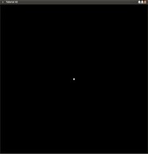

# 第二课 绘制一个点

##背景

这将是我们第一次遇到 GLEW，GLEW 是OpenGL的扩展功能库。它能帮助你解决OpenGL不断扩展的问题。一旦你初始化它之后，它在你的系统上将查询所有可用的扩展功能，自动的加载它们并且通过一个单一的头文件提供简单的接口。

在这一节中，我们将第一次看见顶点缓冲区对象（VBOs）的使用。顾名思义，它们是被用来储存顶点数据的。加载顶点进入 GPU 最有效率的方法是 VBOs。它们是可以存储在显存中的缓冲区，使得 GPU 访问数据的速度最快。

这一节和下一节的内容在这本教程中是唯一讲述固定管线而不是可编程管线的部分，事实上这两节内容中我们也不会用到任何变换，我们仅仅是让将数据传递给管线而已。在接下来的学习中我们将完整学习渲染管线，现在在涉及到光栅器之前我们使用屏幕坐标系绘制点、线、和三角形，点的坐标用X，Y，Z表示并且他们的值都在[-1.0, 1.0]之间。光栅器将这些坐标映射到屏幕空间（比如，如果屏幕的宽度是1024，X 的坐标为-1.0，则 X 将映射到0；若 X 坐标为1.0，则将会被将映射到1023）。最后，光栅器根据指定绘图命令（可以在下面的源代码解析中看到）的拓扑结构画出图元。因为我们没有绑定任何shader到管线中，所有顶点没有进行矩阵变化。这将意味着为了在屏幕中绘制出这些点我们仅仅需要传递给程序一些在上述范围之内的值就可以了。事实上，我们选取在屏幕中的零点作为x、y两条轴的中心点，换句话说，零点是在屏幕的正中心。

Installing GLEW: GLEW从服务器 [http://glew.sourceforge.net/](http://glew.sourceforge.net/)中可以获得。大部分 Linux 为 GLEW 提供了预编译包。在 Ubuntu 上，你可以安装通过运行下面的命令行命令 apt-get install libglew1.6 libglew1.6-dev 来安装它。

##Sourcewalkthrough

```
\#include<GL/glew.h>
```

这里我们包含了一个单一的 GLEW 头文件。如果你包含其他 OpenGL 头文件，你必须把 GLEW 头文件放在其他头文件之前。  

```#include"math_3d.h"```

在这一节我们开始使用其他的一些辅助工具比如 vector。我们以后将会扩展这个头文件。
 
```
GLenum res =glewInit();
if (res != GLEW_OK)
{
   fprintf(stderr, "Error: '%s'\n", glewGetErrorString(res));
   return 1;
}
```

这里我们初始化 GLEW 和检查是否存在一些错误。这必须要在 GLUT 被初始化之前完成。

```
Vector3fVertices[1];
Vertices[0] =Vector3f(0.0f, 0.0f, 0.0f);
```

我们创建了一个类型为 Vector3f（这个类型被定义在 math_3d.h）的数组，同时初始化 X、Y、Z为0.这将会使我们绘制的点出现在屏幕中间。  

```
GLuint VBO;
```

我们分配一个全局变量 GLuint 储存顶点缓存区对象的句柄，你稍后将看到大部分 OpenGL 对象都是通过一个 GLuint 类型的变量来访问的。  

```
glGenBuffers(1,&VBO);
```

OpenGL为了生成不同类型的对象定义几个 glGen* 函数。这些函数通常有两个参数，第一个参数指定你想要创建对象的数量，第二个参数是一个存放 GLuint 类型数组的地址，这个数组用于存放函数生成的句柄（确定数组是足够大来存放你的所申请的缓冲区句柄）。以后调用这个函数将不会生成相同的句柄，除非你使用 glDeleteBuffers 函数删除它。在这个地方，你不需要指定用这些 buffers 用于做什么，所以创建的是普通的 buffers，指定这个 buffer 的功能是下面一个函数的任务  

```
glBindBuffer(GL_ARRAY_BUFFER,VBO);
```

OpenGL 有一个独一无二的方法使用句柄。在许多的 API 中，句柄只是简单的通过一些相关的函数来使用。在 OpenGL 中我们绑定句柄到到一个目标上，然后在目标上执行命令。这些命令的执行只影响到已经绑定的句柄，直到当前句柄被代替或者将0绑定到目标上。目标 GL_ARRAY_BUFFER 表示缓冲区用于存储顶点数组。另一个有用的目标是 GL_ELEMENT_ARRAY_BUFFER 表示缓冲区用于存储数组的索引。我们也可以将句柄绑定到别的目标上，我们将在下一节看到。  

```
glBufferData(GL_ARRAY_BUFFER,sizeof(Vertices),Vertices,GL_STATIC_DRA);
```

当我们将缓冲区绑定到目标上之后，我们需要用数据进行填充。上面函数的参数包括：目标点名称（和上面缓冲区绑定的目标点一样），数据的字节数，顶点数组的地址，以及一个表示数据使用方式的枚举量。因为我们不需要改变缓冲区中的内容，所谓我们将数据指定为 GL_STATIC_DRAW，与之相反的我们可以将其设置为 GL_DYNAMIC_DRAW。通过设定这个值，OpenGL可以对数据进行一些优化（比如在内存中哪个地方最适合存储缓冲区）。  

```
glEnableVertexAttribArray(0);
```

在 shaders 章节中，你将看见 Shader 中用到的顶点属性（位置，法线等）有一个映射到它们的索引，使我们在 C/C++ 项目中创建的数据能与 Shader 内的属性名之间进行绑定。此外你必须启用每个顶点属性的索引。在这一节中我们还没使用任何 Shader，但是我们加载到缓冲器的顶点位置属性在固定函数管线（在没有绑定着色器的时候就自动启用固定管线）中被看做顶点属性索引为0。你必须启用所有的顶点属性，否则管线将接收不到数据。  

```
glBindBuffer(GL_ARRAY_BUFFER,VBO);
```

由于将要调用绘图函数，所以这里我们再一次绑定了缓冲区。在这个小的项目中我们只有一个顶点缓冲区，所以在每一帧都调用这个函数是多余的。但是在更复杂的项目中可能存在很多个缓冲区来存储不同类型的变量，所以你必须用你打算使用的缓冲区来更新渲染管线状态。  

```
glVertexAttribPointer(0,3, GL_FLOAT, GL_FALSE, 0, 0);
```

这个函数调用告诉管线如何在缓冲区内部解释数据。第一个参数指定了属性的索引。我们都知道0是默认的，但是当我们开始使用 Shaders 的时候，我们在 Shader 中需要明确的设置索引。第二个参数是构成属性的分量的个数（X,Y,Z共三个分量）。第三个参数是每个分量的数据类型。第四个参数表明属性在管线中使用之前是否需要被规范化。第五个参数是在缓冲区中两个相同属性值之间的间隔的字节数，当只有一个属性时（比如缓冲区只包含顶点位置）并且数据是紧挨着的，那么我们设置这个值为0。如果我们有一个包含位置属性和法线属性的数组（每个属性都是一个float类型的三维向量），我们将这个值设置为6*4=24。最后一个参数在上一个例子中是有用的。我们需要指定在缓冲区中存储数据的偏移值，这样管线才会找到数据。当顶点的位置和法线相邻存储时时，我们设置顶点位置的偏移值为0而顶点法线的偏移值为12。  

```
glDrawArrays(GL_POINTS,0, 1);
```

最后，调用这个函数来画几何体。这里就是 GPU 真正开始工作的地方。它现在将结合绘图命令的参数，然后创建一个点并将结果渲染到屏幕。

OpenGL 提供多个类型的渲染命令，每一个都适合于不同的情况。通常你可以把它们分成两个个类别——有序渲染和索引渲染。有序渲染相对来说比较简单。GPU 遍历你的顶点缓冲区，一个接着一个的访问顶点，然后根据在函数中指定的参数类别解释数据，例如，如果你指定 GL_TRIANGLES，那么顶点0-2成为第一个三角形，3-5是第二个三角形等。如果你想让相同的顶点出现在不同的三角形中，你将需要在顶点缓冲区指定它两次，但是这样将会浪费空间。

使用索引渲染相对来说复杂一点，并且涉及到了一个额外的缓冲区——索引缓冲区。索引缓冲区存放的是顶点在顶点缓冲区中的索引值。GPU 遍历索引缓冲区，与顺序渲染类似，他会将索引为0-2描述为第一个三角形。如果你想要相同的顶点在两个三角形中，那么只需要在索引缓冲区中简单的指定该顶点的索引两次，顶点缓冲区仅仅只需要包含一份数据。索引缓冲区在游戏使用的更加普遍，因为大部分模型的表面（人的皮肤，城堡的墙等等）都是由共享顶点的三角形组成的。

在这一节中，我们使用最简单的绘图命令——glDrawArrays。这是一个已经顺序绘制命令，所以这里没有保存索引缓冲区。我们指定点的拓扑结构为 GL_POINTS ，这意味着顶点缓冲区中的每一个顶点都被绘制成一个点。下一个参数是开始绘制的第一个顶点的索引值。因为我们想要从缓冲区的开始来绘图，所以我们指定参数为0。这使我们可以在相同的缓冲区储存多个模型，在绘制图形的时候只需要只需要选择不同的偏移量就行了。最后一个参数是要用于绘制的顶点的数量。  

```
glDisableVertexAttribArray(0);
```

当顶点不是要立即被使用的时候，禁用所有的顶点属性是一个很不错的方法。当着色器不使用顶点的时候将顶点属性激活，这是给自己自找麻烦。  

##操作结果



