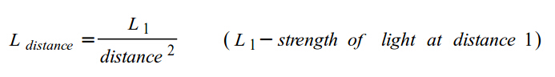
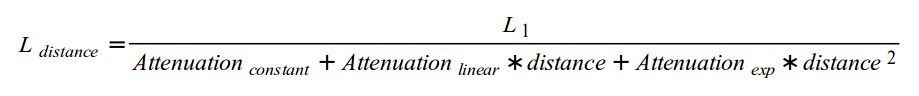
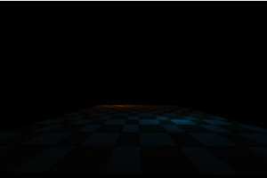

#第二十课 点光源
##背景知识
基于平行光，我们已经学习了三种基本光照模型（环境光、漫反射光和高光）。平行光是一种只有单一方向并且没有起点的灯光类型。因此，它不会随着距离增大而减弱（事实上，你甚至不能定义它与目标的距离）。我们来定义一下点光源，点光源有起点和衰减效果，并且当物体远离点光源时这种衰减效果变得更为明显。灯泡（light blub）其实就是一个点光源，在房间里你可能感受不到灯泡发出的光照的衰减效果；但是一到了室外，你会很快看到灯光强度有限（随距离增大衰减明显）。注意，平行光在整个场景中的方向都不变，而点光源光线的方向则是不一样的。这是因为点光源向各个方向平等地发出光线，因此我们必须要通过从物体到点光源的矢量来为每个物体计算其接受的光照的方向。这就是我们为点光源定义源位置而非方向的原因。  

点光源的衰退效应常被叫做“衰减”。实际物体的“衰减”遵循平方反比法则（光强与物体到光源的距离的平方成反比）。数学公式如下：  



这个公式产生的 3D 视觉效果不是很好。例如，当距离变得非常小的时候，光线的强度就会趋于无穷大。另外，开发者除了可以设置光的初始强度外，并没有其他手段来控制光照的最后效果。这种做法局限性太大了。因此，我们给这个公式添加一些因子，来让它变得更灵活：  



我们给分母添加了三个光衰减因子（一个常量因子，一个线性因子和一个指数因子）。当我们把常量和线性因子设置为 0，并且指数因子设置为 1 的时候，就得到了一个精确的公式（即本讲第一个公式）。你会发现把常量因子设置成 1 而把另外两个因子设置成很小的分数是很有用的。当把常量因子设置成 1，基本上就可以保证光强在距离为零处达到最大值（事实上，这个值是你在在程序中指定的），并且随着距离变大而衰减，因为分母将比 1 大。当你协调好线性和指数因子的时候，你会得到想要的随着距离急剧或缓慢衰减的灯光效果。
我们来总结一下计算点光源需要的步骤：  

1. 像平行光中一样计算环境光成分（ambient  term）。
2. 计算从像素点（世界坐标系下）到点光源的光线矢量的方向。你现在可以用这个方向像在平行光中一样计算漫反射光和高光了。
3. 计算从像素点到光源的距离，并用它来得到全部的衰减值。
4. 将这三种光成分加起来，并除以衰减因子来得到最终的点光线颜色。

##代码
```
(lighting_technique.h:24)
struct BaseLight
{
    Vector3f Color;
    float AmbientIntensity;
    float DiffuseIntensity;
};
.
.
.
struct PointLight : public BaseLight
{
    Vector3f Position;
    struct
    {
        float Constant;
        float Linear;
        float Exp;
    } Attenuation;
}
```

尽管有一些不同，平行光和点光还是有很多共同点。这些共同点被移动到 BaseLight 结构体中，现在二者从这个结构体派生来。平行光将方向（direction）添加到它实际的类中，而点光源添加了它在世界坐标系下的位置和三个衰减因子。

```
(lighting_technique.h:81)
void SetPointLights(unsigned int NumLights, const PointLight* pLights);
```

本讲除了演示如何实现一个点光源，还会展示如何使用多光源（multiple lights）。灯光的设定一般是一个单向光（比如”日光”）与/或许多点光源（房间里的灯泡，地牢里的火把等）。这个函数接收一个 PointLight 结构体的数组指针和以及这个数组的大小作为参数，并用他们的值更新着色器。

```
(lighting_technique.h:103)
struct {
    GLuint Color;
    GLuint AmbientIntensity;
    GLuint DiffuseIntensity;
    GLuint Position;
    struct
    {
        GLuint Constant;
        GLuint Linear;
        GLuint Exp;
    } Atten;
} m_pointLightsLocation[MAX_POINT_LIGHTS];
```

为了支持多个点光源，着色器内包含了与 PointLight（仅在 GLSL 中）一样的结构体的数组。一般有两个方法来更新着色器中的结构体数组：
1. 你可以获取每个数组元素的每个结构体字段的地址（例如结构体数组里有5个元素，每个结构体里有4个字段，那么共有20个一致变量地址），并分别给每一个元素的每一个字段赋值。
2. 你可以只得到第一个数组元素中的每个字段的地址，然后调用 GL 函数来为每个字段设置一个变量数组。例如，如果第一个字段是浮点型数据，第二个字段是一个整型。你可以在第一次 GL 调用中传递一个浮点型数组来设置第一个字段所有的值，而第二次传递一个整形的数组来设置第二个字段的值。  

第一个方法，就你必须要得到每个一致变量的地址，导致资源比较浪费，但是用起来却比较灵活。你可以通过简单的访问地址来更新整个数组中的任意变量，而且不需要像第二个方法那样对你的输入的数据进行变换。  

第二个方法对一致变量地址的管理比较少，但是如果你想一次性更新几个数组元素你的用户传递的参数是一个结构体数组（像在 SetPointLights（）里那样），你需要将它转换为由数组构成的结构体，因为每一个一致变量地址都需要由一个具有同类型变量的数组来更新。这一讲我们使用第一个方法。你应该两个都试一下，看哪一个更好。  

MAX_POINT_LIGHTS 是一个常量值，用来限制可以使用的点光源的最大数目，并且必须与着色器中相应的值保持一致。我们将其默认值设置为 2 。当你在程序中逐渐增加光源数目时，显示效果会越来越差。这个问题可以通过使用“延迟渲染”技术来解决，具体的我们以后探讨。

```
(lighting.fs:46)
vec4 CalcLightInternal(BaseLight Light, vec3 LightDirection, vec3 Normal)
{
    vec4 AmbientColor = vec4(Light.Color, 1.0f) * Light.AmbientIntensity;
    float DiffuseFactor = dot(Normal, -LightDirection);
    vec4 DiffuseColor = vec4(0, 0, 0, 0);
    vec4 SpecularColor = vec4(0, 0, 0, 0);
    if (DiffuseFactor > 0) {
        DiffuseColor = vec4(Light.Color, 1.0f) * Light.DiffuseIntensity * DiffuseFactor;
        vec3 VertexToEye = normalize(gEyeWorldPos - WorldPos0);
        vec3 LightReflect = normalize(reflect(LightDirection, Normal));
        float SpecularFactor = dot(VertexToEye, LightReflect);
        SpecularFactor = pow(SpecularFactor, gSpecularPower);
        if (SpecularFactor > 0) {
            SpecularColor = vec4(Light.Color, 1.0f) *
            gMatSpecularIntensity * SpecularFactor;
        }
    }
    return (AmbientColor + DiffuseColor + SpecularColor);
}
```  

其实不需要太过吃惊于平行光和点光源之间会共享相当多的着色器代码。程序中的大部分计算过程都是一样的，而不同的是，我们只需要将点光源的衰减因子考虑进来。另外，由程序提供光照方向只是对平行光来说的，而点光源的光线方向必须由我们自己挨个为每个像素计算出来。  

上面的这个函数封装了平行光和点光源之间的共同部分。BaseLight 结构体包含强度和颜色。光照方向基于上述原因需要单独提供，正是因为上面所考虑到的原因。第三个参数是顶点法线，提供它是因为进入片元着色器时我们对其进行一次标准化，然后这个函数可以多次调用它。  

```
(lighting.fs:70)
vec4 CalcDirectionalLight(vec3 Normal)
{
    return  CalcLightInternal(gDirectionalLight.Base,gDirectionalLight.Direction, Normal);
}  
```

常用函数（在此指 CalcLightInternal（）函数）工作时，计算平行光的函数就变成了对它的封装。  

```
(lighting.fs:75)
vec4 CalcPointLight(int Index, vec3 Normal)
{
    vec3 LightDirection = WorldPos0 - gPointLights[Index].Position;
    float Distance = length(LightDirection);
    LightDirection = normalize(LightDirection);
    vec4 Color = CalcLightInternal(gPointLights[Index].Base, LightDirection, Normal);
    float Attenuation = gPointLights[Index].Atten.Constant +
          gPointLights[Index].Atten.Linear * Distance +
          gPointLights[Index].Atten.Exp * Distance * Distance;
    return Color / Attenuation;
}
``` 

点光源的计算比定向光复杂一些。我们要为每一个配置好的点光源调用上述函数，因此，这个函数将光源索引值作为一个参数，并用它去索引点光源的全局数组。这个函数计算从点光源（在世界坐标系下，由应用程序提供）到顶点着色器提供的世界位置的矢量。用 length() 计算光源到像素点之间的距离。获得距离之后，我们就标准化光线矢量。记住 CalcLightInternal() 需要的参数是规范化的方向矢量，而在定向光中由 LightingTechnique 类负责这个操作。我们从 CalcInternalLight() 计算得到 Color，然后用先前得到的距离计算衰减因子。最终得到的点光线的颜色由 Color 除以衰减因子得到。  

```
(lighting.fs:89)
void main()
{
    vec3 Normal = normalize(Normal0);
    vec4 TotalLight = CalcDirectionalLight(Normal);
    for (int i = 0 ; i < gNumPointLights ; i++) {
        TotalLight += CalcPointLight(i, Normal);
    }
    FragColor = texture2D(gSampler, TexCoord0.xy) * TotalLight;
}
```

一旦我们的基础条件准备就绪，片元着色器就变得非常简单。它只用将顶点法线规范化，然后叠加所有类型的光照的计算结果。最后的结果与取样颜色相乘作为最终的像素颜色。  

```
(lighting_technique.cpp:279)
void LightingTechnique::SetPointLights(unsigned int NumLights, const PointLight* pLights)
{
    glUniform1i(m_numPointLightsLocation, NumLights);
    for (unsigned int i = 0 ; i < NumLights ; i++) {
        glUniform3f(m_pointLightsLocation[i].Color,      pLights[i].Color.x, pLights[i].Color.y, pLights[i].Color.z);
        glUniform1f(m_pointLightsLocation[i].AmbientIntensity, pLights[i].AmbientIntensity);
        glUniform1f(m_pointLightsLocation[i].DiffuseIntensity, pLights[i].DiffuseIntensity);
        glUniform3f(m_pointLightsLocation[i].Position, pLights[i].Position.x, pLights[i].Position.y, pLights[i].Position.z);
        glUniform1f(m_pointLightsLocation[i].Atten.Constant, pLights[i].Attenuation.Constant);
        glUniform1f(m_pointLightsLocation[i].Atten.Linear, pLights[i].Attenuation.Linear);
        glUniform1f(m_pointLightsLocation[i].Atten.Exp, pLights[i].Attenuation.Exp);
    }
}
```

这个函数用点光源信息更新着色器，通过遍历光源数组中的每一个元素，我们将每一个元素中的每一个变量都分别传递给着色器中的相应的一致变量中。这就是前面我们描述的“方法1”。

这章的示例展示了两个点光源在一个场景中互相追逐。一个光源的轨迹沿 cos 函数，另一个沿 sin 函数。这个场景是一个由两个三角形构成的简单的四边形，其发现方向竖直向上。

##操作结果
