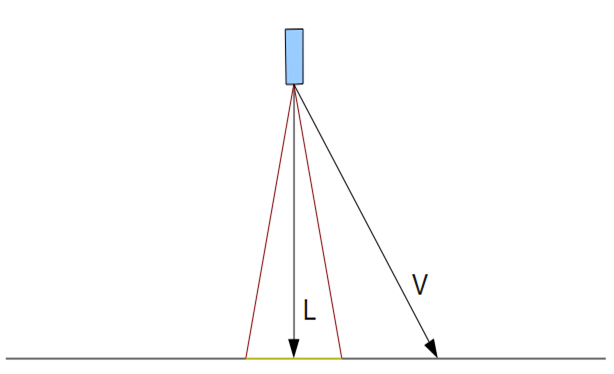
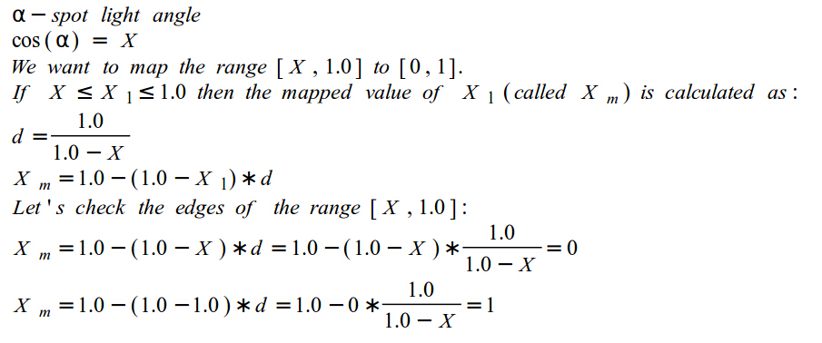
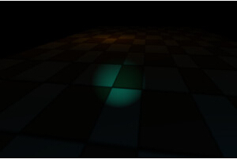

#第二十一课 聚光灯  

##背景

聚光灯是第三个也是最后一个我们将要介绍的光源类型（至少在一段时间内）。他比平行光和点光源更加复杂，而本质上还是用到这二者的很多内容。我们需要设置聚光灯光源的位置，并且其光照强度随着和目标物距离的增加而减小（像点光源那样），而且他也要指向一个特定的方向（像平行光那样）。但是聚光灯新增了一个特性，它的光只分布在有限的圆锥形空间内并且不断减弱，而这个圆锥形空间随着随着与光源位置的增加，其而底部不断扩大。聚光灯的典型例子是手电筒，当你在开发的游戏中的角色在探索一个地牢或者是从监狱中逃跑时，聚光灯是非常有用的。
我们已经知道知道如何去计算物体表面的光照效果，现在还缺少的就是这种光类型的圆锥形效果。请看下面的图片：



聚光灯的方向被定义为垂直向下的黑色箭头所指向的方向。我们希望我们的光只在两条红线内有限区域内产生影响。点积运算在这里会再次派上用场。我们借助于每个红线和光线的方向之间的夹角（即红线之间夹角的一半）来定义我们的光锥。我们可以先算好这个夹角的 cosine 值 “C” ，然后计算光线方向 “L” 和从光源到像素点的矢量 “V” 之间的点积。如果点乘的结果比 “C” 大（记住 cosine 值随角度变小而增大），那么 “L” 和 “V” 之间的夹角就比 “L” 和两条红线之间的角度小。在这种情况下像素点应该接收到光照。如果结果较大，那么像素点将不能接收任何来自聚光灯的光线。在上面图中的例子 “L” 和 “V” 之间的点乘结果比 “L” 和任一条红线间点乘的结果都小（很明显 “L” 和 “V” 之间的夹角要比 “L“ 和红线之间的角度大），因此这个像素点在光锥之外，不能被照亮。  

如果我们采用“接收/不接收光“的方法，我们得到的结果将是一个非常虚假的聚光灯效果，它照亮的地方与黑暗的地方有非常明显的界限。看起来就像一个在全黑世界里（假设没有其他的光源）的一个整圆。对于聚光灯来说，一个比较好的效果是离中心点越远的地方，光照效果越弱。我们可以将我们计算的点乘结果（用来确定像素是否被照亮）作为一个因素。我们已经知道 “L” 和 “V” 相等时点乘结果最大是 1（即最强光）。但是现在我们遇到了余弦函数的一些令人讨厌的地方，聚光灯的光锥的角度不能太大，否则光分布得太广，我们也就失去了聚光灯的效果。如果我们将角度设置为 20 度，20 度的 cosine 值是 0.939 ，但是 [0.939, 1.0] 的变化范围太小，不能作为因子，因为没有足够的空间进行眼睛能够注意到的插值。[0, 1]的范围能提供更好的效果。  

我们要用的方法是把聚光灯角度所定义的小范围映射到[0, 1]这个较大的范围中。下面看是我们如何做到这一点的：  



原理非常简单——计算小范围和大范围之间的比例，并且用这个比例来对你的范围进行缩放。

##代码
```
(lighting_technique.h:68)
struct SpotLight : public PointLight
{
    Vector3f Direction;
    float Cutoff;
    SpotLight()
    {
        Direction = Vector3f(0.0f, 0.0f, 0.0f);
        Cutoff = 0.0f;
    }
};
```

这个定义聚光灯属性的结构体派生于点光源的结构体，并且增加了两个属性使它区别于点光源：一个方向矢量和临界值。这个临界值代表了光源照射所形成的椎体空间的角度的大小，对于在临界值外的其他像素没有任何影响。

```
(lighting.fs:39)
struct SpotLight
{
    struct PointLight Base;
    vec3 Direction;
    float Cutoff;
};
...
uniform int gNumSpotLights;
...
uniform SpotLight gSpotLights[MAX_SPOT_LIGHTS];
```

GLSL 中有一个相似的聚光灯类型结构体。因为我们不能像在 C++ 代码中那样使用继承，所以我们把点光源结构体当做一个成员，接着添加新的属性。在这里最显著的不同之处是临界值在 C++ 代码中是角度本身，而在着色器中是角度的 cosine 值。着色器只关心 cosine 值，所以我们只计算 cosine 值一次，而不是为每个像素计算一次，这样会使代码更高效。我们还定义了一个聚光灯数组的数组，并且用一个叫做 'gNumSpotLights' 的记录程序使用了多少个聚光灯光源。  

```
(lighting.fs:85)
vec4 CalcPointLight(struct PointLight l, vec3 Normal)
{
    vec3 LightDirection = WorldPos0 - l.Position;
    float Distance = length(LightDirection);
    LightDirection = normalize(LightDirection);
    vec4 Color = CalcLightInternal(l.Base, LightDirection, Normal);
    float Attenuation = l.Atten.Constant +
        l.Atten.Linear * Distance +
        l.Atten.Exp * Distance * Distance;
    return Color / Attenuation;
}
```

计算点光源光照效果的函数有一个小的改动——他把 点光源结构体作为一个参数，而不是直接使用全局数组。这样我们在计算聚光灯光照效果的时候就可以直接调用这个函数。  

```
(lighting.cpp:fs)
vec4 CalcSpotLight(struct SpotLight l, vec3 Normal)
{
    vec3 LightToPixel = normalize(WorldPos0 - l.Base.Position);
    float SpotFactor = dot(LightToPixel, l.Direction);
    if (SpotFactor > l.Cutoff) {
        vec4 Color = CalcPointLight(l.Base, Normal);
       return  Color * (1.0 - (1.0 - SpotFactor) * 
1.0/(1.0 - l.Cutoff));
    }
    else {
        return vec4(0,0,0,0);
    }
}
```

我们在这里计算聚光灯的光照效果。首先我们需要计算从光源到当前片元的向量。按照惯例，先提前标准化这个向量为点乘做好准备。之后再在这个向量和光的方向之间进行点乘（光的方向在应用程序中已经被标准化），以得到二者之间角度的 cosine 值，然后和光的临界值相比较（临界值是光的方向和定义光照射的圆区域的向量之间夹角的余弦值）。比较后如果这个值小于临界值，当前像素处于聚光灯的光照区域之外。在这种情况下聚光灯的光照效果为 0。 通过这个临界值我们可以对聚光灯的光照效果限制在一个可控的区域内。之后我们就可以和点光源一样计算光照效果了，然后将刚刚计算的点乘结果('SpotFactor')带入到我们之前介绍过的公式中。那个提供将 'SpotFactor' 线性插值到 【0 - 1】 范围内的因子。我们把此因子与光照效果相乘得到最后的光照效果。

```
(lighting.fs:122)
...
for (int i = 0 ; i < gNumSpotLights ; i++) {
    TotalLight += CalcSpotLight(gSpotLights[i], Normal);
}
...
```

用与点光源相似的方式，我们的 main 函数中有一个循环，用于累加每个聚光灯光源对最后的像素颜色的贡献。  

```
(lighting_technique.cpp:367)
void LightingTechnique::SetSpotLights(unsigned int NumLights, const SpotLight* pLights)
{
    glUniform1i(m_numSpotLightsLocation, NumLights);
    for (unsigned int i = 0 ; i < NumLights ; i++) {
     glUniform3f(m_spotLightsLocation[i].Color, pLights[i].Color.x, pLights[i].Color.y, pLights[i].Color.z);
  glUniform1f(m_spotLightsLocation[i].AmbientIntensity, pLights[i].AmbientIntensity);
        glUniform1f(m_spotLightsLocation[i].DiffuseIntensity, pLights[i].DiffuseIntensity);
  glUniform3f(m_spotLightsLocation[i].Position, pLights[i].Position.x, pLights[i].Position.y, pLights[i].Position.z);
        Vector3f Direction = pLights[i].Direction;
        Direction.Normalize();
        glUniform3f(m_spotLightsLocation[i].Direction, Direction.x, Direction.y, Direction.z);
        glUniform1f(m_spotLightsLocation[i].Cutoff, cosf(ToRadian(pLights[i].Cutoff)));
        glUniform1f(m_spotLightsLocation[i].Atten.Constant, pLights[i].Attenuation.Constant);
        glUniform1f(m_spotLightsLocation[i].Atten.Linear, pLights[i].Attenuation.Linear);
        glUniform1f(m_spotLightsLocation[i].Atten.Exp, pLights[i].Attenuation.Exp);
    }
}
```

这个函数用一个聚光灯结构体数组更新着色器程序。这和点光源中相应函数的作用是一样的，不过增加了两个部分。在被标准化之后，光的方向向量也添加到着色器上。而且，调用者提供的临界值是一个角度，但是传进着色器中的是这个角度的余弦值（以允许 shader 直接把点乘的结果和这个值相比较）。需要注意的是库函数 cosf() 以角度的弧度值为参数，所以我们使用方便的 ToRadian 宏指令来转化它。

##操作结果
