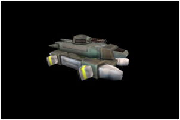

#第二十二课 使用Assimp加载模型  

##背景  
到现在为止我们都在使用手动生成的模型。正如你所想的，指明每个顶点的位置和其他属性有点时候并不是十分方便。对于一个箱子、锥体和简单平面还好，但是像人们的脸怎么办？现实的商业应用和游戏中，程序中使用模型一般都是由美术人员通过如 Blender, Maya 或 3ds Max 等建模软件来解决这个问题。这些软件提供了高级的工具帮助他们创造很复杂的模型。模型完成后可以以不同格式的文件保存。文件中包含了这个模型的所有几何解释。这些文件可以被加载到一个游戏引擎（提供支持特定格式的引擎）里面，文件中的内容可用来填充到渲染所需要的顶点缓存和索引缓存中。使用这些专业的模型对于场景效果的提升是十分关键的。  

自己开发解析器将耗费你很长的时间。如果你想从不同格式的模型文件中加载模型，你需要学习每一种格式然后为其开发一个特定的解释器。有些模型的格式简单，但是一些也很复杂，你最终可能花费很多时间在这些并不是 3D 设计的核心内容上。因此，这章介绍的内容就是使用外加的库负责从文件中解释和加载模型。  

Open Asset Import Library，也称 Assimp，是一个可以处理许多 3D 格式的开源库，包括最受欢迎的二进制反码格式。它是跨平台的，可用于 Linux 和 Windows，非常容易使用和嵌入到以 C/C++ 程序中。  

这课没有太多的理论。让我们直接去看如何使用 Assimp 库中提供的函数来导入 3D 模型。在开始之前，请先确认你已经从上面的链接安装了 Assimp。

##代码
```
(mesh.h:50)
class Mesh
{
public:
Mesh();
~Mesh();
bool LoadMesh(const std::string& Filename);
void Render();
private:
bool InitFromScene(const aiScene* pScene, const std::string& Filename);
void InitMesh(unsigned int Index, const aiMesh* paiMesh);
bool InitMaterials(const aiScene* pScene, const std::string& Filename);
    void Clear();
 #define INVALID_MATERIAL 0xFFFFFFFF
    struct MeshEntry {
   MeshEntry();
   ~MeshEntry();
   bool Init(const std::vector& Vertices,
   const std::vector& Indices);
   GLuint VB;
   GLuint IB;
   unsigned int NumIndices;
   unsigned int MaterialIndex;
};
std::vector<MeshEntry> m_Entries;
std::vector<Texture*> m_Textures;
};
```  

这个 Mesh 类是 Assimp 和 OpenGL 程序之间的接口。这个类使用一个文件名参数作为 LoadMesh() 函数的参数，借助于 Assimp 加载模型，然后我们对加载进的模型数据进行解析，并将这些模型数据填充到顶点缓存、索引缓存以及纹理对象。为了渲染 mesh，我们定义了 Render() 函数。Mesh 类的内部结构与 Assimp 加载模型的方法相匹配。Assimp 用一个 aiScene 对象来代表被加载的 mesh， aiScene 对象中封装了包含模型各部分的 mesh 结构体。 aiScene 对象中必须至少含有一个 mesh 结构，复杂的模型可以包含多个 mesh 结构。 Mesh 类的成员 m\_Entries 是 MeshEntry 结构体向量，其中的每个结构体和 aiScene 对象中的一个 mesh 结构相对应。这个结构体包含顶点缓存、索引缓存和材质的索引。目前一个材质只是一个纹理，又因为 mesh 实体可以共享材质，所以我们给每个材质( m\_Textures )单独设一个向量。MeshEntry::MaterialIndex 指向 m\_Textures 里面的一个纹理。

```
(mesh.cpp:77)
bool Mesh::LoadMesh(const std::string& Filename)
{
    // Release the previously loaded mesh (if it exists)
    Clear();
    bool Ret = false;
    Assimp::Importer Importer;
    const aiScene* pScene = Importer.ReadFile(Filename.c_str(), aiProcess_Triangulate | aiProcess_GenSmoothNormals | aiProcess_FlipUVs);
    if (pScene) {
        Ret = InitFromScene(pScene, Filename);
    }
    else {
        printf("Error parsing '%s': '%s'\n", Filename.c_str(), Importer.GetErrorString());
    }
    return Ret;
}
```

加载mesh从这个函数开始。我们在栈上创建了一个 Assimp::Importer 类的实例，并且调用它的读文件（ReadFile）方法。这个函数需要两个参数：模型文件的完整路径和一些处理的选项。 Assimp 能对加载的模型执行很多实用的优化。例如，为没有法线的模型生成法线，优化模型的结构来提高性能等，我们可以根据需要来选择合适的操作。在这里我们使用了其提供的三个操作：第一个是 aiProcess\_Triangulate ，它将不是由三角组成的模型转换为基于三角形的网格模型。例如：一个四边形 mesh 可以通过从其中的每个四边形生成两个三角形而被变换为三角形 mesh； 第二个操作是 aiProcess\_GenSmoothNormals ，为那些原来不含顶点法线的模型生成顶点法线。记住这些加工方式是非重叠的位掩码，因此你可以使用或运算来对这些操作进行组合；第三个操作是 aiProcess\_FlipUVsv ，沿着 y 轴翻转纹理坐标。你需要根导入的模型数据来选择合适的操作。如果 mesh 成功加载，我们获得一个指向 aiScene 对象的指针。这个对象包含整个模型的内容，模型的不同结构都保持在一个 aiMesh 结构中。接下来我们调用 InitFromScene() 函数来初始化 Mesh 对象。  

```
(mesh.cpp:97)
bool Mesh::InitFromScene(const aiScene* pScene, const std::string& Filename)
{
    m_Entries.resize(pScene->mNumMeshes);
    m_Textures.resize(pScene->mNumMaterials);
    // Initialize the meshes in the scene one by one
    for (unsigned int i = 0 ; i < m_Entries.size() ; i++) {
        const aiMesh* paiMesh = pScene->mMeshes[i];
        InitMesh(i, paiMesh);
    }
    return InitMaterials(pScene, Filename);
}
```  

首先我们根据需要用到的 m\_Entries 和 m\_Textures 数量来为其分配存储空间，其数目可经由 aiScene 对象中的成员 mNumMeshes 和 mNumMaterials 得到。接下来我们遍历 aiScene 对象中的 mMeshes 数组，并挨个儿初始化 m\_Entries 实例。最后初始化材质。  

```
(mesh.cpp:111)
void Mesh::InitMesh(unsigned int Index, const aiMesh* paiMesh)
{
    m_Entries[Index].MaterialIndex = paiMesh->mMaterialIndex;
    std::vector Vertices;
    std::vector Indices;
    ...
```

首先我们记录下当前 mesh 的材质索引，在渲染过程中将通过它来找到 mesh 对应的正确材质。接下来，我们创建两个 STL 容器来储存顶点和索引缓冲器的内容。STL 容器有一个很好的特性：能够在连续的缓冲区中储存数据，这使得将数据加载到 OpenGL 缓存中变得很容易（使用 glBufferData() 函数）。  

```
(mesh.cpp:118)
    const aiVector3D Zero3D(0.0f, 0.0f, 0.0f);
    for (unsigned int i = 0 ; i < paiMesh->mNumVertices ; i++) {
        const aiVector3D* pPos = &(paiMesh->mVertices[i]);
        const aiVector3D* pNormal = &(paiMesh->mNormals[i]) : &Zero3D;
        const aiVector3D* pTexCoord = paiMesh->HasTextureCoords(0) ? &(paiMesh->mTextureCoords[0][i]) : &Zero3D;
        Vertex v(Vector3f(pPos->x, pPos->y, pPos->z),
                Vector2f(pTexCoord->x, pTexCoord->y),
                Vector3f(pNormal->x, pNormal->y, pNormal->z));
        Vertices.push_back(v);
    }
    ...
```

这里我们通过对模型数据的解析将顶点属性数据依次存放到我们的 Vertices 容器中。我们使用到 aiMesh 类中下面的一些方法：
1. mNumVertices - 顶点数量
2. mVertices - 包含位置属性的数组
3. mNormals - 包含顶点法线属性的数组
4. mTextureCoords - 包含纹理坐标数组，这是一个二维数组，因为每个顶点可以拥有多个纹理坐标。

因此，总的来说我们有三个相互独立的数组，它们囊括了所有我们需要的顶点信息，我们可以通过这些信息来构建我们最终的顶点结构体。注意一些模型没有纹理坐标，所以在访问mTextureCoords数组之前（可能会引发错误），我们应该通过调用 HasTextureCoords() 来检查纹理是否存在。除此之外，一个 mesh 的每个顶点可以包含多个纹理坐标。在这章，我们只是简单地使用其第一个纹理坐标。因此 mTextureCoords 数组（二维的）始终只有第一行的值被访问。如果纹理坐标不存在，我们将这个顶点的纹理坐标初始化为 0 向量。  

```
(mesh.cpp:132)
for (unsigned int i = 0 ; i < paiMesh->mNumFaces ; i++) {
        const aiFace& Face = paiMesh->mFaces[i];
        assert(Face.mNumIndices == 3);
        Indices.push_back(Face.mIndices[0]);
        Indices.push_back(Face.mIndices[1]);
        Indices.push_back(Face.mIndices[2]);
    }
...
```

接下来我们创建索引缓存。aiMesh 类的成员 mNumFaces 告诉我们有多少个多边形，而 mFaces 数组包含了顶点的索引。首先我们要确保每个多边形的顶点数都为3（加载模型的时候我们要求进行三角化，但是最好再检查一下）。然后我们从模型数据中解析出每个面的索引并将其存放到 Indices 容器中。

```
(mesh.cpp:140)
    m_Entries[Index].Init(Vertices, Indices);
}
```

最后，我们用顶点和索引向量初始化 MeshEntry 结构体。函数 MeshEntry::Init() 中没有新内容，所以这里不再对其进行详细介绍。它仅仅是使用 glGenBuffer(), glBindBuffer() 和 glBufferData() 来创建和填充顶点缓存和索引缓存。

```
(mesh.cpp:143)
bool Mesh::InitMaterials(const aiScene* pScene, const std::string& Filename)
{
    for (unsigned int i = 0 ; i < pScene->mNumMaterials ; i++) {
        const aiMaterial* pMaterial = pScene->mMaterials[i];
       ...
```

这个函数加载模型所用的所有纹理。在 aiScene 对象中 mNumMaterials 属性存放材质数量，而 mMaterials 是一个指针数组，其中的每一个元素都指向一个 aiMaterials 结构体。aiMaterials 结构体十分复杂，但是它通过几个 API 对其进行了封装。

```
(mesh.cpp:165)
        m_Textures[i] = NULL;
        if (pMaterial->GetTextureCount(aiTextureType_DIFFUSE) > 0) {
            aiString Path;
            if (pMaterial->GetTexture(aiTextureType_DIFFUSE, 0, &Path, NULL, NULL, NULL, NULL, NULL) == AI_SUCCESS) {
                std::string FullPath = Dir + "/" + Path.data;
                m_Textures[i] = new Texture(GL_TEXTURE_2D, FullPath.c_str());
                if (!m_Textures[i]->Load()) {
                    printf("Error loading texture '%s'\n", FullPath.c_str());
                    delete m_Textures[i];
                    m_Textures[i] = NULL;
                    Ret = false;
                }
            }
        }
        ...
```

一个材质可以包含多个的纹理，但并不是所有的纹理都必须包含颜色。例如，一个纹理可以是高度图、法向图、位移图等。因为当前我们针对光照计算的着色器程序只使用一个纹理，所以我们也只关心漫反射纹理。因此，我们使用 aiMaterial::GetTextureCount() 函数检查有多少漫反射纹理存在。这个函数以纹理类型为参数而返回此特定类型纹理的数目。如果至少存在一个漫反射纹理，我们使用 aiMaterial::GetTexture() 函数来获取它。这个函数的第一个参数是类型，接下来是纹理索引，然后我们需要一个指向纹理文件路径的字符串指针。最后有 5 个指针参数允许我们去获取纹理的各种配置，比如混合因子、全图模式和纹理操作等。这些是可选的，现在我们忽略它们而只传递 NULL。这里我们假定模型和纹理在同一子目录中。如果模型的结构比较复杂，你可能需要在别处寻找纹理，那样的话我们可以像往常一样创建纹理对象并加载它。  

```
(mesh.cpp:187)
       if (!m_Textures[i]) {
          m_Textures[i] = new Texture(GL_TEXTURE_2D, "./white.png");
          Ret = m_Textures[i]->Load();
       }
    }
    return Ret;
}
```

上面这一小段代码用于处理你在模型加载时遇到的一些问题。有时候一个模型可能并没有纹理，这样的话你可能会看不到任何东西，因为如果纹理不存在的话取样的结果默认为黑色。在这里当我们遇到这种问题时我们为其加载一个白色的纹理（你将在附件中找到这个纹理）。这将使得所有像素的基色变为白色，这样可能看起来不是很好，但是至少你可以看到一些东西。

```
(mesh.cpp:197)
void Mesh::Render()
{
    glEnableVertexAttribArray(0);
    glEnableVertexAttribArray(1);
    glEnableVertexAttribArray(2);
    for (unsigned int i = 0 ; i < m_Entries.size() ; i++) {
        glBindBuffer(GL_ARRAY_BUFFER, m_Entries[i].VB);
        glVertexAttribPointer(0, 3, GL_FLOAT, GL_FALSE, sizeof(Vertex), 0);
        glVertexAttribPointer(1, 2, GL_FLOAT, GL_FALSE, sizeof(Vertex), (const GLvoid*)12);
        glVertexAttribPointer(2, 3, GL_FLOAT, GL_FALSE, sizeof(Vertex), (const GLvoid*)20);
        glBindBuffer(GL_ELEMENT_ARRAY_BUFFER, m_Entries[i].IB);
        const unsigned int MaterialIndex = m_Entries[i].MaterialIndex;
        if (MaterialIndex < m_Textures.size() && m_Textures[MaterialIndex]) {
            m_Textures[MaterialIndex]->Bind(GL_TEXTURE0);
        }
        glDrawElements(GL_TRIANGLES, m_Entries[i].NumIndices, GL_UNSIGNED_INT, 0);
    }
    glDisableVertexAttribArray(0);
    glDisableVertexAttribArray(1);
    glDisableVertexAttribArray(2);
}
```

这个函数封装了 mesh 的渲染，并将其从主函数中分离出来（以前是主函数的一部分）。它遍历 m\_Entries 数组，将数组中每个元素。节点的材质索引被用来从 m\_Texture 数组中取出纹理对象，并将这个纹理绑定。最后，执行绘制命令。现在我们有多个已经从文件中加载进来的 mesh 对象，调用 Mesh::Render() 函数一个接一个渲染它们。

```
glEnable(GL_DEPTH_TEST);
```

最后我们需要学习的是以前章节略去的。如果你继续使用上面的代码导入模型并渲染，你的场景将可能出现异常。原因是距离相机较远的三角形被绘制在距离较近的三角形的上面。为了解决这个问题，我么需要开启深度测试，这样光栅化程序就可以比较屏幕上相同位置存在的像素的深度优先权。最后被绘制到屏幕上的就是“赢得”深度测试（距离相机较近）的像素。深度测试默认不开启，上面的代码用于开启深度测试（这段代码在 GLUTBackendRun() 函数中，用于 OpenGl 状态的初始化）。但是这只是开启深度测试的第一步。（继续看下面）

```
(glut_backend.cpp:73)
glutInitDisplayMode(GLUT_DOUBLE|GLUT_RGBA|GLUT_DEPTH);
```

这一步是对深度缓存的初始化，为了比较两个像素的深度，“旧”的像素必须被储存起来。出于这个目的，我们创建一个特殊的缓冲过去——深度缓存（或者 Z 缓冲器）。深度缓存的大小与屏幕尺寸对应，这样颜色缓冲器里面的每个像素在深度缓冲器都有相应的位置。这个位置总是储存离相机最近的像素的深度值，用于深度测试时的比较。

```
(tutorial22.cpp:95)
glClear(GL_COLOR_BUFFER_BIT | GL_DEPTH_BUFFER_BIT);
```

最后我们需要做的是在开始渲染新的一帧的时候清除深度缓存。如果我们不那样做，深度缓存中将会保留上一帧中各像素的深度值，并且新一帧像素的深度将被与上一帧像素的深度比较。正如所想象的，这将导致最后绘制出来的图象千奇百怪（自己试试！）。 glClear() 函数接收它需要处理的缓冲器的位掩码。之前我们只清除了颜色缓存，现在也该清除深度缓存了。

##操作结果
