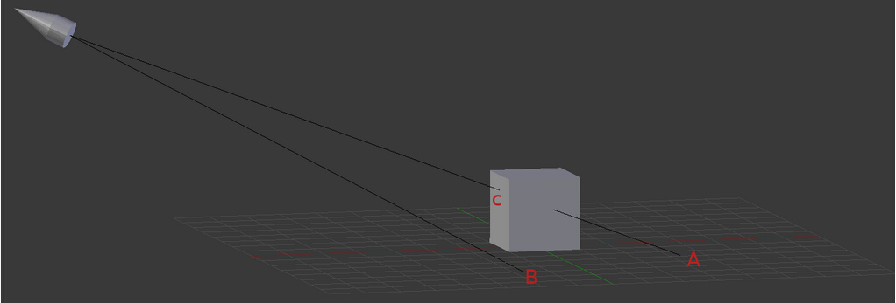

#第二十三课 阴影贴图（一）
##背景
阴影和光是紧密联系在一起的，因为如果你想要产生一个阴影就必须要光。有许多的技术可以生成阴影，在接下来的两个章节中我们将学习其中的一种比较基础简单的技术-阴影贴图。

当光栅化的时候，你会问这个像素是否位于阴影中?让我们换个问法，从光源到像素的路径是否中间经过其他物体？如果是，这个像素可能位于阴影中（假定其他的物体不透明），如果不是，则像素不位于阴影中。某种程度上这个问题和我们之前章节问的问题相似，如何确定当两个物体覆盖彼此时，我们看到的是比较近的那个。如果我们把相机放在光源的位置，那么两个问题变成一个。我们希望在深度测试中失败的像素处于阴影中。只有在在深度测试中获胜的像素受到光的照射。这些像素都是直接和光源接触的，其间没有任何东西会遮蔽它们。简单的说，这是在阴影贴图背后的原理。

看似深度测试可以帮助我们探测一个像素是否位于阴影中，但是还有一个问题：相机和光源不总位于同一个地方。深度测试通常用于解决从相机视口看物体是否可见的问题。所以当光源处于远处的时候，我们如何利用深度测试来进行阴影测试？解决方案是渲染场景两次。第一次从光源的角度。这次渲染过程的结果没有被存储到颜色缓冲区中。相反，离光源最近的深度值被渲染进入由应用程序创建的（而不是由 GLUT 自动生成的）深度缓冲区。在第二个过程则是像以前一样以相机为视口渲染场景。我们创建的深度缓冲区被绑定到片元着色器以便读取。对于每一个像素我们从这个深度缓冲区中取出相应的深度值（准确的说是取出当前像素到光源的路径上离光源最近的那个片元的深度值），同时我们也计算这个像素到光源的距离。有时候这两个值是相等的。这种情况说明这个像素与光源最近，因此它的深度值才会被写进深度缓冲区。如果这种情况发生，这个像素就被认为处于光照中并和往常一样计算它的颜色。如果这两个值是不相同，这意味着从光源看这个像素时有其他像素遮挡了它。这种情况下我们在颜色计算中增加阴影因子来模仿阴影效果。看看下面这幅图：  



我们的场景由两个对象组成——表面和立方体。光源是位于左上角并且指向立方体。在第一个渲染过程，我们以光源位置为视口将深度信息渲染到深度缓冲区中。单看 A，B，C 这 3 个点。当 B 被渲染时，它的深度值进入深度缓冲区。因为在 B 和光源之间没有其他的东西。我们默认它是那条线上离光源最近的点。然而当 A 和 C 被渲染的时候，它们在深度缓冲区的同一个点进行比较。两个点都在同一条来自光源的直线上，所以在透视投影后，光栅器发现这两个点需要去往屏幕上的同一个像素。这就是深度测试，最后 C 点“赢”了，则 C 点的深度值被写入了深度缓存中。

在第二个渲染过程，我们以相机为视口渲染表面和立方体。我们在着色器中除了为每个像素做一些计算，我们还计算从光源到像素之间的距离，并和在深度缓冲区中对应的深度值进行比较。当我们光栅化 B 点时，这两个值应该是差不多相等的（可能由于插值的不同和浮点类型的精度问题会有一些差距），因此我们认为 B 不在阴影中而和往常一样进行计算。当光栅化 A 点的时候，我们发现储存的深度值明显比 A 到光源的距离要小。所以我们认为 A 在阴影中，并且在 A 点上应用一些阴影参数，以使它比以往黑一点。

这个简言之就是阴影映射算法（在第一次渲染过程中我们渲染的深度缓冲区被称为 "shadow map" ）。我们将分两个阶段学习它。在第一个阶段（本节）我们将学习如何将深度信息渲染到 shadow map 中。渲染一些东西（深度，颜色等等）到由应用程序创建的纹理，被称为 'render to texture' 。我们将用十分熟悉的纹理贴图技术在屏幕上显示 shadow map 。这是一个很好的调试过程，因为保证 shadow map 的正确性对于正确实现整个阴影效果至关重要。在下一节我们将看见如何使用 shadow map 来计算顶点“是否处于阴影中”。

这一节我们使用的模型包括一个可以被用来显示 shadow map 的简单四边形。这个四边形是由两个三角形组成的，并设置纹理坐标使它们覆盖整个纹理。当四边形被渲染的时候，纹理坐标被光栅器插值，于是你就可以在整个纹理上采样并在屏幕上显示。

##代码
```
(shadow_map_fbo.h:50)
class ShadowMapFBO
{
    public:
        ShadowMapFBO();
        ~ShadowMapFBO();
        bool Init(unsigned int WindowWidth, unsigned int WindowHeight);
        void BindForWriting();
        void BindForReading(GLenum TextureUnit);
    private:
        GLuint m_fbo;
        GLuint m_shadowMap;
};
```

OpenGL 中的 3D 管线最终输出到 'framebuffer object'（简称 FBO ）。FBO 可以挂载颜色缓冲（在屏幕上显示），深度缓冲和一些有其他用处的缓冲区。当 glutInitDisplayMode() 被调用的时候，它用一些特定的参数创建默认的 framebuffer。这个 framebuffer被窗口系统所管理，不能够被 OpenGL 删除。除了默认的 framebuffer ，应用程序可以创建自己的 FBOs 。在应用程序的控制下，这些对象可以被控制和用于不同的技术。ShadowMapFBO 类为 FBO 提供一个容易使用的接口 ( FBO 将被用来实现阴影贴图技术)。   ShadowMapFBO 类内部有两个 OpenGL 句柄。'm_fbo' 句柄代表真正的 FBO 。 FBO 封装了 framebuffer 的所有状态。一旦这个对象被创建并设置合适的参数，我们可以简单的通过绑定一个不同的对象来改变 framebuffers。注意只有默认的 framebuffers 才可以被使用来在屏幕上显示东西，应用程序创建的 framebuffers 只能用于”离屏渲染“。这个可以说是一个中间的渲染过程（比如我们的阴影贴图缓冲区），为后面用于屏幕显示的真正的渲染过程所服务。

Framebuffer 本身仅仅是一个占位符。为了使它变得可用，我们需要把纹理依附于一个或者更多的可用的挂载点。纹理含有 framebuffers 实际的内存空间。OpenGL 定义了下面的一些附着点。  

1. COLOR_ATTACHMENTi —— 附着到这里的纹理将接收来自片元着色器的颜色。‘i’ 后缀意味着可以有多个纹理同时被附着为颜色附着点。在片元着色器中有一个机制可以确保同时将颜色输出到多个缓冲区中。
2. DEPTH_ATTACHMENT —— 附着在上面的纹理将收到深度测试的结果。
3. STENCIL_ATTACHMENT —— 附着在上面的纹理将充当模板缓冲区。模板缓冲区限制了光栅化的区域，可被用于不同的技术。
4. DEPTH_STENCIL_ATTACHMENT —— 这仅是一个深度和模板缓冲区的结合，因为它俩经常被一起使用。  

为实现阴影贴图技术，我们只需要得到经过深度测试之后获得的场景的深度值。成员属性 'm_shadowMap' 是一个纹理的句柄，这个纹理将要附着到 DEPTH_ATTACHMENT 附着点上。ShadowMapFBO 也提供两个接口供主渲染函数的调用。在渲染进 shadow map 之前我们将调用 BindForWriting()，在第二次渲染过程开始的时候调用 BindForReading()。

```
(shadow_map_fbo.cpp:43)
glGenFramebuffers(1, &m_fbo);
```

这里我们创建 FBO。和纹理与、缓冲区这些对象的创建方式一样，我们指定一个 GLuints 数组的地址和它的大小。这个数组被句柄填充。

```
(shadow_map_fbo.cpp:46)
glGenTextures(1, &m_shadowMap);
glBindTexture(GL_TEXTURE_2D, m_shadowMap);
glTexImage2D(GL_TEXTURE_2D, 0, GL_DEPTH_COMPONENT, WindowWidth, WindowHeight, 0, GL_DEPTH_COMPONENT, GL_FLOAT, NULL);
glTexParameterf(GL_TEXTURE_2D, GL_TEXTURE_MIN_FILTER, GL_LINEAR);
glTexParameterf(GL_TEXTURE_2D, GL_TEXTURE_MAG_FILTER, GL_LINEAR);
glTexParameterf(GL_TEXTURE_2D, GL_TEXTURE_WRAP_S, GL_CLAMP);
glTexParameterf(GL_TEXTURE_2D, GL_TEXTURE_WRAP_T, GL_CLAMP);
```

接下来我们创建将充当 shadow map 的纹理。通常这是一个标准的 2D 纹理，同时我们对其的参数进行设置，使得这个纹理能够适应以下的需求：
1. 纹理的内部格式是 GL\_DEPTH\_COMPONENT 。之前我们通常将纹理的内部格式设置为与颜色有关的类型如（GL_RGB），但是这里我们将其设置为 GL\_DEPTH\_COMPONENT 意味着纹理中的每个纹素都存放着一个单精度浮点数用于存放已经标准化后深度值。
2. glTexImage2D 的最后一个参数是空，这意味着我们不提供任何用于初始化 buffer 的数据，因为我们想要 buffer 包含每一帧的深度值并且每一帧的深度值都可能会变化。无论我们什么时候开始一个新的帧，我们会用 glClear() 清除 buffer。这就是我们在初始化过程中需要做的。
3. 我们告诉 OpenGL 如果纹理坐标越界，需要将其截断到[0，1]之间。当以相机为视口的投影窗口超过以光源为视口的投影窗口时会发生纹理坐标越界。为了避免奇怪的现象比如阴影在别的地方重复（由于 wraparound ），我们截断纹理坐标。

```
(shadow_map_fbo.cpp:54)
glBindFramebuffer(GL_FRAMEBUFFER, m_fbo);
```

我们已经生成 FBO，纹理对象，并为阴影贴图配置了纹理对象。现在我们需要把纹理对象附到 FBO。我们要做的第一件事就是绑定 FBO，之后所有对 FBO 操作都会对它产生影响。这个函数的参数是 FBO 句柄和所需的 target。target 可以是 GL\_FRAMEBUFFER, GL\_DRAW\_FRAMEBUFFER 或者 GL\_READ\_FRAMEBUFFER。GL\_READ\_FRAMEBUFFE 用于当我们想调用 glReadPixels（本课中不会使用）从 FBO 中读取内容时。当我们想要把场景渲染进入 FBO 时需要使用 GL\_DRAW_FRAMEBUFFE。当我们使用 GL\_FRAMEBUFFER 时，FBO 的读写状态都会被更新，因此建议您这样初始化 FBO。当我们真正开始渲染的时候我们将会使用 GL\_DRAW\_FRAMEBUFFER。

```
(shadow_map_fbo.cpp:55)
glFramebufferTexture2D(GL_DRAW_FRAMEBUFFER, GL_DEPTH_ATTACHMENT, GL_TEXTURE_2D, m_shadowMap, 0);
```

这里我们把 shadow map 纹理附着到 FBO 的深度附着点。这个函数最后一个参数指明要用的 Mipmap 层级。Mipmap 层是纹理贴图的一个特性，以不同分辨率展现一个纹理。0 代表最大的分辨率，随着层级的增加，纹理的分辨率会越来越小。将 Mipmap 纹理和三线性滤波结合起来能产生更好的结果。这里我们只有一个 mipmap 层，所以我们使用 0。我们让 shadow map 句柄作为第四个参数。如果这里我们使用 0，那么当前的纹理(在上面的例子是深度）将从指定的附着点上脱落。

```
(shadow_map_fbo.cpp:58)
glDrawBuffer(GL_NONE);
glReadBuffer(GL_NONE);
```

因为我们没打算渲染到 color buffer（只输出深度），我们通过上面的函数来明确的禁止向颜色缓存中的写入。默认情况下，颜色缓存会被绑定在 GL\_COLOR\_ATTACHMENT0，但是我们 FBO 中甚至不会包含一个纹理缓冲区，所以，最好明确的告诉 OpenGL 我们的意愿。这个函数可用的参数是 GL\_NONE 和 GL\_COLOR\_ATTACHMENT0 到 GL\_COLOR\_ATTACHMENTm ，‘m’ 是（GL\_MAX\_COLOR\_ATTACHMENTS – 1）。这些参数只对 FBOs 有效。如果用了默认的 framebuffer，那么有效的参数是 GL\_NONE, GL_FRONT\_LEFT, GL\_FRONT\_RIGHT, GL\_BACK\_LEFT 和 GL\_BACK\_RIGHT。它允许你可以直接将场景渲染进入前或者后 buffer（每一个都有左和右 buffer）。我们也将从缓存中的读取操作设置为 GL_NONE（记住，我们不打算调用 glReadPixel APIs 中的任何一个函数）。这主要是为了避免因 GPU 只支持 opengl3.x 而不支持 4.x 而出现问题。

```
(shadow_map_fbo.cpp:61)
GLenum Status = glCheckFramebufferStatus(GL_FRAMEBUFFER);
if (Status != GL_FRAMEBUFFER_COMPLETE) {
    printf("FB error, status: 0x%x\n", Status);
    return false;
}
```

当我们完成 FBO 的配置后，一定要确认其状态是否为 OpenGL 定义的的 “complete” 。否则可能虽然没检查出错误，而 framebuffer 却可以被使用。上面的代码就是用于对这些状态的检测。

```
(shadow_map_fbo.cpp:72)
void ShadowMapFBO::BindForWriting()
{
    glBindFramebuffer(GL_DRAW_FRAMEBUFFER, m_fbo);
}
```

在渲染过程章我们需要将渲染目标在 shadow map 和默认的 framebuffer 之间进行切换。在第二个渲染过程中，我们将需要绑定 shadow map 作为输入。这个函数和下一个函数提供一个便捷的的封装来做这项工作。上面的函数仅绑定 FBO 用于写入数据。在第一次渲染之前我们将调用它。

```
(shadow_map_fbo.cpp:78)
void ShadowMapFBO::BindForReading(GLenum TextureUnit)
{
    glActiveTexture(TextureUnit);
    glBindTexture(GL_TEXTURE_2D, m_shadowMap);
}
```

这个函数在第二次渲染之前被调用以绑定 shadow map 用于读取数据。注意我们绑定纹理对象而不是 FBO 本身。这个函数的参数是纹理单元，并把 shadow map 绑定到这个纹理单元上。这个纹理单元的索引一定要和着色器同步（因为着色器有一个 sampler2D 一致变量用来访问这个纹理）。注意 glActiveTexture 的参数是纹理索引的枚举值（比如GL\_TEXTURE0, GL\_TEXTURE1等等）。着色器中的一致变量只需要索引值本身（如0，1等）。这可能会是许多 bugs 的源头。

```
(shadow_map.vs)
 #version 330
layout (location = 0) in vec3 Position;
layout (location = 1) in vec2 TexCoord;
layout (location = 2) in vec3 Normal;
uniform mat4 gWVP;
out vec2 TexCoordOut;
void main()
{
    gl_Position = gWVP * vec4(Position, 1.0);
    TexCoordOut = TexCoord;
}
```

我们将在两次的渲染中都使用同一着色器程序。顶点着色器在两次渲染过程中都用到，而片元着色器将只在第二次渲染过程中被使用。因为我们在第一次渲染过程中禁止把数据写入颜色缓存，所以就没用到片元着色器。上面的顶点着色器是十分简单的，它仅仅是通过 WVP 矩阵将位置坐标变换到裁剪坐标系中，并将纹理坐标传递到片元着色器中。在第一次的渲染过程中，纹理坐标是多余的（因为没有片元着色器）。然而，这没有实际的影响。正如你所看见的，从着色器角度来看，无论这是一个渲染深度的过程还是一个真正的渲染过程都没有什么不同，而真正不同的地方是应用程序在第一次渲染过程传递的是以光源为视口的 WVP 矩阵，而在第二次渲染过程传递的是以相机为视口的 WVP 矩阵。在第一次的渲染过程 Z buffer 将被最靠近光源位置的 Z 值所填充，在第二次渲染过程中，Z buffer将被最靠近相机位置的 Z 值所填充。在第二次渲染过程中我们需要使用片元着色器中的纹理坐标，因为我们将从 shadow map（此时它是着色器的输入）中进行采样。

```
(shadow_map.fs)
 #version 330
in vec2 TexCoordOut;
uniform sampler2D gShadowMap;
out vec4 FragColor;
void main()
{
    float Depth = texture(gShadowMap, TexCoordOut).x;
    Depth = 1.0 - (1.0 - Depth) * 25.0;
    FragColor = vec4(Depth);
}
```

这是在渲染过程中用来显示 shadow map 的片元着色器。2D 纹理坐标被用来从 shadow map 中进行采样。Shadow map 纹理是以 GL_DEPTH_COMPONENT 类型为内部格式而创建的。这意味着纹理中每一个纹素都是一个单精度的浮点型数据而不是一种颜色。这就是为什么 '.x' 在采样的过程中被使用。当我们显示深度缓存中的内容时，我们可能遇到的一个情况是渲染的结果不够的清楚。所以，在我们从 shadow map 中采样获得深度值后，为使效果明显，我们放大当前点的距离到远边缘(此处Z为1)，然后再用1减去这个放大后值。我们将这个值作为片元的每个颜色通道的值，这意味着我们将得到一些灰度的变化（远裁剪面处是白色，近裁剪面处是黑色）。

现在让我们如何结合上面的这些代码片段而创建应用程序。

```
(tutorial23.cpp:109)
virtual void RenderSceneCB()
{
    m_pGameCamera->OnRender();
    m_scale += 0.05f;
    ShadowMapPass();
    RenderPass();
    glutSwapBuffers();
}
```

主渲染程序随着大部分的功能移到其他函数变得更加简单。首先我们处理全局的东西比如更新相机的位置和用来旋转对象的类成员。然后我们调用一个 ShadowMapPass() 函数将深度信息渲染进入 shadow map 纹理中，接着用 RenderPass() 函数来显示这个纹理。最后调用 glutSwapBuffer() 用来将最终结果显示到屏幕上。

```
(tutorial23.cpp:120)
virtual void ShadowMapPass()
{
    m_shadowMapFBO.BindForWriting();
    glClear(GL_DEPTH_BUFFER_BIT);
    Pipeline p;
    p.Scale(0.1f, 0.1f, 0.1f);
    p.Rotate(0.0f, m_scale, 0.0f);
    p.WorldPos(0.0f, 0.0f, 5.0f);
    p.SetCamera(m_spotLight.Position, m_spotLight.Direction, Vector3f(0.0f, 1.0f, 0.0f));
    p.SetPerspectiveProj(20.0f, WINDOW_WIDTH, WINDOW_HEIGHT, 1.0f, 50.0f);
    m_pShadowMapTech->SetWVP(p.GetWVPTrans());
    m_pMesh->Render();
    glBindFramebuffer(GL_FRAMEBUFFER, 0);
}
```
在渲染 Shadow map 之前我们先绑定 FBO。从现在起，所有的深度值将被渲染进入 shadow map，同时颜色的写入被舍弃。我们只在渲染开始之前清除深度缓冲区。之后我们为了渲染 mesh（例中为一个坦克）初始化了一个 pipeline 类对象。这里值得注意的一点是相机相关设置是基于聚光灯的位置和方向。我们先渲染 mesh，然后通过绑定 FBO 为 0 来切换回默认的 framebuffer。

```
(tutorial23.cpp:138)
virtual void RenderPass()
{
    glClear(GL_COLOR_BUFFER_BIT | GL_DEPTH_BUFFER_BIT);
    m_pShadowMapTech->SetTextureUnit(0);
    m_shadowMapFBO.BindForReading(GL_TEXTURE0);
    Pipeline p;
    p.Scale(5.0f, 5.0f, 5.0f);
    p.WorldPos(0.0f, 0.0f, 10.0f);
    p.SetCamera(m_pGameCamera->GetPos(), m_pGameCamera->GetTarget(), m_pGameCamera->GetUp());
    p.SetPerspectiveProj(30.0f, WINDOW_WIDTH, WINDOW_HEIGHT, 1.0f, 50.0f);
    m_pShadowMapTech->SetWVP(p.GetWVPTrans());
    m_pQuad->Render();
}
```

第二个渲染过程开始先清除颜色和深度缓存。这些缓存属于默认的 framebuffer。我们告诉着色器使用纹理单元 0，并绑定 shadow map 用来读取其中的数据。从这里起处理就都和以前一样了。我们放大四边形，把他直接放在相机的前面并渲染它。在光栅化期间 shadow map 被采样和并显示到模型上。

注意：在这个章节的代码中，当 mesh 文件中不包含纹理时，我们不再自动的加载一个白色的纹理。因为我们会为其绑定 Shadow map。

##操作结果
