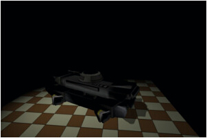

#第二十四课 阴影贴图（二） 

##背景

在前面一节中我们学习了 shadow mapping 的基本原理，并且介绍了如何将深度信息渲染到一张纹理上面并最终通过从深度缓存中进行采样而将其渲染到屏幕上面。在这一节中我们将会介绍如何使用这个功能来创建真正的阴影。  

我们知道 shadow mapping 是一个二次渲染技术，在第一次渲染过程中场景的渲染是从光源角度出发的。让我们回顾一下在第一次渲染时位置向量的 Z 分量的发生了什么：  

1. 传入顶点着色器的顶点位置属性是在局部坐标系下定义的；
2. 顶点着色器将位置信息从局部坐标系变换到裁剪空间中，并将其传递给渲染管线的下一阶段（如果你对裁剪空间不熟悉可以查阅第 12 节中的内容）；
3. 在光栅化阶段执行透视除法（位置向量除以其自身的 W 分量）。这使得位置向量从裁剪空间变换到 NDC 空间中。在 NDC 空间中，所有最终会显示到屏幕上的点的 X、Y 以及 Z 分量都处于 [-1，1] 之间，而所有的在这个范围之外的点都会被裁剪掉；
4. 光栅化阶段位置向量的 X、Y 分量被映射到帧缓存空间中（例如 800 * 600 , 1024 * 768 等）。其结果是将位置向量变换到屏幕空间中去；
5. 光栅器接收位于屏幕空间中的三角形的三个顶点，并且在他们之间插值，以此来得到被三角形覆盖的每个像素的坐标值。他们的 Z 值（依然位于[0，1]范围内）也被插值，所以每个像素都有自己的深度值。
6. 由于我们在第一轮渲染时禁止了颜色的写入，所以此时片元着色器无效，但是深度测试依然会执行。为了让当前像素的深度值与缓存中的像素的深度值进行比较，我们可以使用像素的屏幕坐标来从深度缓存中获取像素的深度值。如果当前像素的深度值比缓存中的小，则更新缓存（如果颜色写入被开启，则颜色缓存中的值也会被更新）。  

在上面的过程中，我们看到了以光源为视角时的深度值的计算和存储。在第二次渲染中我们以相机为视角渲染场景，所以自然而然我们会得到不同的深度值。但是这两个深度值都是我们所需要的——其中一个使得图形能够正确绘制在屏幕上，另一个用来检查哪些片元位于阴影中，而哪些不在。实现 shadow mapping 的技巧就是在 3D 渲染管线中维护两个位置向量和两个 WVP 矩阵。其中一个 WVP 矩阵从光源角度算出，而另一个从相机角度算得。与往常一样，顶点着色器接受一个在局部坐标系下定义的位置向量，但它却要输出两个向量：  

1. 内置变量 gl_Position，它是经过相机的 WVP 矩阵变换之后的结果；
2. 一个纯向量，是经过光源 WVP 矩阵变换之后的结果。  

第一个向量会经历上述的过程（最后变换到 NDC 空间中），并且会用于常规的光栅化阶段。第二个向量仅仅会通过光栅化阶段，在光栅化和深度测试之后将离光源最近的片元的深度值存放到我们创建的 shadow map 中（在二次渲染时通过从这个纹理中获取相应像素的深度值来确定最后的阴影效果）。所以现在，对于屏幕上的每一个像素，shadow map 中都有一个像素点与之对应，现在剩下的就是如何通过裁剪空间中的坐标来获取 shadow map 中的深度值。之后我们就可以将阴影纹理中的深度值与位于裁剪坐标系中的深度值进行比较，如果剪裁坐标的深度值比较小，那就意味着像素位于阴影中。  

那么我们如何在片元着色器中通过裁剪空间中的坐标（经过光源 WVP 矩阵变换得到）来获取 shadow map 中的深度值呢？  

1. 因为片元着色器将接收到的裁剪空间中的坐标看做一个标准的顶点属性，光栅化程序不会对他执行透视除法（只有被传入到 gl\_position 变量中的顶点才会自动执行透视除法）。但是在 shader 中我们可以很方便的来手动实现这一功能，我们将这个向量除以其 W 分量这样我们就将其变换到了 NDC 空间中了；
2. 我们知道在 NDC 空间中，顶点的 X、Y 分量都位于[-1，1]的范围内，在上面的第四步中光栅化程序将 NDC 空间中的坐标映射到屏幕空间中，并且用它们来存放深度信息。现在我们想要从中提取出深度信息，为此我们需要一个位于[0，1]范围内的纹理坐标。如果我们将范围在[-1，1]之间的 NDC 空间坐标线性的映射到[0，1]的范围中，那么我就会得到一个纹理坐标，这个纹理坐标会映射到阴影纹理的同一位置。例如：在 NDC 空间中一个顶点的 X 坐标为 0，现在纹理的宽度为 800，那么位于 NDC 空间中的 0 需要被映射到纹理坐标空间中的 0.5（因为 0 位于[-1，1]的中点）。纹理空间中的 0.5 被映射到纹理上面的 400，而这同样是光栅器执行屏幕空间转换时需要对其进行计算的地方。
3. 将 NDC 空间中的 X、Y 坐标变换到纹理空间中的公式如下：  
	u = 0.5 * X + 0.5   
	v = 0.5 * Y + 0.5  

##代码  

```
class LightingTechnique : public Technique {
    public:
    ... 
        void SetLightWVP(const Matrix4f& LightWVP);
        void SetShadowMapTextureUnit(unsigned int TextureUnit);
    ...
    private:
        GLuint m_LightWVPLocation;
        GLuint m_shadowMapLocation;
...
```

在 LightingTechnique 类中需要两个新的属性。一个是根据光源视角计算出 WVP 矩阵，另一个是存放阴影纹理的纹理单元。我们依然使用 0 号纹理单元来存放映射到模型上的普通纹理，而用 1 号纹理单元存储阴影纹理。  

```
(lighting.vs)
 #version 330
layout (location = 0) in vec3 Position;
layout (location = 1) in vec2 TexCoord;
layout (location = 2) in vec3 Normal;
uniform mat4 gWVP;
uniform mat4 gLightWVP;
uniform mat4 gWorld;
out vec4 LightSpacePos;
out vec2 TexCoord0;
out vec3 Normal0;
out vec3 WorldPos0;
void main()
{
    gl_Position = gWVP * vec4(Position, 1.0);
    LightSpacePos = gLightWVP * vec4(Position, 1.0);
    TexCoord0 = TexCoord;
    Normal0 = (gWorld * vec4(Normal, 0.0)).xyz;
    WorldPos0 = (gWorld * vec4(Position, 1.0)).xyz;
} 
```

这是 LightingTechnique 类中更新之后的顶点着色器。我们新增加了一个 WVP 矩阵一致变量和一个作为输出的四维向量，它存放由光源 WVP 矩阵变换之后的坐标。正如你所看到的，在第一通道中的顶点着色器中的 gWVP 变量与这儿的 gLightWVP 变量中存放的矩阵都是一样的，所以那儿的 gl_position 与此处的 LightSpacePos 变量得到的数据一样。但是由于 LightSpacePos 仅仅是一个标准的向量，它不会像 gl_position 一样自动执行透视除法。对此我们会在下面的片元着色器中手动进行。

```
(lighting.fs:58)
float CalcShadowFactor(vec4 LightSpacePos)
{
    vec3 ProjCoords = LightSpacePos.xyz / LightSpacePos.w;
    vec2 UVCoords;
    UVCoords.x = 0.5 * ProjCoords.x + 0.5;
    UVCoords.y = 0.5 * ProjCoords.y + 0.5;
    float z = 0.5 * ProjCoords.z + 0.5;
    float Depth = texture(gShadowMap, UVCoords).x;
    if (Depth < (z + 0.00001))
        return 0.5;
    else
        return 1.0;
} 
```

这个函数在片元着色器中用来计算像素的阴影因素。阴影因素是光照计算中的一个新的影响因素，我们只需要将当前光照计算的结果乘上这个阴影因素，如果这个像素位于阴影中，则在计算这个像素的光照情况时，我们会为其加上一个衰减。这个函数接收从顶点着色器传来的经过插值得到的 LightSpacePos 向量作为参数，并先对这个向量执行透视除法——我们将其 XYZ 分量除以其 W 分量，如此将向量变换到 NDC 空间中去。下一步我们创建一个二维向量作为纹理坐标，并初始化它，通过将 LightSpacePos 向量从 NDC 空间中变换到纹理空间（根据“背景”里介绍的公式）。纹理坐标被用来从阴影纹理中获取深度信息，这个深度值是空间中所有投影到这个像素的点中离光源最近的点的深度值。我们将阴影纹理中的深度值与当前像素的深度值进行比较，如果阴影纹理中的深度值较小，则返回 0.5 作为阴影因素，否则返回 1.0（表示无阴影）。位于 NDC 空间中的 Z 值的范围同样要经历从[-1，1]变到[0，1],因为我们在比较他们的时候要保证他们位于同一空间中。需要注意的是我们为当前像素的深度加上了一个较小的值（epsilon value），这是为了避免处理浮点数时出现的精度错误。  

```
(lighting.fs:72)
vec4 CalcLightInternal(BaseLight Light, vec3 LightDirection, vec3 Normal, float ShadowFactor)
{
    ...
    return (AmbientColor + ShadowFactor * (DiffuseColor + SpecularColor));
} 
```

在光照计算的核心函数中改动就很少了，在调用这个函数的时候需要传入一个阴影因素，漫反射光和高光会受这个因素的调整，而环境光则不受其影响，因为按照定义，环境光是无处不在的。  

```
(lighting.fs:97)
vec4 CalcDirectionalLight(vec3 Normal)
{
    return CalcLightInternal(gDirectionalLight.Base, gDirectionalLight.Direction, Normal, 1.0);
} 
```

我们所实现的 shadow mapping 目前只局限于聚光灯光源，为了计算光源的 WVP 矩阵，我们不仅需要光源的位置，同时还需要光照的方向，这是点光源和平行光所不具有的。我们会在之后的学习中将这些因素都添加上去，但是目前在计算平行光时，我们简单的将其阴影因素设置为 1。  

```
(lighting.fs:102)
vec4 CalcPointLight(struct PointLight l, vec3 Normal, vec4 LightSpacePos)
{
    vec3 LightDirection = WorldPos0 - l.Position;
    float Distance = length(LightDirection);
    LightDirection = normalize(LightDirection);
    float ShadowFactor = CalcShadowFactor(LightSpacePos);
    vec4 Color = CalcLightInternal(l.Base, LightDirection, Normal, ShadowFactor);
    float Attenuation = l.Atten.Constant +
        l.Atten.Linear * Distance +
        l.Atten.Exp * Distance * Distance;
    return Color / Attenuation;
} 
```

由于聚光灯的光照实际上是用点光源计算的，这个函数现在接收了一个新的参数 LightspacePos，并计算阴影因素，接着将其传给 CalcLightInternal() 函数。  

```
(lighting.fs:117)
vec4 CalcSpotLight(struct SpotLight l, vec3 Normal, vec4 LightSpacePos)
{
    vec3 LightToPixel = normalize(WorldPos0 - l.Base.Position);
    float SpotFactor = dot(LightToPixel, l.Direction);

    if (SpotFactor > l.Cutoff) {
        vec4 Color = CalcPointLight(l.Base, Normal, LightSpacePos);
        return Color * (1.0 - (1.0 - SpotFactor) * 1.0/(1.0 - l.Cutoff));
    }
    else {
        return vec4(0,0,0,0);
    }
}    
```

计算聚光灯光源光照的函数仅仅将 LightSpacePos 参数传递给点光源即可。  

```
(lighting.fs:131)
void main()
{
    vec3 Normal = normalize(Normal0);
    vec4 TotalLight = CalcDirectionalLight(Normal);
    for (int i = 0 ; i < gNumPointLights ; i++) {
        TotalLight += CalcPointLight(gPointLights[i], Normal, LightSpacePos);
    }
    for (int i = 0 ; i < gNumSpotLights ; i++) {
        TotalLight += CalcSpotLight(gSpotLights[i], Normal, LightSpacePos);
    }
    vec4 SampledColor = texture2D(gSampler, TexCoord0.xy);
    FragColor = SampledColor * TotalLight;
}   
```

最后，在片元着色器的 main 函数中，我们向点光源与聚光灯光源的光照计算中都传入了 LightSpacePos 向量，尽管只有聚光灯光源才支持（由于我们传入的光源 WVP 矩阵都是以聚光灯光源计算的）。这个缺陷会在后面的学习中进行改进。现在我们已经回顾了 lightingTechnique 类中的一些变化，接下来我们看看主程序中的改动。   

```
(tutorial24.cpp:86)
m_pLightingEffect = new LightingTechnique();
if (!m_pLightingEffect->Init()) {
    printf("Error initializing the lighting technique\n");
    return false;
}
m_pLightingEffect->Enable();
m_pLightingEffect->SetSpotLights(1, &m_spotLight);
m_pLightingEffect->SetTextureUnit(0);
m_pLightingEffect->SetShadowMapTextureUnit(1); 
```

这段代码创建了 LightingTechnique 对象，这是 Init（）函数中的一部分，所以它只会在开始的时候执行一次。这儿我们设置了一致变量，它不会因帧的改变而改变。我们用 0 号纹理单元来存放模型原有的纹理，用 1 号纹理单元来存放阴影纹理。记住在设置一致变量之前我们必须要先启用着色器程序，只要着色器程序不重新链接这些一致变量就一直不变。这是十分方便的，因为它使得我们能够在着色器程序之间进行转换并且只需要考虑那些动态的一致变量，而那些不发生变化的一致变量就可以在启动的时候设置一次就行了。  

```
(tutorial24.cpp:129)
virtual void RenderSceneCB()
{
    m_pGameCamera->OnRender();
    m_scale += 0.05f;
    ShadowMapPass();
    RenderPass();
    glutSwapBuffers();
} 
```

在主渲染函数中没有什么改变——首先我们设置全局变量如相机和用来旋转模型的因子。之后我们依次进行阴影通道和渲染通道的执行。  

```
(tutorial24.cpp:141)
virtual void ShadowMapPass()
{
    m_shadowMapFBO.BindForWriting();
    glClear(GL_DEPTH_BUFFER_BIT);
    m_pShadowMapEffect->Enable();
    Pipeline p;
    p.Scale(0.1f, 0.1f, 0.1f);
    p.Rotate(0.0f, m_scale, 0.0f);
    p.WorldPos(0.0f, 0.0f, 3.0f);
    p.SetCamera(m_spotLight.Position, m_spotLight.Direction, Vector3f(0.0f, 1.0f, 0.0f));
    p.SetPerspectiveProj(30.0f, WINDOW_WIDTH, WINDOW_HEIGHT, 1.0f, 50.0f);
    m_pShadowMapEffect->SetWVP(p.GetWVPTrans());
    m_pMesh->Render();
    glBindFramebuffer(GL_FRAMEBUFFER, 0);
} 
```

这个阴影通道和前一节基本上都是一样的，唯一不同的地方就是我们在每次渲染之前都需要启用负责渲染 shadow map 的着色器，这是因为我们需要在阴影计算和光照计算之间进行切换（光照计算和阴影计算是在两个不同的着色器程序中进行，所以需要调用 glUseProgram 函数在两个着色器程序之间切换）。需要注意的是虽然在我们的场景中包含了一个网格模型和一个用作地面的矩形模型，但是只有网格模型被渲染到了阴影纹理中。这是因为地面不会产生阴影。这是在我们了解了一个对象类型之后我们可以进行的优化之一。  

```
(tutorial24.cpp:162)
virtual void RenderPass()
{
    glClear(GL_COLOR_BUFFER_BIT | GL_DEPTH_BUFFER_BIT);
    m_pLightingEffect->Enable();
    m_shadowMapFBO.BindForReading(GL_TEXTURE1);
    Pipeline p;
    p.SetPerspectiveProj(30.0f, WINDOW_WIDTH, WINDOW_HEIGHT, 1.0f, 50.0f);
    p.Scale(10.0f, 10.0f, 10.0f);
    p.WorldPos(0.0f, 0.0f, 1.0f);
    p.Rotate(90.0f, 0.0f, 0.0f);
    p.SetCamera(m_pGameCamera->GetPos(), m_pGameCamera->GetTarget(), m_pGameCamera->GetUp());
    m_pLightingEffect->SetWVP(p.GetWVPTrans());
    m_pLightingEffect->SetWorldMatrix(p.GetWorldTrans());
    p.SetCamera(m_spotLight.Position, m_spotLight.Direction, Vector3f(0.0f, 1.0f, 0.0f));
    m_pLightingEffect->SetLightWVP(p.GetWVPTrans());
    m_pLightingEffect->SetEyeWorldPos(m_pGameCamera->GetPos());
    m_pGroundTex->Bind(GL_TEXTURE0);
    m_pQuad->Render();
    p.Scale(0.1f, 0.1f, 0.1f);
    p.Rotate(0.0f, m_scale, 0.0f);
    p.WorldPos(0.0f, 0.0f, 3.0f);
    p.SetCamera(m_pGameCamera->GetPos(), m_pGameCamera->GetTarget(), m_pGameCamera->GetUp());
    m_pLightingEffect->SetWVP(p.GetWVPTrans());
    m_pLightingEffect->SetWorldMatrix(p.GetWorldTrans());
    p.SetCamera(m_spotLight.Position, m_spotLight.Direction, Vector3f(0.0f, 1.0f, 0.0f));
    m_pLightingEffect->SetLightWVP(p.GetWVPTrans());
    m_pMesh->Render();
} 
```

渲染通道的开始和以前一样——我们先清空深度缓存和颜色缓存，之后用负责光照渲染的着色器替换之前的负责 shadow map 渲染的着色器，并将阴影纹理的 FBO 绑定到 1 号纹理单元上以供读取。之后我们渲染四边形把它作为地面，阴影将出现在这个地面上。我们把它放大一些，并使其绕 X 轴旋转 90 度（因为原来的平面是正对着相机的）。注意这儿 WVP 矩阵是如何根据相机的位置更新的，但是对于光源 WVP 矩阵，我们直接将相机移动到光源的位置。因为四边形模型本来就没有纹理，所以这里我们手动为其绑定一个纹理。网格模型的渲染也是同样的方法。  

##操作结果

