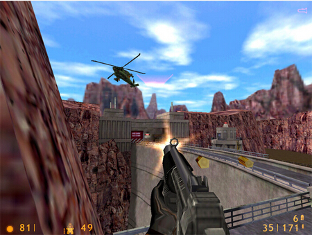
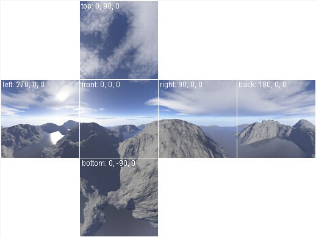
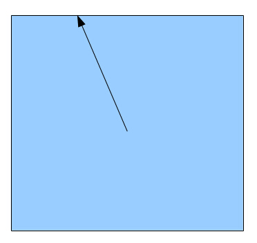
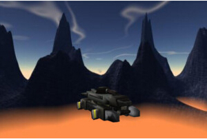

#第二十五课 天空盒

##背景  

天空盒是用于增强场景表现力的一个常用技术，它一般通过在相机周围包裹一个纹理来实现。这个纹理通常是一些天空、山川或者摩天大楼等等，下面是游戏 Half-Life 中使用天空盒的例子：



天空盒的思想就是绘制一个大的立方体，然后将观察者放在立方体的中心，当相机移动时，这个立方体也跟着相机一起移动，这样相机就永远不会运动到场景的边缘。这与我们真实世界中的情况一样的，我们可以看见远处的天空接触到了地平线，但是不论我们怎么朝着那个方向移动，都不可能到达那个地方。  

一个特殊类型的纹理会被映射到这个立方体上，这个纹理的创建是与其贴到立方体上的方式相关的，立方体上每个面的纹理与其相邻的面上的纹理的边缘都可以很好的贴合，就如下面这个情况一样：



如果我们去掉上面的纹理之间的白边，并且将上面的各部分纹理沿着白边折叠，这样我们就能得到我们想要的这样一个盒子，这就是 OpenGL 中所谓的立方体纹理。  

为了从立方体纹理中进行采样，我们需要使用 3D 纹理坐标而不是我们之前用到的 2D 纹理坐标，纹理采样器将 3D 纹理坐标看做一个向量，它会先确定我们需要的纹素是存在于立方体的哪一个面上，之后再从这个面上得到纹素的数据，这一个过程可以用下面这个图片表示（从上往下看立方体）。    



OpenGL 会根据纹理坐标中分量最大的那一个来选择合适的面进行采样，在上面的例子中我们可以看到其 Z 方向上的分量最大（虽然我们看不见 Y 轴上的情况，但是让我们假设它比 Z 分量小）。由于我们的 Z 分量沿着 Z 轴的正方向，所以纹理采样器会使用 “PosZ” 表面，并且从这个表面上获取纹素信息（其余的表面包括 'NegZ', 'PosX', 'NegX', 'PosY' 以及 'NegY'）。

天空盒除了借助于一个立方体盒子来实现之外，还可以使用球体。他们之间的区别就在于球体中各个方向上的向量长度都是一样的（都为球体的半径），而在立方体盒子中则不是这样。但是他们的纹素获取机制都是一样的。通过球体来实现的天空盒有时也被叫做 skydome。这一节中我们就是用的这种天空盒。

##代码
```
(ogldev_cubemap_texture.h:28)
class CubemapTexture
{
public:
    CubemapTexture(const string& Directory,
        const string& PosXFilename,
        const string& NegXFilename,
        const string& PosYFilename,
        const string& NegYFilename,
        const string& PosZFilename,
        const string& NegZFilename);
    ~CubemapTexture();
    bool Load();
    void Bind(GLenum TextureUnit);
private:
    string m_fileNames[6];
    GLuint m_textureObj;
};
```

这个类封装了 OpenGL 对 cubemap 的实现，并且提供了一些简单的接口来导入和使用 cubemap。 其构造函数需要一个文件目录和 6 个图片文件名作为参数。为了简单起见我们假设这 6 个图片都位于同一个目录下。在开始的时候我们需要调用 Load（） 函数从文件中导入图片数据并创建 OpenGL 纹理对象。这个类中定义了两个成员变量，一个字符串数组用于保存需要用到的所有纹理的绝对路径，和一个纹理对象句柄。在程序运行的时候，我们需要调用 Bind（）函数将 cubemap 绑定到合适的纹理单元上以方便着色器程序调用。  

```
(cubemap_texture.cpp:60)
bool CubemapTexture::Load()
{
    glGenTextures(1, &m_textureObj);
    glBindTexture(GL_TEXTURE_CUBE_MAP, m_textureObj);
    Magick::Image* pImage = NULL;
    Magick::Blob blob;
    for (unsigned int i = 0 ; i < ARRAY_SIZE_IN_ELEMENTS(types) ; i++) {
        pImage = new Magick::Image(m_fileNames[i]);
        try { 
            pImage->write(&blob, "RGBA");
        }
        catch (Magick::Error& Error) {
            cout << "Error loading texture '" << m_fileNames[i] << "': " << Error.what() << endl;
            delete pImage;
            return false;
        }
        glTexImage2D(types[i], 0, GL_RGB, pImage->columns(), pImage->rows(), 0, GL_RGBA,
            GL_UNSIGNED_BYTE, blob.data());
        delete pImage;
    } 
    glTexParameteri(GL_TEXTURE_CUBE_MAP, GL_TEXTURE_MAG_FILTER, GL_LINEAR);
    glTexParameteri(GL_TEXTURE_CUBE_MAP, GL_TEXTURE_MIN_FILTER, GL_LINEAR);
    glTexParameteri(GL_TEXTURE_CUBE_MAP, GL_TEXTURE_WRAP_S, GL_CLAMP_TO_EDGE);
    glTexParameteri(GL_TEXTURE_CUBE_MAP, GL_TEXTURE_WRAP_T, GL_CLAMP_TO_EDGE);
    glTexParameteri(GL_TEXTURE_CUBE_MAP, GL_TEXTURE_WRAP_R, GL_CLAMP_TO_EDGE);
    return true;
} 
```

这个函数用于导入 cubemap 要用到的纹理，在这个函数里面它先创建了一个纹理对象，并且这个纹理对象被绑定到了一个特殊的  GL\_TEXTURE\_CUBE\_MAP 目标上，之后我们进入一个循环，为 cubemap 的每个面指定其对应的纹理数据， types 数组中的每一个元素都代表着 cubemap 中的一个面（GL\_TEXTURE\_CUBE\_MAP\_POSITIVE\_X, GL\_TEXTURE\_CUBE\_MAP\_NEGATIVE\_X 等等）。因为这些枚举值与我们存放文件名的数组中的数据是对应的，这简化了我们的循环操作。我们借助于 ImageMagick 将图片文件一个一个的加载进来，之后通过 glTexImage2D() 函数将数据传递给 OpenGL，值得注意的是每次我们调用 glTexImage2D()，我们都会为其第一个参数指定不同的值，它对应着 cubemap 中不同的面。在 cubemap 导入之后，我们需要为其配置一些参数，除了 GL\_TEXTURE\_WRAP\_R 之外，其他的你应该都比较熟悉了，这一个枚举值仅仅是对应了纹理坐标的第三个维度，我们只要参照上面的设置即可。  

```
(cubemap_texture.cpp:95)
void CubemapTexture::Bind(GLenum TextureUnit)
{
    glActiveTexture(TextureUnit);
    glBindTexture(GL_TEXTURE_CUBE_MAP, m_textureObj);
}
```

在使用这个纹理对象来绘制天空盒之前，我们必须调用这个函数，同样我们将这个纹理对象绑定到 GL\_TEXTURE\_CUBE\_MAP 目标上。  

```
(skybox_technique.h:25)
class SkyboxTechnique : public Technique {
public:
    SkyboxTechnique();
    virtual bool Init();
    void SetWVP(const Matrix4f& WVP);
    void SetTextureUnit(unsigned int TextureUnit);
private:
    GLuint m_WVPLocation;
    GLuint m_textureLocation;
};
```

天空盒的渲染需要使用它自己的着色器程序，这个着色器我们只需要传入几个属性即可——一个用于对天空盒进行变换的 WVP 矩阵和其渲染需要用到的纹理单元。  

```
(skybox.vs)
 #version 330
layout (location = 0) in vec3 Position;
uniform mat4 gWVP;
out vec3 TexCoord0;
void main()
{
    vec4 WVP_Pos = gWVP * vec4(Position, 1.0);
    gl_Position = WVP_Pos.xyww;
    TexCoord0 = Position;
}
```

它的顶点着色器十分简单，但是你还是需要注意其中的一些小技巧。首先我们使用 WVP 矩阵对传入的顶点数据进行变换，但需要注意的是我们并不是直接将变换之后的坐标传入 gl\_Position 中，在传入之前我们用其 W 分量替换了 Z 分量的值。这是因为在光栅化阶段中光栅器会对 gl\_Position 执行透视除法（除以其 W 分量），如果这里我们将 Z 分量替换成 W 分量的值，则在透视除法之后这个向量的 Z 分量的值就成为了 1.0 。这样这个片元就会始终位于远裁剪面上，这意味着在深度测试的过程中，天空盒的片元和场景中任意模型的片元比较都会失败。这样天空盒就只会是填满场景模型留下的背景空隙，这也是我们希望得到的效果。  

这里的第二个技巧就是我们使用位于模型局部坐标系下的位置坐标作为 3D 纹理坐标，这样做可行的原因是在对 cubemap 采样的过程中也是通过从圆心发出一条射线到立方体或者球体表面上，所以这里天空盒的位置坐标就可以直接作为我们的纹理坐标。之后我们将这些数据都传递到片元着色器中。

```
(skybox.fs)
 #version 330
in vec3 TexCoord0;
out vec4 FragColor;
uniform samplerCube gCubemapTexture;
void main()
{
    FragColor = texture(gCubemapTexture, TexCoord0);
}
```

这里的片元着色器也十分简单，这里唯一需要注意的就是我们使用 samplerCube 而不是 sampler2D 来从我们的 cubemap 进行采样。

```
(skybox.h:27)
class SkyBox
{
public:
    SkyBox(const Camera* pCamera, const PersProjInfo& p);
    ~SkyBox();
    bool Init(const string& Directory,
        const string& PosXFilename,
        const string& NegXFilename,
        const string& PosYFilename,
        const string& NegYFilename,
        const string& PosZFilename,
        const string& NegZFilename);
    void Render();
private: 
    SkyboxTechnique* m_pSkyboxTechnique;
    const Camera* m_pCamera;
    CubemapTexture* m_pCubemapTex;
    Mesh* m_pMesh;
    PersProjInfo m_persProjInfo;
};
```

要渲染一个天空盒这里需要一些组件——一个着色器对象、一个 cubemap 纹理对象和一个立方体盒子（或者球体）模型。为了简化天空盒的使用，我们将这些组件都封装在同一个类中。我们只需要在开始的时候使用纹理文件的路径对其进行初始化，之后我们就可以在运行期间调用 Render（）函数进行渲染。这个类同时也可以访问相机对象和透视投影的相关信息（FOV，Z 以及屏幕尺寸）。

```
void SkyBox::Render()
{
    m_pSkyboxTechnique->Enable();
    GLint OldCullFaceMode;
    glGetIntegerv(GL_CULL_FACE_MODE, &OldCullFaceMode);
    GLint OldDepthFuncMode;
    glGetIntegerv(GL_DEPTH_FUNC, &OldDepthFuncMode);
    glCullFace(GL_FRONT);
    glDepthFunc(GL_LEQUAL);
    Pipeline p; 
    p.Scale(20.0f, 20.0f, 20.0f);
    p.Rotate(0.0f, 0.0f, 0.0f);
    p.WorldPos(m_pCamera->GetPos().x, m_pCamera->GetPos().y, m_pCamera->GetPos().z);
    p.SetCamera(m_pCamera->GetPos(), m_pCamera->GetTarget(), m_pCamera->GetUp());
    p.SetPerspectiveProj(m_persProjInfo);
    m_pSkyboxTechnique->SetWVP(p.GetWVPTrans());
    m_pCubemapTex->Bind(GL_TEXTURE0);
    m_pMesh->Render(); 
    glCullFace(OldCullFaceMode); 
    glDepthFunc(OldDepthFuncMode);
}
```

这个函数负责天空盒的渲染。首先我们启用天空盒的着色器，这里我们用到了一个新的 OpenGL API——glGetIntegerv()。这个函数用于获取 OpenGL 的状态，它需要两个参数，第一个参数是一个 OpenGL 状态枚举值，表示要获得的 OpenGL 状态；第二个参数是用于存放这个状态的值的数组的地址（我们这里只是返回一个整型变量）。对于不同的状态，我们可以使用不同的 Get* 函数来获取其状态，比如 glGetIntegerv(), glGetBooleanv(), glGetInteger64v(), glGetFloatv() 以及 glGetDoublev()。这里我们使用 glGetIntegerv() 是因为我们想要改变在 glut_backend.cpp 中为 OpenGL 设置的一些状态，由于渲染天空盒的时候我们需要改变 OpenGL 的一些状态，但是为了不影响场景中其他对象的渲染，所以在天空盒进行渲染的时候我们先将需要改变的 OpenGL 状态保存下来，等天空盒渲染完成之后再将这些状态还原回去。  

首先我们需要改变剔除模式，一般情况下我们希望将三角形背向相机的面剔除，但是对于天空盒，由于相机是放在天空盒内部的，所以我们希望看到的是天空盒的内部，但是一般情况下，球体的模型表面被定义为正面（根据顶点定义的顺序确定），我们可以修改我们的模型或者修改 OpenGL 的状态来解决这个问题。这里我们使用后者，所以我们告诉 OpenGL 对正面进行剔除。其次我们需要改变深度测试函数，默认情况下，我们告诉 OpenGL 当新的片元的 Z 值小于之前存放的片元时，则新的片元覆盖之前的片元。对于天空盒，其片元的 Z 值始终等于远裁剪面的值，当我们将深度测试函数设置为 “less than” 时，这样的片元在深度测试的时候不能保存下来，所以这里我们将深度测试函数设置为 GL\_LEQUAL(小于或者等于)  

接下来我们需要做的事就是计算天空盒的 WVP 矩阵，需要注意的是天空盒的中心应该是被放置在相机的位置处的，这样才能保证相机一直位于天空盒的中心，之后我们将 cubemap 纹理绑定到 0 号纹理单元上（在 SkyboxTechnique 着色器中，我们向着色器中传入的纹理单元也是 0）。之后我们渲染这个球体模型，最后我们将 OpenGL 的相关设置还原。  

这里有一个有趣的现象，我们总是在最后才渲染天空盒（所有其他模型渲染完之后）。这是因为我们知道天空盒肯定是在场景中的所有模型的后面的，一些 GPU 有一些优化机制可以在执行片元着色器之前就进行一些早期的深度测试，从而将那些在深度测试中失败的片元丢弃，这对于天空盒的渲染时非常有利的，因为这样的话就只用对那些没有被场景模型覆盖的背景片元执行片元着色器了。

##操作结果
