# 第二十六课 法线纹理
##背景
我们之前使用的光照技术还算不错，光线在模型表面得到了很好的插值，为场景营造出真实感。但是这种效果还能够有非常大的提升。事实上，我们以前使用的这种插值方式在某种程度上来说是对效果提升的一个障碍，特别是当纹理代表的是凹凸不平的平面的时候，这使得模型看起来就太平滑了。例如下面这两幅图片：  

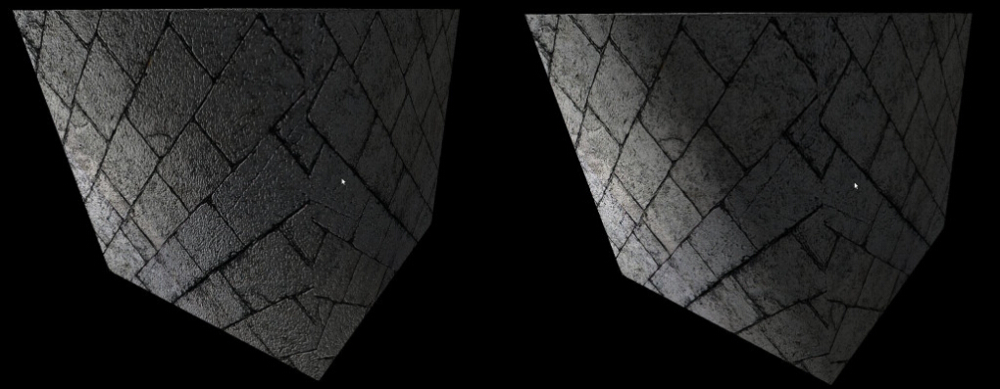

左边的图片比右边的图片看起来要好多了，它将石头表面的凹凸不平的感觉很好的表现了出来，而右边的图片看起来则感觉太光滑了。左边的图片使用了一个叫做法线贴图 (或者叫Bump Mapping——凹凸纹理)技术，而这也是我们这一节的重点。  

法线贴图的思想是取代对三角面上的顶点法线进行插值，而是简单的通过从纹理中取样来获取法线方向。这种技术能够更好的模拟真实世界的场景，因为大多数的表面（特别是我们在游戏中感兴趣的那些地方）并没光滑到使光线能够按照我们用之前的方法插值得到的法线方向进行反射，反而表面上的凹凸之处会使得光线沿着其照射点处的大致反射方向进行反射。对于每一个纹理，他们的法线都能被计算出来并且存放在一张特殊纹理—— 法线纹理之中。当在片元着色器中进行光照计算的时候，我们可以借助于纹理坐标从法线纹理中采样来获得当前像素的法线信息，并像一般法线一样使用它。下面的这幅图片展示了顶点法线在常规光照计算中和法线纹理中的区别。  

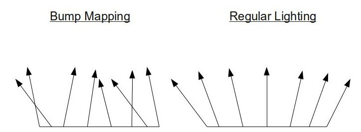

现在我们已经有了法线纹理，其中存放了真实的（至少是十分接近的）表面法线信息。之后我们就可以直接使用它了吗？当然不行。让我们试想一下有一个贴了砖块纹理的立方体，它的六个表面上都贴了相同的纹理，因此相同的法线纹理也被贴在了六个表面上。这样问题来了，立方体的每个面都是指向不同的方向的，所以任意光对表面的影响也是不一样的。如果我们直接使用从纹理中读取的法线向量而不对其进行任何变化，那么我们会得到错误的结果，因为同样的法线向量不可能对指向不同方向的六个面都是正确的。例如，即使表面十分崎岖不平，立方体的上表面的法线指向也大致是（0，1，0），而底面的法线方向大致是（0，-1，0）。由于法线方向都是在它们的局部坐标系之下定义的，只有将它们变换到世界坐标系之下才能参与光照计算。在某种意义上来说，这个理念与我们对顶点法线所做的工作是相似的。顶点法线是在模型的局部坐标系之下定义的，我们需要通过世界矩阵将其变换到世界坐标系之下。  

首先我们需要为法线向量定义他们的局部坐标系，此坐标系需要三个互相正交的单位向量，由于法线是 2D 纹理的一部分，并且 2D 纹理有两个互相垂直的轴 U 和 V（都是单位长度），习惯的做法是将坐标系的 X 轴与 U 轴对应，而将 Y 轴与 V 对应。记住 U 从左指向右，而 V 从底部指向顶部（其原点位于纹理的左下角）。其 Z 分量则从纹理垂直发出并与 X 和 Y 轴都垂直：   

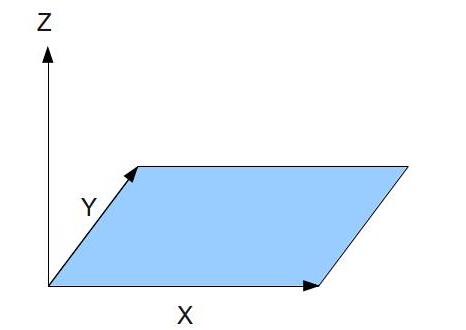

现在法线向量可以定义在上述坐标系中并且存储在纹理的 RGB 纹素中。需要注意的是即使是在一个非常崎岖的表面，法线的大致方向是从纹理指向外面的。例如：Z 分量是占支配地位的一个分量，而 X 和 Y 分量则使得法线向量倾斜。将 XYZ 分量存放在一个 RGB 纹素中使得法线纹理相当接近蓝色。如下图所示：  

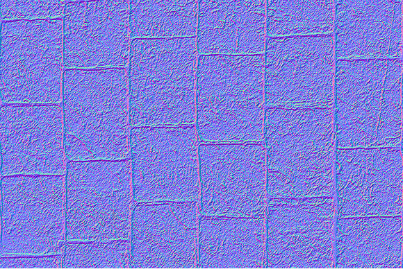

这是这个法线纹理的顶行的前五个纹素（从左到右）：(136，102，248), (144，122，255), (141，145，253), (102, 168, 244) 和 (34，130，216)。  

接下来我们需要做的是检查模型中所有的三角面，并且按照每个顶点的纹理坐标匹配其在法线纹理上的坐标的方式将法线纹理映射到每个三角面上。例如，如果给出的三角形的纹理坐标是(0.5,0), (1, 0.5) 和 (0,1)。那么法线纹理会按如下的方式放置：  

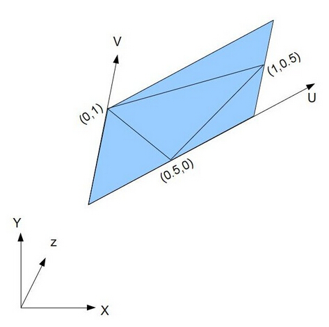

在上面这个图片中，左下角的坐标系代表了对象的局部坐标系。  

这个三角形的三个顶点除了有纹理坐标之外，同时还有代表它们在模型局部坐标系下位置的 3D 坐标。当我们将纹理映射到三角形上的时候，我们实际上也给出了纹理坐标与模型局部坐标系的对应关系。如果我们现在在模型的局部坐标系下计算 UV 向量（同时通过 UV 之间的叉乘得到纹理的法线），我们能够生成一个将法线从纹理坐标系变换到模型局部坐标系的变换矩阵，这样我们就可以通过和往常一样的方法将其变换到世界坐标系之下并使之参与光照计算。我们一般将位于模型局部坐标系之下的 U 向量和 V 向量分别称作 Tangent 和 Bitangent。我们需要推导出的变换矩阵被称作 TBN（Tangent-Bitangent-Normal）矩阵。这些 Tangent-Bitangent-Normal 向量定义了一个被称作 Tangent（或者纹理）空间的坐标系。因此法线纹理中的法线是被存放在 tangent/texture 空间中的，现在我们来介绍如何在模型的局部坐标系之下计算出 UV 向量。  

我们将上面的图片用更加一般性的表示，我们有一个三角形，其三个顶点分别位于 P0, P1 和 P2 和纹理坐标(U0，V0), (U1，V1) 和(U2，V2):  

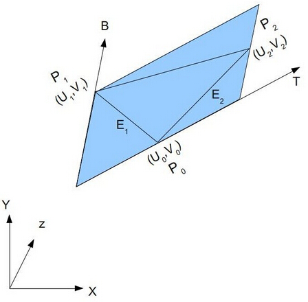

我们想在模型的局部坐标系中找到向量 T（代表tangent）和 B（代表bitangent）。我们可以看到三角形的两个边 E1 和 E2可被写作 T 和 B 的线性组合：

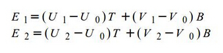

同样的，它也可以被写作如下形式：  

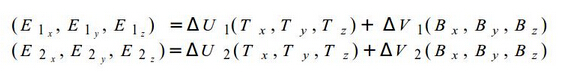

现在它可以很容易的被写成矩阵形式：  

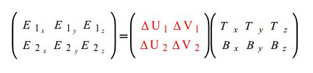

现在我们想要把矩阵提取到等式的右边，为了实现这个目的，我们可以在上面的等式两边都乘上用红色字体标注的矩阵的逆矩阵：  


现在我们可以得到下面的等式：

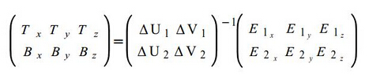

在求得矩阵的逆矩阵之后，我们可以得到：

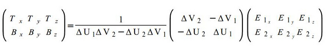

我们可以对网格中的每一个三角形执行上述过程并且为每个三角形都计算出 tangent 向量和 bitangent 向量（对三角形的三个顶点来说这两个向量都是一样的）。通常的做法是为每一个顶点都保存一个 tangent/bitangent 值，每个顶点的 tangent/bitangent 值由共享这个顶点的所有三角面的平均 tangent/bitangent 值确定（这与顶点法线是一样的）。这样做的原因是使整个三角面的效果比较平滑，防止相邻三角面之间的不平滑过渡。这个坐标系空间的第三个分量——法线分量，是 tangent 和 bitangent 的叉乘积。这样 Tangent-Bitangent-Normal 三个向量就能作为纹理坐标空间的基向量并且实现将法线由法线纹理空间到模型局部空间的转换。接下来需要做的就是将法线变换到世界坐标系之下并使之参与光照计算即可。不过我们可以对此进行一点优化，即将 Tangent-Bitangent-Normal 坐标系变换到世界坐标系下来，这样我们就能直接将纹理中的法线变换到世界坐标系中去。  

在这一节中我们需要做下面几件事：

1. 将 tangent 向量传入到顶点着色器中；
2. 将 tangent 向量变换到世界坐标系中并传入到片元着色器；
3. 在片元着色器中使用 tangent 向量和法线向量（都处于世界坐标系下）来计算出 bitangent 向量；
4. 通过 tangent-bitangent-normal 矩阵生成一个将法线信息变换到世界坐标系中的变换矩阵；
5. 从法线纹理中采样得到法线信息；
6. 通过使用上述的矩阵将法线信息变换到世界坐标系中；
7. 继续和往常一样进行光照计算。  

在我们的代码中需要解决的一点是，在像素层次我们的 tangent-bitangent-normal 实际上并不是真正的正交基（三个单位向量互相垂直）。造成这种情况的原因有两个——首先对于每个顶点的 tangent 向量和法线向量，我们是通过对共享此顶点的所有三角面求平均值得到的；其次我们在像素层面看到的 tangent 向量和法线向量是经过光栅器插值得到的结果。这使得我们的 tangent-bitangnet-normal 矩阵丧失了他们的“正交特性”。但是为了将法线信息从纹理坐标系变换到世界坐标系我们需要一个正交基。解决方案是使用 Gram-Schmidt 进行处理。这个方案能够将一组基向量转换成正交基。这个方案大致如下：从基向量中选取向量 ‘A’ 并对其规范化，之后选取基向量中的向量 ‘B’ 并将其分解成两个分向量（两个分向量的和为 ‘B’ ），其中一个分向量沿着向量 ‘A’ 的方向，另一个分量则垂直于 ‘A’ 向量。现在用这个垂直于 ‘A’ 向量的分量替换 ‘B’ 向量并且对其规范化。按照这样的方法对所有基向量进行处理。  

##代码

```
(mesh.h:33)
struct Vertex
{
    Vector3f m_pos;
    Vector2f m_tex;
    Vector3f m_normal;
    Vector3f m_tangent;
    Vertex() {}
    Vertex( const Vector3f& pos, 
            const Vector2f& tex, 
            const Vector3f& normal, 
            const Vector3f& Tangent )
    {
        m_pos = pos;
        m_tex = tex;
        m_normal = normal;
        m_tangent = Tangent;
    }
}; 
```

在我们的顶点结构体中我们新增加了一个 tangent 向量。至于 bitangent 向量我们会在片元着色器中进行计算。需要注意的是切线空间的法线与普通的三角形法线是一样的（因为纹理与三角是平行的）。因此虽然顶点法线位于两个不同的坐标系之中但是他们实际上是一样的。

```
for (unsigned int i = 0 ; i <  Indices.size() ; i += 3) {
    Vertex& v0 = Vertices[Indices[i]];
    Vertex& v1 = Vertices[Indices[i+1]];
    Vertex& v2 = Vertices[Indices[i+2]];
    Vector3f Edge1 = v1.m_pos - v0.m_pos;
    Vector3f Edge2 = v2.m_pos - v0.m_pos;
    float DeltaU1 = v1.m_tex.x - v0.m_tex.x;
    float DeltaV1 = v1.m_tex.y - v0.m_tex.y;
    float DeltaU2 = v2.m_tex.x - v0.m_tex.x;
    float DeltaV2 = v2.m_tex.y - v0.m_tex.y;
    float f = 1.0f / (DeltaU1 * DeltaV2 - DeltaU2 * DeltaV1);
    Vector3f Tangent, Bitangent;
    Tangent.x = f * (DeltaV2 * Edge1.x - DeltaV1 * Edge2.x);
    Tangent.y = f * (DeltaV2 * Edge1.y - DeltaV1 * Edge2.y);
    Tangent.z = f * (DeltaV2 * Edge1.z - DeltaV1 * Edge2.z);
    Bitangent.x = f * (-DeltaU2 * Edge1.x - DeltaU1 * Edge2.x);
    Bitangent.y = f * (-DeltaU2 * Edge1.y - DeltaU1 * Edge2.y);
    Bitangent.z = f * (-DeltaU2 * Edge1.z - DeltaU1 * Edge2.z);
    v0.m_tangent += Tangent;
    v1.m_tangent += Tangent;
    v2.m_tangent += Tangent;
}
for (unsigned int i = 0 ; i < Vertices.size() ; i++) {
    Vertices[i].m_tangent.Normalize();
} 
``` 

这部分代码是计算 tangent 向量的算法的实现（在“背景”中所描述的算法）。它遍历索引数组并通过所以在顶点数组中获取组成三角面的顶点向量。为了表示三角面的两条边，我们用第二个顶点和第三个顶点分别减去第一个顶点。同样的，我们对纹理坐标也进行相似的处理来获得用 VU 向量，并计算两条边沿着 U 轴和 V 轴的增量。 ‘f’ 为一个因子，他是“背景”中得到的最后一个等式的等号右边出现的那个因子。一旦求得了 ‘f’，那么用这两个矩阵的结果乘上它即可分别得到 tangent 和 bitangent 向量在模型局部坐标系之下的表示。需要注意的是这里对 bitangent 向量的计算只是为了整个算法的完整性，我们真正需要的是被存放到顶点数组中的 tangent 向量。最后一件事就是遍历顶点数组对 tangent 向量进行规范化。  

现在你已经完全理解了这个算法的理论和实现，但是本章中不会使用这段代码。Open Asset Import 库已经为我们实现了这一功能，使我们能够很方便的得到 tangent 向量（无论如何了解它的实现是非常重要的，也许有一天你需要自己来实现它）。我们只需要在导入模型的时候定义一个 tangent 变量，之后我们便可以访问 aiMesh 类中的 ‘mTangents’ 数组，并从这里获取 tangent 向量。详细实现可以参看源码。  

```
(mesh.cpp:195)
void Mesh::Render()
{
    ...
    glEnableVertexAttribArray(3);
    for (unsigned int i = 0 ; i < m_Entries.size() ; i++) {
        ...
        glVertexAttribPointer(3, 3, GL_FLOAT, GL_FALSE, sizeof(Vertex), (const GLvoid*)32);
    }
    ...
    glDisableVertexAttribArray(3);
} 
```

由于顶点结构体经过了扩充，我们需要对 Mesh 类的渲染函数进行一些改动。这里我们启用了第四个顶点属性并且指定 tangent 属性的位置在距顶点开始 32 字节位置处（位于法线之后）。在函数最后第四个顶点属性被禁用。

```
(lighting.vs)
layout (location = 0) in vec3 Position;
layout (location = 1) in vec2 TexCoord;
layout (location = 2) in vec3 Normal;
layout (location = 3) in vec3 Tangent;
uniform mat4 gWVP;
uniform mat4 gLightWVP;
uniform mat4 gWorld;
out vec4 LightSpacePos;
out vec2 TexCoord0;
out vec3 Normal0;
out vec3 WorldPos0;
out vec3 Tangent0;
void main()
{
    gl_Position = gWVP * vec4(Position, 1.0);
    LightSpacePos = gLightWVP * vec4(Position, 1.0);
    TexCoord0 = TexCoord;
    Normal0 = (gWorld * vec4(Normal, 0.0)).xyz;
    Tangent0 = (gWorld * vec4(Tangent, 0.0)).xyz;
    WorldPos0 = (gWorld * vec4(Position, 1.0)).xyz;
} 
```

这是经过修改之后的顶点着色器，这里没有什么大的修改，因为大部分改动都在片元着色器中。新增部分只有 tangent 向量传入，之后将其变换到世界坐标系中并输出到片元着色器中。

```
(lighting.fs:132)
vec3 CalcBumpedNormal()
{
    vec3 Normal = normalize(Normal0);
    vec3 Tangent = normalize(Tangent0);
    Tangent = normalize(Tangent - dot(Tangent, Normal) * Normal);
    vec3 Bitangent = cross(Tangent, Normal);
    vec3 BumpMapNormal = texture(gNormalMap, TexCoord0).xyz;
    BumpMapNormal = 2.0 * BumpMapNormal - vec3(1.0, 1.0, 1.0);
    vec3 NewNormal;
    mat3 TBN = mat3(Tangent, Bitangent, Normal);
    NewNormal = TBN * BumpMapNormal;
    NewNormal = normalize(NewNormal);
    return NewNormal;
}
void main()
{
    vec3 Normal = CalcBumpedNormal();
    ... 
```

上面这段代码包含了片元着色器中的大部分改动，所有对法线的操作都被封装在 CalcBumpedNormal() 函数中。首先我们先对法线向量和 tangent 向量进行规范化，第三行中的代码就是 Gram-Schmidt 处理的实现。dot(Tangent, Normal) 求出了 tangent 向量投影到法线向量上的长度，将这个结果乘上法线向量即可得到 tangent 向量在沿着法线向量方向上的分量。之后我们用 tangent 向量减去它在法线方向上的分量即可得到其垂直于法线方向上的分量。这就是我们新的 tangent 向量（要记住对其进行规范化）。新的 tangent 向量和法线向量之间是我叉乘结果就是 bitangent 向量。之后我们从法线纹理中采样得到此片元的法线信息（位于切线/纹理空间）。‘gNormalMap’ 是一个新增加的 sampler2D 类型的一致变量，我们需要在绘制之前将法线纹理绑定到它上面。法线信息的存储方式与颜色一样，所以它的每个分量都处于[0，1]的范围之间。所以我们需要通过函数 'f(x) = 2 * x - 1' 将法线信息变换回它的原始形式。这个函数将 0 映射到 -1，将 1 映射到 1。  

现在我们需要将法线信息从切线空间中变换到世界坐标系中。我们用 mat3 类型的构造函数中的其中一个创建一个名为 TNB 的 3x3 矩阵，这个构造函数采用三个向量作为参数，这三个分量依次作为矩阵的第一行、第二行和第三行。如果你在疑惑为什么要以这样的顺序构造矩阵而不是其他的顺序，那么你只需要记住 tangent 对应于 X 轴，而 bitangent 对应于 Y 轴，至于法线向量则与 Z 轴相对应（参看上面的图片）。在标准的 3x3 单位矩阵中，第一行对应其 X 轴，第二行对应其 Y 轴，第三行则对应其 Z 轴，我们只是依据这个顺序。将从纹理中提取的位于切线空间下的法线信息乘上 TBN 矩阵，并且将结果规范化之后再返回给调用者，这就得到了片元最终的法线信息。

本章中的示例还伴有三个 JPEG 文件：

1. 'bricks.jpg' 是颜色纹理； 
2. 'normal_map.jpg' 是从 'bricks.jpg' 纹理中生成的法线纹理；
3. 'normal_up.jpg' 是一个也是一个发现纹理，但是这个纹理中所有发现都是朝上的。使用这个纹理作为法线纹理时，场景的效果就像没有使用法线纹理技术一样， 我们可以通过绑定这个纹理来使得我们的法线纹理失效（尽管效率不是很高）。你可以通过按 ‘b’ 键在法线纹理和普通纹理之间的切换。  

法线纹理被绑定在 2 号纹理单元中，并且此纹理单元专门用于存放法线纹理（ 0 号纹理单元是颜色纹理，1 号纹理单元存放阴影纹理）。  

注意法线纹理的生成方式：  

生成法线纹理的方法有很多，在这一节中我使用 gimp 来生成法线纹理，它是一个免费开源的软件，有一个专门用于生成法线纹理的插件—— normal map plugin。只要你安装了这个插件，选择 Filters->Map->Normalmap 导入你想要贴在模型上的纹理，之后会有多个与发现纹理相关的参数可供选择，达到满意的效果后点击 ‘OK’ 即可。这样在 gimp 软件视图中原来的普通纹理就会被新生成的法线纹理所替代，用新文件名将其保存下来即可在我们的着色器中使用了。  

##操作结果
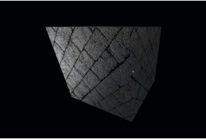
