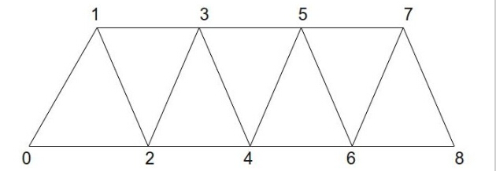
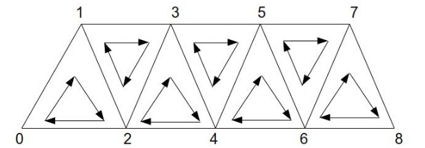
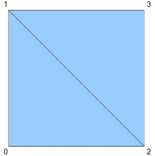
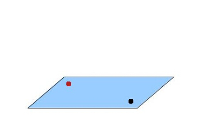
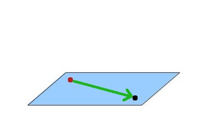
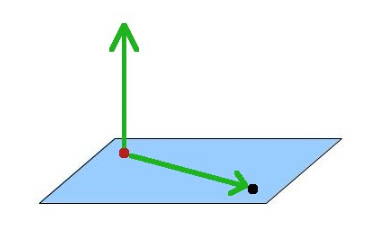
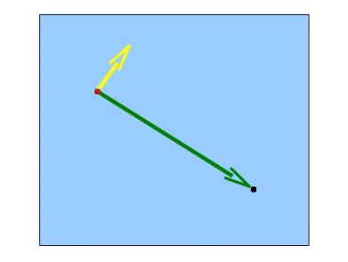
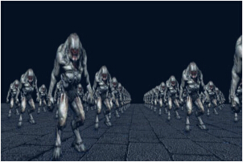

# 第二十七课 广告牌和几何着色器 

##背景

在前面的几章内容里，我们已经认识了顶点着色器和片元着色器，但事实上，我们遗漏了一个很重要的着色器——几何着色器（GS）。微软在 DirectX10 中使用了这个着色器，后来被集成到了 OpenGL3.2 的内核中。VS 会对每一个顶点执行一次， FS 会对每一个片元执行一次，GS 则会对每一个基本图元执行一次。也就是说，如果我们绘制一些三角形，那么 GS 的每一次调用都会接收到一个三角形；如果我们绘制一些线，那么 GS 的每一次调用都会接收到一个线，等等。这就给 GS 提供了一个看待模型的独特的视野，开发人员可以知道顶点和顶点之间拓扑关系，并基于此开发一些新的技术。  

顶点着色器将一个顶点作为输入，一个顶点作为输出（或者说，它不可能凭空创建或者销毁顶点），而对于传递到 GS 中的图元，GS 有特殊的能力来改变他们，这些包括：  

1. 改变新传递进来的图元的拓扑结构。GS 可以接收任何拓扑类型的图元，但是只能输出点列表、折线（line strip）和三角带（triangle strips）；
2. GS 需要一个图元作为输入，在处理过程中他可以将这个图元整个丢弃或者输出一个或更多的图元（也就是说它可以产生比它得到的更多或更少的顶点）。这个能力被叫做几何增长（growing geometry）。这一章我们将会看看它有哪些优势。  

GS 是可选择的。如果我们编译程序的时候不使用 GS，图元会简单的从顶点着色器进入片元着色器。这就是为什么我们之前没有使用 GS，还是可以绘制出图形。  

三角形列表中每三个顶点构成一组。比如顶点 0-2 形成第一个三角形，顶点 3-5 形成第二个三角形，依次进行。我们可以简单地通过将顶点数除以 3（舍去余数）来计算三角形的数量。三角带的绘制更加高效，因为这个过程不是每添加 3 个顶点才绘制一个新三角形的，大多数时候我们只需要添加一个顶点就可以绘制出一个新三角形。构建第一个三角形，我们用三个顶点（ 0-2 ）。当我们添加第四个顶点的时候，就得到了第二个三角形，这个三角形是由顶点 1-3 构成的。当你添加第五个顶点的时候，你就会得到第三个三角形，这个三角形是由顶点 2-4 构成的。以此类推。因此，从第二个三角形开始，每添加一个新的顶点，就可以和先前的两个顶点一起构建一个新的三角形，例如：    

  

如你所见，9 个顶点就可以创建出 7 个三角形。如果这是三角形列表，我们只能创建 3 个三角形。  

三角带有一条关于三角形内部环绕顺序的重要性质——奇数三角形的环绕顺序是反向的。这就意味着如下的顺序：[0,1,2]，[1,3,2]， [2,3,4]， [3,5,4]，以此类推。下面的图片显示了这个顺序：  

  

这下我们就理解了 GS 的主要原理了，让我们来看一下它如何帮助我们实现一个非常有用并且广受欢迎的技术—— billboard 。Billboard 是一个始终朝向相机的四边形。当相机在场景中发生运动时，Billboard 也随之转动，因此，从 billboard 到相机的矢量一直垂直于 billboard 的表面。这和我们真实世界中高速公路上的广告牌是一个道理，总是尽可能地面朝行驶的车辆。一旦我们得到面向相机的四边形，就很容易将怪兽、树等等的图片贴在这个四边形之上了，并且创建大量朝相机的场景物体。森林需要大量的树，我们常使用 Billboard 来创建森林，营造森林的效果。由于 billboard 上的纹理总是面朝相机，所以玩家误以为所有物体都有真实的深度，而实际上呢，这些物体都仅仅是一个面而已。每一个 billboard 只需要四个顶点，因此它比实实在在制作出来的模型占用的资源会少很多。  

这一课中我们创建一个顶点缓冲区，并且在这个顶点缓存中存放 billboard 在世界坐标系中的位置，每一个位置仅仅是一个单独的点（ 3D 矢量）。我们将这个点的信息传递给几何着色器，并用这些位置坐标组建出一个四边形。也就是说，输入给 GS 的拓扑结构是点列表，而输出的拓扑结构是三角带。利用三角带的原理，我们用 4 个顶点创建一个四边形：  

  

 GS 负责对四边形进行处理，使之始终朝向相机，同时他会为每个顶点生成合适的纹理坐标。片元着色器只需要从纹理上取样就能得到最后的颜色信息。  

我们来看一下如何使 billboard 一直朝向相机。在下面的这张图片中，黑点代表相机，红点代表 billboard 的位置。每一个点都在世界坐标系下，虽然看起来就好像它们像是位于平行于 XZ 平面的一个平面上（当然也没必要如此），实际上任意两个点都行。  

  

接下来我们创建一个从 billboard 指向相机的矢量：  

  

接下来我们添加（0，1，0）矢量：  

  

现在对这两个矢量做一个叉乘，结果是一个垂直于这两个矢量创建的平面的矢量，我们可以通过这个矢量对这个点进行扩展并创建出四边形。这个四边形将会垂直于从 billboard 到相机的矢量，这就是我们想要的。由上面的情况可知，我们能得到以下内容（黄色的矢量就是叉乘的结果）：  

  

有一件事情经常困扰开发人员，就是计算叉乘时的顺序（A X B还是 B X A）。这两种方法产生的向量是相向的。我们有必要提前知道向量的结果，因为我们需要输出顶点，这样从相机的方位来看，这两个三角形生成的正方形才会是顺时针的。这里我们使用左手定则——如果你站在 billboard 的位置，你的食指指向相机的方位，中指指向天空，然后你的大拇指将会沿着“食指”和“中指”叉乘的结果的方向（两个手指保持夹紧）。这一节，我们将叉乘的结果称为“右”向量，因为从相机方位看我们手，是指向右侧的。“中指”叉乘“食指”会产生一个“左”向量。
（我们使用左手定则，因为我们使用的是左手坐标系（Z轴指向屏幕里）。左手坐标系非常合适）。

##代码  

```
(billboard_list.h:27)
class BillboardList
{
public:
    BillboardList();
    ~BillboardList();
    bool Init(const std::string& TexFilename);
    void Render(const Matrix4f& VP, const Vector3f& CameraPos);
private:
    void CreatePositionBuffer();
    GLuint m_VB;
    Texture* m_pTexture;
    BillboardTechnique m_technique;
};
```  

BillboardList 类封装了创建 billboard 的所需要的接口。Init（）函数中包含将要贴在 billboard 上的纹理图像的文件名。Render（）函数在主渲染循环中调用，并且负责 billboard 对象的渲染。这个函数需要两个参数：视图矩阵和投影矩阵的组合矩阵、相机在世界坐标系下的位置。因为 billboard 就定义在世界坐标系下，所有我们直接跳过了世界坐标系的变换。这个类有三个私有属性：顶点缓冲用来存储 billboard 的位置，一个指针指向给 billboard 需要的纹理贴图，一个 billboard technique 类对象中包含渲染相关的着色器程序。  

```
(billboard_list.cpp:80)
void BillboardList::Render(const Matrix4f& VP, const Vector3f& CameraPos)
{
    m_technique.Enable();
    m_technique.SetVP(VP);
    m_technique.SetCameraPosition(CameraPos);
    m_pTexture->Bind(COLOR_TEXTURE_UNIT);
    glEnableVertexAttribArray(0);
    glBindBuffer(GL_ARRAY_BUFFER, m_VB);
    glVertexAttribPointer(0, 3, GL_FLOAT, GL_FALSE, sizeof(Vector3f), 0); // position 
    glDrawArrays(GL_POINTS, 0, NUM_ROWS * NUM_COLUMNS);
    glDisableVertexAttribArray(0);
}
```

这个函数用于启用 billboard technique 并对 billboard 对象进行渲染，在函数中首先设置了 OpenGL 的相关状态，之后调用绘制函数对这些点进行绘制（这些点在经过几何着色器之后会被装换为一个正方形面）。在这个例子中，billboard 的位置严格地按照行列排列，这就是我们为什么可以通过将其行列相乘来获得点的数量。注意，我们在绘制的时候使用点模式（GL\_POINTS）进行绘制，在几何着色器中需要于此对应。  

```
(billboard_technique.h:24)
class BillboardTechnique : public Technique
{
public:
    BillboardTechnique();
    virtual bool Init();
    void SetVP(const Matrix4f& VP);
    void SetCameraPosition(const Vector3f& Pos);
    void SetColorTextureUnit(unsigned int TextureUnit);
private:
    GLuint m_VPLocation;
    GLuint m_cameraPosLocation;
    GLuint m_colorMapLocation;
};
```

这就是 billboard technique 类的接口。它需要三个参数来完成这项工作：视口和投影矩阵的组合矩阵、世界坐标系下相机的位置和 billboard 用到的纹理绑定的纹理单元的。  

```
(billboard.vs)
 #version 330
layout (location = 0) in vec3 Position;
void main()
{
    gl_Position = vec4(Position, 1.0);
}
```

这是 billboard 渲染的顶点着色器，由于大部分工作都会在 GS 中完成， 所以 VS 中所做的工作非常简单，而且由于顶点缓存中只有位置向量，而且这个位置向量同时也是定义在世界坐标系之下的，所有我们只需要将它们传递到 GS 中即可。  

```
(billboard.gs:1)
 #version 330
layout (points) in;
layout (triangle_strip) out;
layout (max_vertices = 4) out;
```

Billboard 技术的核心在 GS。首先我们使用 “layout” 关键词声明一些全局变量。我们告诉管线输入的图元拓扑结构是点列表，输出图元的拓扑是三角带。我们还告诉管线生成的顶点数不会多于四个顶点。这个关键词是用来告诉驱动程序 GS 中会产生的顶点的最大数目。提前知道这个限度，使得驱动程序可以针对一些特殊场景对 GS 性能进行优化。因为我们知道最终我们会将一个点扩展成一个四边形，所以我们声明了最大定点数目是 4。  

```
(billboard.gs:7)
uniform mat4 gVP;
uniform vec3 gCameraPos;
out vec2 TexCoord;
```

由于传入 GS 中的点的位置信息本来就是位于世界坐标系下的，因此我们只需要一个 VP（view 和 projection）矩阵。它还需要一个相机位置来计算如何让 billboard 朝向它。同时在 GS 中为 FS 生成了纹理坐标，因此我们需要声明一个纹理坐标变量。  

```
void main()
{
    vec3 Pos = gl_in[0].gl_Position.xyz;
```

上面这一行是 GS 中特有的一部分。由于 GS 的执行时针对一个完整的图元的，所以我们可以访问这个图元的所有顶点，这是通过内置变量 “gl_in” 做到的。这个变量是一个结构体数组（数组中每个元素都是一个结构体），数组中每个元素都包含了写入到 gl\_position 中的位置信息和其他一些从 VS 中输出的数据。为了获取某个顶点的信息，我们可以使用这个顶点在图元中的索引来得到。在这个特殊的例子中，输入拓扑是点列表，因此每个图元中只有一个单独的点，我们使用 “gl\_in[0]” 来获取它。如果输入拓扑是三角形，我们也可以写成 “gl\_in[1]” 或 “gl\_in[2]” 。在这里我们只需要位置向量的前三个分量，我们可以用 “.xyz” 方法获取。  

```
 	vec3 toCamera = normalize(gCameraPos - Pos);
    vec3 up = vec3(0.0, 1.0, 0.0);
    vec3 right = cross(toCamera, up);
```

这里我们使用在“背景”中介绍的技术使 billboard 在每一帧的渲染中都朝向相机。我们将从 billboard 到相机的向量与竖直向上的向量进行叉乘。当我们从相机看向 billboard 时，前面叉乘的结果是朝向右边的。我们现在就借助于这个向量，绕着 billboard 的位置来创建一个四边形。  

```
	Pos -= (right * 0.5);
    gl_Position = gVP * vec4(Pos, 1.0);
    TexCoord = vec2(0.0, 0.0);
    EmitVertex();
    Pos.y += 1.0;
    gl_Position = gVP * vec4(Pos, 1.0);
    TexCoord = vec2(0.0, 1.0);
    EmitVertex();
    Pos.y -= 1.0;
    Pos += right;
    gl_Position = gVP * vec4(Pos, 1.0);
    TexCoord = vec2(1.0, 0.0);
    EmitVertex();
    Pos.y += 1.0;
    gl_Position = gVP * vec4(Pos, 1.0);
    TexCoord = vec2(1.0, 1.0);
    EmitVertex();
    EndPrimitive();
}
```

顶点缓冲区中的存放的点的是四边形底部的中心。我们需要通过这个点形成两个面向相机的三角形。我们从四边形左下角开始。首先我们通过前面计算出的“右”向量得到平面的左下角的点，之后我们通过视口矩阵和投影矩阵将其变换到裁剪坐标系下，同时将这个顶点的纹理坐标设置为（0，0），因为我们希望将纹理完整的贴在这个平面上。为了将新产生的顶点传递到管线的下一阶段，我们调用内置函数 EmitVertex()。一旦我们调用了这个函数 gl\_Position 变量中的数据就无效了，所以我们需要给其传一个新值。常规的方法是，我们形成四边形的左上角和右下角。这是第一个朝向相机的三角形。由于 GS 输出的图元的拓扑结构是三角带，在构建第二个三角形的时候，我们只需要再多添加一个点。使用新顶点和前一个三角形的最后两个顶点（这两个顶点构成之后形成四边形的对角线）构成了第二个三角形。这第四个顶点并且也是最后一个顶点是四边形的右上角。为了终止三角带，我们调用内置函数 EndPrimitive()。

```
(billboard.fs)
 #version 330
uniform sampler2D gColorMap;
in vec2 TexCoord;
out vec4 FragColor;
void main()
{
    FragColor = texture2D(gColorMap, TexCoord);
    if (FragColor.r == 0 && FragColor.g == 0 && FragColor.b == 0) 
	{
        discard;
    }
}
```

 FS 中的处理非常简单的——它的大部分工作是借助于 GS 中的纹理坐标进行纹理取样。这这里我们使用了 OpenGL 中一个新的功能——内置关键字 “discard” ，在某些情况下，我们可以希望将某个片元完全丢弃，我们就可以使用这个关键字。这一课中使用的纹理图像是一个黑色背景下的怪物，理想情况下我们不希望我们渲染出来的 billboard 出现黑色的背景，所以我们对片元的颜色进行判断——如果 billboard 的颜色是黑色，我们就丢弃这个像素。这样最终渲染出来的就只剩下怪物的图像了，试着将 “discard” 注释掉，看看有什么不同。  

##操作结果


 
