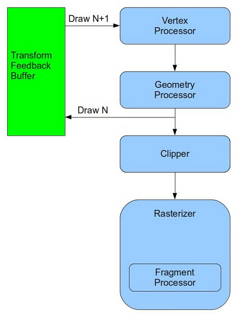
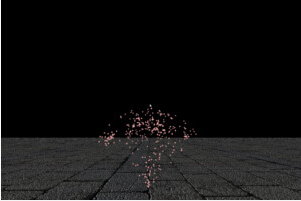

# 第二十八课 使用 Transform Feedback 创建粒子系统
## 背景

粒子系统是为了模仿一些自然现象（比如烟，灰尘，烟火，雨等）所使用的技术的一个通用名字。在这些现象中，共同的地方就是它们是由大量的小粒子所组成，这些小的粒子以某种方式在一起移动，这样就构成了一种自然现象。

为了模仿一个由粒子组成的自然现象，我们通常需要维护每一个粒子的位置信息和一些其他的属性（速率，颜色等等）并且在每一帧中执行下面的一些步骤。  

1. 更新每个粒子的属性。这一步通常涉及到一些数学计算(计算可能是非常简单或者非常困难，这取决于需要模拟的现象的复杂性)。
2. 渲染粒子（将每个点简单的渲染成一个颜色点或者使用 billboard 技术）。

在第一步通常发生在 CPU。应用程序可以访问顶点缓冲区，并且可以获得或者更新每个粒子的属性。第二步则与其他渲染其他对象一样发生在 GPU。这种方法存在两个问题:  

1. 在 CPU 中更新粒子要求 OpenGL 驱动程序从 GPU 显存（在独立的显卡上，这意味着将通过 PCI 进行数据传输）中拷贝顶点缓冲区的数据到 CPU 内存。一般情况下要模拟一个自然现象需要大量的例子，很多时候 10000 个粒子也是很正常的。如果每个粒子在内存中占 64 个字节，同时每秒中渲染 60 帧（非常好的帧速）。这将意味着每秒钟我们都需要将 640K 的数据在 GPU 和 CPU 之间来回拷贝 60 次。这会对我们程序的性能产生很大的影响，而且随着粒子数目的增加，程序的性能会变得更差。  

2. 更新粒子属性意味着需要在不同的数据上进行相同的数学计算，这刚好是 GPU 的强项。如果将这个过程在 GPU 上进行，则意味着整个过程是串行进行的，如果我们的 CPU 是多核的，我们可以利用多核来减少这个过程所需要的时间，但是我们需要在程序中需要进行一些额外的处理。在 GPU 上进行这些计算则更好的利用的 GPU 的并行计算特性。

DirectX10 介绍了一个新的特性叫 Stream Output，这个对于粒子系统的实现是非常有用的。OpenGL 在 3.0 版本之后也加入了这个特性——Transform Feedback，其实现思路是在 GS（如果没有使用 GS 则是 VS）处理之后，我们可以将变换之后的图元存放到一个特殊的缓存——Transform Feedback Buffer 中。此外，我们可以决定图元是否将继续按照以前的流程进行光栅化。在下一帧渲染的时候，上一帧中输出的顶点信息可以在这一帧中作为顶点缓存使用，在这样的一个循环过程中，我们可以不借助于应用程序来实现对粒子信息的更新。下面这幅图片介绍了 Transform Feedback Buffer 在管线中所处的位置。



在 transform feedback 缓存中有多少个图元? 如果我们没使用 GS，这个答案是十分简单的——就是我们在调用绘制函数时传入的顶点数量的参数。然而，如果 GS 存在，那么图元的数量是未知的。因为 GS 能够创建和删除图元。所以有时候我们不知道在  transform feedback 缓存中的图元数。那么在我们不知道缓存里包含多少顶点的情况下，如何使用缓存中的数据进行绘图呢？为了克服这个困难，transform feedback 提供了一个新的绘图函数，并且这个函数不需要使用顶点的个数作为参数。系统会自动的为每一个缓存计算顶点数，之后当缓存被用来作为输入时，系统会自动使用之前计算出来的顶点数。如果我们多次将数据输入到transform feedback 缓存中，那么顶点数也会相应的增加。我们随时都可以重新设置缓存内部的偏移值，而且系统也会根据我们设置的偏移值将重新计算顶点数。  

在这一节中，我们为了模仿烟火的效果将使用 transform feedback 。就数学计算而言，烟火是比较容易模拟的，所以我们将着重介绍 transform feedback 的使用，这个框架同样可以用于其他类型的粒子系统的实现。  

OpenGL 有一个限制——在同一个绘制过程中，相同的缓存不能同时作为输入和输出。这意味着如果我们想要在一个顶点缓冲区中更新粒子，我们实际上需要两个 transform feedback 缓存并在它们之间进行切换。在第 0 帧的时候我们将在 buffer A 中更新粒子并从 buffer B 中渲染粒子，在第 1 帧的时候我们将在 buffer B 中更新粒子并从 buffer A 中渲染粒子。当然对于使用者来说，这些对他们来说都是不用了解的。  

此外，我们也将有两个着色器类---一个负责处理粒子的更新，另一个用于处理渲染。这里我们将使用上一节学过的 billboard 技术。

##代码  

```
(particle_system.h:29)
class ParticleSystem
{
public:
    ParticleSystem();
    ~ParticleSystem();
    bool InitParticleSystem(const Vector3f& Pos);
    void Render(int DeltaTimeMillis, const Matrix4f& VP, const Vector3f& CameraPos);
private:
    bool m_isFirst;
    unsigned int m_currVB;
    unsigned int m_currTFB;
    GLuint m_particleBuffer[2];
    GLuint m_transformFeedback[2];
    PSUpdateTechnique m_updateTechnique;
    BillboardTechnique m_billboardTechnique;
    RandomTexture m_randomTexture;
    Texture* m_pTexture;
    int m_time;
};
```

ParticleSystem 类中把涉及到 transform feedback 相关的操作都进行了封装。在我们的主逻辑类中创建了这个类的实例，并将其作为粒子系统的发射器进行初始化。在主渲染循环中，ParticleSystem::Render() 函数被调用，这个函数有三个参数：上一次调用到现在的间隔时间（毫秒），视口矩阵和投影矩阵的乘积，以及相机在世界坐标系下的坐标。这个类中同时也定义了其他一些变量：一个标记（ Render() 函数是不是第一次调用），两个索引（指定哪个 buffer 是当前的顶点缓冲区( input ) 哪一个是 transform feedback 缓存(output)），两个顶点缓存句柄。两个transform feedback 对象句柄，粒子更新着色器和粒子渲染着色器，一个包含随机数的纹理，一个映射到粒子上的纹理和一个存放当前时间的变量。  

```
(particle_system.cpp:31)
struct Particle
{
    float Type; 
    Vector3f Pos;
    Vector3f Vel; 
    float LifetimeMillis; 
};
```

这个结构体定义了每个粒子的属性。一个粒子可以是一个发射器，一个 shell（由发射器分裂产生的） 或者一个 secondary shell（由 shell 分裂产生的）。发射器是静态的，它负责生成别的粒子，在系统中它是独一无二。发射器周期性的创建 shell 粒子并让 shell 粒子向上运动。在一段时间之后 shell 分裂生成多个 secondary shell（向任意的方向飞行）粒子。除了发射器所有的粒子都有一个生命周期（系统会进行记录），当这个粒子存在的时间已经达到了其生命周期，这个粒子就被移除了。每个粒子都会记录其当前的位置和速度，当一个粒子被创建的时候，它就被赋予一个初速度（一个向量），这个速度会被重力影响。在每一帧中，我们都会根据粒子的速度来更新粒子在世界坐标系下的坐标，这个坐标在后面会被用于渲染粒子。
 
```
(particle_system.cpp:67)
bool ParticleSystem::InitParticleSystem(const Vector3f& Pos)
{ 
    Particle Particles[MAX_PARTICLES];
    ZERO_MEM(Particles);
    Particles[0].Type = PARTICLE_TYPE_LAUNCHER;
    Particles[0].Pos = Pos;
    Particles[0].Vel = Vector3f(0.0f, 0.0001f, 0.0f);
    Particles[0].LifetimeMillis = 0.0f;
    glGenTransformFeedbacks(2, m_transformFeedback); 
    glGenBuffers(2, m_particleBuffer);
    for (unsigned int i = 0; i < 2 ; i++) {
        glBindTransformFeedback(GL_TRANSFORM_FEEDBACK, m_transformFeedback[i]);
        glBindBuffer(GL_ARRAY_BUFFER, m_particleBuffer[i]);
        glBufferData(GL_ARRAY_BUFFER, sizeof(Particles), Particles, GL_DYNAMIC_DRAW);
        glBindBufferBase(GL_TRANSFORM_FEEDBACK_BUFFER, 0, m_particleBuffer[i]);
    }
```

这是粒子系统的初始化的第一部分。我们在栈上建立储存区域用于存放所有粒子的数据并且仅仅初始化第一个粒子作为发射器（剩下的粒子将在渲染的时候被创建）。发射器的位置是所有粒子开始的位置，这些新的粒子的初始速度也就是发射器的速度（发射器它自己是静止的）。我们将使用两个 transform feedback 缓存并在它们之间进行切换（当使用一个作为输入时，另一个作为绘图的地方，反之亦然）。所以我们使用函数 glGenTransformFeedback 创建两个 transform feedback 对象。同时我们也创建了两个缓存对象——分别对应两个 transform feedback 对象，在后面我们会对这两个对象执行一系列相同的操作。  

首先我们使用 glBindTransfornFeedback() 函数绑定一个 transform feedback 对象到 GL\_TRANSFORN\_FEEDBACK 目标上，这样这个绑定的对象就成为了当前的对象，接下来的所有操作（和 transform feedback 相关的）都会对其产生影响。下一步我们绑定相应的缓存对象到 GL\_ARRAY\_BUFFER ，这样我们就能将粒子数组中的数据填充到这个缓冲区中。最后将这个缓存对象绑定到 GL\_TRANSFORM\_FEEDBACK\_BUFFER 目标上并且指定其索引为 0。这使得这个缓冲区作为 transform feedback 缓存且将其绑定在了索引为 0 的位置上。很多时候我们也可以通过绑定多个缓存（每个缓存都绑定到不同的索引位置）使得图元可以输入到多个缓存中。现在我们有两个 transform feedback 对象，这两个对象有着相应的缓存对象并且他们都可以作为顶点缓存或者 transform feedback 缓存使用。  

这个函数中剩下的部分就没有什么好解释的了，因为剩下的没有什么新的内容。我们仅仅需要初始化两个着色器对象（ParticleSystem 类的成员），并设置一些状态参数，同时加载需要映射到粒子上的纹理图片。  

```
void ParticleSystem::Render(int DeltaTimeMillis, const Matrix4f& VP, const Vector3f& CameraPos)
{
    m_time += DeltaTimeMillis;
    UpdateParticles(DeltaTimeMillis);
    RenderParticles(VP, CameraPos);
    m_currVB = m_currTFB;
    m_currTFB = (m_currTFB + 1) & 0x1;
}
```

这是 ParticleSystem 类的渲染函数。这个函数用来更新时间计数器并在两个缓存之间切换（ 'm\_currVB' 是当前的顶点缓存的索引并初始化为 0 ，然而 ’m\_currTFB’ 是当前的 transform feedback 缓存的索引并初始化为 1）。这个函数的主要工作是调用类中的两个私有的函数来更新粒子属性，之后再渲染它们。让我们来看一看这里是如何更新粒子属性的。  

```
void ParticleSystem::UpdateParticles(int DeltaTimeMillis)
{
    m_updateTechnique.Enable();
    m_updateTechnique.SetTime(m_time);
    m_updateTechnique.SetDeltaTimeMillis(DeltaTimeMillis);
    m_randomTexture.Bind(RANDOM_TEXTURE_UNIT);
```

首先我们启用粒子更新着色器并为它设置一些动态的状态。这个着色器需要知道在上一帧渲染到这一帧之间的间隔时间，因为我们在使用运动方程计算粒子的位移时需要使用到这个参数，同时它也需要使用全局时间作为一个随机数种子来访问随机纹理。我们声明了一个纹理单元 GL\_TEXTURE3 并将随机纹理绑定到这个纹理单元上。需要注意的是这个随机纹理并不是用于提供片元的颜色，而是用于确定生成的粒子的运动方向（稍后我们将会介绍随机纹理是如何创建的）。

```
glEnable(GL_RASTERIZER_DISCARD);
```

这个状态设置我们之前没有见到过。因为我们调用这个函数的唯一目的就是更新 transform feedback 缓存中的数据，所以在数据更新之后我们并不希望对这些图元进行光栅化，至于渲染我们后面会调用其他函数来完成。用 GL\_RASTERIZER\_DISCARD 作为参数来调用 glEnable() 是告诉渲染管线在对图元进行光栅化之前就丢弃他们（同时 transform feedback 阶段之后）。  

```
glBindBuffer(GL_ARRAY_BUFFER, m_particleBuffer[m_currVB]); 
glBindTransformFeedback(GL_TRANSFORM_FEEDBACK, m_transformFeedback[m_currTFB]);
```

接下来的两个函数将在我们创建的两个缓存之间进行切换。’m\_currVB’ （ 0 或者是 1 ）作为顶点缓存数组的一个索引并且我们将这个缓存绑定到 GL\_ARRAY\_BUFFER 上（作为输入）。’m\_currTFB’（总是和 ’m\_currVB’ 相反）作为 transform feedbakc 对象数组的一个索引并且我们将其绑定到 GL\_TRANSFORM\_FEEDBACK 目标上使其成为当前的 transform feedback（连同着附着在其上面的状态——实际的缓存）。  

```
glEnableVertexAttribArray(0);
    glEnableVertexAttribArray(1);
    glEnableVertexAttribArray(2);
    glEnableVertexAttribArray(3);
    glVertexAttribPointer(0,1,GL_FLOAT,GL_FALSE,sizeof(Particle),0); // type
    glVertexAttribPointer(1,3,GL_FLOAT,GL_FALSE,sizeof(Particle),(const GLvoid*)4); // position
    glVertexAttribPointer(2,3,GL_FLOAT,GL_FALSE,sizeof(Particle),(const GLvoid*)16); // velocity
    glVertexAttribPointer(3,1,GL_FLOAT,GL_FALSE,sizeof(Particle),(const GLvoid*)28); // lifetime
```

这些函数我们之前都使用过，都是根据顶点缓冲区中的数据设置顶点属性。  

```
glBeginTransformFeedback(GL_POINTS);
```

这里才真正开始有趣了起来。我们调用 glBeginTransformFeedback() 函数来激活 transform feedback。在这之后的所有绘制的结果（直到 glTransformFeedback() 被调用）都会被输入到当前的 transform feedback 缓存中（根据当前绑定的transform feedback对象）中。这个函数需要一个拓扑结构变量作为参数。由于 Transform feedback 工作的方式，只有完整的图元才能被写入到缓存中。这个意思就是如果你绘制四个顶点（其拓扑结构是 triangle strip），或者六个顶点（其拓扑结构是 triangle list），不论你使用哪种方式最后输入到这个缓存中的数据都将是六个顶点（两个三角形）。对于这个函数的参数可以是下面这几个：

- GL_POINTS – 在调用绘制函数时拓扑结构也必须指定为 GL\_POINTS；
- GL_LINES – 在调用绘制函数时拓扑结构必须是 GL\_LINES，GL\_LINE\_LOOP 或者是 GL\_LINE\_STRIP；
- GL_TRIANGLES – 在调用绘制函数时拓扑结构必须是GL\_TRIANGLES，GL\_TRIANGLE\_STRIP或者是GL\_TRIANGLE\_FAN。

```
if (m_isFirst) {
        glDrawArrays(GL_POINTS, 0, 1);
        m_isFirst = false;
    }
    else {
        glDrawTransformFeedback(GL_POINTS, m_transformFeedback[m_currVB]);
    }
```

正如我们之前说的那样，我们没有办法知道在缓存中有多少个顶点，但是 transform feedback 支持这种情况。因为我们频繁的生成和删除粒子是基于发射器和每个粒子的生命周期，我们不可能告诉绘制函数有多少个粒子需要绘制。这些都是真的 – 除了第一次渲染。在进行第一次渲染时我们知道在顶点缓冲区只包含发射器粒子并且系统之前没有 transform feedback 相关的记录（第一帧渲染之后我们都没使用过它），所以它也不知道缓存中到底存放了多少粒子。这就是为什么第一次绘图一定要明确的使用一个标准的 glDrawArrays()	来绘制。在其他情况下，我们都会调用 glDrawTransformFeedback() 来完成绘制。这个函数不需要被告知有多少顶点需要渲染，它仅仅检查输入缓存中的数据并将之前写入到这个缓存中的顶点数据全部渲染出来（只有当它被绑定作为一个 transform feedback 缓存时才行）。  

glDrawTransformFeedback() 需要两个参数。第一个参数是绘制的图元的拓扑结构，第二个参数是当前被绑定到顶点缓冲区上的 transform feedback 对象。记住当前绑定的 transform feedback 对象是 m_transformFeedback[m\_currTFB]。这是绘制函数的目标缓冲区。将要处理的顶点的个数来自于在上一次在这个函数中被绑定到 GL\_TRANSFORM\_FEEDBACK 目标上的 transform feedback 对象。如果你已经迷惑了，那么你只需要简单的记住当我们向 transform feedback 对象 #1 中写入的时候，我们就从 transform feedback 对象 #0 中得到顶点的个数来进行绘制，反之亦然。现在的输入将作为以后的输出。  

```
glEndTransformFeedback();
```

每一次调用 glBeginTransformFeedback() 之后一定要记得调用 glEndTransformFeedback()。如果你漏掉这个函数，将会出现很大的问题。

```
	glDisableVertexAttribArray(0);
    glDisableVertexAttribArray(1);
    glDisableVertexAttribArray(2);
    glDisableVertexAttribArray(3);
}
```

这一部分是很常见的，当运行到这里的时候，所有的粒子都已经被更新过了，接下来让我们看看如何对更新之后的粒子进行渲染。

```
(particle_system.cpp:177)
void ParticleSystem::RenderParticles(const Matrix4f& VP, const Vector3f& CameraPos)
{
    m_billboardTechnique.Enable();
    m_billboardTechnique.SetCameraPosition(CameraPos);
    m_billboardTechnique.SetVP(VP);
    m_pTexture->Bind(COLOR_TEXTURE_UNIT);
```

我们通过启用 billboarding 技术对粒子进行渲染，在渲染之前我们为这个着色器设置了一些参数。每个粒子将被扩展为一个四边形平面，这里绑定的纹理最终会被映射到这个平面上

```
glDisable(GL_RASTERIZER_DISCARD);
```

在我们将数据写入到 transform feedback 缓存中时，光栅化被禁用了。我们使用其 glDisable() 函数来启用光栅器。  

```
glBindBuffer(GL_ARRAY_BUFFER, m_particleBuffer[m_currTFB]);
```

当我们写数据进 transform feedback 缓存时，我们将 m_transformFeedback[m_currTFB] 绑定位为 transform feedback 对象，附着在那个对象上的顶点缓冲区就是 m_particleBuffer[m_currTFB]。我们现在绑定这个缓存来为渲染提供输入顶点。  

```
glEnableVertexAttribArray(0);
    glVertexAttribPointer(0, 3, GL_FLOAT, GL_FALSE, sizeof(Particle), (const GLvoid*)4); // position
    glDrawTransformFeedback(GL_POINTS, m_transformFeedback[m_currTFB]);
    glDisableVertexAttribArray(0);
}
```

在 transform feedback 缓存中的粒子有四个属性。但是在渲染粒子的时候，我们只需要知道粒子的位置信息，所以我们只启用了位置属性对应的位置，同时我们确定间隔（相邻的同属性之间的距离）为 sizeof(Particle) ,而其他的三个属性被我们忽略。  

同样，我们还是使用 glDrawTransformFeedback() 来绘制。第二个参数是 transform feedback 对象（该对象被匹配到输入的顶点缓冲区）。这个对象知道有多少个顶点要被绘制。

```
bool PSUpdateTechnique::Init()
{
    if (!Technique::Init()) {
        return false;
    }
    if (!AddShader(GL_VERTEX_SHADER, pVS)) {
        return false;
    }
    if (!AddShader(GL_GEOMETRY_SHADER, pGS)) {
        return false;
    }
    const GLchar* Varyings[4]; 
    Varyings[0] = "Type1";
    Varyings[1] = "Position1";
    Varyings[2] = "Velocity1"; 
    Varyings[3] = "Age1";
    glTransformFeedbackVaryings(m_shaderProg, 4, Varyings, GL_INTERLEAVED_ATTRIBS); 
    if (!Finalize()) {
        return false;
    }
    m_deltaTimeMillisLocation = GetUniformLocation("gDeltaTimeMillis");
    m_randomTextureLocation = GetUniformLocation("gRandomTexture");
    m_timeLocation = GetUniformLocation("gTime");
    m_launcherLifetimeLocation = GetUniformLocation("gLauncherLifetime");
    m_shellLifetimeLocation = GetUniformLocation("gShellLifetime");
    m_secondaryShellLifetimeLocation = GetUniformLocation("gSecondaryShellLifetime");
    if (m_deltaTimeMillisLocation == INVALID_UNIFORM_LOCATION ||
        m_timeLocation == INVALID_UNIFORM_LOCATION ||
        m_randomTextureLocation == INVALID_UNIFORM_LOCATION) {
        m_launcherLifetimeLocation == INVALID_UNIFORM_LOCATION ||
        m_shellLifetimeLocation == INVALID_UNIFORM_LOCATION ||
        m_secondaryShellLifetimeLocation == INVALID_UNIFORM_LOCATION) {
        return false;
    }
    return true;
}
```

现在你应该大致了解了我们为什么要创建 transform feedback 对象，将一个缓冲附加到这个对象并且将场景渲染到这个缓存中。但是这仍然有一个问题：到底是什么进入到了 feedback 缓存中？是一个完整的顶点？我们可以指定顶点属性的一个子集么?它们之间的顺序是怎样的？上面的代码解释了这些问题，这个函数用于初始化 PSUpdateTechique，这个类是负责对粒子属性进行更新的着色器。我们在 glBeginTransformFeedback() 和 glEndTransformFeedback() 之间使用它。为了指定要输入进缓存中的属性，我们需要在着色器程序对象链接之前调用 glTransformFeedbackVaryings()。这个函数有四个参数：程序对象、属性名的字符串数组、在数组中的字符串数量、以及一个标记值（ GL\_INTERLEAVED\_ATTRIBS 或者 GL\_SEPARATE\_ATTRIBS ）。数组中的字符串都必须上一个着色器阶段输出的属性的名字（必须是在 FS 之前，可以是 VS 或者 GS）。当 transform feedback 被激活的时候，每个顶点的这些属性将被写进缓存中。属性的顺序和数组中的顺序一样。至于 glTransformFeedbackVaryings() 函数的最后的一个参数是告诉 OpenGL 是把所有的属性作为一个结构体输入到一个缓存中（ GL\_INTERLEAVER\_ATTRIBS ）还是把每一个属性都输出到单独的缓存中( GL\_SEPARATE\_ATTRIBS )中。如果你使用 GL\_SEPARATE\_ATTRIBS,则只需要绑定一个缓存即可；但是如果你使用 GL\_SEPARATE\_ATTRIBS ,那么你需要为每一个属性都绑定一个缓存（绑定的位置需要与属性的所在的槽相对应），缓存绑定的位置可以通过 glBindBufferBase() 函数的第二个参数来指定。此外，绑定的缓存的数量也是有明确限制的，其数量不允许超过 GL\_MAX\_TRANSFORM\_FEEDBACK\_SEPARATE\_ATTRIBS（通常是4）。

除了 glTransformFeedbackVaryings()，其他的代码都是比较常见的。但是注意在这个着色器中我们并没有使用片元着色器，因为我们在更新粒子的时候禁用了光栅化，所以我们不需要 FS。

```
(ps_update.vs)
 #version 330
layout (location = 0) in float Type;
layout (location = 1) in vec3 Position;
layout (location = 2) in vec3 Velocity;
layout (location = 3) in float Age;
out float Type0;
out vec3 Position0;
out vec3 Velocity0;
out float Age0;
void main()
{
    Type0 = Type;
    Position0 = Position;
    Velocity0 = Velocity;
    Age0 = Age;
}
```

这是负责粒子更新的顶点着色器代码。如你所见，这里面十分的简单，它所做的一切都是将顶点属性传递到 GS (重头戏开始的地方)。

```
(ps_update.gs)
 #version 330
layout(points) in;
layout(points) out;
layout(max_vertices = 30) out;
in float Type0[];
in vec3 Position0[];
in vec3 Velocity0[];
in float Age0[];
out float Type1;
out vec3 Position1;
out vec3 Velocity1;
out float Age1;
uniform float gDeltaTimeMillis;
uniform float gTime;
uniform sampler1D gRandomTexture;
uniform float gLauncherLifetime;
uniform float gShellLifetime;
uniform float gSecondaryShellLifetime;
 #define PARTICLE_TYPE_LAUNCHER 0.0f
 #define PARTICLE_TYPE_SHELL 1.0f
 #define PARTICLE_TYPE_SECONDARY_SHELL 2.0f
```

在几何着色器中，首先对我们需要的一些属性进行了定义，它会接收一些顶点属性，同时也会输出一些顶点属性。我们从 VS 中得到的所有属性都会被输出到 transform feedback 缓存中（在进行一些处理之后）。同时这里也声明了一些一致变量，通过这些一致变量我们可以设置发射器的频率，shell 和 secondary shell 的生命周期（发射器根据它的频率生成一个 shell 并且在 shell 的生命周期结束的时候，shell 分裂成多个secondary shell）。

```
vec3 GetRandomDir(float TexCoord)
{
    vec3 Dir = texture(gRandomTexture, TexCoord).xyz;
    Dir -= vec3(0.5, 0.5, 0.5);
    return Dir;
}
```

我们使用这个函数来为 shell 生成一个随机的的方向。方向被储存在一个 1D 纹理（纹理的元素是浮点型的3D向量）。我们稍后将看见如何用随机向量来填充纹理。这个函数仅仅只有一个浮点类型参数并且使用它来从纹理中采样。因为在纹理中的所有的值都是在[0.0 - 1.0]之间，我们把采样的结果减去向量 [0.5，0.5，0.5]，这样做是为了把值的范围映射到[-0.5 - 0.5]之间，这样获得的向量就可以朝向任意方向了。

```
void main()
{
    float Age = Age0[0] + gDeltaTimeMillis;
    if (Type0[0] == PARTICLE_TYPE_LAUNCHER) {
        if (Age >= gLauncherLifetime) {
            Type1 = PARTICLE_TYPE_SHELL;
            Position1 = Position0[0];
            vec3 Dir = GetRandomDir(gTime/1000.0);
            Dir.y = max(Dir.y, 0.5);
            Velocity1 = normalize(Dir) / 20.0;
            Age1 = 0.0;
            EmitVertex();
            EndPrimitive();
            Age = 0.0;
        }
        Type1 = PARTICLE_TYPE_LAUNCHER;
        Position1 = Position0[0];
        Velocity1 = Velocity0[0];
        Age1 = Age;
        EmitVertex();
        EndPrimitive();
    }
```

GS 的主函数包含粒子的处理过程。首先我们判断粒子存在的时间是否到达其生命周期，然后再根据粒子的不同类型进行不同的处理。上面的代码处理发射器粒子的情况。如果发射器的生命周期结束，我们生成一个 shell 粒子和把它送进 transform feedback 缓存中。shell 粒子以发射器的位置作为起始位置并通过从随机纹理中进行采样来获得粒子的速度矢量。我们使用全局时间作为伪随机数种子（虽然不是真正的随机数但是还是能满足我们的需要了），之后我们需要确保方向向量的 Y 值是大于等于 0.5 的，这样 shell 粒子才会是始终朝向天空发射的。最后这个方向向量被标准化并除以20作为速度矢量（你可以根据你自己的系统做一个调整）。新粒子的年龄当然是为 0，我们也重设发射器的年龄使得发射器可以再次通过这个逻辑发射粒子。此外，我们总是会将发射器重新输出到缓存中（因为发射器始终都存在场景中的）。

```
else {
        float DeltaTimeSecs = gDeltaTimeMillis / 1000.0f;
        float t1 = Age0[0] / 1000.0;
        float t2 = Age / 1000.0;
        vec3 DeltaP = DeltaTimeSecs * Velocity0[0];
        vec3 DeltaV = vec3(DeltaTimeSecs) * (0.0, -9.81, 0.0);
```

在我们开始处理 shell 和 secondary shell 之前，我们需要定义一些相关的变量。DeltaTimeSecs 是存放将毫秒转化为秒的间隔时间。我们也将粒子（t1）的旧年龄和粒子（t2）的新年龄转换成秒为单位。在位置坐标上的改变根据公式 'position = time * velocity' 来计算。最后我们通过重力向量乘以 DeltaTimeSecs 来计算速度的改变量，粒子在其产生的时候获得一个速度矢量，但是在这之后唯一影响它的就是重力（忽略风等）。在地球上一个下落物体的重力加速度为 9.81，因为重力的方向是向下的，所以我们重力向量的 Y 分量设置为负，X 和 Z 分量设置为 0。  

```
if (Type0[0] == PARTICLE_TYPE_SHELL) {
            if (Age < gShellLifetime) {
                Type1 = PARTICLE_TYPE_SHELL;
                Position1 = Position0[0] + DeltaP;
                Velocity1 = Velocity0[0] + DeltaV;
                Age1 = Age;
                EmitVertex();
                EndPrimitive();
            }
            else {
                for (int i = 0 ; i < 10 ; i++) {
                    Type1 = PARTICLE_TYPE_SECONDARY_SHELL;
                    Position1 = Position0[0];
                    vec3 Dir = GetRandomDir((gTime + i)/1000.0);
                    Velocity1 = normalize(Dir) / 20.0;
                    Age1 = 0.0f;
                    EmitVertex();
                    EndPrimitive();
                }
            }
        }
```

我们现在把注意力放在 shell 粒子的处理上。只要这个例子的年龄还没有达到它的生命周期，它将会一直被保存在系统中，我们只需要基于之前算的变化量来更新它的坐标和速度即可。一旦它达到它的生命周期，它将会被删除并且生成 10 个 secondary 粒子来代替它，之后把这十个粒子输出到缓存中。这些新生成的粒子都会获得当前 shell 粒子的位置属性，至于速度则通过上面提到的方法来获取一个随机的速度矢量。对于 Secondary shell 粒子，我们不会限制其方向，它可以向任意方向发射，这样看起来才会像是真的。  

```
else {
            if (Age < gSecondaryShellLifetime) {
                Type1 = PARTICLE_TYPE_SECONDARY_SHELL;
                Position1 = Position0[0] + DeltaP;
                Velocity1 = Velocity0[0] + DeltaV;
                Age1 = Age;
                EmitVertex();
                EndPrimitive();
            }
        }
    }
}
```

针对 secondary shell 的处理和 shell 的处理是相似的，不同的是当它达到生命周期的时候，它直接被删除并且没有新的粒子生成。

```
(random_texture.cpp:37)
bool RandomTexture::InitRandomTexture(unsigned int Size)
{
    Vector3f* pRandomData = new Vector3f[Size];
    for (unsigned int i = 0 ; i < Size ; i++) {
        pRandomData[i].x = RandomFloat();
        pRandomData[i].y = RandomFloat();
        pRandomData[i].z = RandomFloat();
    }
    glGenTextures(1, &m_textureObj);
    glBindTexture(GL_TEXTURE_1D, m_textureObj);
    glTexImage1D(GL_TEXTURE_1D, 0, GL_RGB, Size, 0.0f, GL_RGB, GL_FLOAT, pRandomData);
    glTexParameterf(GL_TEXTURE_1D, GL_TEXTURE_MIN_FILTER, GL_LINEAR);
    glTexParameterf(GL_TEXTURE_1D, GL_TEXTURE_MAG_FILTER, GL_LINEAR);
    glTexParameterf(GL_TEXTURE_1D, GL_TEXTURE_WRAP_S, GL_REPEAT); 
    delete [] pRandomData;
    return GLCheckError();
}
```

RandomTexture 类是一个十分有用的工具，它能够为着色器程序提供随机数据。这是一个以 GL\_RGB 为内部格式的 1D 纹理并且是浮点类型的。这意味着每一个元素是 3 个浮点类型值组成的一个向量。注意我们设置其覆盖模式为 GL\_REPEAT 。这允许我们使用任意的纹理坐标来进行纹理纹理。如果纹理坐标是超过 1.0，它简单的被折回到合理的范围，所以它总是能够得到一个合法的值。在这个教程中 random texture 都是被绑定在 3 号纹理单元上的。你可以看见在头文件 engine_common.h 里看到纹理单元的设置。  

##操作结果
