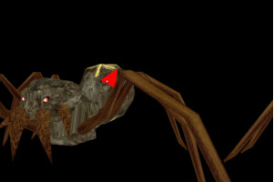

#第二十九课 3D 拾取

##背景

所谓 3D 拾取就是当我们用鼠标点击屏幕上显示的 3D 场景时，我们鼠标选中的那个像素能够映射到实际的 3D 场景中的相应图元上。这个功能对于那些强调交互性的应用程序十分有用，用户只需要进行点击（在 2D 屏幕上）就能这个被点击的位置映射到三维场景中的对象上。例如，你可以使用它来选择某个对象或者其一部分作为目标，并在之后对其进行进一步的操作。在这章的示例中，我们渲染了一些对象并且展示如何将被“选中”的三角形以红色标记出来！  

为执行3D 拾取我们需要充分利用在二十三课中所介绍的 OpenGL 中的 FBO。以前我们只是将深度缓存输出到 FBO 中因为我们那时只是关心在不同视口下同一像素之间的深度比较。在 3D 拾取中我们将使用深度缓存和颜色缓存信息来储存被渲染的所有三角形的索引。  

3D 拾取的技巧十分简单。在程序运行的过程中我们会给每一个三角形附上一个索引，然后在 FS 输出的时候会同时输出当前像素属于的三角形的索引。最终我们会得到一个颜色缓存（缓存中存放的并不是颜色值），这个缓存中存放的是当前像素所属于的图元的索引！当鼠标点击窗口时，我们将根据鼠标位置来获得这个索引并将这个三角形渲染成红色。由于有深度测试，所以我们能够保证当片元之间相互覆盖时，我们也可以得到最顶部的片元的索引（距离相机最近的）。  

在我们用程序实现这个功能之前，我们需要提前做一些规划设计。例如，我们应该怎么解决多个对象的情况？如何解决每个对象多次调用绘制函数的情况？亦或是我们是对场景中所有对象统一的进行索引还是对每个对象都重置其索引。  

这一课中我们使用一个简化的方式，我们会为每一个像素设置三个索引值：  


1. 像素所属的对象的索引，每一个对象有一个唯一的索引；
2. 在渲染同一个对象时绘制函数的调用索引，每绘制一个新的对象，这个索引就会增加；
3. 每次绘制过程中每个图元的索引，在每次绘制的时候这个索引都会重置。   

当我们读取像素的索引是实际上就是获得了上面这三个数据的组合，之后我们就可以对这个图元做相应的处理了。  

我们需要渲染场景两次！第一次渲染是为了渲染出"picking texture"，这个纹理中包含了图元的索引，第二次渲染则才真正将数据渲染到颜色缓存中。因此，主渲染循环中将包含拾取阶段和渲染阶段。  

注意：这个程序中使用的蜘蛛模型是 Assimp source package 中的！这个模型中包含了对个顶点缓存正好可以用来测试。  

##代码

```
class PickingTexture
{
public:
    PickingTexture();
    ~PickingTexture();
    bool Init(unsigned int WindowWidth, unsigned int WindowHeight);
    void EnableWriting();
    void DisableWriting();
    struct PixelInfo {
        unsigned int ObjectID;
        unsigned int DrawID;
        unsigned int PrimID;
        PixelInfo()     {
            ObjectID = 0;
            DrawID = 0;
            PrimID = 0;
        }
    };
    PixelInfo ReadPixel(unsigned int x, unsigned int y);
private:
    GLuint m_fbo;
    GLuint m_pickingTexture;
    GLuint m_depthTexture;
};
```

PickingTexture 类封装了 FBO 的相关操作，类中包含了一个 FBO 句柄、一个存储索引信息的纹理对象、一个存放深度信息的纹理对象。在初始化时他们的大小都被设定为与窗口大小一致。此外它还提供三个重要的方法。 EnableWriting() 必须在拾取阶段之前调用，之后我们才渲染所有相关的对象，并在最后我们调用方法 DisableWriting() 来将数据输出到默认的帧缓存中。为了获得像素所在图元的索引，我们需要调用 ReadPixel() 函数，这个函数需要像素的屏幕坐标作为参数，它的返回值是我们在“背景”中介绍过的一个索引（ID）的结构体。如果鼠标没有点击到场景中的对象，其返回值将会是 0xFFFFFFFF。  

```
bool PickingTexture::Init(unsigned int WindowWidth, unsigned int WindowHeight)
{
    // Create the FBO
    glGenFramebuffers(1, &m_fbo); 
    glBindFramebuffer(GL_FRAMEBUFFER, m_fbo);
    // Create the texture object for the primitive information buffer
    glGenTextures(1, &m_pickingTexture);
    glBindTexture(GL_TEXTURE_2D, m_pickingTexture);
    glTexImage2D(GL_TEXTURE_2D, 0, GL_RGB32UI, WindowWidth, WindowHeight,
                0, GL_RGB_INTEGER, GL_UNSIGNED_INT, NULL);
    glFramebufferTexture2D(GL_DRAW_FRAMEBUFFER, GL_COLOR_ATTACHMENT0, GL_TEXTURE_2D, 
                m_pickingTexture, 0); 
    // Create the texture object for the depth buffer
    glGenTextures(1, &m_depthTexture);
    glBindTexture(GL_TEXTURE_2D, m_depthTexture);
    glTexImage2D(GL_TEXTURE_2D, 0, GL_DEPTH_COMPONENT, WindowWidth, WindowHeight, 
                0, GL_DEPTH_COMPONENT, GL_FLOAT, NULL);
    glFramebufferTexture2D(GL_DRAW_FRAMEBUFFER, GL_DEPTH_ATTACHMENT, GL_TEXTURE_2D, 
                m_depthTexture, 0); 
    // Disable reading to avoid problems with older GPUs
    glReadBuffer(GL_NONE);
    // Verify that the FBO is correct
    GLenum Status = glCheckFramebufferStatus(GL_FRAMEBUFFER);
    if (Status != GL_FRAMEBUFFER_COMPLETE) {
        printf("FB error, status: 0x%x\n", Status);
        return false;
    }
    // Restore the default framebuffer
    glBindTexture(GL_TEXTURE_2D, 0);
    glBindFramebuffer(GL_FRAMEBUFFER, 0);
    return GLCheckError();
}
```

上面这个函数用于对 PickingTexture 类对象进行初始化。在这里面我们生成一个 FBO 并且将其绑定到 GL/_FRAMEBUFFER 目标,然后我们生成两个纹理对象（像素信息和深度）。需要注意的是包含像素信息的纹理的内部格式我们设置为 GL\_RGB32UI ,这意味着纹理中的每个纹素是一个由三个无符号整型构成的向量，这样我们的索引对于对于大多数场景应该都足够了，即使我们不初始化这个纹理（glTexImage2D 的最后一个参数是 null）我们仍然需要提供正确的格式和类型（第 7 和 8 个参数）。与 GL\_RGB32UI 对应的格式和类型分别是 GL\_RGB\_INTEGER 和 GL\_UNSIGNED\_INT。最后，我们将这个纹理添加到 FBO 中 GL\_COLOR\_ATTACHMENT0 的位置。这样片元着色器中的输出数据就可以输出到这个缓存中了。    

存放深度缓存信息的深度纹理其创建和绑定方式与在前面在阴影纹理中的使用是一样的，所以这里将不再复习。所有的初始化后我们会检查  FBO 的状态，并将 OpenGL 状态重置。  

```
void PickingTexture::EnableWriting()
{
    glBindFramebuffer(GL_DRAW_FRAMEBUFFER, m_fbo);
}
```

在我们开始渲染拾取纹理之前我们需要使它调用这个函数使之能够被写入。这意味着需要将 FBO 绑定到 GL\_DRAW\_FRAMEBUFFER。  

```
void PickingTexture::DisableWriting()
{
    glBindFramebuffer(GL_DRAW_FRAMEBUFFER, 0);
}
```

在我们完成拾取纹理的渲染之后，我们告诉 OpenGL，从现在起我们想将结果渲染到默认的帧缓存中去，所有我们将 0 绑定到 GL\_DRAW\_FRAMEBUFFER 上  

```
PickingTexture::PixelInfo PickingTexture::ReadPixel(unsigned int x, unsigned int y)
{
    glBindFramebuffer(GL_READ_FRAMEBUFFER, m_fbo);
    glReadBuffer(GL_COLOR_ATTACHMENT0);
    PixelInfo Pixel;
    glReadPixels(x, y, 1, 1, GL_RGB_INTEGER, GL_UNSIGNED_INT, &Pixel);
    glReadBuffer(GL_NONE);
    glBindFramebuffer(GL_READ_FRAMEBUFFER, 0);
    return Pixel;
}
```

这个函数通过一个屏幕坐标，返回从拾取纹理中获得的相应像素。这个像素是一个三维向量，每个分量都是 32 位整型数据，同时他也是 PixelInfo 结构体所包含的内容。为了从 FBO 中读取，我们必须首先将其绑定到 GL\_READ\_FRAMEBUFFER 目标上。然后我们需要使用  glReadBuffer() 函数指明要从哪个颜色缓存中读取数据，这是因为 FBO 可以包含多个的颜色缓冲( FS 可以同时将数据输出到多个颜色缓存中)但是我们一次只能读取一个缓存。函数 glReadPixels 做了实际的读取工作。这个函数需要一个矩形区域作为参数（第一对参数指定这个矩阵的左下角，第二对参数指定这个矩形区域的宽和高），而且最后的结果会存放到最后一个参数中并返回。在本课中这个矩形区域正好是一个纹素的大小。我们也需要告诉这个函数数据的格式和数据的类型，因为对于一些内置类型，这个函数会在不知不觉中对其进行类型转换。在本课中，我们需要行数据因此我们使用 GL\_RGB\_INTEGER 作为数据格式，GL\_UNSIGNED\_INT作为数据类型。我们完成这些后必须重新设置读取的缓存和帧缓存。  

```
 #version 330
layout (location = 0) in vec3 Position;
uniform mat4 gWVP;
void main()
{
    gl_Position = gWVP * vec4(Position, 1.0);
}
```

这是 PickingTechnique 类的顶点着色器程序。这个着色器类主要负责将像素的索引信息渲染到拾取纹理中去。正如你看到的，VS 中的代码很简单，我们只是对顶点进行了变换。  

```
 #version 330
uniform uint gDrawIndex; 
uniform uint gObjectIndex; 
out uvec3 FragColor;
void main()
{
    FragColor = uvec3(gObjectIndex, gDrawIndex, gl_PrimitiveID + 1);
}
```

在片元着色器中主要讲片元索引信息写入到拾取纹理中。在绘制当前对象的时候，对象索引和绘制索引对所有的像素是一样的（在相同的绘制调用中），因为这两个索引值由一致变量传入。为了得到片元索引我们使用可内置变量 gl_PrimitiveID，这个变量中存放的就是当前片元的索引，注意在使用它之前必须要保证 GL\_EXT\_gpu\_shader4 扩展被启用。gl\_PrimitiveID 仅在 GS 和 FS 中被使用。如果 GS 使用了这个变量而且 FS 也想使用 gl\ _PrimitiveID，那么 GS 必须将 gl\_PrimitiveID 作为输出数据，而 FS 也必须声明相同的变量名来获得这个变量。在我们的例子中没有 GS,所以我们可以直接使用 gl\_PrimitiveID。  

每次绘制开始的时候，系统都会将 gl\_PrimitiveID 重置为 0。但是我们很难区分背景像素和真正被物体覆盖的像素。为了解决这个我们在将图元 ID 写入到缓存中的时候都为其加 1。这样背景像素就可以被识别因为它们的图元 ID 是 0 而被物体覆盖的像素有其图元 ID 可以为 1...n 。在后面渲染阶段我们会在使用这个索引的时候对图元 ID 进行判断。  

```
class IRenderCallbacks
{
public:
    virtual void DrawStartCB(unsigned int DrawIndex) = 0;
};
```

拾取着色器需要应用程序在每个绘制函数之前更新索引信息。这体现了之前代码设计中存在的一个问题，因为目前的 mesh 类（对于有多个顶点缓存的模型）会在其内部遍历所有的顶点缓冲（或者索引缓存）并为其单独调用绘制函数。这就没有给我们机会来更新绘制索引。解决办法是我们使用上述的接口，PickingTechnique 类继承了这个接口，并实现了上面的方法。函数 Mesh::Render() 中现在会保存一个上述对象的指针，并在每个新的绘制函数调用之前调用这个接口。这样就将 Mesh 类与其他着色器类进行了很好的分离。  

```
void Mesh::Render(IRenderCallbacks* pRenderCallbacks)
{
    ...
    for (unsigned int i = 0 ; i < m_Entries.size() ; i++) {
        ...
        if (pRenderCallbacks) {
            pRenderCallbacks->DrawStartCB(i);
        }
        glDrawElements(GL_TRIANGLES, m_Entries[i].NumIndices, GL_UNSIGNED_INT, 0);
    }
    ...
}
```

上面的代码是 Mesh::Render() 函数中新增加的部分。如果调用者不需要在每次调用之前使用回调函数，那就直接传一个 NULL 即可。  

```
void PickingTechnique::DrawStartCB(unsigned int DrawIndex)
{
    glUniform1ui(m_drawIndexLocation, DrawIndex);
}
```

这是 IRenderCallbacks::DrawStartCB() 接口在其派生类 PickingTechnique 中的实现，在 Mesh::Render() 函数中为这个函数提供了绘制索引，并通过这个函数将其传入到着色器中。注意 PickingTechnique 类中也提供了函数用于设置对象索引，但是这个函数可以在主应用程序中调用而不需要上面的机制。  

```
virtual void RenderSceneCB()
{
    m_pGameCamera->OnRender(); 
    PickingPhase();
    RenderPhase();
    glutSwapBuffers();
}
```

这是主渲染函数，这个函数的功能由两个核心阶段实现，一个是将索引信息绘制到拾取纹理，另外一个负责渲染物体并响应鼠标点击。  

```
void PickingPhase()
{
    Pipeline p;
    p.Scale(0.1f, 0.1f, 0.1f);
    p.SetCamera(m_pGameCamera->GetPos(), m_pGameCamera->GetTarget(), m_pGameCamera->GetUp());
    p.SetPerspectiveProj(m_persProjInfo);
    m_pickingTexture.EnableWriting();
    glClear(GL_COLOR_BUFFER_BIT | GL_DEPTH_BUFFER_BIT);
    m_pickingEffect.Enable();
    for (unsigned int i = 0 ; i < ARRAY_SIZE_IN_ELEMENTS(m_worldPos) ; i++) {
        p.WorldPos(m_worldPos[i]);
        m_pickingEffect.SetObjectIndex(i);
        m_pickingEffect.SetWVP(p.GetWVPTrans()); 
        m_pMesh->Render(&m_pickingEffect);
    }
    m_pickingTexture.DisableWriting(); 
} 
```

在拾取阶段，OpenGL 的状态设置和往常一样。之后我们启用 m\_pickingTexture 使之成为输出目标，之后我们清楚颜色缓存和深度缓存中的内容（他们都是 FBO 中的缓存）。glClear() 函数作用于当前被绑定的帧缓冲——在这一课中绑定为当前帧缓存的是  m\_pickingTexture 。' m\_worldPos ' 数组中存放的是两个对象实例在世界坐标系下的位置（两个对象都是用的同一个模型）。我们遍历这个数组，通过向渲染管线传入不同的变换矩阵来绘制不同的对象。对于每一个对象，我们也会更新对象索引并将其传入到 picking technique 着色器中。注意函数 Mesh::Render() 是怎么将 picking technique 的对象地址作为一个参数传入的。这样我们就能在每次调用绘制函数之前调用这个回调函数来更新绘制索引。在函数结束之前，我们通过调用 DisableWriting（） 函数来将默认的帧缓存绑定到当前的输出。  

```
void RenderPhase()
{
    glClear(GL_COLOR_BUFFER_BIT | GL_DEPTH_BUFFER_BIT);
    Pipeline p;
    p.Scale(0.1f, 0.1f, 0.1f);
    p.SetCamera(m_pGameCamera->GetPos(), m_pGameCamera->GetTarget(), m_pGameCamera->GetUp());
    p.SetPerspectiveProj(m_persProjInfo);
    // If the left mouse button is clicked check if it hit a triangle
    // and color it red
    if (m_leftMouseButton.IsPressed) {
        PickingTexture::PixelInfo Pixel = m_pickingTexture.ReadPixel(m_leftMouseButton.x, 
                                                WINDOW_HEIGHT - m_leftMouseButton.y - 1);
        if (Pixel.PrimID != 0) {
            m_simpleColorEffect.Enable();
            p.WorldPos(m_worldPos[Pixel.ObjectID]);
            m_simpleColorEffect.SetWVP(p.GetWVPTrans());
            // Must compensate for the decrement in the FS!
            m_pMesh->Render(Pixel.DrawID, Pixel.PrimID - 1);
        }
    }
    // render the objects as usual
    m_lightingEffect.Enable();
    m_lightingEffect.SetEyeWorldPos(m_pGameCamera->GetPos());
    for (unsigned int i = 0 ; i < ARRAY_SIZE_IN_ELEMENTS(m_worldPos) ; i++) {
        p.WorldPos(m_worldPos[i]);
        m_lightingEffect.SetWVP(p.GetWVPTrans());
        m_lightingEffect.SetWorldMatrix(p.GetWorldTrans()); 
        m_pMesh->Render(NULL);
    } 
}
```

拾取阶段之后是渲染阶段，和之前一样我们设置渲染管线，然后检查鼠标左键是否被按下，如果按下我们使用 PickingTexture::ReadPixel() 得到像素信息。因为 FS 增加了 primitive ID 写到 picking texture 所有的背景像素其图元 ID 都为0，而其他被对象覆盖的像素其图元 ID 都为 1... n 之间的一个数。所以如果是被物体所覆盖的像素，我们启用一个非常简单的着色器程序，这个着色器程序只是简单的将所有片元的颜色以红色输出。我们根据选中的像素的索引信息来找到这个像素所属的对象，并通过这个对象的位置信息来设置渲染管线，之后我们使用 Mesh 类中的一个新的渲染函数来将选中的片元绘制成红色，这个渲染函数需要绘制索引，和图元 ID 作为参数（注意我们必须将图元 ID 减 1 ，因为 Mesh 类中图元 ID 是从 0 开始计数的）。最后，我们像平常一样渲染整个场景。  

```
static void MouseCB(int Button, int State, int x, int y)
{
    s_pCallbacks->MouseCB(Button, State, x, y);
}
static void InitCallbacks()
{
    ...
    glutMouseFunc(MouseCB);
}
```

这一课中要求程序能够捕捉鼠标点击事件。 glutMouseFunc() 函数正好是负责鼠标事件的捕捉。在 ICallbacks 接口类中我们添加了一个新的回调函数。你可以使用枚举变量例如 GLUT\_LEFT\_BUTTON, GLUT\_MIDDLE\_BUTTON, 和 GLUT\_RIGHT\_BUTTON 来判断按下的是哪一个键（MouseCB() 的第一个参数）。'State' 参数可以告诉我们按键现在是被按下( GLUT\_DOWN )还是释放( GLUT\_UP )。

##操作结果
