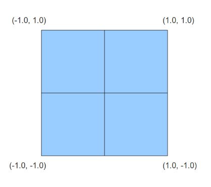
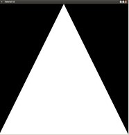

# OpenGL教程翻译  第三课 First Triangle
##Background
这一节是非常短的。我们简单的扩展上一节的内容来画一个三角形。  
在这一节中我们再一次在规范化空间中安排我们的顶点坐标。能够看见的顶点一定要在盒子内部，这样视口矩阵才能将这些顶点映射到窗口可以看见的地方。当我们忽略 Z 轴时，我们看到的盒子如下图：   
 
  

点（-1.0，-1.0）是被映射到窗口的左下角，（-1.0，1.0）被映射到窗口的左上角等等。如果你将顶点的位置坐标扩展到这个盒子的外边，那么这个三角形将被截断同时你只能看到它的一部分。
##Source Walkthru

```
Vector3fVertices[3];
Vertices[0] =Vector3f(-1.0f, -1.0f, 0.0f);
Vertices[1] =Vector3f(1.0f, -1.0f, 0.0f);
Vertices[2] =Vector3f(0.0f, 1.0f, 0.0f);
```

我们让这个数组包含三个顶点。  

```
glDrawArrays(GL_TRIANGLES,0, 3);
```

对于这个绘图函数我们做个两个改变：在这个例子中我们绘制的是一个三角形，而且使用了3个顶点。

##Operation Result


