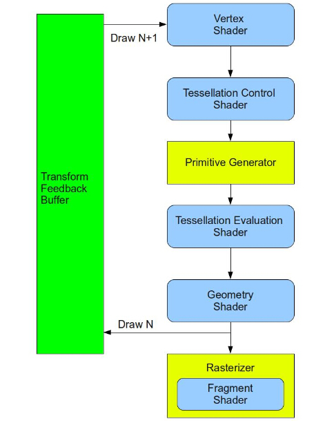
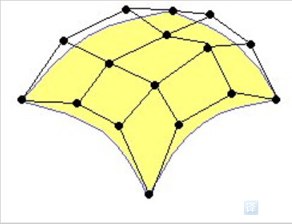
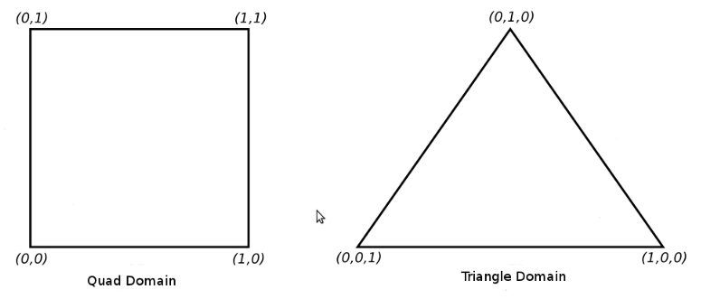
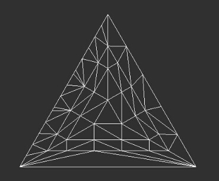
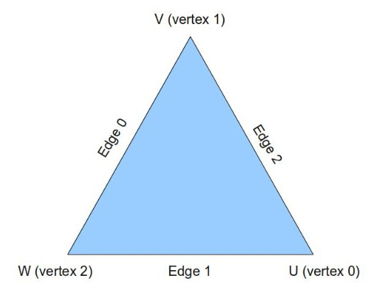
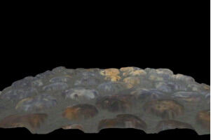

# 第三十课 曲面细分
注意：此节中用到的颜色和位移纹理是用 Ben Cloward 创建的。
##背景

曲面细分（ Tessellation ）是 OpenGL4.x 中的一个令人兴奋的新特性，Tessellation 主要用于解决 3D 模型的静态属性，包括他们的精细度和多边形数量。具体来说就是当我们近距离观察一个复杂的模型（如人脸）时，我们希望能够看到这个模型的所有细节（例如皮肤的褶皱），所以我们需要使用一个高精细度的模型。一个高精细度的模型自然是需要更多的三角面以及更多的处理器资源。而当我们在稍远的距离观察这个模型的时候，我们更愿意使用一个精细度比较低的模型使得更多的计算机资源能够用于对离相机更近对象的渲染。这个技术简单来说就是用于平衡 GPU 资源，使得更多的资源能够用于距离相机很近的对象的渲染，因为这些地方的小细节是很容易被用户注意到的。  

要解决这个问题，我们也可以使用 OpenGL 的一个已经存在的特性即为同一个模型生成多个不同层级精细度的模型（LOD）。例如，高精细度、一般精细度、低精细度。之后我们就可以根据与相机距离的不同来选择使用不同精细度版本的模型。但是这个方法会消耗更多的美术资源而且很多情况下这个方法也不够灵活。我们理想的方法是导入一个多边形数量很少的模型，之后将组成此模型的所有三角面细分成更小的三角面，这就是曲面细分（ Tessellation ）。在 OpenGL 4.x 中所提供的曲面细分管线中，这些都能够在 GPU 中进行动态的处理并且选择每个三角形的精细度。  

在经过学术界和工业界多年的研究之后，曲面细分技术已经被整合到了 OpenGL 的渲染管线中。它的设计很大程度上是受到了数学中的几何表面和曲线、贝塞尔曲线以及细分的影响。我们将分两步来学习曲面细分技术，在这一课中，我们将主要聚焦于如何在渲染管线中使用新的机制来实现曲面细分技术而不会涉及太多的数学知识。这个技术本身是比较简单的，但是它需要使用很多与之相关的组件。在下一课中我们将学习贝塞尔曲线，并且探讨如何将其用于曲面细分技术之中。  

让我们先看看在渲染管线中曲面细分技术是如何实现的。负责实现曲面细分技术的关键部分是两个新的着色器阶段，而且在他们之间有一个固定功能阶段，在这个阶段中可以从某种程度上来配置一些参数但并不需要运行着色器程序。第一个着色器阶段被称作细分控制着色器(TCS)，固定功能阶段为图元生成(PG)，而第二个着色器阶段为细分曲面计算着色器(TES)。下面这幅图片展示了管线中新增的几个阶段的顺序：  


 
TCS 着色器需要一组被称作是 Control Points (控制点)的顶点。这些顶点并没有被真正定义成如三角形、矩形、五边形或者其他的多边形。相反的是，他们定义了一个几何曲面。这个曲面一般由一些多项式公式定义，其思想就是当我们移动其中一个控制点时，它会对整个曲面的都产生影响。如果你熟悉一些图形软件，那么你可能会知道在一些图形软件中会允许你使用一系列的控制点来定义曲面或者曲线，并且通过移动这些控制点来改变他们。这一组控制点通常被称作一个 Patch。在下面图中的黄色表面就是通过由 16 个控制点组成的 patch 来实现的：  

  
 
TCS 着色器使用一个 patch 作为输入并且最终输出一个 patch 。开发者在着色器中可以对控制点进行一些变换甚至是添加或者删除控制点。除了输出一个 patch 之外，着色器程序还会计算出一组被称作 Tessellation Levels (TL) 的数据。TLs 决定了曲面细分的精细程度——对这一个 patch 需要生成多少个三角形。因为这些都是在着色器中实现的，开发者可以任意选择合适的算法来计算 TLs 。例如，我们可以定义如果光栅化之后的三角形将会覆盖的像素点的个数小于 100 则 TLs 值为 3，当覆盖的像素点的个数在 101 到 500 之间的时候 TLs 值为 7，超出 500 之后则为 12.5（我们后面会详细介绍如何通过 TL 的值来影响曲面细分）。还有的算法也可以根据对象到相机的距离来计算。更重要的一点是每个 patch 都可以根据其本身的特征来得到不同的 TLs 值。  

在 TCS 着色器完成之后数据会进入固定功能阶段 PG 中，它的任务就是进行细分操作。这对于新手来说可能会比较迷惑。因为 PG 并不是真正对 TCS 着色器输出的 patch 进行细分。实际上它并没有权限去接触它。相反的是，它借助于 TLs 在一个特定的空间中进行细分操作。这个特定的空间可以是一个规范化的（在[0.0 ~ 1.0]之间）二维矩形或者一个由三维质心坐标（Barycentric coordinates）定义的一个等边三角形：  


 
三角形的质心坐标系是一个通过组成三角形的三个顶点的加权值来定义三角形内部位置的方法。三角形的顶点有 U、V 以及 W 三个分量确定。三角形中的某一个点其位置越靠近一个顶点，则这个顶点的权值就越大相应的其他两个顶点的权值就会减小。如果这个点正好位于一个顶点上，那么对应这个顶点的权值为 1 ，另外两个顶点的权值都为 0 。例如质心坐标系的U为（1，0，0），V 为（0，1，0）、W 为（0，0，1）。三角形的中心用质心坐标系表示就是(1/3，1/3，1/3)。质心坐标系的一个很有趣的特点就是如果我们将三角形内部一点的三个分量相加，得到的结果始终都是 1 。为了简单起见，现在我们都先专注于三角形空间。  

PG 借助于 TLs 中的信息并在此基础上在三角形内部生成一系列的点。每个点都是由这个三角形的质心坐标系确定的。开发者可以选择输出的拓扑结构为点或者是三角形。如果选择的是拓扑关系为点，那么 PG 会直接将其传入渲染管线的下一阶段并按照点来进行光栅化。如果选择的是三角形，PG 会将所有顶点连起来这样整个三角面就被细分成了多个小的三角面。  



在一般情况下 TLs 告诉 PG 三角形边上的线段的数量，并且一环一环的绕着三角形的中心来构造三角形。  

那么上面图片中的这些小三角形与我们之前提到过的 patch 有什么关系呢？其实，这就主要取决于你想使用曲面细分技术做什么了。一个非常简单的应用（本课中我们使用的）就是跳过曲面的多项式表示，简单来说就是你模型中的三角形面仅仅是简单的映射到 patch 上。在这种情况下组成三角形的 3 个顶点表示我们的 3 个控制点，而原始的三角形同时作为 TCS 的输入和输出 patch。我们使用 PG 来对三角形进行曲面细分并且生成由质心坐标表示的 domain 三角形并对这些坐标进行线性组合（例如：将他们与原始三角形的属性相乘）来对原始模型的三角形面进行细分。在下一节中我们我们将会介绍 patch 在几何曲面上的实际应用。无论如何要记住，PG 并不在意 TCS 的输入和输出 patch，它需要在意的是每个 patch 的 TLS 值。  

在 PG 对三角形域进行曲面细分之后，我们还需要对其细分的结果进行一些处理。毕竟，PG 无法访问 patch。它唯一的输出就是质心坐标和他们的连通性。将他们传递到 TES 着色器中之后，TES 有权限去访问 TCS 中输出的 patch 和 PG 生成的质心坐标。PG 对每一个质心坐标都会执行 TES，而 TES 的功能就是为在 PG 中生成的每一个位于质心坐标系下的顶点都生成一个真正的可用的顶点。因为可以访问 patch，他可以从中获取诸如位置、法线等信息，并且通过这些来生成顶点。在 PG 对一个“小”三角形的三个质心坐标系下的顶点执行 TES 之后，由 TES 生成的这三个顶点会被传递到渲染管线的下一阶段传递并把他们当做一个完整的三角形进行光栅化。  

TES 与顶点着色器在某种程度上十分相似，它只有一个输入（质心坐标）和一个输出（顶点）。TES 在每次调用过程中只能生成一个顶点，而且它不能丢弃顶点。OpenGL 中曲面细分阶段的 TES 着色器的主要目的就是借助于 PG 阶段生成的坐标来生成曲面。简单来说就是将质心坐标变换到表示曲面的多项式中并计算出最终结果。结果就是新的顶点的位置，之后这些顶点就能与普通顶点一样进行变换和投影了。正如你所看到的那样，在处理几何曲面的时候，如果我们选择的 TLs 值越高，我们获得的区域位置就越多，而且通过在 TES 中对他们进行计算我们得到的顶点就会更多，这样我们就能更好的表示精细的表面。在这一节中表面的计算公式我们简单的使用一个线性组合公式来代替。  

在 TES 着色器执行之后，产生的新的顶点会被作为三角形传递到渲染管线的下一阶段。在 TES 之后接下来不管是 GS 还是光栅化阶段，这些都与我们之前的一样了。  

现在让我们总结一下整个阶段：
1. 对于 patch 中的每一个顶点都会执行顶点着色器，每个 patch 中都包含顶点缓存中的多个控制点（CPs）（控制点的最大值由驱动和 GPU 定义）；
2. TCS 着色器获取由顶点处理器处理之后的数据并输出 patch，除此之外它也会产生 TLs；
3. 基于我们定义的细分空间，PG 阶段通过获取从 TCS 着色器中传入的 TLS（细分层级）以及其输出的拓扑结构，PG 会生成这个空间下的顶点信息和其生成的顶点的连通性；
4. 所有生成的位于这个特定空间下的位置都会经过 TES 着色器进行处理；
5. 在第 3 步中生成的图元会沿着渲染管线继续传递，TES 着色器会生成这些图元的具体数据；
6. 和往常一样执行 GS 阶段和光栅化阶段。

##代码
```
(tutorial30.cpp:80)
GLint MaxPatchVertices = 0;
glGetIntegerv(GL_MAX_PATCH_VERTICES, &MaxPatchVertices);
printf("Max supported patch vertices %d\n", MaxPatchVertices); 
glPatchParameteri(GL_PATCH_VERTICES, 3);
```

当我们启用曲面细分时（例如我们使用了 TCS 和 TES 着色器）渲染管线需要知道一个 patch 输入由多少个顶点组成。需要记住一个 patch 不一定有一个确定的几何形式。它仅仅是一系列的控制点。上面程序中我们调用 glPatchParameteri() 是为了告诉渲染管线每个 patch 输入由三个顶点组成。这个参数的最大值由显卡驱动定义的值 GL\_MAX\_PATCH\_VERTICES 确定，这个值对于不同的显卡驱动是不一样的，我们我们通过调用 glGetIntegerv() 函数来获取这个值并打印出来。

```
 (lighting.vs)
 #version 410 core
layout (location = 0) in vec3 Position_VS_in;
layout (location = 1) in vec2 TexCoord_VS_in;
layout (location = 2) in vec3 Normal_VS_in;
uniform mat4 gWorld;
out vec3 WorldPos_CS_in;
out vec2 TexCoord_CS_in;
out vec3 Normal_CS_in;
void main()
{
    WorldPos_CS_in = (gWorld * vec4(Position_VS_in, 1.0)).xyz;
    TexCoord_CS_in = TexCoord_VS_in;
    Normal_CS_in = (gWorld * vec4(Normal_VS_in, 0.0)).xyz;
} 
```

这是我们的顶点着色器，这个顶点着色器与我们之前使用的顶点着色器不同的地方在于我们不再将顶点从局部坐标系变换到裁剪坐标系中（通过乘上 world-view-projection 矩阵）。原因很简单，因为这里面本来就没有任何顶点。我们希望能生成一大堆的新的顶点这样才会需要这个矩阵。因此这个变换会在我们 TES 着色器执行之后才会进行。  

```
(lighting.cs)
 #version 410 core
// define the number of CPs in the output patch
layout (vertices = 3) out;
uniform vec3 gEyeWorldPos;
// attributes of the input CPs
in vec3 WorldPos_CS_in[];
in vec2 TexCoord_CS_in[];
in vec3 Normal_CS_in[];
// attributes of the output CPs
out vec3 WorldPos_ES_in[];
out vec2 TexCoord_ES_in[];
out vec3 Normal_ES_in[];
```

这是 TCS 着色器程序的开始部分，对于输出 patch 中的每一个控制点都会执行一次这个着色器，首先我们定义了输出的每个 patch 中的控制点的数量。之后我们定义一个一致变量用于计算 TLs 。在那之后我们还定义了一些输入和输出的控制点属性。在这一课中我们输出和输出的 patch 结构都是一样的，但是一般情况下并不是这样的。每一个输入和输出的控制点都有位置、纹理坐标以及法线属性。因为在一个输入和输出 patch 中我们可以有多个控制点，所以每个属性都是用一个数组来定义的，这使得我们可以很方便的索引到任何一个控制点。  

```
(lighting.cs:33)
void main()
{
    // Set the control points of the output patch
    TexCoord_ES_in[gl_InvocationID] = TexCoord_CS_in[gl_InvocationID];
    Normal_ES_in[gl_InvocationID] = Normal_CS_in[gl_InvocationID];
    WorldPos_ES_in[gl_InvocationID] = WorldPos_CS_in[gl_InvocationID];
```

在 TCS 着色器的主函数中，我们首先将输入的控制点属性复制到输出的控制点中。这个函数在每个控制点输出时都会调用一次，而内置变量 gl_InvocationID 则包含了当前控制点的索引值。这里不能确定顶点的执行顺序的原因是因为 GPU 的并行运算，所以这里我们使用 gl_InvocationID 作为输出和输入 patch 的索引（OpenGL 会为我们处理）。  

```
(lighting.cs:40)
    // Calculate the distance from the camera to the three control points
    float EyeToVertexDistance0 = distance(gEyeWorldPos, WorldPos_ES_in[0]);
    float EyeToVertexDistance1 = distance(gEyeWorldPos, WorldPos_ES_in[1]);
    float EyeToVertexDistance2 = distance(gEyeWorldPos, WorldPos_ES_in[2]);
    // Calculate the tessellation levels
    gl_TessLevelOuter[0] = GetTessLevel(EyeToVertexDistance1, EyeToVertexDistance2);
    gl_TessLevelOuter[1] = GetTessLevel(EyeToVertexDistance2, EyeToVertexDistance0);
    gl_TessLevelOuter[2] = GetTessLevel(EyeToVertexDistance0, EyeToVertexDistance1);
    gl_TessLevelInner[0] = gl_TessLevelOuter[2];
} 
```

在产生输出 patch 之后，我们计算 TLs 的值，对于每个输出 patch，我们可以有不同的 TLs 值。OpenGL 为 TLs 提供了两个内置浮点数组： gl\_TessLevelOuter (size 4) 、 gl\_TessLevelInner (size 2)。在三角域里面我们只需要使用 gl\_TessLevelOuter 数组的前三个成员以及 gl\_TessLevelInner 数组的第一个成员（除了三角域之外还有矩形域和 isoline 域，不同的域对数组有不同的访问）。gl\_TessLevelOuter 用于确定三角形每个边线上的线段的数量，gl\_TessLevelInner[0] 确定三角形中将会包含多少个圈。如果我们用 U、V、W 来指定三角形的顶点，那么每个顶点对应的边线就是此顶点正对着的边:   

 

我们用来计算 TLs 的算法非常简单，它是基于世界标系中顶点到相机的距离来计算的。它在 GetTessLevel 函数中实现（下面会介绍）。我们先计算相机与每个顶点的距离并且三次调用 GetTessLevel（）函数来更新 gl\_TessLevelOuter[] 数组中的每一个元素。每一次调用都与上图中的边线所对应（ 0 号边线的 TL 值被存放在 gl\_TessLevelOuter[0] 中），并且这个边线的 TL 值是基于组成这个边线的两个顶点到相机的距离计算出来的。内部的 TL 值我们选择使用与 W 边线相同的 TL 值。  

你可以使用任何你想使用的算法来计算 TL 值，例如我们可以通过估计三角形最终显示到屏幕上的像素大小，并且设置 TL 值使得所有细分之后的三角形都不小于一个给定的像素值。  

```
(lighting.cs:18)
float GetTessLevel(float Distance0, float Distance1)
{
    float AvgDistance = (Distance0 + Distance1) / 2.0;
    if (AvgDistance <= 2.0) {
        return 10.0;
    }
    else if (AvgDistance <= 5.0) {
        return 7.0;
    }
    else {
        return 3.0;
    }
} 
```

这个函数用于计算一条边的 TL 值，它是基于组成这条边的两个顶点到相机的距离来计算的。我们使用两个点到相机的平均距离来将 TL 值确定为 10、7 或者是 3。随着距离的增加我们希望得到一个更小的 TL 值这样不至于浪费 GPU 的资源。  

```
(lighting.es)
 #version 410 core
layout(triangles, equal_spacing, ccw) in;
```

在 TES 着色器开始，我们使用 ‘layout’ 关键字配置了三个属性：  

- Triangles 这是 PG 的工作域，其他两个选项是 quads 和 isolines；
- equal\_spacing 意味着三角形的边缘会被细分成等分的线段（根据 TLs）。你也可以使用 fractional_even_spacing 或者 fractional\_odd\_spacing 使得在线段长度上获得更加平滑的过渡，不论 TL 值是一个奇数整数还是一个偶数整数。例如，如果你使用 fractional\_odd\_spacing 并且 TL 值为 5.1，这意味着会有两个非常短的线段和 5 个比较长的线段。随着 TL 值增加到 7，所有线段的长度会变得十分接近。当 TL 值达到7，两个新的十分短的线段会被创建出来。fractional\_even\_spacing在处理偶数TL值时也是一样;
- ccw 意味着 PG 中输出的三角形会按照逆时针顺序（你同样可以使用 cw 将其设定为顺时针顺序）。你也许会想，在顺时针为正面的情况下为什么我们还要将其设置为逆时针方向。这是因为在这一节中我使用的模型（ quad2.obj ）是用 Blender 按照逆时针顺序生成的，我本应该在导入模型的时候将 Assimp 标志设置为 'aiProcess\_FlipWindingOrder' 这样在这里我们就能使用 cw 。我现在只是不想去修改 mesh.cpp 中的内容，底线就是无论你做什么，都要保证他们始终是一致的。

注意你也可以为上面每一个配置项目都单独使用一个 layout 关键字来声明，上面的写法仅仅是为了节省空间。

```
 (lighting.es:5)
uniform mat4 gVP;
uniform sampler2D gDisplacementMap;
uniform float gDispFactor;
in vec3 WorldPos_ES_in[];
in vec2 TexCoord_ES_in[];
in vec3 Normal_ES_in[];
out vec3 WorldPos_FS_in;
out vec2 TexCoord_FS_in;
out vec3 Normal_FS_in;
```

TES 着色器与其他着色器程序一样都有一致变量。偏移纹理实际上就是高度纹理，它记录了颜色纹理中每个像素在所在位置的高度信息。我们将会使用高度纹理在我们的网格模型的表面上产生起伏的状态。除此之外，TES 也可以访问 TCS 着色器的输出 patch。最后我们声明输出的顶点的属性。需要注意的是默认数组并没有在这里出现，这是因为 TES 的输出通常都是一个单一的顶点。  

```	
(lighting.es:27)
void main()
{
    // Interpolate the attributes of the output vertex using the barycentric coordinates
    TexCoord_FS_in = interpolate2D(TexCoord_ES_in[0], TexCoord_ES_in[1], TexCoord_ES_in[2]);
    Normal_FS_in = interpolate3D(Normal_ES_in[0], Normal_ES_in[1], Normal_ES_in[2]);
    Normal_FS_in = normalize(Normal_FS_in);
    WorldPos_FS_in = interpolate3D(WorldPos_ES_in[0], WorldPos_ES_in[1], WorldPos_ES_in[2]);
```

这是 TES 着色器的主函数，现在概要整理下到目前为止我们已经完成了哪些工作了。网格顶点经过顶点着色器处理之后得到了世界坐标系下的位置、法线。TCS 将每个三角形作为一个带三个控制点的 patch 并直接将其传递到 TES 中。PG 将一个等边三角形细分成多个小三角形并且为每个新产生的顶点都执行 TES 着色器。在每次的 TES 调用中，我们都可以访问顶点的质心坐标（或者叫做 Tessellation Coordinates）。因为三角形内部一点的质心坐标代表了三个顶点的权值的线性组合。我们可以用它来插值得到新产生的顶点的所有属性。函数 interpolate2D() 和 interpolate3D() 就是用于完成这个工作的。他们从 patch 的控制点中获取属性并且使用 gl_TessCoord 进行插值。  

```
(lighting.es:35)
    // Displace the vertex along the normal
    float Displacement = texture(gDisplacementMap, TexCoord_FS_in.xy).x;
    WorldPos_FS_in += Normal_FS_in * Displacement * gDispFactor;
    gl_Position = gVP * vec4(WorldPos_FS_in, 1.0);
} 
```

在将原始网格中的三角形细分成多个小三角形之后，这并不会对整个模型的外观产生很大的影响，因为这些小三角形都是位于原来的大三角形的平面里。我们希望能够通过某种方法对顶点进行一些偏移（或者替换）使得其能够与颜色纹理相对应。例如，如果纹理包含的内容是砖块或者岩石，我们希望我们的顶点沿着砖块或者岩石的边缘凸起。为了实现这个效果我们需要使用一个高度纹理（ displacement map ）作为颜色纹理的补充。现在有很多工具和编辑器都可以生成高度纹理，这里我们就不具体介绍其细节了。你可以在网上找到更多有关的信息。为了使用高度纹理，我们只需要使用当前纹理坐标从其中进行采样，这样就能获得顶点的高度信息。之后我们使用顶点法线与高度以及一个由应用程序控制的一致变量（位移因子）的乘积来替换原来的顶点。这样一来所有顶点都会根据其高度沿着其法线方向进行移动，并且移动的距离由从高度纹理中读取的高度信息决定。最后我们将新产生的位于世界坐标系中的顶点乘上 view-projection 矩阵并将其传入 ‘gl_Position’ 变量中。  

```
(lighting.es:17)
vec2 interpolate2D(vec2 v0, vec2 v1, vec2 v2)
{
    return vec2(gl_TessCoord.x) * v0 + vec2(gl_TessCoord.y) * v1 + vec2(gl_TessCoord.z) * v2;
}
vec3 interpolate3D(vec3 v0, vec3 v1, vec3 v2)
{
    return vec3(gl_TessCoord.x) * v0 + vec3(gl_TessCoord.y) * v1 + vec3(gl_TessCoord.z) * v2;
} 
```

这两个函数通过使用 'gl_TessCoord' 作为权值在二维向量和三维向量之间插值  

```
(lighting_technique.cpp:277)
bool LightingTechnique::Init()
{
    ...
    if (!AddShader(GL_TESS_CONTROL_SHADER, pTessCS)) {
        return false;
    }
    if (!AddShader(GL_TESS_EVALUATION_SHADER, pTessES)) {
        return false;
    }
    ...
```

最后不要忘了编译这两个新的着色器程序。  
 
**关于这个 Demo**  

本节中的演示示例展示了如何对矩形地形进行曲面细分并且使顶点沿着颜色纹理中的岩石边缘进行偏移。你可以使用键盘中的 ‘+’ 和 ‘-’ 符号来更新位移因素进而控制位移的大小。你也可以通过 ‘Z’ 按键将场景切换到线框模式进而观察由曲面细分技术生成的三角形。你可以尝试在线框模式下远离或者靠近地形进而观察曲面细分的层级是如何基于顶点到相机的距离改变的。这就是我们需要 TCS 的原因。  

##操作结果

 

