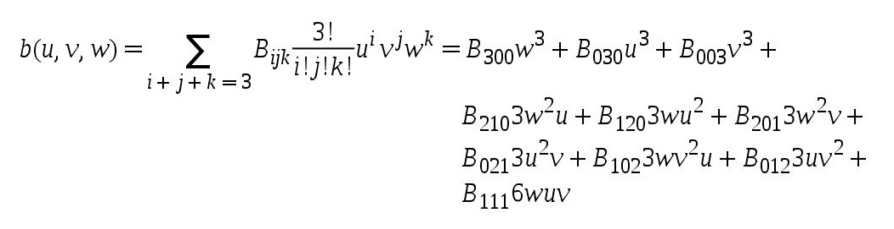
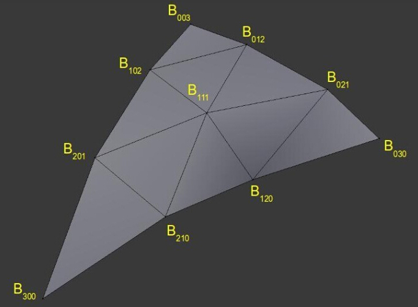
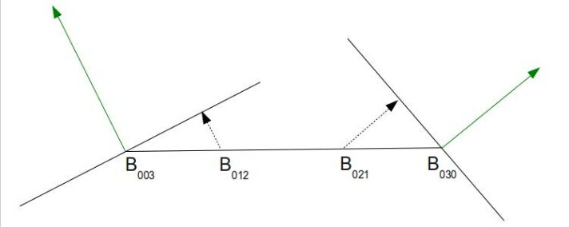
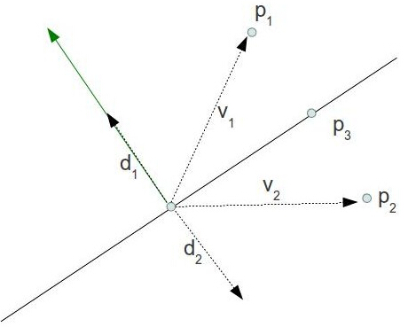
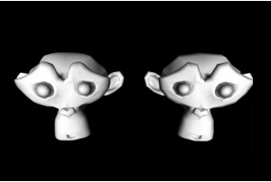

#第三十一课 基于PN算法的曲面细分
##背景

在前面一节中我们简单介绍了　OpenGL 4.x中的曲面细分技术，我们通过对渲染管线的相关阶段进行设置，学习了如何对我们的网格模型进行细分，以及如何将由细分着色器生成的顶点渲染出来，这一节中的内容很大一部分都会依赖于上一节，所以请确保对上一节中的内容比较熟悉。细分着色器的使用是比较简单的，TES 中主要结合原始顶点信息和由 PG 阶段生成的质心坐标系下的数据对顶点进行插值，但是插值得到的点都是位于之前的平面之上的，所以我们还需要通过使用高度图使得表面产生真实的凹凸感。  

在这一节中，我们将学习一种更加先进的细分技术——PN（Point-Normal）三角形，他的原理是通过一个几何上的贝塞尔表面来替换原始的网格数据进而对精细度较低的网格进行平滑处理。  

贝塞尔曲面是 Pierre Bezier 在 1960 年代发明的，他的初衷是用这个技术来描述汽车车身的曲面部分。简而言之，贝塞尔曲面就是一个描述光滑的连续的曲面的多项式函数，并且这个曲面全部包含在一组控制点内。贝塞尔曲面有一个特殊的性质，当我们移动一个控制点时，这个控制点附近的表面都会受到影响，而且离这个点越远，这个影响变得越小。你可以想象有一个十分纤细而且有弹性的布料平铺在地面上，当你用手拿住布料的某一个点向上提时，你可以发现在这个点附近会形成一个曲面，而且离这个点越远，这个曲面会变得更加不明显。

贝塞尔曲面多项式是定义在一个单位正方形之上的，这意味着我们可以通过向多项式中插入一组在[0 - 1] 之间的数据，就能得到多项式所描述的光滑曲面上的一个点。如果你在这个单位正方形中插入很多组数据，并将结果绘制到屏幕上，最终你会得到一个近似的曲面。

我们将会使用贝塞尔曲面中的一个特例——Bezier Triangle，它的形式如下：  

  

让我们一步一步的来理解上面这个公式，‘u/v/w’ 是质心坐标（他们始终满足等式：u + v + w = 1），‘Bxyz’ 是一组控制点，我们会对标准的贝塞尔三角形进行一些改动，并如下放置控制点。

   

正如你所见的那样，一组控制点大体就是三角形表面上的一个膨胀表面，将质心坐标带入上面的这个公式，我们就能得到更加接近真实的 3D 表面。
   
让我们看看如何将这些数学知识整合进细分管线中，我们先从一个三角形开始，这会是我们作为我们的输入 patch（就和前一课中一样）。我们会生成 10 个控制点并在 TCS 着色器中决定细分层级（TLS）。PG 阶段会根据 TLs 对三角形域进行划分，进而生成新的顶点，对于每个新生成的顶点都会对其执行 TES 着色器。在 TES 中会通过访问 PG 中得到的质心坐标，并结合从 TCS 中输出的 10 个控制点的数据，最后能得到膨胀表面的顶点。之后的处理就和之前差不多了。

还需要指出的一点就是如何生成一组控制点，PN 三角形算法建议我们这么做：  

- 初始的三角形的顶点保持不变（将其命名为 B003, B030 和 B300）。
- 将每条边等分成3个线段从而产生两个新的顶点——一个顶点在边的 1/3 处，另一条边在 2/3 处。
- 上面生成的每一个点都被投影到由最近的顶点以及其法线创建出来的平面上。  

   
 
上面这幅图片展示了三角形的其中一条边的情况，这个边的两个端点都有其法线方向（绿色箭头），这个点和法线结合构造出一个平面，我们将之前计算出的两个等分点投影到离其最近的顶点构建出的平面上（图中虚线所示）。

- 为了计算 B111 的位置，我们定义了一个从原始三角形中心（三个顶点的平均）到 6 个等分点中心（投影之后）的向量，最终的 B111 的位置就是这 6 个等分点的中心沿着这个向量移动其一半的距离。

实用这种方法来计算的原因十分简单，如果在一个模型上有一个区域比较平坦，这就意味着这部分顶点的法线都是朝着大致一样的方向而不会与真实的三角形法线相差太多，这也说明当我们将等分点投影到表面的时候这个点离三角形表面也不会太远，最后结果就是这个区域的面只会出现很小的起伏。但如果这个区域十分的凹凸不平，那么这些等分点偏移的距离就会比较远，以此来模拟出这个区域较大的起伏状态，在这个 Demo 中我们将使用一个低精细度的角色模型，这个模型大概只有 500 个面，所以这个模型看起来是十分粗糙的，特别是它的头部。通过将上面描述的这些等分点进行投影来创建控制点，之后使用细分着色器对由这些控制点创建出的贝塞尔三角形进行计算，之后我们就能在不依靠其他美术资源的情况下得到一个更加平滑的模型。  

**引用：**

Vlachos Alex, Jorg Peters, Chas Boyd and Jason L. Mitchell. "Curved PN Triangles". Proceedings of the 2001 Symposium interactive 3D graphics (2001): 159-66。  

John McDonald. "Tessellation On Any Budget". Game Developers Conference, 2011。

##代码  

```
(lighting.vs:13)
void main()
{ 
    WorldPos_CS_in = (gWorld * vec4(Position_VS_in, 1.0)).xyz; 
    TexCoord_CS_in = TexCoord_VS_in; 
    Normal_CS_in = normalize((gWorld * vec4(Normal_VS_in, 0.0)).xyz); 
} 
```

顶点着色器中和前一课中相比较起来只有一个地方改动——法线属性在经过世界坐标矩阵变换之后需要进行规范化，这是因为在 TCS 中需要使用规范化的顶点法线属性，否则，表面上的控制点就不会被正确的生成，如果世界变换矩阵中包含了缩放操作，那么法线的长度就不再是单位长度，所以我们需要进行规范化。  

```
(lighting.cs)
 #version 410 core
// 定义输出 Patch 中的控制点数量
layout (vertices = 1) out;
uniform float gTessellationLevel;
// attributes of the input CPs
in vec3 WorldPos_CS_in[];
in vec2 TexCoord_CS_in[];
in vec3 Normal_CS_in[];
struct OutputPatch
{
    vec3 WorldPos_B030;
    vec3 WorldPos_B021;
    vec3 WorldPos_B012;
    vec3 WorldPos_B003;
    vec3 WorldPos_B102;
    vec3 WorldPos_B201;
    vec3 WorldPos_B300;
    vec3 WorldPos_B210;
    vec3 WorldPos_B120;
    vec3 WorldPos_B111;
    vec3 Normal[3];
    vec2 TexCoord[3];
};
// attributes of the output CPs 
out patch OutputPatch oPatch;
```

这是 TCS 着色器中变量声明部分。首先我们需要注意的是我们只输出一个控制点，你也许会觉得这个事儿很奇怪，因为我们从一开始就说我们需要在原始三角形上面创建一个有 10 个控制点的贝塞尔三角形，但是为什么我们这儿声明的是输出一个控制点而不是十个？这是因为 TCS 会对我们定义的每一个输出控制点都执行一次，在这个算法中，对于某些控制点我们需要进行不同的处理，所以对所有控制点执行相同的函数就不是那么合适了。相反的是，我们将输出的所有数据都封装在一个 OutputPatch 结构体中，并声明了一个这个结构体类型的变量 oPatch 作为输出。这样 TCS 的主函数只会对每个 patch 执行一次，并且在这次执行过程中会将这十个控制点的数据存放到输出的结构体变量中。McDonald 在 2011 年的 GDC 中对于这部分的实现为我们提供了一个更有效率的方法（见引用）。在它的版本中，TCS 对每个 patch  执行三次，这使得 GPU 能够将一个 patch 的处理工作分给三个线程同时进行。通常来说，如果输出的这组控制点是通过相同的算法生成的，那么对每一个控制点执行一次 TCS 可能是更好的选择（从性能的角度来说）。  

另外一个我们需要注意的是 oPatch 是由关键字 patch 修饰的，这个关键字说明变量中包含的数据是整个 patch 的而不是当前输出的控制点，编译器可以通过这个来保证在更新这个变量的时候只会对每个 patch 运行一次而不是对每个控制点都运行一次（因为 GPU 会尽量在不同的硬件线程中更新每个控制点信息）。  

这部分的最后一个变化就是保存相机位置的一致变量现在变成了一个细分层级变量，在这一课中我们允许用户通过 ‘+’ 和 ‘-’ 来控制细分层级而不是根据离相机的远近（像前面一课那样）。这样我们能近距离观察 TL 的变化对模型的影响。  

```
(lighting.cs:76)
void main()
{
    // Set the control points of the output patch
    for (int i = 0 ; i < 3 ; i++) {
       oPatch.Normal[i] = Normal_CS_in[i];
       oPatch.TexCoord[i] = TexCoord_CS_in[i];
    }
    CalcPositions();
    // Calculate the tessellation levels
    gl_TessLevelOuter[0] = gTessellationLevel;
    gl_TessLevelOuter[1] = gTessellationLevel;
    gl_TessLevelOuter[2] = gTessellationLevel;
    gl_TessLevelInner[0] = gTessellationLevel;
} 
```

这是 TCS 着色器的主函数，输入的三个控制点的法线属性、纹理坐标属性都被直接拷贝到输出 patch 中，我们将要生成的 10 个控制点都只包含位置属性，这些控制点的生成都是通过调用 CalcPositions() 函数实现的，最后，我们通过传入的一致变量来设置细分层级。  

```
(lighting.cs:41)
void CalcPositions(
{
    // The original vertices stay the same
    oPatch.WorldPos_B030 = WorldPos_CS_in[0];
    oPatch.WorldPos_B003 = WorldPos_CS_in[1];
    oPatch.WorldPos_B300 = WorldPos_CS_in[2];
    // Edges are names according to the opposing vertex
    vec3 EdgeB300 = oPatch.WorldPos_B003 - oPatch.WorldPos_B030;
    vec3 EdgeB030 = oPatch.WorldPos_B300 - oPatch.WorldPos_B003;
    vec3 EdgeB003 = oPatch.WorldPos_B030 - oPatch.WorldPos_B300;
    // Generate two midpoints on each edge
    oPatch.WorldPos_B021 = oPatch.WorldPos_B030 + EdgeB300 / 3.0;
    oPatch.WorldPos_B012 = oPatch.WorldPos_B030 + EdgeB300 * 2.0 / 3.0;
    oPatch.WorldPos_B102 = oPatch.WorldPos_B003 + EdgeB030 / 3.0;
    oPatch.WorldPos_B201 = oPatch.WorldPos_B003 + EdgeB030 * 2.0 / 3.0;
    oPatch.WorldPos_B210 = oPatch.WorldPos_B300 + EdgeB003 / 3.0;
    oPatch.WorldPos_B120 = oPatch.WorldPos_B300 + EdgeB003 * 2.0 / 3.0;
    // Project each midpoint on the plane defined by the nearest vertex and its normal
    oPatch.WorldPos_B021 = ProjectToPlane(oPatch.WorldPos_B021, oPatch.WorldPos_B030,
                                          oPatch.Normal[0]);
    oPatch.WorldPos_B012 = ProjectToPlane(oPatch.WorldPos_B012, oPatch.WorldPos_B003,
                                         oPatch.Normal[1]);
    oPatch.WorldPos_B102 = ProjectToPlane(oPatch.WorldPos_B102, oPatch.WorldPos_B003,
                                         oPatch.Normal[1]);
    oPatch.WorldPos_B201 = ProjectToPlane(oPatch.WorldPos_B201, oPatch.WorldPos_B300,
                                         oPatch.Normal[2]);
    oPatch.WorldPos_B210 = ProjectToPlane(oPatch.WorldPos_B210, oPatch.WorldPos_B300,
                                         oPatch.Normal[2]);
    oPatch.WorldPos_B120 = ProjectToPlane(oPatch.WorldPos_B120, oPatch.WorldPos_B030,
                                         oPatch.Normal[0]);
    // Handle the center
    vec3 Center = (oPatch.WorldPos_B003 + oPatch.WorldPos_B030 + oPatch.WorldPos_B300) / 3.0;
    oPatch.WorldPos_B111 = (oPatch.WorldPos_B021 + oPatch.WorldPos_B012 + oPatch.WorldPos_B102 +
                          oPatch.WorldPos_B201 + oPatch.WorldPos_B210 + oPatch.WorldPos_B120) / 6.0;
    oPatch.WorldPos_B111 += (oPatch.WorldPos_B111 - Center) / 2.0;
} 
```

这个函数根据我们在“背景”中描述的方法在原始三角形的表面建立了一个贝塞尔三角形，结构体中相关控制点的命名都与上面图片中的点向对应，以此来方便我们的理解。让我们一步一步的理解上面的算法。  

```
(lighting.cs:32)
vec3 ProjectToPlane(vec3 Point, vec3 PlanePoint, vec3 PlaneNormal)
{
    vec3 v = Point - PlanePoint;
    float Len = dot(v, PlaneNormal);
    vec3 d = Len * PlaneNormal;
    return (Point - d);
} 
```

这个函数是在 CalcPositions() 函数中被调用的，用于将一个等分点投影到由离其最近的点和其法线组成的平面上，首先我们计算出了离当前等分点最近的顶点到等分点的向量 v ，之后通过在向量 v 和法线向量直接做叉乘得到 v 向量在法线方向上的分量的模的大小（法线向量必须为单位向量）。这就是控制点离平面上最近的一点的距离。我们将这长度乘上法线向量，并使用等分点减去这个向量来得到等分点在平面上的投影。下面这个图片解释了上面的算法：

 

P1 和 P2 在创建出的平面的两侧，当我们 v1 投影到绿色的法线方向上时，我们得到长度 d1 的模，将这个长度乘上法线向量我们得到向量 d1，现在我们用 P1 减去这个向量就得到了 P1 在平面上的投影。当我们将 v2 投影到绿色的法线方向上时，我们能得到向量 d2 的长度（这是一个负值），我们将这个长度乘上法线向量就得到了 d2（长度为负说明这个向量与法线方向相反），同样的我们用 P2 减去 d2 就得到了这个点在平面上的投影。所以结论就是上面我们使用的算法不论等分点在平面的哪一边都是正确的。

```
(lighting.es)
 #version 410 core
layout(triangles, equal_spacing, ccw) in;
uniform mat4 gVP;
struct OutputPatch
{
    vec3 WorldPos_B030;
    vec3 WorldPos_B021;
    vec3 WorldPos_B012;
    vec3 WorldPos_B003;
    vec3 WorldPos_B102;
    vec3 WorldPos_B201;
    vec3 WorldPos_B300;
    vec3 WorldPos_B210;
    vec3 WorldPos_B120;
    vec3 WorldPos_B111;
    vec3 Normal[3];
    vec2 TexCoord[3];
};
in patch OutputPatch oPatch;
out vec3 WorldPos_FS_in;
out vec2 TexCoord_FS_in;
out vec3 Normal_FS_in;
vec2 interpolate2D(vec2 v0, vec2 v1, vec2 v2)
{
    return vec2(gl_TessCoord.x) * v0 + vec2(gl_TessCoord.y) * v1 + vec2(gl_TessCoord.z) * v2;
}
vec3 interpolate3D(vec3 v0, vec3 v1, vec3 v2)
{
    return vec3(gl_TessCoord.x) * v0 + vec3(gl_TessCoord.y) * v1 + vec3(gl_TessCoord.z) * v2;
}
void main()
{
    // Interpolate the attributes of the output vertex using the barycentric coordinates
    TexCoord_FS_in = interpolate2D(oPatch.TexCoord[0], oPatch.TexCoord[1], oPatch.TexCoord[2]);
    Normal_FS_in = interpolate3D(oPatch.Normal[0], oPatch.Normal[1], oPatch.Normal[2]);
    float u = gl_TessCoord.x;
    float v = gl_TessCoord.y;
    float w = gl_TessCoord.z;
    float uPow3 = pow(u, 3);
    float vPow3 = pow(v, 3);
    float wPow3 = pow(w, 3);
    float uPow2 = pow(u, 2);
    float vPow2 = pow(v, 2);
    float wPow2 = pow(w, 2);
    WorldPos_FS_in = oPatch.WorldPos_B300 * wPow3 +
                    oPatch.WorldPos_B030 * uPow3 +
                    oPatch.WorldPos_B003 * vPow3 +
                    oPatch.WorldPos_B210 * 3.0 * wPow2 * u +
                    oPatch.WorldPos_B120 * 3.0 * w * uPow2 +
                    oPatch.WorldPos_B201 * 3.0 * wPow2 * v +
                    oPatch.WorldPos_B021 * 3.0 * uPow2 * v +
                    oPatch.WorldPos_B102 * 3.0 * w * vPow2 +
                    oPatch.WorldPos_B012 * 3.0 * u * vPow2 +
                    oPatch.WorldPos_B111 * 6.0 * w * u * v;
    gl_Position = gVP * vec4(WorldPos_FS_in, 1.0);
} 
```

这就是 TES 着色器的所有代码，法线属性和纹理坐标属性的插值计算和之前是一样的，为了计算出世界坐标系下顶点的位置我们使将质心坐标带入到“背景”中给出的贝塞尔三角形等式中，内置函数 pow（）用于进行指数运算，之后我们将世界坐标系下的位置属性变换到裁剪空间中。

##操作结果
 
 