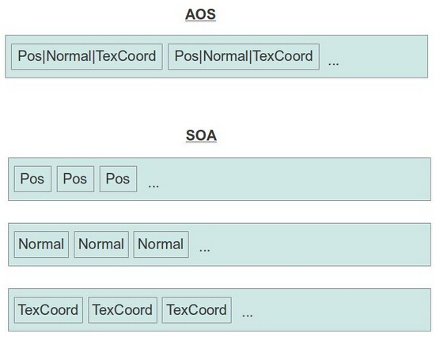

#第三十二课 顶点数组对象
##背景

顶点数组对象（ VAO ）是一种特殊类型对象，它封装了与顶点处理器有关的所有数据，它仅仅是记录顶点缓存区和索引缓冲区的引用，以及顶点的各种属性的布局而不是实际的数据。这样做的好处是一旦你为一个 mesh 设置一个 VAO ，你就可以通过简单的绑定 VAO 来导入 mesh 的所有状态。之后你就可以直接渲染 mesh 对象而不需要担心它的状态，VAO 为你记住了它。如果你的程序需要对顶点属性布局不同的 mesh 进行处理，VAO 同样可以帮忙，你只需要确保在创建 VAO 的时候为其设置了正确的布局即可，之后就完全不用管它了，因为这些信息都已经被保存在了 VAO 中。

当你正确使用时，VAo 也可以代表一种对 GPU 驱动的优化，如果 VAO 被创建了一次，并且在之后被多次使用，由于驱动程序知道了顶点缓存与索引缓存之间的映射关系以及缓存中顶点属性的布局，所以就可以对其进行一些优化。很显然，这都取决于你使用的驱动程序，而且不同的驱动其优化方式也不能保证完全一样。但是不管怎么说， 复用 VAO 总是最好的选择。  

在这一课中，我们基于上面所讲的 VAO 对 Mesh类进行更新。除此之外，我们将使用 SOA(存放数组的结构体)方法组织缓冲区中的顶点数据。现在为止我们的顶点数据都是用一个包含各种顶点属性（如位置属性等）的结构体表示的，顶点缓存中包含了一个又一个的顶点结构体，缓存中的这种数据保存方式称作 AOS（存放结构体的数组）。 SOA 是这种模式的一个简单变换，这种模式下缓存中存放的是一个包含了多个数组的结构体，每个数组中都只存放顶点的某一个属性，为了得到某一个顶点的所有属性，GPU 会使用这个顶点的索引从每个数组中读取数据，这个方式对某些 3D 模型文件来说效率会更高一些，而且对于同样的问题，了解一些不同的解决方法也是很有趣的。  

下面的图片介绍了 AOS 和 SOA:



##代码
```
class Mesh
{
public:
    Mesh();
    ~Mesh();
    bool LoadMesh(const std::string& Filename);
    void Render();
private:
    bool InitFromScene(const aiScene* pScene, const std::string& Filename);
    void InitMesh(const aiMesh* paiMesh,
                std::vector& Positions,
                std::vector& Normals,
                std::vector& TexCoords,
                std::vector& Indices);
    bool InitMaterials(const aiScene* pScene, const std::string& Filename);
    void Clear();
 #define INVALID_MATERIAL 0xFFFFFFFF
 #define INDEX_BUFFER 0 
 #define POS_VB 1
 #define NORMAL_VB 2
 #define TEXCOORD_VB 3 
    GLuint m_VAO;
    GLuint m_Buffers[4];
    struct MeshEntry {
        MeshEntry()
        {
            NumIndices = 0;
            BaseVertex = 0;
            BaseIndex = 0;
            MaterialIndex = INVALID_MATERIAL;
        }
        unsigned int BaseVertex;
        unsigned int BaseIndex;
        unsigned int NumIndices;
        unsigned int MaterialIndex;
    };
    std::vector m_Entries;
    std::vector m_Textures;
};
```

这一课中所有的变化都被封装在 Mesh 类中。原来我们只有两个缓冲区对象—— VB、IB，现在我们使用四个缓冲区——索引缓冲、位置缓冲、法线缓冲和纹理坐标缓冲。除此之外，Mesh 类里面增加了成员变量 m\_VAO 来储存顶点数组对象。因为我们的模型可能会包含多个子模型，每个子模型都会有自己的纹理，我们提供了一个 m\_Entries 向量来保存每个子模型的材质索引以及各个子模型的地址。NumIndices 是子模型中索引的数量，BaseVertex 是子模型中的顶点数据在顶点缓冲开始的地方，BaseIndex 是子模型的索引数据在索引缓冲区开始的地方（因为所有的子模型都被依次存放在同一个缓冲区中）。在渲染 mesh 的子模型之前，我们需要为其绑定相应的纹理，之后再对子模型的顶点数据调用绘制函数进行绘制，这会在后面介绍。

```
bool Mesh::LoadMesh(const string& Filename)
{
    // Release the previously loaded mesh (if it exists)
    Clear();
    // Create the VAO
    glGenVertexArrays(1, &m_VAO); 
    glBindVertexArray(m_VAO);
    // Create the buffers for the vertices atttributes
    glGenBuffers(ARRAY_SIZE_IN_ELEMENTS(m_Buffers), m_Buffers);
    bool Ret = false;
    Assimp::Importer Importer;
    const aiScene* pScene = Importer.ReadFile(Filename.c_str(), aiProcess_Triangulate |
                                aiProcess_GenSmoothNormals | aiProcess_FlipUVs);
    if (pScene) {
        Ret = InitFromScene(pScene, Filename);
    }
    else {
        printf("Error parsing '%s': '%s'\n", Filename.c_str(), Importer.GetErrorString());
    }
    // Make sure the VAO is not changed from outside code
    glBindVertexArray(0); 
    return Ret;
}
```

在加载 Mesh 数据的函数中没有多大变化。我们调用 glGenVertexArrays() 函数生成了一个 VAO 对象，然后我们调用 glBindVertexArray() 将其绑定，不论何时，都只能有一个 VAO 被绑定。从现在开始，不论我们对顶点处理器的状态进行任何改变，这都会对这个 VAO 产生影响。这四个缓冲区对象都是通过 glGenBuffers() 生成并且模型是使用 Open Asset Import Library 加载的。在这个函数的最后调用了一个非常重要的函数 —— glBindVertexArray(0)。通过将 0 绑定到 VAO 上,我们可以确保从这以后对顶点处理器所做的所有改变都不会影响到我们的 VAO( OpenGL 不会创建一个 0 值的 VAO，所有这不会影响到任何 VAO 对象)。  

```
bool Mesh::InitFromScene(const aiScene* pScene, const string& Filename)
{ 
    m_Entries.resize(pScene->mNumMeshes);
    m_Textures.resize(pScene->mNumMaterials);
    // Prepare vectors for vertex attributes and indices
    vector Positions;
    vector Normals;
    vector TexCoords;
    vector Indices;
    unsigned int NumVertices = 0;
    unsigned int NumIndices = 0;
    // Count the number of vertices and indices
    for (unsigned int i = 0 ; i < m_Entries.size() ; i++) {
        m_Entries[i].MaterialIndex = pScene->mMeshes[i]->mMaterialIndex; 
        m_Entries[i].NumIndices = pScene->mMeshes[i]->mNumFaces * 3;
        m_Entries[i].BaseVertex = NumVertices;
        m_Entries[i].BaseIndex = NumIndices;
        NumVertices += pScene->mMeshes[i]->mNumVertices;
        NumIndices += m_Entries[i].BaseIndex;
    }
    // Reserve space in the vectors for the vertex attributes and indices
    Positions.reserve(NumVertices);
    Normals.reserve(NumVertices);
    TexCoords.reserve(NumVertices);
    Indices.reserve(NumIndices);
    // Initialize the meshes in the scene one by one
    for (unsigned int i = 0 ; i < m_Entries.size() ; i++) {
        const aiMesh* paiMesh = pScene->mMeshes[i];
        InitMesh(paiMesh, Positions, Normals, TexCoords, Indices);
    }
    if (!InitMaterials(pScene, Filename)) {
        return false;
    }
    // Generate and populate the buffers with vertex attributes and the indices
    glBindBuffer(GL_ARRAY_BUFFER, m_Buffers[POS_VB]);
    glBufferData(GL_ARRAY_BUFFER, sizeof(Positions[0]) * Positions.size(), &Positions[0], 
                    GL_STATIC_DRAW);
    glEnableVertexAttribArray(0);
    glVertexAttribPointer(0, 3, GL_FLOAT, GL_FALSE, 0, 0);
    glBindBuffer(GL_ARRAY_BUFFER, m_Buffers[TEXCOORD_VB]);
    glBufferData(GL_ARRAY_BUFFER, sizeof(TexCoords[0]) * TexCoords.size(), &TexCoords[0], 
                    GL_STATIC_DRAW);
    glEnableVertexAttribArray(1);
    glVertexAttribPointer(1, 2, GL_FLOAT, GL_FALSE, 0, 0);
    glBindBuffer(GL_ARRAY_BUFFER, m_Buffers[NORMAL_VB]);
    glBufferData(GL_ARRAY_BUFFER, sizeof(Normals[0]) * Normals.size(), &Normals[0], 
                    GL_STATIC_DRAW);
    glEnableVertexAttribArray(2);
    glVertexAttribPointer(2, 3, GL_FLOAT, GL_FALSE, 0, 0);
    glBindBuffer(GL_ELEMENT_ARRAY_BUFFER, m_Buffers[INDEX_BUFFER]);
    glBufferData(GL_ELEMENT_ARRAY_BUFFER, sizeof(Indices[0]) * Indices.size(), &Indices[0], 
                    GL_STATIC_DRAW);
    return true;
}
```

这个函数是模型导入的具体操作。Open Asset Import Library (Assimp)加载了一个模型数据到 aiScene 结构体中，我们可以得到一个只想它的指针。现在我们需要做的就是将这些数据导入到 OpenGL 的缓存中，并将他们关联到 VAO 上。我们使用 STL 向量来完成这个工作，对于每一个 OpenGL 缓冲区，我们都用一个向量来存放其中的数据。我们先计算在 aiScene 结构体中的顶点和索引的数量，而且对于每一个 aiMesh 结构体我们都会将其材质索引、索引数量、base vertex 和 base index 保存在 m_Entries 数组中。并根据这些为向量分配空间，之后我们遍历 aiScene 中每个 aiMesh 结构体来进行初始化这些向量，这些向量都通过引用传递到 InitMesh() 函数中，材质的初始化和之前一样。  

这个函数的最后一部分才是真正有趣的地方，位置缓存、法线向量缓存、纹理坐标缓存都被一个接一个的绑定到 GL\_ARRAY\_BUFFER 目标上，对这个目标的所有操作都会影响到当前被绑定的缓存，而且就算之后其他缓存绑定到了这个目标上，之前对那个缓存的改变依然会有效。对于这三个缓存，我们都进行了如下工作：  

1. 使用 glBufferData() 将数据填充到缓存中；
2. 使用 glEnableVertexAttribArray() 来启用对应的顶点属性；
3. 使用 glVertexAttribPointer() 来配置顶点属性（分量的数量，分量的类型等）。

索引缓存是通过将其绑定到 GL\_ELEMENT\_ARRAY\_BUFFER 目标上来进行初始化的，我们只需要使用索引数据填充它即可。现在所有的缓存都已经初始化了，而且他们都被封装在了 VAO 中。

```
void Mesh::InitMesh(const aiMesh* paiMesh,
                     vector& Positions,
                     vector& Normals,
                     vector& TexCoords,
                     vector& Indices)
{
    const aiVector3D Zero3D(0.0f, 0.0f, 0.0f);
    // Populate the vertex attribute vectors
    for (unsigned int i = 0 ; i < paiMesh->mNumVertices ; i++) {
        const aiVector3D* pPos = &(paiMesh->mVertices[i]);
        const aiVector3D* pNormal = &(paiMesh->mNormals[i]);
        const aiVector3D* pTexCoord = paiMesh->HasTextureCoords(0) ?
                                      &(paiMesh->mTextureCoords[0][i]) : &Zero3D;
        Positions.push_back(Vector3f(pPos->x, pPos->y, pPos->z));
        Normals.push_back(Vector3f(pNormal->x, pNormal->y, pNormal->z));
        TexCoords.push_back(Vector2f(pTexCoord->x, pTexCoord->y));
    }
    // Populate the index buffer
    for (unsigned int i = 0 ; i < paiMesh->mNumFaces ; i++) {
        const aiFace& Face = paiMesh->mFaces[i];
        assert(Face.mNumIndices == 3);
        Indices.push_back(Face.mIndices[0]);
        Indices.push_back(Face.mIndices[1]);
        Indices.push_back(Face.mIndices[2]);
    }
}
```

这个函数是来加载包含在 aiScene 里面的每个 aiMesh 结构体。要注意向量的引用传入以及 push_back()  函数的使用。

```
void Mesh::Render()
{
    glBindVertexArray(m_VAO);
    for (unsigned int i = 0 ; i < m_Entries.size() ; i++) {
        const unsigned int MaterialIndex = m_Entries[i].MaterialIndex;
        assert(MaterialIndex < m_Textures.size());
        if (m_Textures[MaterialIndex]) {
            m_Textures[MaterialIndex]->Bind(GL_TEXTURE0);
        }
        glDrawElementsBaseVertex(GL_TRIANGLES, 
                                  m_Entries[i].NumIndices, 
                                  GL_UNSIGNED_INT, 
                                  (void*)(sizeof(unsigned int) * m_Entries[i].BaseIndex), 
                                  m_Entries[i].BaseVertex);
    }
    // Make sure the VAO is not changed from the outside 
    glBindVertexArray(0);
}
```

最后，我们要介绍下渲染函数。首先我们绑定我们的 VAO 对象，而且对于顶点处理器来说，这就是我们需要做的全部工作。无论以前状态是什么，现在都将被我们初始化 VAO 时所设置的状态替换。现在我们需要做的就是绘制每个子模型，并在绘制之前绑定好合适的纹理。为了达到目的我们使用了 m_Entries 数组中的信息和一个新的绘制函数 —— glDrawElementsBaseVertex()。这个函数的参数包括拓扑结构、索引数量和索引的类型。第四个参数用于说明从索引缓存中的什么地方开始绘制。问题是 Assimp 为每个 aiMes 提供的索引都是从 0 开始存放的，而且我们之前将他们都累加到了同一个缓冲区中。因此，我们需要告诉绘制函数当前子模型的索引起始位置在整个索引缓存中的偏移量。我们通过将当前入口结构体中的 base index 变量乘上每个索引所占字节数来得出这个偏移量，由于其他的顶点属性也都被保存到了同一个缓存中，所以我们需要对他们也进行同样的设置（第五个参数）—— base vertex。需要注意的是这里我们设置的是一个索引而不是字节偏移量，这是因为不同的顶点缓存中可能会存放不同的属性（所以其所占字节也不一样）。OpenGL 需要用这个变量乘上每个缓存中所存放的顶点属性所占字节数来计算出这个缓存的偏移量，我们不需要去关心这些。

```
glDeleteVertexArrays(1, &m_VAO);
```

上面的函数是删除 VAO，但它并不是删除绑定在这上面的缓冲区（它们可能同时被绑定到多个 VAO 上）。
