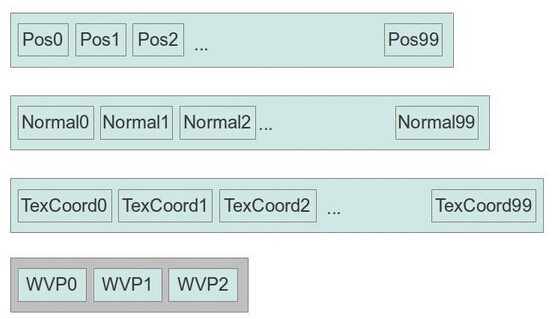

#第三十三课 实例渲染  

##背景  

想象一下如果你想渲染一大片军队在马路上行进的场景，那么你需要渲染上千个士兵，但是如果你只有一个士兵的模型，你要怎么做呢？当然你可以每绘制一个士兵就调用以此绘制函数，并且在每次调用的时候都为它的相关一致变量设置不同的参数，例如士兵的位置，或者是士兵的身高，等等。 因此，每次我们调用绘制函数的时候，我们都需要更新当前绘制的这个士兵的 WVP 矩阵，以及这个士兵的其他一些特殊的参数，但是这个方法的开销是很大的，这里我们有一个更好的办法。  

这个方法就是实例渲染，一个实例就是你想渲染的那个模型的一个渲染结果（我们这里就是一个士兵）。实例渲染意味着我们可以在一个绘制函数的调用中绘制多个实例，并且每个实例都可以有其特有的属性，接下来我们将介绍两个实现实例渲染的方法。  

在第一个方法中，每个实例的特有属性（如 WVP 矩阵）都被存放在单独的顶点缓存中，顶点处理器在处理顶点缓存中的数据时每次都会处理下一个数据，但是在处理存放实例数据的顶点缓存时，它会等所有常规顶点数据处理完之后才会跳转到下一个数据，存放实例数据的顶点缓存是针对所有顶点的，思考下面的例子：  



这里我们有一个包含 100 个顶点的模型，每个顶点都有位置、法线和纹理坐标属性，每一项数据都被单独存放在一个顶点缓存中。除此之外我们设置了第四个缓冲区用于存放 WVP 矩阵信息。我们的计划是先用第一个 WVP 矩阵来绘制这个模型，之后再用第二个 WVP 矩阵来绘制第二个模型，之后再使用第三个矩阵，如此反复。我们会在同一个绘制函数的调用中实现这三个模型的绘制而不是调用绘制函数三次。这个 WVP 参数会被作为一个输入变量传递到顶点着色器中，但是因为我们的第四个顶点缓存是被标记为存放实例数据，所以直到所有的顶点绘制完，这个矩阵参数都不会改变。  

第二个方法是使用一个着色器内置变量 gl\_InstanceID，通过它我们可以得到当前的实例的索引，我们可以通过这个索引来定位与一致变量数组中与此实例相关的数据。

##代码
```
(mesh.h:50)
class Mesh
{
    public:
...
        void Render(unsigned int NumInstances, const Matrix4f* WVPMats, const Matrix4f* WorldMats); 
...
    private:
...
 #define INDEX_BUFFER 0 
 #define POS_VB 1
 #define NORMAL_VB 2
 #define TEXCOORD_VB 3 
 #define WVP_MAT_VB 4
 #define WORLD_MAT_VB 5
        GLuint m_VAO;
        GLuint m_Buffers[6];
...
```

这是 Mesh 类中的变化，Render() 函数现在需要三个参数，一个 WVP 矩阵数组和一个 World 矩阵数组，NumInstances 代表每个数组中存放的矩阵的个数，同样的 我们增加了两个顶点缓冲区用于存放他们。  

```
(mesh.cpp:91)
bool Mesh::InitFromScene(const aiScene* pScene, const string& Filename)
{ 
    ...
    // Generate and populate the buffers with vertex attributes and the indices
    glBindBuffer(GL_ARRAY_BUFFER, m_Buffers[POS_VB]);
    glBufferData(GL_ARRAY_BUFFER, sizeof(Positions[0]) * Positions.size(), &Positions[0],
                GL_STATIC_DRAW);
    glEnableVertexAttribArray(POSITION_LOCATION);
    glVertexAttribPointer(POSITION_LOCATION, 3, GL_FLOAT, GL_FALSE, 0, 0); 
    glBindBuffer(GL_ARRAY_BUFFER, m_Buffers[TEXCOORD_VB]);
    glBufferData(GL_ARRAY_BUFFER, sizeof(TexCoords[0]) * TexCoords.size(), &TexCoords[0],
                GL_STATIC_DRAW);
    glEnableVertexAttribArray(TEX_COORD_LOCATION);
    glVertexAttribPointer(TEX_COORD_LOCATION, 2, GL_FLOAT, GL_FALSE, 0, 0);
    glBindBuffer(GL_ARRAY_BUFFER, m_Buffers[NORMAL_VB]);
    glBufferData(GL_ARRAY_BUFFER, sizeof(Normals[0]) * Normals.size(), &Normals[0],
                GL_STATIC_DRAW);
    glEnableVertexAttribArray(NORMAL_LOCATION);
    glVertexAttribPointer(NORMAL_LOCATION, 3, GL_FLOAT, GL_FALSE, 0, 0);
    glBindBuffer(GL_ELEMENT_ARRAY_BUFFER, m_Buffers[INDEX_BUFFER]);
    glBufferData(GL_ELEMENT_ARRAY_BUFFER, sizeof(Indices[0]) * Indices.size(), &Indices[0], 
                GL_STATIC_DRAW);
    glBindBuffer(GL_ARRAY_BUFFER, m_Buffers[WVP_MAT_VB]);
    for (unsigned int i = 0; i < 4 ; i++) {
        glEnableVertexAttribArray(WVP_LOCATION + i);
        glVertexAttribPointer(WVP_LOCATION + i, 4, GL_FLOAT, GL_FALSE, sizeof(Matrix4f), 
                                (const GLvoid*)(sizeof(GLfloat) * i * 4));
        glVertexAttribDivisor(WVP_LOCATION + i, 1);
    }
    glBindBuffer(GL_ARRAY_BUFFER, m_Buffers[WORLD_MAT_VB]);
    for (unsigned int i = 0; i < 4 ; i++) {
        glEnableVertexAttribArray(WORLD_LOCATION + i);
        glVertexAttribPointer(WORLD_LOCATION + i, 4, GL_FLOAT, GL_FALSE, sizeof(Matrix4f), 
                                (const GLvoid*)(sizeof(GLfloat) * i * 4));
        glVertexAttribDivisor(WORLD_LOCATION + i, 1);
    }
    return GLCheckError();
}
```

上面的代码创建了需要用到的顶点缓存，并使用模型的顶点数据对其进行了初始化。后面的两个 for 循环中展示了如何将实例数据添加到顶点缓存中。首先我们像之前一样绑定存放 WVP 矩阵的缓存，由于 WVP 矩阵是一个 4 x 4 的矩阵，而且我们希望它作为 VS 的输入变量，所以我们不能将其作为一个单独的顶点属性，因为每个顶点属性最多只能包含 4 个浮点或者整型数据。因此我们在一个循环中为其配置了 4 个连续的顶点属性，每一个属性会包含矩阵中的一个向量。之后我们来配置这些属性，每一个属性都是由 4 个浮点型数据组成，而且两个属性之间的距离正好是一个 4 x 4 矩阵的大小。除此之外我们不希望 OpenGL 对这些数据进行初始化，这些就是 glVertexAttribPointer() 函数中第二到第五个参数的作用，最后一个参数就仅仅是实例数据的偏移量，第一个向量的偏移量是 0， 第二个是 16，以此类推。

glVertexAttribDivisor() 函数表面这个属性是实例数据而不是普通的顶点数据，它需要两个参数 —— 第一个参数是属性位置，第二个参数是告诉 OpenGL 在进行实例渲染时实例数据更新的速率，它的基本意义就是在更新实例数据之前会完成多少次顶点数据的渲染。默认情况下 divisor 的值为 0，这种情况下每渲染一个顶点就会对实例数据进行一次更新，如果将这个值设置为 10，这表示前 10 个实例会使用这个缓存中的第一个数据，之后的实例会使用第二个数据，以此类推。因为我们希望的是每个对每个实例使用一个 WVP 矩阵，所有我们将这个值设置为 1。  

我们对组成矩阵的四个属性重复上面的步骤，之后我们对世界矩阵也做同样的工作，需要注意的是与其他顶点属性如位置属性和法线属性不同的是，我们这里并没有向缓存中加载任何数据，这是因为 WVP 矩阵和世界矩阵都是动态的，在每一帧中都会进行更新，所以我们这里只是对他们进行了一些设置，至于初始化就留到后面再进行。  

```
(mesh.cpp:253)
void Mesh::Render(unsigned int NumInstances, const Matrix4f* WVPMats, const Matrix4f* WorldMats)
{ 
    glBindBuffer(GL_ARRAY_BUFFER, m_Buffers[WVP_MAT_VB]);
    glBufferData(GL_ARRAY_BUFFER, sizeof(Matrix4f) * NumInstances, WVPMats, GL_DYNAMIC_DRAW);
    glBindBuffer(GL_ARRAY_BUFFER, m_Buffers[WORLD_MAT_VB]);
    glBufferData(GL_ARRAY_BUFFER, sizeof(Matrix4f) * NumInstances, WorldMats, GL_DYNAMIC_DRAW);
    glBindVertexArray(m_VAO);
    for (unsigned int i = 0 ; i < m_Entries.size() ; i++) {
        const unsigned int MaterialIndex = m_Entries[i].MaterialIndex;
        assert(MaterialIndex < m_Textures.size());
        if (m_Textures[MaterialIndex]) {
            m_Textures[MaterialIndex]->Bind(GL_TEXTURE0);
        }
        glDrawElementsInstancedBaseVertex(GL_TRIANGLES, 
                                         m_Entries[i].NumIndices, 
                                         GL_UNSIGNED_INT, 
                                         (void*)(sizeof(unsigned int) * m_Entries[i].BaseIndex), 
                                         NumInstances,
                                         m_Entries[i].BaseVertex);
    }
    // Make sure the VAO is not changed from the outside 
    glBindVertexArray(0);
}
```

这是更新之后的 Mesh 类中的 Render（）函数，现在它需要两个矩阵数组—— WVP 矩阵和世界变换矩阵（两个数组中的元素都是 NumInstances）作为参数，在我们绑定 VAO 之前（如果对 VAO 不熟悉可以参看前面的课程）我们将这些矩阵数据导入到他们相应的顶点缓存中。在这里我们调用 glDrawElementsInstancedBaseVertex（）函数而不是 glDrawElementsBaseVertex（）函数来进行绘制，他们的唯一区别就是这个函数用第五个参数来确定需要绘制的实例个数，这意味着组成模型的索引数据（根据其他参数确定）会被重复复制 NumInstances 次。 对于每个顶点， OpenGL 会从那些 divisor 设置为 0 的顶点缓存中获取新的数据。而对于 divisor 设置为 1 的缓存，只有当一个完整的实例绘制完之后才会从它里面获取新的数据，这个绘制命令的大致算法可以看做如下：  

for (i = 0 ; i < NumInstances ; i++)  
if (i mod divisor == 0)  
fetch attribute i/divisor from VBs with instance data  
for (j = 0 ; j < NumVertices ; j++)  
fetch attribute j from VBs with vertex data

```
(lightning_technique.cpp:25)
 #version 330
layout (location = 0) in vec3 Position; 
layout (location = 1) in vec2 TexCoord; 
layout (location = 2) in vec3 Normal; 
layout (location = 3) in mat4 WVP; 
layout (location = 7) in mat4 World; 
out vec2 TexCoord0; 
out vec3 Normal0; 
out vec3 WorldPos0; 
flat out int InstanceID; 
void main() 
{ 
    gl_Position = WVP * vec4(Position, 1.0); 
    TexCoord0 = TexCoord; 
    Normal0 = World * vec4(Normal, 0.0)).xyz; 
    WorldPos0 = World * vec4(Position, 1.0)).xyz; 
    InstanceID = gl_InstanceID; 
};
```

这是更新之后的 VS，与之前我们通过一致变量获得 WVP 矩阵和世界矩阵不同的是，现在它们通过和顶点属性一样的方式传入到顶点着色器中， VS 不会关心这些数据到底是会在每个顶点之间更新还是在每个实例之间更新，正如上面讨论的那样，WVP 矩阵占用 3-6 的位置，而世界矩阵占用 7-10 的位置。  

VS 中的最后一行代码是进行实例渲染的第二个方法（第一个方法是将实例数据按顶点属性的方式传入）。'gl\_InstanceID' 是一个内置变量，它能在 VS 中使用，但是因为我们打算在 FS 中使用它，所以这里我们借助一个输出变量将其传入到 FS 中。gl\_InstanceID 是一个整型，所以我们也使用一个整型的输出变量，由于整型数据不能再光栅化阶段进行插值，所以我们需要将这个输出变量标记为 'flat'（如果不这么做会产生编译错误）

```
flat in int InstanceID;
...
uniform vec4 gColor[4];
...
void main() 
{ 
    vec3 Normal = normalize(Normal0); 
    vec4 TotalLight = CalcDirectionalLight(Normal); 
    for (int i = 0 ; i < gNumPointLights ; i++) { 
        TotalLight += CalcPointLight(gPointLights[i], Normal); 
    } 
    for (int i = 0 ; i < gNumSpotLights ; i++) { 
        TotalLight += CalcSpotLight(gSpotLights[i], Normal); 
    } 
    FragColor = texture(gColorMap, TexCoord0.xy) * TotalLight * gColor[InstanceID % 4];
};
```

为了展示 gl/_InstanceID 的使用我们在 FS 中添加了一个一致数组变量，这个数组中包含 4 个浮点类型的向量，FS 从 VS 中得到当前的实例 ID 并且使用取余操作从这个数组中获取颜色值，最后经过光照计算得到的颜色值会和这个数组中的某一个颜色值相乘，通过在数组中存放不同的颜色值，我们可以为每个实例添加一些不同的颜色效果。  


```
(tutorial33.cpp:141)
Pipeline p;
p.SetCamera(m_pGameCamera->GetPos(), m_pGameCamera->GetTarget(), m_pGameCamera->GetUp());
p.SetPerspectiveProj(m_persProjInfo); 
p.Rotate(0.0f, 90.0f, 0.0f);
p.Scale(0.005f, 0.005f, 0.005f); 
Matrix4f WVPMatrics[NUM_INSTANCES];
Matrix4f WorldMatrices[NUM_INSTANCES];
for (unsigned int i = 0 ; i < NUM_INSTANCES ; i++) {
    Vector3f Pos(m_positions[i]);
    Pos.y += sinf(m_scale) * m_velocity[i];
    p.WorldPos(Pos); 
    WVPMatrics[i] = p.GetWVPTrans().Transpose();
    WorldMatrices[i] = p.GetWorldTrans().Transpose();
}
m_pMesh->Render(NUM_INSTANCES, WVPMatrics, WorldMatrices);
```

上面的代码是从主渲染循环中截取出来的，这部分代码的主要功能就是调用更新后的 Mesh::Render() 函数来进行渲染，我们创建了一个 Pipeline 对象并且为其设置了一些通用属性，实例之间唯一不同的就是他们在世界坐标系中的位置，所以我们将这一部分放到一个循环中来处理。这里我们声明了两个数组分别用于存放 WVP 矩阵和世界矩阵，现在我们遍历所有的实例并且从 m/_positions 数组中获取他们的起始位置坐标（这些坐标都在开始的使用使用随机值来进行初始化），之后我们计算当前的位置并且将他们设置到 Pipeline 对象中，现在我们就能从 Pipeline 对象中获得 WVP 矩阵和世界矩阵并将他们存放在数组中的对应位置中。但是在做这些工作之前我们需要做一转置处理，这个处理对于新手来说可能非常头疼。  

这是因为我们的 Matrix 类在保存矩阵的 16 个浮点数时是简单的线性存放在内存中的，我们从标准矩阵的第一行开始从左向右进行处理，当我们处理到这一行的最后一个元素时就跳转到下一行。所以我们在遍历矩阵的时候是一行一行的进行遍历的，你也可以这样说我们有 4 个行向量组成了这个矩阵，每一个行向量都作为一个单独的顶点属性传递到着色器中（例如 WVP 矩阵最上面的那个行向量作为属性 3，第二个行向量作为作为属性 4，第三个行向量作为属性 5，而最底下的那个行向量作为属性 6，这都是根据我们对 VS 的设置确定的）。在着色器层面来说我们声明了一个 'mat4'类型的 WVP 矩阵和世界矩阵，这些 mat4 类型的变量的初始化是通过顶点属性的方式完成的，每一个顶点属性作为矩阵的一列。例如，在我们的 WVP 矩阵中，OpenGL 会隐式的调用构造函数，如下：

mat4 WVP(attribute 3, attribute 4, attribute 5, attribute 6)  

属性 3 作为矩阵从左往右的第一列，属性 4 作为第二列等等。这实际上就是对我们的矩阵进行了转置，因为从缓存中传入的每一行数据都作为了矩阵中的一列。为了解决这个问题我们在将这些矩阵存放到数组之前就对其进行了转置（正如之前代码那样）。  

**注意：**  

如果你运行这一课里面的 Demo 你会发现 FPS（帧速）会显示在窗口的左下角，OpenGL 并没有针对字体渲染的标准库，每个人都会使用不同的方式来实现字体的渲染，最近我发现了 Nicolas Rougier 写的 freetype-gl，这个库时免费的而且使用 BSD 许可。我对它的源码进行了一些修改使他的使用更加简单，我已经将它包含到了 Demo 中所有你不需要再安装任何东西，如果你对这个库比较感兴趣，可以跟随 tutorial33.cpp 文件中的 'FontRenderer' 函数看下去。

##操作结果


