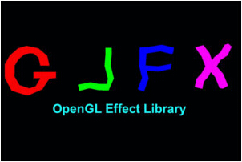

#第三十四课  GLFX —— 一个 OpenGL 效果库

**注意：**从 2014 年三月开始我就不再使用 GLFX了，但是为了那些对这个库感兴趣的人，我还是将这课保留了下来。

##背景  

这一课将要介绍的内容和之前的课程不同，在这一课中我们将简单介绍一下 GLFX 而不是 OpenGL 的特性或者 3D 技术。一个“特效”可以看做是一个包含多个着色器程序和函数的文本文件，并使得其能够更加方便的与我们的程序结合。这种方式克服了 glShaderSource() 函数的局限，我们不需要再为每一个着色器阶段分别定义文本文件（这使得我们要为不同的着色器程序使用不同的文本文件）。将所有的着色器程序放在同一个文件中使得着色器之间定义的结构体的共享变得更加简单。此外， GLFX 还提供了一个一个十分易用的 API 用于将特效文件转换为 GLSL 程序，这样做隐藏掉了 OpenGL 中一些复杂的底层函数的调用。  

特效文件的做法并不是十分有新意，事实上这个东西在微软的 DirectX 里面都已经存在了好几年了，我敢肯定很多游戏工作室都开发了自己的工具但遗憾的是在 OpenGL 中，这还没有成为标准。这一课中我们要用到的这个特效库时 Max Aizenshtein 编写的一个开源项目，你可以在[这里](http://code.google.com/p/glfx/)找到这个项目的主页。  

要安装 GLFX，你只需要下载它的源码然后在命令行中运行下面的命令来编译它：

- svn checkout http://glfx.googlecode.com/svn/trunk/ libglfx 
- cd libglfx 
- cmake . 
- make 
- make install (as root)   


**注意：**  GLFX 是依赖 GLEW 的，如果你是使用的这个教程中的框架或者你本来就在你的程序中使用了 GLEW 的话那就没问题，如果不是你可以参考第二课的内容来了解 GLEW 的使用。  

##代码  

**将 GLFX 整合到项目中**  
添加下面这个头文件来调用 GLFX 的 API：  

```
 #include <glfx.h> 
```

生成一个特效句柄:  

```
int effect = glfxGenEffect(); 
```

解析特效文件（接下来我们马上会介绍其内容）:  

```
if (!glfxParseEffectFromFile(effect, "effect.glsl")) {
 #ifdef __cplusplus // C++ error handling
    std::string log = glfxGetEffectLog(effect);
    std::cout << "Error parsing effect: " << log << std::endl;
 #else // C error handling
    char log[10000];
    glfxGetEffectLog(effect, log, sizeof(log));
    printf("Error parsing effect: %s:\n", log);
 #endif
    return;
} 
```

编译在特效文件中定义的程序程序（结合 VS 、FS 等）：

```
int shaderProg = glfxCompileProgram(effect, "ProgramName");
if (shaderProg < 0) {
    // same error handling as above 
} 
```

现在这个程序就能够像平常一样被 OpenGL 使用了:  

```
glUseProgram(shaderProg); 
```

在不需要这个特效之后，使用下面的函数释放其资源：  

```
glfxDeleteEffect(effect); 
```

**使用 GLFX**  

我们的基础已经搭建好了，现在我们好好看看这个特效文件，使用 GLFX 的一个好处就是你可以像你之前习惯的那样写 GLSL 着色器程序，这里我们主要看看它里面的一些小变化。

创建一个 ‘program’ 对象将不同的着色器阶段组合成一个完整的 GLSL 程序。  

```
program Lighting
{
    vs(410)=VSmain();
    fs(410)=FSmain();
}; 
```

在上面这个例子中，这个特效文件中定义了 VSmain() 函数和 FSmain() 函数，program 关键字定义了一个名叫 'Lighting' 的 OpenGL 程序对象，通过调用 glfxCompileProgram(effect, "Lighting") 可以对 VSmain() 和 FSmain() 进行编译并链接到一个程序中。所有的着色器程序都会用 GLSL 4.0 进行编译（就如在标准 GLSL 中声明的 '#version 410' 那样）。  

**使用 ‘shader’ 而不是 ‘void’ 去声明着色器程序的主函数**  

每个着色器阶段的 main 函数都必须声明为 ‘shader’ 而不是 ‘void’，下面是一个例子：  

```
void calculate_something()
{
    ...
}
shader VSmain()
{
    calculate_something();
} 
```

**在单个特效文件中包含多个着色器和程序对象**  

你可以在单个特效文件中声明多个 ‘program’ 对象，如果你想使用某些程序，你就对那些调用 glfxCompileProgram() 即可。  

**在不同的着色器阶段之间使用结构体传递顶点属性**  

为了在多个着色器阶段之间共享数据，现在我们只需要使用 GLSL 结构体即可而不是像之前那样要在着色器的全局变量里定义 in/out 变量，下面是一个例子：  

```
struct VSoutput
{
    vec2 TexCoord; 
    vec3 Normal; 
};
shader VSmain(in vec3 Pos, in vec2 TexCoord, in vec3 Normal, out VSOutput VSout)
{ 
    // do some transformations and update 'VSout'
    VSout.TexCoord = TexCoord;
    VSout.Normal = Normal;
}
shader FSmain(in VSOutput FSin, out vec4 FragColor)
{
    // 'FSin' matches 'VSout' from the VS. Use it 
    // to do lighting calculations and write the final output to 'FragColor'
} 
```

不幸的是，结构体只适用于在不同着色器阶段之间传递， VS 的输入数据只能按照上面的例子中的方法将每个属性单独输入，虽然有的显卡也支持用结构体的方式向 VS 中传入数据，但是如果不行的话，使用上面的方式就行了。  

**在特效文件之间使用包含文件来共享一些函数**  

‘include’关键字可用于包含其他的特效文件：  

```
 #include "another_effect.glsl" 
```  

在包含文件时需要注意的是这里并不会解析 GLFX 文件，它们只是简单的将包含的文件的内容插入到使用 ‘include’ 的地方，这意味着你只能在这个被包含的文件中写一些纯 GLSL 代码，而不能是 GLFX 特有的关键字比如 program。Tip：由于有一部分 GLSL 语法与 C/C++ 一样（如 #define），你甚至可以在特效文件和应用程序之间共享定义。  

**使用 structure 后缀定义属性位置**  

在之前的课程中我们都是使用 'layout(location = ...)' 关键字来定义 VS 的输入属性的位置，通过在 VS 的输入参数后面添加冒号，并跟上一个数字我们也能实现同样的效果，下面是示例：  

```
struct VSInput2 
{
    vec3 Normal; 
    vec3 Tangent; 
};
shader VSmain(in vec3 Pos : 5, in vec2 TexCoord : 6, in float colorScale : 10)
```

在上面的例子中输入到 VS 中的位置属性位置为 5，纹理坐标位于 6，colorScale 位于 10。实际上就是冒号后面的数字定义了位置，如果后面没有后缀，则属性从 0 开始。  

**在 'interface' 而不是 'struct' 中定义成员的修饰符**  

GLSL 提供了一些如 'flat' 和 'noperspective' 的修饰符，这些修饰符可用在从 VS 传递到 FS 的属性变量的前面。这些修饰符不能用在结构体成员变量的前面， GLFX 提供的一个解决方法是使用一个新的关键字 'interface' 来完成 'struct' 做不到的事。用 'interface' 定义的变量只能在不同着色器阶段之间执行，如果你需要将它全部传递到另一个函数中，那你需要先将其内容拷贝到结构体中，例如：  

```
interface foo
{
    flat int a;
    noperspective float b;
};
struct bar
{
    int a;
    float b;
}
shader VSmain(out foo f)
{
    // ...
}
void Calc(bar c)
{
    // ...
}
shader FSmain(in foo f)
{
    struct bar c;
    c.a = f.a;
    c.b = f.b;
    Calc(c);
}
```

**注意：** 'interface' 关键字是为了将来的使用而保留的一个关键字（根据 OpenGL 4.2）。它以后在 GLFX 中的使用会根据 OpenGL 官方的标准进行修改。  

**Tip：使用 'glfxc' 来验证特效文件**  

'glfxc' 是一个 GLFX 中的一个工具，它能解析特效文件，并使用本地 OpenGL 进行编译并报告发现的错误。可以通过如下方式运行它：  

```
glfxc <effect file name> <program name> 
```

--------------------------------------------------------------------------------

**关于这个 Demo**  

这一课的源码已经为使用 GLFX 做出了相应的修改，由于这些修改十分简单这里也不再介绍它们了，在看源码的时候，特别注意 Technique 类和 LightingTechnique 类。此外之前作为 lighting_technique.cpp 中一部分的着色器程序已经被删除了，'shaders' 目录下现在只有一个 'lighting.glsl' 文件，这个文件中包含了同样的着色器程序，只是说为了适应上面介绍的一些规则做出了一些小的改动。

##操作结果

