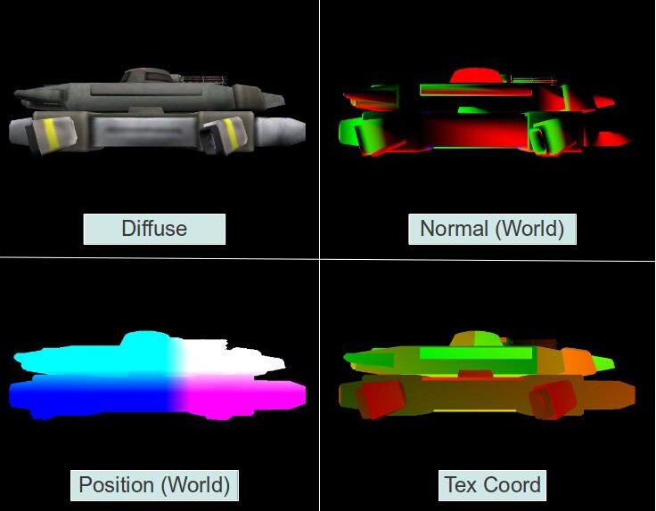

# 第三十五课 延迟渲染（一）

##背景

从第十七课起到目前为止，我们所做的光照计算都叫做前向渲染（着色），这是一个十分直接的方式，我们在 VS 中对所有对象的顶点进行一系列的变换（这些变换通常是将顶点法线和顶点位置变换到裁剪空间中），之后在 FS 中逐像素进行光照计算。由于每个像素都只调用 FS 一次，所以当我们逐像素的计算每个像素的光照效果时，我们需要将所有的光照信息都传递到 FS 中。这个方法十分简单但是却有一些缺陷，如果场景十分复杂（就如大部分的现代的游戏中）包含了大量的对象，而且还有很大的深度复杂度（屏幕上的同一个像素被多个物体覆盖），我们会浪费很多的 GPU 资源。例如，如果深度复杂度为 4，这表示无对 3 个无用的像素进行了光照计算，因为最终只有最上面的那个像素才会被显示到屏幕上。当然我们可以尝试将场景中的对象从前向后排列，但是对于很多复杂的对象来说这个方法也不是很好。  

前向渲染的另一个问题就是当场景中有很多光源的时候，这种情况下很多光源都趋向于小型化而且光照区域也十分有限，但是我们的 FS 在计算的时候还是会把所有的光源都考虑进去，即便是光源离这个像素很远。当然你可以试着计算光源到像素的距离，但是这仅仅是向 FS 中增加了更多的分支和开销。前向渲染对大量光源的支持不是很好，可以简单的想象一下当场景中有几百个光源的时候， FS 需要做的运算量得有多大。  

延迟渲染是现在[很多游戏](http://en.wikipedia.org/wiki/Deferred_shading#Deferred_shading_in_commercial_games)中比较流行的一个技术，他的出现就是为了解决上述的问题。延迟渲染的关键点就在于几何计算（位置和法线变换）和光照计算的削减。与之前我们总是将所有对象从顶点缓存渲染到最后的帧缓存中不同的是，我们将这个过程拆分成了两个主要过程。在第一个过程中我们同样运行 VS 进行相似的处理，将这些处理之后的属性传入到 FS 之后我们并不是直接进行光照计算，而是将他们都写入到 G buffer 中。G buffer 只是一个逻辑集合，它实际上是由多个 2D 纹理组成的，每一个顶点属性都对应这样一个 2D 纹理。我们使用 OpenGL 中的 Multiple Render Targets (MRT) 能力将不同的顶点属性一次性输出到不同的纹理中。由于我们是将 FS 中的数据写出到 G buffer 中，所以最后写入到这个缓存中的数据都是插值之后的数据。这个阶段叫做几何阶段，所有的对象都会在这个阶段中处理，由于有深度测试，所以最终写入到 G buffer 中各个纹理的数据都是对顶点插值之后得到的离相机最近的片元的属性，这意味着所有在不相干（不会出现在最后屏幕上）的像素都在深度测试中被丢弃，最后留在 G buffer 中的片元都是必须要进行光照计算的。下面是一个 G buffer 在某一帧的画面：  



在第二个阶段（即光照阶段）我们会遍历 G buffer 中的每一个像素，对不同的纹理进行采样以获得像素属性，并使用与之前相似的方法来对每个像素进行光照计算。由于当我们向 G buffer 写数据的时候，所有不是离相机最近的片元都已经被丢弃了，所有我们只需要对纹理中的每一个像素进行一次光照计算即可。  

我们如何对 G buffer 中的像素进行遍历呢？最简单的方法就是在屏幕上渲染一个四边形。但是这里有一个更好的办法，我们之前说过由于每个光源都比较弱，所以其光照区域也是有限的，我们不希望对那些无关的像素进行光照计算，当一个光源对某个像素的影响足够小的时候，最好就直接将这个光源忽略。在前向渲染的时候我们没有很有效的办法来完成这个工作，但是在延迟渲染中我们可以在每个光源周围计算一个合适大小的包围球（对于点光源来说是一个包围球，对于聚光灯光源来说就是一个圆锥体）。这个球体就代表了光源能够影响到的范围，这个球体之外的像素都会忽略这个光源。我们可以使用一个几何面很少的粗糙球体模型，并在渲染时将其中心点放置在光源处即可。顶点着色器只会将它的顶点变换到裁剪空间中，片元着色器中则会进行光照计算并且只会对这些与光源有关的像素运行。  

下面我们总结下延迟渲染的三个步骤（即这三个课程）：  


1. 在这一课中我们会使用 MRT 将数据输入到 G buffer 中。我们会把 G buffer 中的内容输出到屏幕上来确保我们的数据是正确的。
2. 在下一课中我们会添加光照阶段，并且使用延迟渲染的习惯来进行光照计算。
3. 最后我们会学习使用模板缓存来防止光源物体的意外关闭（在第二部分的末尾提出的一个问题）。

## 代码

```
(gbuffer.h:28)
class GBuffer
{
public:
    enum GBUFFER_TEXTURE_TYPE {
        GBUFFER_TEXTURE_TYPE_POSITION,
        GBUFFER_TEXTURE_TYPE_DIFFUSE,
        GBUFFER_TEXTURE_TYPE_NORMAL,
        GBUFFER_TEXTURE_TYPE_TEXCOORD,
        GBUFFER_NUM_TEXTURES
    };
    GBuffer();
    ~GBuffer();
    bool Init(unsigned int WindowWidth, unsigned int WindowHeight);
    void BindForWriting();
    void BindForReading();
private:
    GLuint m_fbo;
    GLuint m_textures[GBUFFER_NUM_TEXTURES];
    GLuint m_depthTexture;
};
```
GBuffer 类中包含了在延迟渲染中 G buffer 所需要的所有纹理，对于每一个顶点属性我们都为其创建了一个纹理对象，此外还有一个纹理用于作为深度缓存使用。由于我们想在 FBO 中管理所有纹理，当我们向 FBO 中写入数据时，默认的帧缓存中的深度缓存也同样不能被写入，所以这里我们需要自己设置深度纹理所谓深度缓存。在 23 课中我们已经介绍了 FBO 的相关操作，这里我们跳过这部分。

GBuffer 类中同样提供了两个函数 —— BindForWriting() 在几何阶段通过调用它将 FBO 中的纹理绑定为渲染目标，BindForReading() 通过调用这个函数将 FBO 作为输入，这样他的内容就能够被显示到屏幕上。  

```
(gbuffer.cpp:48)
bool GBuffer::Init(unsigned int WindowWidth, unsigned int WindowHeight)
{
    // Create the FBO
    glGenFramebuffers(1, &m_fbo); 
    glBindFramebuffer(GL_DRAW_FRAMEBUFFER, m_fbo);
    // Create the gbuffer textures
    glGenTextures(ARRAY_SIZE_IN_ELEMENTS(m_textures), m_textures);
    glGenTextures(1, &m_depthTexture);
    for (unsigned int i = 0 ; i < ARRAY_SIZE_IN_ELEMENTS(m_textures) ; i++) {
       glBindTexture(GL_TEXTURE_2D, m_textures[i]);
       glTexImage2D(GL_TEXTURE_2D, 0, GL_RGB32F, WindowWidth, WindowHeight, 0, GL_RGB, GL_FLOAT, NULL);
       glFramebufferTexture2D(GL_DRAW_FRAMEBUFFER, GL_COLOR_ATTACHMENT0 + i, GL_TEXTURE_2D, m_textures[i], 0);
    }
    // depth
    glBindTexture(GL_TEXTURE_2D, m_depthTexture);
    glTexImage2D(GL_TEXTURE_2D, 0, GL_DEPTH_COMPONENT32F, WindowWidth, WindowHeight, 0, GL_DEPTH_COMPONENT, GL_FLOAT,
                  NULL);
    glFramebufferTexture2D(GL_DRAW_FRAMEBUFFER, GL_DEPTH_ATTACHMENT, GL_TEXTURE_2D, m_depthTexture, 0);
    GLenum DrawBuffers[] = { GL_COLOR_ATTACHMENT0, GL_COLOR_ATTACHMENT1, GL_COLOR_ATTACHMENT2, GL_COLOR_ATTACHMENT3 }; 
    glDrawBuffers(ARRAY_SIZE_IN_ELEMENTS(DrawBuffers), DrawBuffers);
    GLenum Status = glCheckFramebufferStatus(GL_FRAMEBUFFER);
    if (Status != GL_FRAMEBUFFER_COMPLETE) {
        printf("FB error, status: 0x%x\n", Status);
        return false;
    }
    // restore default FBO
    glBindFramebuffer(GL_DRAW_FRAMEBUFFER, 0);
    return true;
}
```

这是 G buffer 的初始化函数，首先我们创建了 FBO 对象，并且为顶点属性分别创建了各自的纹理对象以及一个深度缓存。顶点属性纹理之后会在一个循环中对每个纹理进行初始化，循环中完成的操作如下：

1. 为纹理对象分配存储空间（未初始化）；
2. 将纹理对象附加到 FBO 上作为一个渲染目标；

深度纹理的初始化与上面这些有些不同，因为深度纹理的格式不一样而且它在 FBO 上的挂载点也不一样。  

为了实现 MRT，我们需要同时启用向这四个纹理的写入，为了实现这个功能，我们向 glDrawBuffers() 函数中传入了一个挂载点数组，在某种程度上来说，这个数组为我们提供了一些弹性，比如说如果我们将 GL_COLOR_ATTACHMENT6 放在数组中的第一个位置，那么从 FS 中输出的第一个数据就会被写入到挂在 GL_COLOR_ATTACHMENT6 下的纹理中。  

最后，我们检查 FBO 的状态，确保所有的操作都被正确的完成之后，我们将默认帧缓存绑定为当前的帧缓存（这样之后的所有操作都不会对我们的 G buffer 产生影响）。

```
(tutorial35.cpp:105)
virtual void RenderSceneCB()
{ 
    CalcFPS();
    m_scale += 0.05f;
    m_pGameCamera->OnRender();
    DSGeometryPass();
    DSLightPass();
    RenderFPS();
    glutSwapBuffers();
}
```

现在让我们回顾一下这些函数的实现。上面这个函数是主渲染函数，这个函数负责一些全局变量如帧率的计算和显示、相机的更新等。它的主要工作就是执行几何阶段和光照阶段。正如之前提到的那样，在这一课中我们只是生成 G buffer 所以光照阶段中实际上并没有真正进行延迟着色，它只是将 G buffer 中的内容显示到屏幕上。  

```
(tutorial35.cpp:122)
void DSGeometryPass()
{
    m_DSGeomPassTech.Enable();
    m_gbuffer.BindForWriting();
    glClear(GL_COLOR_BUFFER_BIT | GL_DEPTH_BUFFER_BIT);
    Pipeline p;
    p.Scale(0.1f, 0.1f, 0.1f);
    p.Rotate(0.0f, m_scale, 0.0f);
    p.WorldPos(-0.8f, -1.0f, 12.0f);
    p.SetCamera(m_pGameCamera->GetPos(), m_pGameCamera->GetTarget(), m_pGameCamera->GetUp());
    p.SetPerspectiveProj(m_persProjInfo);
    m_DSGeomPassTech.SetWVP(p.GetWVPTrans()); 
    m_DSGeomPassTech.SetWorldMatrix(p.GetWorldTrans());
    m_mesh.Render();
}
```

在几何阶段，我们启用为这个阶段所编写的着色器程序并且将 GBuffer 对象绑定为写入，在这之后我们清空 G buffer（glClear() 函数只对当前帧缓存起作用）。现在所有准备工作都已经完成，我们设置渲染矩阵并渲染模型。在真正的游戏中我们可能会在这儿对所有的模型进行渲染，这些都完成之后，最后 G buffr 中保存的就是离相机最近的像素的信息，我们可以在光照阶段使用它们。  

```
(tutorial35.cpp:141)
void DSLightPass()
{
    glBindFramebuffer(GL_FRAMEBUFFER, 0);
    glClear(GL_COLOR_BUFFER_BIT | GL_DEPTH_BUFFER_BIT);
    m_gbuffer.BindForReading();
    GLsizei HalfWidth = (GLsizei)(WINDOW_WIDTH / 2.0f);
    GLsizei HalfHeight = (GLsizei)(WINDOW_HEIGHT / 2.0f);
    m_gbuffer.SetReadBuffer(GBuffer::GBUFFER_TEXTURE_TYPE_POSITION);
    glBlitFramebuffer(0, 0, WINDOW_WIDTH, WINDOW_HEIGHT,
                    0, 0, HalfWidth, HalfHeight, GL_COLOR_BUFFER_BIT, GL_LINEAR);
    m_gbuffer.SetReadBuffer(GBuffer::GBUFFER_TEXTURE_TYPE_DIFFUSE);
    glBlitFramebuffer(0, 0, WINDOW_WIDTH, WINDOW_HEIGHT, 
                    0, HalfHeight, HalfWidth, WINDOW_HEIGHT, GL_COLOR_BUFFER_BIT, GL_LINEAR);
    m_gbuffer.SetReadBuffer(GBuffer::GBUFFER_TEXTURE_TYPE_NORMAL);
    glBlitFramebuffer(0, 0, WINDOW_WIDTH, WINDOW_HEIGHT, 
                    HalfWidth, HalfHeight, WINDOW_WIDTH, WINDOW_HEIGHT, GL_COLOR_BUFFER_BIT, GL_LINEAR);
    m_gbuffer.SetReadBuffer(GBuffer::GBUFFER_TEXTURE_TYPE_TEXCOORD);
    glBlitFramebuffer(0, 0, WINDOW_WIDTH, WINDOW_HEIGHT, 
                    HalfWidth, 0, WINDOW_WIDTH, HalfHeight, GL_COLOR_BUFFER_BIT, GL_LINEAR); 
}
```

在光照阶段，我们先将默认帧缓存绑定为当前帧缓存（屏幕）并清空它，之后我们将 G buffer 绑定为输入。现在我们想将 G buffer 中的纹理拷贝到屏幕上，我们可以使用 FS 对纹理进行采样并将结果输出，如果我们绘制一个铺满屏幕的正方形并且从[0，0]到[1，1]设置其纹理坐标就能得到我们想要的结果。但是这里我们有一个更好的办法，OpenGL 提供了一个从 FBO 拷贝到另一个 FBO 的函数，而且相对于其他方式来说这个函数不会产生其他的开销。glBlitFramebuffer() 函数用于执行这个拷贝操作，它的参数包括源坐标系、目的坐标系以及一些其他的变量。在调用这个函数的时候，它的源 FBO 需要被绑定到 GL\_READ\_FRAMEBUFFER 上，而它的目标 FBO 需要被绑定到 GL\_DRAW\_FRAMEBUFFER 上（这一步我们在函数开始就已经完成）。由于一个 FBO 可能有多个纹理附加在他不同的挂载点上，所以我们还需要将相应的纹理绑定到 GL\_READ\_BUFFER 目标上（因为我们只能同时从一个纹理中进行拷贝），这个操作被封装在 GBuffer::SetReadBuffer() 函数中。 glBlitframebuffer() 函数的前四个参数定义了源矩形——右下角顶点的 X、Y 坐标，以及左上角的 X，Y 坐标。接下来的四个参数以同样的方式定义了拷贝目标的矩形范围。  

第九个参数定义了我们读取的缓存类型，如颜色缓存、深度缓存或者模板缓存，同样它的取值可以对应为 GL\_COLOR\_BUFFER\_BIT, GL\_DEPTH\_BUFFER\_BIT 或者 GL\_STENCIL\_BUFFER\_BIT。最后一个参数定义了在拷贝过程中 OpenGL 对可能出现的缩放的处理方式（当拷贝源和拷贝目标的参数处于不同的维度时），其值可以为 GL\_NEAREST 或者 GL\_LINEAR（它的效果比 GL\_NEAREST 好，但是需要更多的计算资源）。在拷贝颜色缓存时只能选择 GL\_LINEAR。上面的例子中我们会将每个纹理缩放到屏幕的一个四分之一区域中。  

```
(geometry_pass.vs)
 #version 330 
layout (location = 0) in vec3 Position; 
layout (location = 1) in vec2 TexCoord; 
layout (location = 2) in vec3 Normal; 
uniform mat4 gWVP;
uniform mat4 gWorld;
out vec2 TexCoord0; 
out vec3 Normal0; 
out vec3 WorldPos0; 
void main()
{ 
    gl_Position = gWVP * vec4(Position, 1.0);
    TexCoord0 = TexCoord; 
    Normal0 = (gWorld * vec4(Normal, 0.0)).xyz; 
    WorldPos0 = (gWorld * vec4(Position, 1.0)).xyz;
}
```

这是几何阶段的顶点着色器程序，我们只是对其进行了一些常规的变换并将这些结果传递到 FS 中。  

```
(geometry_pass.fs)
 #version 330
in vec2 TexCoord0; 
in vec3 Normal0; 
in vec3 WorldPos0; 
layout (location = 0) out vec3 WorldPosOut; 
layout (location = 1) out vec3 DiffuseOut; 
layout (location = 2) out vec3 NormalOut; 
layout (location = 3) out vec3 TexCoordOut; 
uniform sampler2D gColorMap; 
void main() 
{ 
    WorldPosOut = WorldPos0; 
    DiffuseOut = texture(gColorMap, TexCoord0).xyz; 
    NormalOut = normalize(Normal0); 
    TexCoordOut = vec3(TexCoord0, 0.0); 
}
```

FS 中的主要工作就是 MRT 操作，在这里面它输出了多个向量数据而不是单个数据，每一个数据都被输入到了 G buffer 中对应的纹理中。

```
(gbuffer.cpp:90)
void GBuffer::BindForWriting()
{
    glBindFramebuffer(GL_DRAW_FRAMEBUFFER, m_fbo);
}
void GBuffer::BindForReading()
{
    glBindFramebuffer(GL_READ_FRAMEBUFFER, m_fbo);
}
void GBuffer::SetReadBuffer(GBUFFER_TEXTURE_TYPE TextureType)
{
    glReadBuffer(GL_COLOR_ATTACHMENT0 + TextureType);
}
```

上面的函数用于改变 G buffer 的状态，使之适应当前阶段的渲染。

##操作结果
