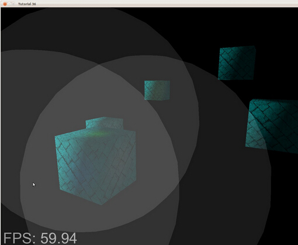
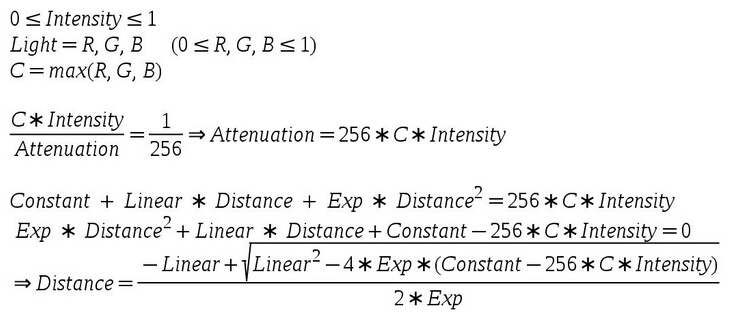
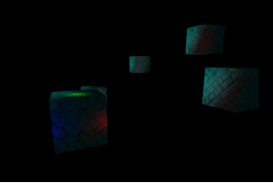

# 第三十六课 延迟渲染（二）

##背景

在前面的课程中我们学习了延迟渲染的基础部分，而且将几何阶段的结果输出到了 G-Buffer 中。如果你运行了演示程序你就知道 G-Buffer 里面的内容是什么了。今天我们将完成延迟渲染的基本实现，并且使得最后渲染出来的场景看起来和使用正向渲染的结果一样！在这一课的最后会有一个问题显现出来，这个问题将在下一课中解决。  

现在 G-buffer 中已经存放和合适的数据，我们要借助于它们来进行光照计算。实际上光照计算的公式丝毫没有变化，环境光、漫反射光以及高光的概念也完全一样，所有相关的数据都分散在 G-Buffer 的不同纹理中。对于屏幕上的每一个像素，我们只需要通过从不同的纹理中采样来获得数据，之后就向之前一样进行光照计算即可。唯一的问题就在于：我们怎么知道要对哪个像素进行处理？在前向渲染时这是十分简单的，顶点着色器将顶点位置信息变换到裁剪空间中，之后他们会被自动映射到屏幕空间并且在光栅化阶段会为每一个处于屏幕空间中的三角形的每一个片元执行片元着色器，我们会对这些像素都进行光照计算。但是现在，几何阶段已经完成了，我们不想再去使用这些原始的模型，而且那也与延迟渲染的初衷背道而驰了。  

我们从光源的角度来看待这些问题，如果在我们的场景中有一个平行光，那么场景中所有的像素都会受到它的影响。在这种情况下我们只需要画一个全屏的四边形，让 FS 对所有像素都执行一次来进行着色。如果是点光源，我们可以以光源位置为中心绘制一个粗糙的球体，这个球体的半径需要根据光照的强度进行设置，FS 会对处于球体内的所有像素进行关照计算。这真是延迟渲染的优势之一——减少需要进行着色的像素数量。我们只会考虑光源周边的像素而不是对场景中的所有对象都进行光照计算。  

这一课中的 Demo 十分简单，在场景中绘制了一些盒子和三个光源，比较讽刺的是这些组成这些包围球的顶点数量会比场景中实际的模型的顶点数量还多，尽管如此，你需要记住的是在现代游戏场景中通常会有成千上万个顶点，在这种情况下，在每个光源周围渲染一个包围球就显得不那么不划算了。在下面的图片中你可以看到三个光源的包围球的情况：  



如果我们只是对处于灰色区域中的像素执行 FS ，这会显著降低 FS 的调用次数，特别是在那中深度复杂度很高的复杂场景中，这样做的优势会更加明显，所以现在的问题是：怎样来设定这个包围球的尺寸？  

我们希望这个包围球足够大，这样光照的效果就不会出现突然不见的情况，同时我们也希望这个包围球不过于大，因为这样的话离光源比较远的像素由于光照对它的影响十分微弱就不再需要进行着色了。这个问题的解决办法十分简单——使用我们的衰减模型来找到最佳尺寸。衰减模型需要用到一个常量因子、一个线性因子、一个指数因子以及到光源的距离参数。在 FS 中计算衰减时，我们会先用光源的颜色乘上其亮度（位于 0.0 到 1.0 之间），之后除以这个衰减值，我们需要确定一个距离值，使得这个除法运算的结果小于某个阈值。每个颜色通道 8 个字节可以为我们提供 16777216 中不同的颜色，并且这个方案也被看做是标准方案。每个通道可以有 256 个不同的值，所以我们将这个临界值设置为 1/256（低于这个值为黑色）。由于颜色通道中最大的值可以为 256，所以能使这个颜色被丢弃的最大衰减值也是 256，下面就是我们计算这个距离的过程：

  

上面的过程是基于二次方程的求解。

##代码

```
(tutorial36.cpp:142)
virtual void RenderSceneCB()
{ 
    CalcFPS();
    m_scale += 0.05f;
    m_pGameCamera->OnRender();
    DSGeometryPass();
    BeginLightPasses();
    DSPointLightsPass();
    DSDirectionalLightPass();
    RenderFPS();
    glutSwapBuffers();
} 
```

主渲染函数想对之前来说并没有多大变化，这里面添加了一个设置光照渲染状态的公共函数（BeginLightPasses()），并且将光照阶段分成了两个函数，其中一个用于处理点光源的计算，另一个用于处理平行光的计算（聚光灯光源的计算就留给读者作为练习了）。

```
(tutorial36.cpp:164)
void DSGeometryPass()
{
    m_DSGeomPassTech.Enable();
    m_gbuffer.BindForWriting();
    // Only the geometry pass updates the depth buffer
    glDepthMask(GL_TRUE);
    glClear(GL_COLOR_BUFFER_BIT | GL_DEPTH_BUFFER_BIT);
    glEnable(GL_DEPTH_TEST);
    glDisable(GL_BLEND);
    Pipeline p;
    p.SetCamera(m_pGameCamera->GetPos(), m_pGameCamera->GetTarget(), m_pGameCamera->GetUp());
    p.SetPerspectiveProj(m_persProjInfo); 
    p.Rotate(0.0f, m_scale, 0.0f);
    for (unsigned int i = 0 ; i < ARRAY_SIZE_IN_ELEMENTS(m_boxPositions) ; i++) {
        p.WorldPos(m_boxPositions[i]);
        m_DSGeomPassTech.SetWVP(p.GetWVPTrans());
        m_DSGeomPassTech.SetWorldMatrix(p.GetWorldTrans());
        m_box.Render(); 
    }
    // When we get here the depth buffer is already populated and the stencil pass
    // depends on it, but it does not write to it.
    glDepthMask(GL_FALSE);
    glDisable(GL_DEPTH_TEST);
} 
```

在几何阶段主要有三个地方发生了改变。第一个地方是我们调用 glDepthMask() 函数使得只能在这个阶段才允许向深度缓存中写入数据，在几何阶段我们需要借助深度缓存使得离相机最近的片元的数据写入到 G-Buffer 中，但是在光照阶段，屏幕上每一个像素上都只对应了一个片元，所以我们不需要向深度缓存写入任何数据。这也引申出了这里面的第二个变化，只允许在这个阶段进行深度测试，在光照阶段由于屏幕上每个像素都只对应一个片元所以也没有必要进行深度测试。还有我们必须要小心的一点是在清除深度缓存之前必须要启用深度缓存的数据写入，如果深度的掩码被设置为 False，glClear() 函数也就无法访问深度缓存了。最后一个变化是我们禁用了混合，在稍后我们会看到在光照阶段是如何将多个光源的效果叠加到一起的，在几何阶段，这都是无关紧要的。  

```
(tutorial36.cpp:199)
void BeginLightPasses()
{
    glEnable(GL_BLEND);
    glBlendEquation(GL_FUNC_ADD);
    glBlendFunc(GL_ONE, GL_ONE);
    m_gbuffer.BindForReading();
    glClear(GL_COLOR_BUFFER_BIT);
}
```
在我们真正开始光照阶段之前，我们需要调用上面这个函数来进行一些光照阶段的设置，正如之前提到的那样，我们需要对不同的光源进行混合，因为每一个光源都是在单独的绘制命令中进行绘制的，在前向渲染中我们可以将所有光源的光照效果进行叠加，但是在 FS 的每一次调用都只处理一个光源，我们需要一个解决办法来将不同光源的光照效果累加到一起，而混合（blending）正好可以处理这种情况。混合其实可以简单的看做是一个函数，它需要一个源颜色（FS 的输出）和一个目标颜色（帧缓存中）并对他们进行一些计算。混合通常被用于实现透明的效果，因为它能够从源颜色和目标颜色中提取一部分并将它们混合在一起。在这一课中我们将混合公式设置为 GL\_FUNC\_ADD ，这意味着 GPU 会简单的将源颜色和目标颜色相加。由于我们想实现真正的相加操作，所有我们在混合函数中将源颜色和目标颜色都设置为 GL\_ONE。这样混合操作就相当于是： 1 * src + 1 * dst。当然在我们进行这些操作之前需要先启用混合。  

对混合设置完成之后，我们将 G-buffer 绑定为输出，并且清空默认帧缓存，接下来我们就可以进行光照阶段的渲染了。  

```
(tutorial36.cpp:210)
void DSPointLightsPass()
{
    m_DSPointLightPassTech.Enable();
    m_DSPointLightPassTech.SetEyeWorldPos(m_pGameCamera->GetPos()); 
    Pipeline p;
    p.SetCamera(m_pGameCamera->GetPos(), m_pGameCamera->GetTarget(), m_pGameCamera->GetUp());
    p.SetPerspectiveProj(m_persProjInfo);
    for (unsigned int i = 0 ; i < ARRAY_SIZE_IN_ELEMENTS(m_pointLight); i++) {
        m_DSPointLightPassTech.SetPointLight(m_pointLight[i]);
        p.WorldPos(m_pointLight[i].Position);
        float BSphereScale = CalcPointLightBSphere(m_pointLight[i]);
        p.Scale(BSphereScale, BSphereScale, BSphereScale); 
        m_DSPointLightPassTech.SetWVP(p.GetWVPTrans());
        m_bsphere.Render(); 
    } 
} 
```

在点光源计算阶段，我们简单的为每个点光源渲染了一个包围球，包围球的中心点放在点光源处，CalcPointLightBSphere() 根据光源的参数来计算包围球的参数。  

```
(tutorial36.cpp:275)
float CalcPointLightBSphere(const PointLight& Light)
{
    float MaxChannel = fmax(fmax(Light.Color.x, Light.Color.y), Light.Color.z);
    float ret = (-Light.Attenuation.Linear + sqrtf(Light.Attenuation.Linear * Light.Attenuation.Linear -
        4 * Light.Attenuation.Exp * (Light.Attenuation.Exp - 256 * MaxChannel * Light.DiffuseIntensity))) 
            /
        2 * Light.Attenuation.Exp;
    return ret;
} 
```

这个函数负责根据每个光源的属性来计算它的包围球的大小，这个函数就是在“背景”中介绍的内容的实现。  

```
(tutorial36.cpp:230)
void DSDirectionalLightPass() 
{ 
    m_DSDirLightPassTech.Enable();
    m_DSDirLightPassTech.SetEyeWorldPos(m_pGameCamera->GetPos());
    Matrix4f WVP;
    WVP.InitIdentity(); 
    m_DSDirLightPassTech.SetWVP(WVP);
    m_quad.Render(); 
} 
```

对于平行光源（我们只支持一个平行光）就更简单了，我们只需要绘制一个覆盖整个屏幕像素的四边形即可，我们使用的四边形模型的坐标范围是（-1，-1） 到 （1，1），在绘制的时候，我们使用的 WVP 矩阵是一个单位矩阵，所以最后传入到 gl_Position 变量中的数据就是原来的顶点数据，在经过透视除法和屏幕空间的变换之后，我们可以得到一个从(0，0) 到 (SCREEN\_WIDTH，SCREEN\_HEIGHT)的四边形。  

```
(light_pass.vs)
 #version 330 
layout (location = 0) in vec3 Position; 
uniform mat4 gWVP;
void main()
{ 
    gl_Position = gWVP * vec4(Position, 1.0);
} 
```

在光照阶段的顶点着色器代码十分简单，在进行平行光的处理时 WVP 矩阵就是一个单位矩阵，所以实际上对顶点坐标实际上是没有进行任何处理的。在处理点光源的时候，我们会获得包围球在屏幕上的投影，这些在投影中的像素才是我们希望进行处理的。  

```
(dir_light_pass.fs:108)
void main()
{
    vec2 TexCoord = CalcTexCoord();
    vec3 WorldPos = texture(gPositionMap, TexCoord).xyz;
    vec3 Color = texture(gColorMap, TexCoord).xyz;
    vec3 Normal = texture(gNormalMap, TexCoord).xyz;
    Normal = normalize(Normal);
    FragColor = vec4(Color, 1.0) * CalcDirectionalLight(WorldPos, Normal);
} 
(point_light_pass.fs:109)
void main()
{
    vec2 TexCoord = CalcTexCoord();
    vec3 WorldPos = texture(gPositionMap, TexCoord).xyz;
    vec3 Color = texture(gColorMap, TexCoord).xyz;
    vec3 Normal = texture(gNormalMap, TexCoord).xyz;
    Normal = normalize(Normal);
    FragColor = vec4(Color, 1.0) * CalcPointLight(WorldPos, Normal);
} 
```

上面的程序是分别对平行光和点光源进行处理的片元着色器，我们采用不同的函数来处理这两种光源，因为他们的计算思路是不一样的，从效率来看，使用不同的着色器程序来进行处理比在同一个着色器程序中添加一个分支判断要更好。这里面使用的一些光照计算函数实际上和之前我们使用的是一样的，我们从 G Buffer 中进行采样来得到当前片元的世界坐标属性、颜色属性以及法线属性。在上一节中我们还在 G Buffer 中保存了纹理坐标信息，但是我们可以节省出这个空间，并通过计算来得到他们的纹理坐标，可以简单的通过下面的函数得到：  

```
(dir_light_pass.fs:101, point_light_pass.fs:101)
vec2 CalcTexCoord()
{
   return gl_FragCoord.xy / gScreenSize;
} 
```

我们可以通过像素在屏幕上的位置来从 G Buffer 中采样。GLSL 为我们提供了一个十分方便的内置变量 gl_FragCoord，它是一个四维向量，在它的 XY 分量中记录了当前片元在屏幕空间中的位置信息，Z 分量中保存了当前片元的深度信息，W 分量中存放了顶点信息的倒数。我们需要将屏幕尺寸传入到 FS 中，并使用片元在屏幕空间中的位置除以这个尺寸，这样我们就能得到一个处于 0 到 1 之间的值，这个值可以被用作纹理坐标来访问 G Buffer 中的纹理。  

```
(gbuffer.cpp:49)
bool GBuffer::Init(unsigned int WindowWidth, unsigned int WindowHeight)
{
    ...
    for (unsigned int i = 0 ; i < ARRAY_SIZE_IN_ELEMENTS(m_textures) ; i++) {
        ...
        glTexParameterf(GL_TEXTURE_2D, GL_TEXTURE_MIN_FILTER, GL_NEAREST);
        glTexParameterf(GL_TEXTURE_2D, GL_TEXTURE_MAG_FILTER, GL_NEAREST);
        ...
    }
    ...
} 
```

这里我们要对 G Buffe 的初始化过程做一些简单的操作，在前面的课程中我们将场景渲染到它里面之后使用一个 blit 操作将其拷贝的默认的帧缓存中，由于我们需要对这些纹理进行采样操作，而且 G Buffer 中的纹素与屏幕上的像素是一一对应的，所以我们将过滤类型设置为 GL\_NEAREST，这样做避免了纹素之间不必要的插值。  

```
(gbuffer.cpp:98)
void GBuffer::BindForReading()
{
    glBindFramebuffer(GL_DRAW_FRAMEBUFFER, 0);
    for (unsigned int i = 0 ; i < ARRAY_SIZE_IN_ELEMENTS(m_textures); i++) {
        glActiveTexture(GL_TEXTURE0 + i); 
        glBindTexture(GL_TEXTURE_2D, m_textures[GBUFFER_TEXTURE_TYPE_POSITION + i]);
    }
} 
```

需要注意的是，我们需要对光照阶段开始之前的 G Buffer 的绑定操作进行一些修改，我们直接将默认帧缓存绑定为 GL\_DRAW\_FRAMEBUFFER 而不是将其再绑定到 GL\_READ\_FRAMEBUFFER 目标上，之后我们将 G Buffer 中的三个纹理绑定到相应的纹理单元上，这样我们就能从这些纹理进行采样。   
 
**BUG，BUG....**

我们现在实现的这个延迟渲染还有一些问题，第一个你可能已经注意到了，当我们相机移动到 light volume(泛指代表光照范围的几何体)内部时，这个光源的光照效果就消失了，这是因为我们只渲染了光源的包围球的正面，所以一旦我们进入它的内部它就被裁剪掉了。如果我们禁用掉背面剔除的话，由于我们使用了混合，所以当我们位于这个球体的外面时，光照效果会加倍（因为球体的正反面都会被渲染），而当我们进入这个球体之后则只有一半的光照效果（我们看到的只是球体的反面）。  

第二个问题是有的对象并没有位于包围球的内部但还是产生了光照效果，这是因为这个球体被投影到了屏幕空间中，所以我们对其也进行了光照计算。  

在下一课中，我们会处理这些问题。

##操作结果

