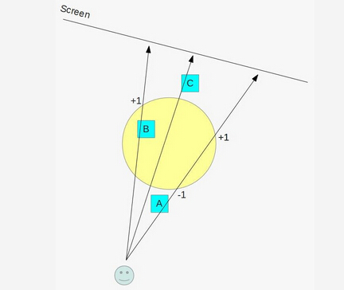
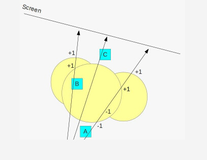
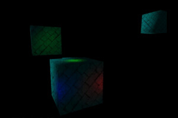

# 第三十七课 延迟渲染（三）

## 背景
到目前为止我们实现的延迟渲染效果还算不错，但是当你将相机靠近物体观察时会出现在上一课的结尾提到的问题。第一个问题就是由于背面剔除的存在，当相机进入到光源体之后这个光源的光照效果就会消失。第二个问题则与光源的范围有关，这是因为在将光源的包围球投影到屏幕坐标系之后，我们会对被这个球体覆盖的所有像素都进行光照计算，即使这个像素离光源很远（也就是位于光源体之外）。  

OpenGL 中的模板缓存可以帮助我们解决这些问题，模板缓存与颜色缓存、深度缓存类似，并且有同样的分辨率（颜色缓存中的每一个像素都与模板缓存中的一个像素对应）。模板缓存中的每个像素都存放一个整型数据（通常为 1 字节）。模板缓存的工作方式与现实世界中的模板相似，一个模板文件通常用于打印信件或者向纸张中插入一些图案，OpenGL 中的模板缓存可以用来限定片元着色器的执行，使之只作用于某些像素。  

模板缓存与模板测试是联系在一起的，模板测试是一个逐片元操作。它的执行方式与深度测试相似，模板测试可用于在片元着色器执行之前丢弃某些片元，它会用模板缓存中当前像素中存放的值与一个提前设置的参考值进行比较，在比较的时候有以下比较方式可供选择：

- Always pass （始终成功）
- Always fail （始终失败）
- Less/greater than （大于或者小于）
- Less/greater than or equal （大于等于或者小于等于）
- Equal （相等）
- Not equal （不等）

基于模板测试和深度测试的结果你可以定义一些针对模板数据的操纵，下面是一些可选的操作：

- Keep the stencil value unchanged （保持模板值不变）
- Replace the stencil value with zero （用 0 替换模板缓存中的值）
- Increment/decrement the stencil value （增加或减小模板缓存中的值）
- Invert the bits of the stencil value （对当前模板值进行按位取反操作）

你可以根据下面的结果来配置不同的操作：

- Stencil test failure 
- Depth test failure 
- depth test success 

除此之外，你可以为每个多边形的每一个面都配置不同的模板测试和模板操作，你可以将正面的比较函数设置为‘ Less Than ’（索引值为 3），同时你也可以将反面的比较函数设置为‘ Equal ’（索引值为 5）。模板操作的设置同样如此。  

以上就是模板测试，但是它如何来帮助我们解决我们的问题呢？我们将会根据多边形的正反面的深度测试结果来对模板值进行加减操作，思考下面的图片：


上面的图片中包含了 3 个对象—— A、B、C 以及一个在光源处创建的包围球，这个包围球被投影在一个虚拟的屏幕上，根据前面几节课中介绍的内容我们需要对光源体（代表光源影响范围的立方体）进行光栅化，并对这些光源体所在的屏幕像素进行光照计算。从上面的图片中我们可以很直观的看到整个红色线条部分（在现实世界中屏幕应该是一个矩形，但是这里我们可以想象成从侧面观察屏幕来减少需要考虑的维度）都会执行片元着色器程序，但是这些片元中只有一小部分是真正需要进行光照计算的，因为只有对象 B 是处于光源体之内的，对象 A 和 C 都位于光源体之外。而且这些片元中有很多都是不需要进行渲染的，因为这些地方根本就没有任何对象，所以 G buffer 中也不会存放任何数据。  

这里我们将要使用模板缓存来将光照计算限定在被对象 B 覆盖的像素上，这里模板缓存的使用思想与阴影技术中所使用的模板阴影体（这些内容将会在后面的课程中介绍）类似，它的实现是根据一些在上面图片中证实了的有趣的属性：当我们我们从相机的视角看这个光源体时，对象 A 处于球体的前面，而对象 C 处于球体的后面，只有对象 B 是处于球体内部的（即从相机的视角看过去对象 B 是位于球体的正面之后，反面之前的）。下面我来看看如何在模板测试中来利用这些属性。  

现在我们的渲染流程大致如下：

- 像往常一样将对象渲染到 G buffer 中，这样场景的深度信息就会被记录到深度缓存中；
- 禁止向深度缓存中写入数据，从现在开始深度缓存作为只读的缓存；
- 禁用背面剔除，我们希望在光栅化阶段对光源体的正反面都进行处理；
- 将模板测试的结果设置为始终成功，我们真正需要关注的是模板操作；
- 配置反面的模板操作，当反面的深度测试失败时使模板缓存中的值加一，当深度测试或者模板测试成功时，保持模板缓存中的值不变；
- 配置正面的模板操作，当正面的深度测试失败时使模板缓存中的值减一，当深度测试或者模板测试成功时，保持模板缓存中的值不变；
- 渲染光源体

让我们将上面介绍的知识用下面这幅图片表示：



这个图片中绘制了 3 个从相机位置指向屏幕的向量，每个向量都穿过了光源体和一个对象，每一个向量都代表了被当前对象所覆盖的所有像素。由于对象模型早已经被渲染到 G buffer 中而且场景的深度信息也被写入到了深度缓存中，我们可以在渲染光源体的正面和反面的像素时根据深度测试的结果来更新模板缓存中的数据。对于对象 A 来说，在渲染光源体时，光源体的正面像素和反面像素在进行深度测试的时候都会失败，反面像素的深度测试失败会使模板缓存中的位于当前像素位置的值加一，但是正面像素同样会使得模板缓存中的值减一，所以实际上模板缓存中的值是没有变化的。而对于对象 C 来说光源体的正面像素和反面像素在深度测试的时候都会成功，所以模板缓存中与对象 C 所对应的像素中的值同样会保持不变。现在我们主要来看一下对象 B 的情况——光源体的正面像素在深度测试的时候成功，但是背面像素在深度测试的时候失败，这意味着模板缓存中与对象 B 所对应的像素中的值会加一。  

上面所讲的就是本课里面的核心思想了，我们先将场景中的几何对象渲染到 G buffer 中，根据以上所述配置好模板测试和模板操作，之后将每个光源的包围球（光源体）渲染到模板缓存中。我们对模板进行了一些独特的设置使得模板中的值只有当对象位于包围球内部时，模板缓存中与这个对象所对应的像素的值才会大于 0。我们将这个部分的操作称为模板阶段，由于我们只对向模板缓存的写入感兴趣，所以这里不需要使用片元着色器。之后我们会再次渲染这些光源体并进行光照计算，但是这次渲染的时候我们会进行模板测试并只对那些模板值大于 0 的像素进行处理。所有位于光源体之外的对象所覆盖的像素在模板测试中都会失败，这样我们只会对真正处于光源体之中的这一小部分像素进行光照计算。  

让我们看另外一个例子，不过这次会我们考虑多个光源的情况：



正如你所看到的这样，上面的逻辑同样适用（当相机位于光源体内部的时候由读者自己考虑）。  

模板缓存中还有一点值得我们注意的是——模板缓存并不是一个单独的缓存，实际上它是深度缓存的一部分，对于深度缓存中的每个像素你可以分配 24 位或者 32 位的空间用来存放深度信息，而利用另外 8 位空间用来存放模板数据。

##代码

```
(tutorial37.cpp:149)
virtual void RenderSceneCB()
{ 
    CalcFPS();
    m_scale += 0.05f;
    m_pGameCamera->OnRender();
    m_gbuffer.StartFrame();
    DSGeometryPass();
    // We need stencil to be enabled in the stencil pass to get the stencil buffer
    // updated and we also need it in the light pass because we render the light
    // only if the stencil passes.
    glEnable(GL_STENCIL_TEST);
    for (unsigned int i = 0 ; i < ARRAY_SIZE_IN_ELEMENTS(m_pointLight); i++) {
        DSStencilPass(i);
        DSPointLightPass(i);
    }
    // The directional light does not need a stencil test because its volume
    // is unlimited and the final pass simply copies the texture.
    glDisable(GL_STENCIL_TEST);
    DSDirectionalLightPass();
    DSFinalPass();
    RenderFPS();
    glutSwapBuffers();
}
```

这一部分代码就是主渲染函数，在这一课中做了一些修改，首先它调用了 GBuffer 中的 StartFrame() 接口，GBuffer 类在这一课中变得更加复杂，在每一帧开始的时候都需要调用这个接口来通知 GBuffer（这个类中的这个接口会在之后详细介绍，现在我们需要注意的一点就是我们并不是直接将图像渲染到窗口上的，而是将其先渲染到一个中间缓存中之后再拷贝到主 FBO 中）。之后我们启用模板测试因为在之后两个阶段中我们需要用到它。现在就来到了变化最大的部分——对于每个光源我们都要先执行模板阶段（标记相关像素），紧接着根据模板阶段的结果针对这个光源进行光照计算。这里我们将每个光源分开计算是因为当某个像素的模板值大于 0 时，我们无法确定其是因为哪一个光源导致的，所以我们需要分开计算。  

在我们对每个光源的光照计算结束之后先禁用模板测试，因为对于平行光源来说我们需要对每个像素都进行光照计算。这个函数中还有一个变化是新增了一个 DSFinalPass()，这同样是因为 GBuffer 的改变而做出的变化。  

```
(tutorial37.cpp:185)
void DSGeometryPass()
{
    m_DSGeomPassTech.Enable();
    m_gbuffer.BindForGeomPass();
    // Only the geometry pass updates the depth buffer
    glDepthMask(GL_TRUE);
    glClear(GL_COLOR_BUFFER_BIT | GL_DEPTH_BUFFER_BIT);
    glEnable(GL_DEPTH_TEST);
    Pipeline p;
    p.SetCamera(m_pGameCamera->GetPos(), m_pGameCamera->GetTarget(), m_pGameCamera->GetUp());
    p.SetPerspectiveProj(m_persProjInfo); 
    p.Rotate(0.0f, m_scale, 0.0f);
    for (unsigned int i = 0 ; i < ARRAY_SIZE_IN_ELEMENTS(m_boxPositions) ; i++) {
        p.WorldPos(m_boxPositions[i]);
        m_DSGeomPassTech.SetWVP(p.GetWVPTrans());
        m_DSGeomPassTech.SetWorldMatrix(p.GetWorldTrans());
        m_box.Render(); 
    }
    // When we get here the depth buffer is already populated and the stencil pass
    // depends on it, but it does not write to it.
    glDepthMask(GL_FALSE); 
} 
```

几何阶段几乎没有变化，GBuffer::BindForWriting() 函数被改名为 GBuffer::BindForGeomPass() 。除此之外眼尖的人可能会发现这里面并没有禁用混合和深度测试，这些操作都在其他地方进行处理。  

```
(tutorial37.cpp:215)
void DSStencilPass(unsigned int PointLightIndex)
{
    m_nullTech.Enable();
    // Disable color/depth write and enable stencil
    m_gbuffer.BindForStencilPass();
    glEnable(GL_DEPTH_TEST);
    glDisable(GL_CULL_FACE);
    glClear(GL_STENCIL_BUFFER_BIT);
    // We need the stencil test to be enabled but we want it
    // to succeed always. Only the depth test matters.
    glStencilFunc(GL_ALWAYS, 0, 0);
    glStencilOpSeparate(GL_BACK, GL_KEEP, GL_INCR_WRAP, GL_KEEP);
    glStencilOpSeparate(GL_FRONT, GL_KEEP, GL_DECR_WRAP, GL_KEEP);
    Pipeline p;
    p.WorldPos(m_pointLight[PointLightIndex].Position);
    float BBoxScale = CalcPointLightBSphere(m_pointLight[PointLightIndex].Color, 
        m_pointLight[PointLightIndex].DiffuseIntensity);
    p.Scale(BBoxScale, BBoxScale, BBoxScale); 
    p.SetCamera(m_pGameCamera->GetPos(), m_pGameCamera->GetTarget(), m_pGameCamera->GetUp());
    p.SetPerspectiveProj(m_persProjInfo);
    m_nullTech.SetWVP(p.GetWVPTrans());
    m_bsphere.Render(); 
} 
```

现在才是真正的主角登场——模板阶段。让我们一步一步的介绍这个阶段中所完成的工作。首先我们启用 “null” 着色器，这个着色器中完成的工作很简单，VS 只是将位置向量通过 WVP 矩阵变换到规范化空间中，FS 则什么都没有做，因为我们并不需要更新颜色缓存，需要更新的仅仅是模板缓存，所以我们仅仅是需要进入到光栅化阶段而已。之后我们调用 GBuffer 的接口，使其针对模板阶段的渲染进行相应的设置，并启用深度测试。虽然在之后的点光源阶段我们会再次禁用深度测试，但是这里由于模板操作依赖于深度测试，所以我们还需要它。之后我们禁用背面剔除，因为对于光源体来说，我们希望对其正反面都进行处理。在这之后我们清空模板缓存并将模板测试设置为 “始终通过”，并根据 “背景” 中的描述为其设置模板操作。之后的操作就很平常了——我们根据光源的参数渲染光源的包围球，渲染完成之后模板缓存中只有被真正处于光源体内部的对象所覆盖的像素才会存放正值。这样我们就可以对这些像素进行光照计算了。  

```
(tutorial37.cpp:246)
void DSPointLightPass(unsigned int PointLightIndex)
{
    m_gbuffer.BindForLightPass();
    m_DSPointLightPassTech.Enable();
    m_DSPointLightPassTech.SetEyeWorldPos(m_pGameCamera->GetPos()); 
    glStencilFunc(GL_NOTEQUAL, 0, 0xFF);
    glDisable(GL_DEPTH_TEST);
    glEnable(GL_BLEND);
    glBlendEquation(GL_FUNC_ADD);
    glBlendFunc(GL_ONE, GL_ONE);
    glEnable(GL_CULL_FACE);
    glCullFace(GL_FRONT);
    Pipeline p;
    p.WorldPos(m_pointLight[PointLightIndex].Position);
    float BBoxScale = CalcPointLightBSphere(m_pointLight[PointLightIndex].Color, 
                                            m_pointLight[PointLightIndex].DiffuseIntensity);
    p.Scale(BBoxScale, BBoxScale, BBoxScale); 
    p.SetCamera(m_pGameCamera->GetPos(), m_pGameCamera->GetTarget(), m_pGameCamera->GetUp());
    p.SetPerspectiveProj(m_persProjInfo); 
    m_DSPointLightPassTech.SetWVP(p.GetWVPTrans());
    m_DSPointLightPassTech.SetPointLight(m_pointLight[PointLightIndex]);
    m_bsphere.Render(); 
    glCullFace(GL_BACK);
    glDisable(GL_BLEND);
} 
```

点光源阶段和其他阶段一样，首先要针对当前阶段对 GBuffer 进行一些设置（通过调用 GBuffer::BindForLightPass() ）。之后对模板测试进行设置——只有当模板值不等于 0 时才通过。之后禁用深度测试（因为在这一阶段我们不需要进行深度测试）并启用混合。下一步十分关键——我们会对多边形进行正面剔除，这是因为当相机处于光源体内部时我们看到的就是光源体的反面，如果我们还像之前一样进行背面剔除，那么我们就看不到光照效果了。将这些设置完之后，我们像平常一样绘制包围球。  

平行光源阶段和之前的没有什么大的区别，这里就不再重复介绍了。

```
(tutorial37.cpp:296)
void DSFinalPass()
{
    m_gbuffer.BindForFinalPass();
    glBlitFramebuffer(0, 0, WINDOW_WIDTH, WINDOW_HEIGHT, 
                      0, 0, WINDOW_WIDTH, WINDOW_HEIGHT, GL_COLOR_BUFFER_BIT, GL_LINEAR);
} 
```

在 FinalPass 中我们使用 Blit 操作将 GBuffer 中的颜色缓存拷贝到屏幕上。这里我们正好来讨论为什么在 GBuffer 中添加一个颜色缓存来存放渲染结果而不是直接将图像绘制到屏幕上。这是因为 GBuffer 中包含了场景的属性数据和深度/模板缓存，是一个整体。当我们进入点光源阶段之后我们需要从深度缓存中获取数据，这样就产生了一个问题——如果直接将图像渲染到默认的 FBO 中那么我们就没有权限去访问 GBuffer 中的深度缓存。但是 GBuffer 必须拥有自己的深度缓存因为当我们想 GBuffer 中渲染场景时我们也无法访问默认 FBO 的深度缓存。因此解决方案就是在 GBuffer 的 FBO 中添加一个颜色缓存来存放最终渲染的结果，并在 FinalPass 中通过 Blit 操作将这个颜色缓存中的图像拷贝到默认 FBO 的颜色缓存中。  

```
(gbuffer.h:23)
class GBuffer
{
public:
    enum GBUFFER_TEXTURE_TYPE {
        GBUFFER_TEXTURE_TYPE_POSITION,
        GBUFFER_TEXTURE_TYPE_DIFFUSE,
        GBUFFER_TEXTURE_TYPE_NORMAL,
        GBUFFER_NUM_TEXTURES
    };
    GBuffer();
    ~GBuffer();
    bool Init(unsigned int WindowWidth, unsigned int WindowHeight);
    void StartFrame();
    void BindForGeomPass();
    void BindForStencilPass();
    void BindForLightPass();
    void BindForFinalPass();
private:
    GLuint m_fbo;
    GLuint m_textures[GBUFFER_NUM_TEXTURES];
    GLuint m_depthTexture;
    GLuint m_finalTexture;
}; 
```

在 GBuffer 中我们添加了一个 finalTexture 用于存放最终的渲染结果，并且对其中一些接口进行了修改。
 
```
(gbuffer.cpp:52)
bool GBuffer::Init(unsigned int WindowWidth, unsigned int WindowHeight)
{
    ...
    glGenTextures(1, &m_finalTexture);
    ...
    // depth
    glBindTexture(GL_TEXTURE_2D, m_depthTexture);
    glTexImage2D(GL_TEXTURE_2D, 0, GL_DEPTH32F_STENCIL8, WindowWidth, WindowHeight, 0, GL_DEPTH_COMPONENT, 
                  GL_FLOAT, NULL);
    glFramebufferTexture2D(GL_DRAW_FRAMEBUFFER, GL_DEPTH_STENCIL_ATTACHMENT, GL_TEXTURE_2D, m_depthTexture, 0);
    // final
    glBindTexture(GL_TEXTURE_2D, m_finalTexture);
    glTexImage2D(GL_TEXTURE_2D, 0, GL_RGBA, WindowWidth, WindowHeight, 0, GL_RGB, GL_FLOAT, NULL);
    glFramebufferTexture2D(GL_DRAW_FRAMEBUFFER, GL_COLOR_ATTACHMENT4, GL_TEXTURE_2D, m_finalTexture, 0); 
    ...
} 
```

在 GBuffer 初始化时我们需要为 finalTexture 对象分配空间， finalTexture 被挂载到 FBO 的第四个颜色挂载点上。在创建深度纹理时深度纹理的每个像素值的类型不再是 GL\_DEPTH\_COMPONENT32F， 而是 GL\_DEPTH32F\_STENCIL8, 这样每个像素中会有一个字节用于存放模板信息。并且深度缓存被挂在到 FBO 的 GL\_DEPTH\_STENCIL\_ATTACHMENT 上而不是 GL\_DEPTH\_COMPONENT。  

```
(gbuffer.cpp:97)
void GBuffer::StartFrame()
{
    glBindFramebuffer(GL_DRAW_FRAMEBUFFER, m_fbo);
    glDrawBuffer(GL_COLOR_ATTACHMENT4);
    glClear(GL_COLOR_BUFFER_BIT);
} 
```

在每一帧开始的是我们需要清空 finalTexture 中的内容。

```
(gbuffer.cpp:105)
void GBuffer::BindForGeomPass()
{
    glBindFramebuffer(GL_DRAW_FRAMEBUFFER, m_fbo);
    GLenum DrawBuffers[] = { GL_COLOR_ATTACHMENT0, 
                            GL_COLOR_ATTACHMENT1,
                            GL_COLOR_ATTACHMENT2 };
    glDrawBuffers(ARRAY_SIZE_IN_ELEMENTS(DrawBuffers), DrawBuffers);
} 
```

之前 GBuffer 中的 FBO 都是静态的（根据其配置来说）并且都是提前设置好了的，所以我们只需要在几何阶段开始的时候将其绑定为输出即可。但是现在在不同的阶段我们都需要为 FBO 配置不同的输出缓存。

```
(gbuffer.cpp:117)
void GBuffer::BindForStencilPass()
{
    // must disable the draw buffers 
    glDrawBuffer(GL_NONE);
} 
```

正如之前提到的那样，在模板测试的时候我们只会向模板缓存中写入数据而不会向颜色缓存中写入，而且我们 FS 都是空的，但尽管是这样 FS 的默认输出也是黑色，为了避免这个问题我们在这里禁用颜色输出。  

```
(gbuffer.cpp:125)
void GBuffer::BindForLightPass()
{
    glDrawBuffer(GL_COLOR_ATTACHMENT4);
    for (unsigned int i = 0 ; i < ARRAY_SIZE_IN_ELEMENTS(m_textures); i++) {
        glActiveTexture(GL_TEXTURE0 + i); 
        glBindTexture(GL_TEXTURE_2D, m_textures[GBUFFER_TEXTURE_TYPE_POSITION + i]);
    }
} 
```

光照阶段的设置就十分明确了，我们将 finalTexture 设置为颜色输出，将场景的属性纹理作为输入来进行光照计算。

```
(gbuffer.cpp:136)
void GBuffer::BindForFinalPass()
{
    glBindFramebuffer(GL_DRAW_FRAMEBUFFER, 0);
    glBindFramebuffer(GL_READ_FRAMEBUFFER, m_fbo);
    glReadBuffer(GL_COLOR_ATTACHMENT4);
} 
```

当程序运行到 FinalPass 时，finalTexture 中早已保存了场景最终的渲染结果，这里我们为 Blit 操作进行设置，默认 FBO 设置为输出目标，GBuffer 的 FBO 设置为输入。  

这一课中我们关于延迟渲染的介绍就算完了，本课中介绍的方法并不是唯一的，你也可以在网上找到其他的实现方法，但是他们的核心思想都是一致的。正如任何事物都具有两面性，延迟渲染也有其优点和缺点，在后面的课程中我们会花时间介绍前向渲染和延迟渲染，并借助一些新特性来优化他们的渲染框架。

## 操作结果

