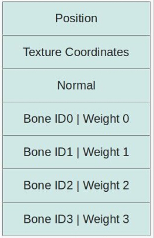
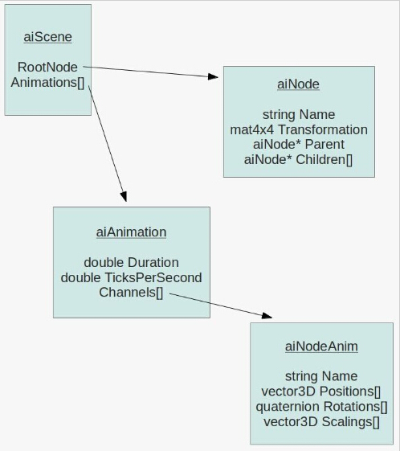
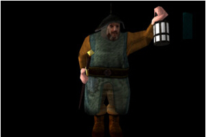

# 第三十八课 用 Assimp 导入骨骼动画

##背景

这一课中将会介绍很多读者期盼已久的东西——骨骼动画，在这一课中我们将使用 Assimp 库来导入骨骼动画。  

骨骼动画实际上是有两个处理过程的，第一个过程是由美术人员进行的，第二个过程则是由作为程序员的你（或者你写的引擎）来进行的。第一个过程通常是美术人员借助于建模软件对骨骼动画进行装配，借助于建模软件，美术人员在模型网格之下定义了骨架的骨骼。网格代表着对象的表面（这个对象可能是人、怪物或者其他任何东西），骨骼则用于模拟真实世界中网格的运动，它是通过将顶点绑定到一个或多个骨骼上实现的，当一个顶点被绑定到一个骨骼上时，同时也会定义顶点相对与这个骨骼的权值，这个权值决定了当这个骨骼运动的时候骨骼对顶点的影响程度。一般的做法是使得每个顶点的所有权值的和始终为 1。例如，当一个顶点正好位于两个骨骼之间时，我们会将这个顶点相对与两个骨骼的权值都声明为 0.5 ，因为我们希望这两个骨骼对这个顶点的影响程度都是一样的。当然如果一个顶点仅仅只受某一个骨骼的影响，那么这个顶点相对与这个骨骼的权值就为 1（这意味这个这个骨骼完全控制了这个顶点的运动）。

这是在 Blender 中创建的一个骨架的例子：  

  

上面我们看到的就是骨骼动画很重要的部分了。美术人员将所有的骨骼装配在一起并为每个动作类型定义一系列的关键帧（如行走、跑、死亡等动作）。关键帧包含了所有骨骼在运动路径的关键点处的变换。图形引擎会对关键帧的变换之间进行插值使得整个运动能平滑的进行。  

骨骼动画中定义的骨架一般都是有层次结构的，这也就是说骨骼节点之间有一个父子关系，即我们创建了一个骨骼树。除了根骨骼节点之外其他骨骼节点都有一个父节点。对于人体来说，你可以将脊柱声明为根骨骼节点，将胳膊、腿、手指等骨骼节点都作为其子节点。当父节点运动时，它同时会带动它所有的子节点运动，但是当一个子节点运动时却不会对其父节点产生影响（我们的手指可以在手掌不动的情况下运动，但是当手掌运动时却会带动所有的手指一起运动）。从实践的角度来说这意味着当我们处理一个骨骼节点的变换时我们需要将其所有父节点的变换都考虑进来。  

接下来我们不会进一步讨论骨骼的装配，这是一个复杂的主题并且也超出了图形编程人员的范围，建模软件已经提供了很多优秀的工具来进行这些工作，你只需要一个好的美术人员来创建出好看的网格和骨骼即可。接下来让我们看一下为了支持骨骼动画，图形引擎需要做什么工作。  

首先我们需要讨论的是在顶点缓存中如何保持每个顶点的骨骼信息。为每个顶点保存骨骼信息的方法很多，但是这里我们选择了一个比较直接的办法，在每一个顶点中我们都会保存一个骨骼信息数组，数组中的每个元素都会保存一个骨骼 ID　以及这个骨骼所对应的权重。为了简单起见每个骨骼数组中都包含 4 个元素，这意味着每个顶点的运动最多只会受到 4 个骨骼的影响。如果你导入的模型需要更多的骨骼，那么就需要对数组的大小进行修改，但是对于我们课程中使用的模型 4 个骨骼就足够了，我们新的顶点缓存的结构如下：  

   

骨骼  ID 是存放所有骨骼变换的数组中的索引，这些变换会在进行 WVP 变换之前作用到位置向量和法线向量上（即将顶点从骨骼空间中变换到局部坐标系中）。权重（weight）用于将多个骨骼的变换组合成一个变换矩阵，而且无论如何一个顶点的所有骨骼权重之和都必须为 1（由建模软件负责保证所有骨骼的权重之和一定为 1 ）。通常情况下我们会在两个关键帧之间进行插值并在每一帧中都更新骨骼数组中的变换矩阵。  

骨骼变换矩阵数组的创建方式通常是比较有技术含量的一部分，这些变换矩阵都在一个层次结构中进行设置（例如树结构），通常的做法是在树中的每一个节点都保存一个缩放向量、一个旋转四元数以及一个平移向量。实际上树中的每个节点都用一个数组来存放这些数据。每个数组都会有一个事件戳，当然在程序中的时间很少会正好与时间戳匹配，所以我们的程序要能够对 缩放/旋转/平移 向量进行插值来得到对应时间点骨骼的正确变换矩阵。要得到某个骨骼节点的变换矩阵，我们需要从当前节点追溯到根节点并将他们的变换矩阵乘在一起以获得最终的变换结果，我们会对所有骨骼节点都进行这样的处理并将这个矩阵传递到着色器程序中。  

到目前为止我们讨论的所有东西都很普通，但是这一课中我们的主题是使用 Assimp 导入骨骼动画，所以我们需要再次介绍这个库。这个库的优点是他支持多个格式的骨骼动画的导入，糟糕的是我们还需要对它的读入的骨骼动画数据进行一些处理来生成着色器需要的骨骼变换矩阵。  

首先让我们看看顶点层面的骨骼信息，下面是 Assimp 中保存的相关数据的结构：  

  

你可能还记得 Assimp 那一课中的内容，所有的数据都包含在 aiScene 对象中（当我们将模型文件导入时得到的数据对象）。 siScene 对象包含了一个 aiMesh 对象数组，一个 aiMesh 对象就是模型的一部分，它包含了模型顶点层面的数据，如位置信息、法线信息、纹理坐标信息等。现在我们看到 aiMesh 中还包含了一个 aiBone 对象数组。不出所料，一个 aiBone 对象代表了网格骨架中的一个骨骼，每个骨骼都有一个名字这样就能通过名字在骨骼层次中找到对应的骨骼(后面会详细介绍)，此外每个骨骼对象中还存放了一个顶点权重数组和一个 4 x 4 的偏移矩阵。我们保存这个矩阵是因为顶点通常都定义在局部坐标系下的，这意味着就算不支持骨骼动画我们现有的代码也能正确的渲染模型，但是骨骼树中的骨骼变换是在骨骼空间中进行的（每个骨骼都有其自己的坐标系所以我们需要将所有的变换乘在一起）。所以偏移矩阵的工作就是将顶点位置坐标从模型的局部坐标系变换到当前骨骼的骨骼空间中。  

顶点权重数组才是真正有趣的部分，这个数组中的每一个元素里都保存了一个顶点索引以及一个权重值，这个索引与 aiMesh 中的顶点数组中的元素对应。同一个顶点的所有权重之和必须为 1，但是为了找到这个顶点的所有骨骼权重我们需要遍历所有的骨骼节点。  

在介绍了顶点与骨骼节点之间的关系之后，我们需要对模型文件中保存的骨骼层次结构进行处理，并生成最终的要传递到着色器程序中的矩阵，下面的图片展示了相关的数据的结构：  

  

还是从 AIScene 开始，aiScene 对象中保存了一个指向 aiNode 的指针，这个指针所指向的对象就是整个骨骼树的根节点，骨骼树中的每一个节点都保存了一个指向其父节点的指针和一个保存其所有子节点指针的数组。这使得我们能够十分方便的对这个树进行前向和后向的遍历。此外节点中还保存了一个从当前骨骼空间变换到其父节点空间的变换矩阵。最后每个骨骼节点还应该有一个字符串用于保存节点名，如果一个节点代表了骨骼层级结构中的一个骨骼，那么节点名必须与骨骼名相匹配。但是某些情况下节点的名字可以为空（这表示这个节点没有对应的骨骼），它的作用仅仅是帮助建模人员分解模型并做一些中间变换。  

最后一点迷惑人的部分就是 aiAnimation 数组了，这个数组同样保存在 aiScene 对象中，每一个 aiAnimation 对象都表示一个动画帧序列，例如行走、跑、射击等动作。通过在关键帧之间插值，我们就可以得到与当前动作像匹配的视觉效果。一个 aiAnimation 节点中保存了一个用 tick 计数的持续时间，以及每秒的 tick 数（例如： 如果持续时间为 100 tick， 每秒的 tick 值为 25，这表示整个动作的持续时间为 4 秒），这使得我们能在不同的硬件平台上保持动画表现的一致性。此外每一个元素中还有一个 aiNodeAnim 对象数组，数组名为 channels 。数组中的每一个元素中存放的实际上就是一个骨骼的变换信息，这些信息里面同样保存了一个骨骼名字符串和三个分别表示缩放、旋转、平移的数组。  

为了计算出某个时刻骨骼最终的变换矩阵，我们需要根据当前时间对关键帧之间三个变换数组进行插值，并将这些变换组合成一个矩阵。这些完成之后我们需要在骨骼树种找到对应的骨骼节点并遍历其父节点，之后我们对它的每个父节点都做同样的插值处理，并将这些变换矩阵乘起来即可。  

## 代码

```
(mesh.cpp:75)
bool Mesh::LoadMesh(const string& Filename)
{
    // Release the previously loaded mesh (if it exists)
    Clear();
    // Create the VAO
    glGenVertexArrays(1, &m_VAO); 
    glBindVertexArray(m_VAO);
    // Create the buffers for the vertices attributes
    glGenBuffers(ARRAY_SIZE_IN_ELEMENTS(m_Buffers), m_Buffers);
    bool Ret = false; 
    m_pScene = m_Importer.ReadFile(Filename.c_str(), aiProcess_Triangulate | aiProcess_GenSmoothNormals | 
                                    aiProcess_FlipUVs);
    if (m_pScene) { 
       m_GlobalInverseTransform = m_pScene->mRootNode->mTransformation;
       m_GlobalInverseTransform.Inverse();
       Ret = InitFromScene(m_pScene, Filename);
    }
    else {
       printf("Error parsing '%s': '%s'\n", Filename.c_str(), m_Importer.GetErrorString());
    }
    // Make sure the VAO is not changed from the outside
    glBindVertexArray(0); 
    return Ret;
} 
```

这是修改之后的 Mesh 类的入口函数，这里面有一些改动需要我们注意，首先导入的 aiScene 对象现在是作为成员变量，这是因为我们在程序运行的时候还需要多次访问 aiScene 对象，在真正的游戏中我们可能会将我们需要的数据用一种更加优化的格式存储下来，但是作为教学 Demo 来说就不需要这么麻烦了。  

其次我们获得了骨骼根节点的变换矩阵，将其转置后存储下来，在后面我们会用到这个矩阵，注意我们在 Matrix4f 类中添加了矩阵转置函数。  

```
(mesh.h:69)
struct VertexBoneData
{ 
    uint IDs[NUM_BONES_PER_VEREX];
    float Weights[NUM_BONES_PER_VEREX];
} 
(mesh.cpp:107)
bool Mesh::InitFromScene(const aiScene* pScene, const string& Filename)
{ 
    ...
    vector<VertexBoneData> Bones;
    ...
    Bones.resize(NumVertices);
    ...
    glBindBuffer(GL_ARRAY_BUFFER, m_Buffers[BONE_VB]);
    glBufferData(GL_ARRAY_BUFFER, sizeof(Bones[0]) * Bones.size(), &Bones[0], GL_STATIC_DRAW);
    glEnableVertexAttribArray(BONE_ID_LOCATION);
    glVertexAttribIPointer(BONE_ID_LOCATION, 4, GL_INT, sizeof(VertexBoneData), (const GLvoid*)0);
    glEnableVertexAttribArray(BONE_WEIGHT_LOCATION); 
    glVertexAttribPointer(BONE_WEIGHT_LOCATION, 4, GL_FLOAT, GL_FALSE, sizeof(VertexBoneData), (const GLvoid*)16);
    ...
} 
```

上面的定义的结构体包含了顶点中所需要的骨骼信息，默认情况下我们有足够的内存空间为每个顶点保存四个骨骼信息（ 每个骨骼的 ID 和权重）。将 VertexBoneData 里面的数据这样组织是为了方便向着色器中传递数据。我们早已经将位置信息、纹理坐标信息和法线信息分别绑定在了位置 0、1、2上，因此我们配置 VAO 将骨骼 ID 信息绑定在位置 3，将权重信息绑定在位置 4。需要特别注意的是在绑定 ID 信息时我们应该使用 glVertexAttribIPointer 函数而不是 glVertexAttribPointer ，这是因为 ID 是整型数据而不是浮点类型数据，如果不注意这点，会使传递到着色器中的数据出现问题。  

```
(mesh.cpp:213)
void Mesh::LoadBones(uint MeshIndex, const aiMesh* pMesh, vector& Bones)
{
    for (uint i = 0 ; i < pMesh->mNumBones ; i++) { 
        uint BoneIndex = 0; 
        string BoneName(pMesh->mBones[i]->mName.data);
        if (m_BoneMapping.find(BoneName) == m_BoneMapping.end()) {
            BoneIndex = m_NumBones;
            m_NumBones++; 
            BoneInfo bi; 
            m_BoneInfo.push_back(bi);
        }
        else {
            BoneIndex = m_BoneMapping[BoneName];
        }
        m_BoneMapping[BoneName] = BoneIndex;
        m_BoneInfo[BoneIndex].BoneOffset = pMesh->mBones[i]->mOffsetMatrix;
        for (uint j = 0 ; j < pMesh->mBones[i]->mNumWeights ; j++) {
            uint VertexID = m_Entries[MeshIndex].BaseVertex + pMesh->mBones[i]->mWeights[j].mVertexId;
            float Weight = pMesh->mBones[i]->mWeights[j].mWeight; 
            Bones[VertexID].AddBoneData(BoneIndex, Weight);
        }
    } 
} 
```

上面这个函数用于导入 aiMesh 对象中的顶点的骨骼数据，这个函数在 Mesh::InitMesh() 中调用，除了初始化每个顶点的 VertexBoneData 结构体中的数据之外它还会更新一个存放骨骼名和骨骼 ID 的 map 结构（由这个函数管理的骨骼名和骨骼 ID 之间的索引），并保存骨骼的偏移矩阵。需要注意的是这里的顶点 ID 是如何计算出来的，由于骨骼对象中保存的顶点 ID 是相对与单个 aiMesh 对象来说的，但是我们是将所有 aiMesh 对象的顶点都保存在同一个向量中的，所以我们这里先获得当前 aiMesh 对象的基础顶点索引再加上当前从骨骼对象中获取的顶点 ID 就能得到真正的顶点 ID 了。 

```
(mesh.cpp:29)
void Mesh::VertexBoneData::AddBoneData(uint BoneID, float Weight)
{
    for (uint i = 0 ; i < ARRAY_SIZE_IN_ELEMENTS(IDs) ; i++) {
        if (Weights[i] == 0.0) {
            IDs[i] = BoneID;
            Weights[i] = Weight;
            return;
        } 
    }
    // should never get here - more bones than we have space for
    assert(0);
} 
```

这个函数会在遍历 VertexBoneData 结构体中数组的每一个元素，直到找到一个没有存放数据的元素并将骨骼 ID 和权重值存到里面。对于有的顶点来说，对其有影响的骨骼数量可能会小于 4，但是由于这些不存在的骨骼的权重值依然会是 0（参看 VertexBoneData 结构体的构造函数）这意味着对于不同数量的骨骼我们依然可以使用相同的计算方式。  

```
(mesh.cpp:473)
Matrix4f Mesh::BoneTransform(float TimeInSeconds, vector<Matrix4f>& Transforms)
{
    Matrix4f Identity;
    Identity.InitIdentity();
    float TicksPerSecond = m_pScene->mAnimations[0]->mTicksPerSecond != 0 ? 
                            m_pScene->mAnimations[0]->mTicksPerSecond : 25.0f;
    float TimeInTicks = TimeInSeconds * TicksPerSecond;
    float AnimationTime = fmod(TimeInTicks, m_pScene->mAnimations[0]->mDuration);
    ReadNodeHeirarchy(AnimationTime, m_pScene->mRootNode, Identity);
    Transforms.resize(m_NumBones);
    for (uint i = 0 ; i < m_NumBones ; i++) {
        Transforms[i] = m_BoneInfo[i].FinalTransformation;
    }
} 
```

之前我们介绍的关于顶点的骨骼信息导入仅仅会在模型导入的开始阶段执行一次，现在我们要介绍第二部分——计算每一帧中传入到着色器中的骨骼变换矩阵。上面的函数就是这一过程的入口函数，调用的时候需要将当前时间以秒的形式传递进去，并提供一个矩阵向量作为输出参数。通过传入的时间在动作循环中查找相关的关键帧并对整个骨骼树进行更新，并将更新之后的矩阵信息传递给调用函数。

```
(mesh.cpp:428)
void Mesh::ReadNodeHeirarchy(float AnimationTime, const aiNode* pNode, const Matrix4f& ParentTransform)
{ 
    string NodeName(pNode->mName.data);
    const aiAnimation* pAnimation = m_pScene->mAnimations[0];
    Matrix4f NodeTransformation(pNode->mTransformation);
    const aiNodeAnim* pNodeAnim = FindNodeAnim(pAnimation, NodeName);
    if (pNodeAnim) {
        // Interpolate scaling and generate scaling transformation matrix
        aiVector3D Scaling;
        CalcInterpolatedScaling(Scaling, AnimationTime, pNodeAnim);
        Matrix4f ScalingM;
        ScalingM.InitScaleTransform(Scaling.x, Scaling.y, Scaling.z);
        // Interpolate rotation and generate rotation transformation matrix
        aiQuaternion RotationQ;
        CalcInterpolatedRotation(RotationQ, AnimationTime, pNodeAnim); 
        Matrix4f RotationM = Matrix4f(RotationQ.GetMatrix());
        // Interpolate translation and generate translation transformation matrix
        aiVector3D Translation;
        CalcInterpolatedPosition(Translation, AnimationTime, pNodeAnim);
        Matrix4f TranslationM;
        TranslationM.InitTranslationTransform(Translation.x, Translation.y, Translation.z);
        // Combine the above transformations
        NodeTransformation = TranslationM * RotationM * ScalingM;
    }
    Matrix4f GlobalTransformation = ParentTransform * NodeTransformation;
    if (m_BoneMapping.find(NodeName) != m_BoneMapping.end()) {
        uint BoneIndex = m_BoneMapping[NodeName];
        m_BoneInfo[BoneIndex].FinalTransformation = m_GlobalInverseTransform * GlobalTransformation * 
                                                    m_BoneInfo[BoneIndex].BoneOffset;
    }
    for (uint i = 0 ; i < pNode->mNumChildren ; i++) {
        ReadNodeHeirarchy(AnimationTime, pNode->mChildren[i], GlobalTransformation);
    }
} 
```

上面这个函数遍历整个骨骼节点树并根据传入的动画时间更新每个骨骼节点的变换矩阵。但是这个代码里面有一个缺陷，这里面默认这个模型只有一个动作序列，如果你想支持多个动作你可以通过动作名字在 m_pScene->mAnimations[] 数组中进行查找，上面的代码对于 demo 来说已经足够了。  

NodeTransformation 矩阵的初始化是通过传入参数 pNode 的 mTransformation 成员变量进行的，如果传入的节点没有骨骼与之对应，那么这个矩阵就是它的最终变换矩阵。如果存在，那么就会用我们自己计算出来的矩阵替换它。它是这样实现的：首先我们根据节点名在当前动作的 channel 数组中搜索节点，之后我们根据传入的运动时间对缩放向量、旋转四元数以及平移向量进行插值，并将他们整合成一个矩阵之后乘上传入的父节点矩阵，最后得到 GlobablTransformation。这个函数是从根节点开始递归调用的，所以最开始传入的矩阵是一个单位矩阵，它的每个子节点都会递归的调用这个函数并且将当前节点的变换矩阵作为父节点的矩阵传递到函数中。由于我们是从根节点开始，所以我们能得到所有节点的变换矩阵。  

m\_BoneMapping 中保存了节点名与节点 ID 的对应关系，通过这个节点 ID 我们也可以在 m_BoneInfo 数组中得到每个骨骼的变换矩阵。骨骼的最终变换矩阵是这样计算出来的：首先是偏移矩阵，这个矩阵将顶点从模型局部坐标系变换到骨骼空间中；其次会乘上根据当前运动时间计算出来的节点变换矩阵。  

需要注意的是这里我们使用 Assimp 库中的代码来处理数学计算，因为我觉得没有必要在我们的代码里面添加一份相同功能的代码，所以我直接使用了 Assimp 库中提供的函数。

```
(mesh.cpp:387)
void Mesh::CalcInterpolatedRotation(aiQuaternion& Out, float AnimationTime, const aiNodeAnim* pNodeAnim)
{
    // we need at least two values to interpolate...
    if (pNodeAnim->mNumRotationKeys == 1) {
        Out = pNodeAnim->mRotationKeys[0].mValue;
        return;
    }
    uint RotationIndex = FindRotation(AnimationTime, pNodeAnim);
    uint NextRotationIndex = (RotationIndex + 1);
    assert(NextRotationIndex < pNodeAnim->mNumRotationKeys);
    float DeltaTime = pNodeAnim->mRotationKeys[NextRotationIndex].mTime - pNodeAnim->mRotationKeys[RotationIndex].mTime;
    float Factor = (AnimationTime - (float)pNodeAnim->mRotationKeys[RotationIndex].mTime) / DeltaTime;
    assert(Factor >= 0.0f && Factor <= 1.0f);
    const aiQuaternion& StartRotationQ = pNodeAnim->mRotationKeys[RotationIndex].mValue;
    const aiQuaternion& EndRotationQ = pNodeAnim->mRotationKeys[NextRotationIndex].mValue;
    aiQuaternion::Interpolate(Out, StartRotationQ, EndRotationQ, Factor);
    Out = Out.Normalize();
} 
```
这个函数用于根据运动时间对某一个动作序列的旋转四元数进行插值（记住 channel 数组实际上包含了一个动作的所有关键帧）。首先我们找到关键帧的索引，这个关键帧刚好是我们所需要的动画时间的前一个。之后我们计算当前动画时间在其前一个关键帧发生的时间和后一个关键帧时间之间比例，并通过这个比例在两个关键帧之间进行插值，这里我们还是借助 Assimp 库中的函数对结果进行插值和规范化。对于位置向量和缩放向量的插值也和这个差不多，所有就不再详细介绍了。

```
(mesh.cpp:335)
uint Mesh::FindRotation(float AnimationTime, const aiNodeAnim* pNodeAnim)
{
    assert(pNodeAnim->mNumRotationKeys > 0);
    for (uint i = 0 ; i < pNodeAnim->mNumRotationKeys - 1 ; i++) {
        if (AnimationTime < (float)pNodeAnim->mRotationKeys[i + 1].mTime) {
            return i;
        }
    }
    assert(0);
} 
```

这个工具函数用于查找刚好位于当前动画时间之前的关键帧，如果我们有 N 个关键帧，那么结果应该是位于 0 到 N - 2 之间。动画时间应该始终小于动画序列的持续时间的，所有返回的结果肯定不会是最后一个关键帧（ N - 1）。  

```
(skinning.vs)
 #version 330 
layout (location = 0) in vec3 Position; 
layout (location = 1) in vec2 TexCoord; 
layout (location = 2) in vec3 Normal; 
layout (location = 3) in ivec4 BoneIDs;
layout (location = 4) in vec4 Weights;
out vec2 TexCoord0;
out vec3 Normal0; 
out vec3 WorldPos0; 
const int MAX_BONES = 100;
uniform mat4 gWVP;
uniform mat4 gWorld;
uniform mat4 gBones[MAX_BONES];
void main()
{ 
    mat4 BoneTransform = gBones[BoneIDs[0]] * Weights[0];
    BoneTransform += gBones[BoneIDs[1]] * Weights[1];
    BoneTransform += gBones[BoneIDs[2]] * Weights[2];
    BoneTransform += gBones[BoneIDs[3]] * Weights[3];
    vec4 PosL = BoneTransform * vec4(Position, 1.0);
    gl_Position = gWVP * PosL;
    TexCoord0 = TexCoord;
    vec4 NormalL = BoneTransform * vec4(Normal, 0.0);
    Normal0 = (gWorld * NormalL).xyz;
    WorldPos0 = (gWorld * PosL).xyz; 
}
```

Mesh 类中的修改已经介绍完了，现在我们看看着色器程序中的改变，首先我们将骨骼 ID 数组和权重数组绑定到顶点着色器的输入。之后我们定义了一个新的一致变量数组用于保存骨骼的变换矩阵。最后我们根据每个顶点的骨骼 ID 以及这个骨骼所对应的权重来计算出最终的变换矩阵。这个最终的矩阵用于将顶点属性和法线属性从骨骼空间变换到模型的局部空间中，之后的所有操作就没什么区别了。  

```
(tutorial38.cpp:140)
float RunningTime = (float)((double)GetCurrentTimeMillis() - (double)m_startTime) / 1000.0f;
m_mesh.BoneTransform(RunningTime, Transforms);
for (uint i = 0 ; i < Transforms.size() ; i++) {
    m_pEffect->SetBoneTransform(i, Transforms[i]);
} 
```

最后我们需要做的就是将这部分功能加入到程序中去，这可以通过上面这几行代码实现。GetCurrentTimeMillis() 函数会返回从程序开始执行到现在所经过的毫秒时间（注意使用 float 的强制转型）。

## 操作结果

