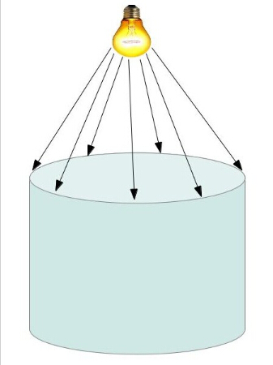
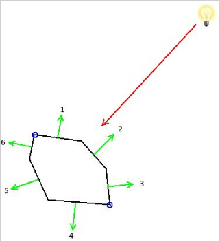
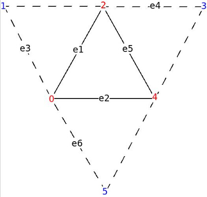
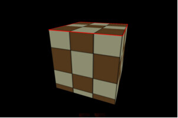

# 第三十九课 边缘检测

## 背景

这一课中我们将介绍一种检测对象边缘的方式，为了方便介绍，我们这里所提到的 3D 对象的轮廓都是当从任意方向上照射到物体上的光线创建出来的。当光源发生移动时，物体的轮廓也会随之变化。这与在 2D 图片中检测图片中物体的边界完全不同（图片中的边缘检测与光源的位置无关）。虽然说这一课的主要目的是介绍边缘检测的，但是对于我来说这一课另一个重要目的是作为 **模板阴影体** 技术的第一个步骤，模板阴影体技术主要用于渲染点光源所产生的阴影，我们会在下一课学习这个技术（所以你也可以将这一课作为模板阴影体的第一部分）。

下面的图片展示饿了我们所想实现的边缘检测效果：

  

上面的图片中与光线接触的椭圆就是我们希望得到的轮廓。  

现在让我们以更加传统的 3D 语言来描述这个问题，一个模型实际上也是由很多三角形组成的，所以轮廓也一定是由三角形的边缘组成的,但是我们如何判断某一条边就是轮廓的一部分呢？诀窍就是借助于漫反射光照模型。根据这个模型光照的强度是由三角形的法线向量与光照方向向量的点乘得到的，如果三角形的朝向光源的另一边，那么点乘的结果应该是小于或者等于 0，在这种情况下光源对三角面不会产生任何影响。为了判断三角形的某一条边是否为轮廓的一部分我们需要找到共享这一条边的另外一个三角形，并用光照方向向量与这两个三角形的法向量分别做点乘，如果其中一个三角形朝向光源而另一个三角形却不朝向光源（其中一个三角形的点乘结果大于 0， 而另外一个三角形小于或等于 0），那么这一条边就可以确定为轮廓的一部分。

为了简单起见我们先用一个 2D 对象来说明这个方法：  

   

红色的箭头代表了照射到三条边上（在 3D 世界中这些边应该看做三角形，这里仅仅是为了说明问题用 2D 世界的一条边来代表 3D 世界的一个三角面）的光线，这三条边的法线方向分别为 1，2 和 3（这些法线光照方向的反方向的向量之间的点乘结果很明显都大于 0）。法线方向分别为 4，5 和 6 的边都没有朝向光源（进行同样的点乘操作这些边的结果都会小于小于或等于 0 ）。被蓝色的圆圈标记的两个点就可以看做是这个对象的轮廓，因为边 1 是朝向光源的，但是它的相邻边 6 确不是，所以他们之间的点就是轮廓的一部分。对于其他轮廓点的判定也是一样的。如果某一条边朝向光源，但是与他相邻的边也是朝向光源的那么他们之间共享的点就不是轮廓的一部分（如边 1 和边 2 之间的点）。

正如你所看到的这样，找到轮廓的算法十分简单，但是它却需要我们能够访问每个三角形的三个相邻三角形，即邻接三角形。不幸的是 Assimp 不支持邻接三角形的计算，所以我们需要自己实现这一套算法。在编写代码的时候我们会介绍一个满足我们需求的简单算法。  

但是我们在渲染管线的哪一个阶段来运行我们的轮廓检测算法呢？记住我们需要在光线方向向量和三角形法线方向以及这个三角形的三个邻接三角形法线方向之间进行点乘计算，这需要我们能够访问所有的图元信息，所以不应该在 VS 中进行计算。看起来 GS 阶段可能更加适合用于轮廓计算，因为在 GS 中允许访问图元的所有顶点，但是如何找到邻接三角形呢。幸运的是 OpenGL 的设计者早就考虑到了这一点，并且创建了一个名为三角邻接的拓扑类型。如果你在顶点缓存中存放了邻接信息，这些数据都会被正确的导入到 GS 中，并且对于每个三角形 GS 中都会保存 6 个顶点而不是 3 个顶点。多出的 3 个顶点分别属于与当前三角形邻接的三个三角形。并且这三个顶点不属于当前三角形。下面的图片应该能好的解释这个问题：

    

上图中的红色顶点是属于原来的三角形，蓝色的顶点输入这个三角形的邻接三角形（先不用关注边 e1 - e6 ，在编写代码的时候才会用到他们）。如果我们将上面图中所示格式的数据保存到顶点缓存中，VS 会对所有的顶点都执行一次（不论顶点属于邻接三角形还是原始三角形），GS （如果有的话）则会对上面这样的每一组顶点执行一次（包括原始三角形和邻接三角形的顶点）。如果存在 GS 开发者可以输出一个拓扑结构，但是如果没有 GS 则光栅化阶段会直接忽略这些邻接数据。

需要注意的是顶点缓存中的所存放的顶点没有没有邻接顶点和普通顶点之分，决定一个顶点是否为邻接顶点仅仅是根据其在每一组顶点中的相对位置。例如在一个由连续的三角形组成的模型中，同一个顶点有时作为普通顶点有时也可看做是邻接顶点，这都是根据当前三角形来说的。这种方式同样也节约了顶点缓存的空间，使得索引绘制也更加具有吸引力。

## 代码

```
(mesh.cpp:204)
void Mesh::FindAdjacencies(const aiMesh* paiMesh, vector& Indices)
{ 
    for (uint i = 0 ; i < paiMesh->mNumFaces ; i++) {
        const aiFace& face = paiMesh->mFaces[i];
        Face Unique;
        // If a position vector is duplicated in the VB we fetch the 
        // index of the first occurrence.
        for (uint j = 0 ; j < 3 ; j++) { 
            uint Index = face.mIndices[j];
            aiVector3D& v = paiMesh->mVertices[Index];
            if (m_posMap.find(v) == m_posMap.end()) {
                m_posMap[v] = Index;
            }
            else {
                Index = m_posMap[v];
            } 
            Unique.Indices[j] = Index;
        }
        m_uniqueFaces.push_back(Unique);
        Edge e1(Unique.Indices[0], Unique.Indices[1]);
        Edge e2(Unique.Indices[1], Unique.Indices[2]);
        Edge e3(Unique.Indices[2], Unique.Indices[0]);
        m_indexMap[e1].AddNeigbor(i);
        m_indexMap[e2].AddNeigbor(i);
        m_indexMap[e3].AddNeigbor(i);
    } 
```

与邻接计算有关的逻辑都包含在上面这个函数中，当然我们还定义了一些辅助结构体。这个算法包含了两个阶段，在第一个阶段中我们将每条边以及共享这一条边的两个三角形都存放在一个 map 中，这一部分都是在上面这个 for 循环中进行的，在这个循环中的前半部分，我们生成了一个 map 用于存放每个顶点的位置以及这个顶点的第一个索引。对于位于同一个位置的顶点却存在在不同的索引，这是因为有的时候顶点的其他一些属性会迫使 Assimp 将同一个顶点分成两个顶点进行处理。例如如果有两个相邻的面共享同一个顶点，这个顶点可能就会有两个不同的纹理坐标，所有 Assimp 就会将这个顶点看做是有不同纹理坐标的两个顶点。但是这样会对我们的邻接算法产生一些问题，我们希望每个顶点只会出现一次，所以我们创建了一个 map，并将用顶点的位置坐标作为主键，防止出现两个位于同一个位置的顶点。

```
(mesh.cpp:240)
    for (uint i = 0 ; i < paiMesh->mNumFaces ; i++) { 
        const Face& face = m_uniqueFaces[i];
        for (uint j = 0 ; j < 3 ; j++) { 
            Edge e(face.Indices[j], face.Indices[(j + 1) % 3]);
            assert(m_indexMap.find(e) != m_indexMap.end());
            Neighbors n = m_indexMap[e];
            uint OtherTri = n.GetOther(i);
            assert(OtherTri != -1)
            const Face& OtherFace = m_uniqueFaces[OtherTri];
            uint OppositeIndex = OtherFace.GetOppositeIndex(e);
            Indices.push_back(face.Indices[j]);
            Indices.push_back(OppositeIndex); 
        }
    } 
} 
```

在第二阶段中我们按照前面图中所示的拓扑结构将邻接三角形的数据存放到索引向量中，我们在第一阶段中创建的 map 数据在这里就帮上大忙了，对于三角形的每一条边我们就能很方便的找到共享这条边的另一个三角形，并且也能找到那个三角形的不在这条边上的另一个顶点。这个循环中的最后两行交替的将当前三角形的顶点和邻接三角形的顶点写入到索引向量中。  

Mesh 类中只添加了一些新的函数以及变量，我建议你可以和前面课程中的 Mesh 类比较一下以确保你掌握了这一课中所有的变化，还有一个明显的变化是我们在调用 glDrawElementsBaseVertex() 函数时并没有使用 GL\_TRIANGLES 作为绘制的拓扑结构而是使用 GL\_TRIANGLES\_ADJACENCY。如果你忘记了这里，那么 OpenGL 向 GS 中传入的图元的大小就会出问题。   

```
(silhouette.vs)
 #version 330
layout (location = 0) in vec3 Position; 
layout (location = 1) in vec2 TexCoord; 
layout (location = 2) in vec3 Normal; 
out vec3 WorldPos0; 
uniform mat4 gWVP; 
uniform mat4 gWorld; 
void main() 
{ 
    vec4 PosL = vec4(Position, 1.0);
    gl_Position = gWVP * PosL;
    WorldPos0 = (gWorld * PosL).xyz; 
} 
```

在这一课的 Demo 中我们将会对对象的轮廓进行检测并用红色的细线条来绘制轮廓。对象本身还是会使用我们通常使用的前向渲染光照着色器，而轮廓则会使用这一课中添加的轮廓检测着色器。上面的代码就是这个着色器中的 VS 的代码，这里面并没有进行任何特别的处理，我们只需要使用 WVP 矩阵将顶点的位置信息变换到裁剪空间，并向 GS 中传入位于世界坐标系下的顶点坐标即可（因为轮廓检测算法也是在世界坐标系下进行计算的）。  

```
(silhouette.gs)
 #version 330
layout (triangles_adjacency) in;
layout (line_strip, max_vertices = 6) out;
in vec3 WorldPos0[];
void EmitLine(int StartIndex, int EndIndex)
{
    gl_Position = gl_in[StartIndex].gl_Position;
    EmitVertex();
    gl_Position = gl_in[EndIndex].gl_Position;
    EmitVertex();
    EndPrimitive();
}
uniform vec3 gLightPos;
void main()
{
    vec3 e1 = WorldPos0[2] - WorldPos0[0];
    vec3 e2 = WorldPos0[4] - WorldPos0[0];
    vec3 e3 = WorldPos0[1] - WorldPos0[0];
    vec3 e4 = WorldPos0[3] - WorldPos0[2];
    vec3 e5 = WorldPos0[4] - WorldPos0[2];
    vec3 e6 = WorldPos0[5] - WorldPos0[0];
    vec3 Normal = cross(e1,e2);
    vec3 LightDir = gLightPos - WorldPos0[0];
    if (dot(Normal, LightDir) > 0.00001) {
        Normal = cross(e3,e1);
        if (dot(Normal, LightDir) <= 0) {
            EmitLine(0, 2);
        }
        Normal = cross(e4,e5);
        LightDir = gLightPos - WorldPos0[2];
        if (dot(Normal, LightDir) <=0) {
            EmitLine(2, 4);
        }
        Normal = cross(e2,e6);
        LightDir = gLightPos - WorldPos0[4];
        if (dot(Normal, LightDir) <= 0) {
            EmitLine(4, 0);
        }
    }
} 
```

与边缘检测有关的所有逻辑都在 GS 里面，当我们使用邻接拓扑结构的三角形进行绘制时 GS 就能得到一个包含 6 个顶点的数组，首先我们根据这些点计算出了一些边的向量，这些可以帮助我们计算当前三角形以及其邻接三角形的法向量，参看上面的图片就能理解程序里定义的 e1 - e6 与实际的边之间的对应关系。之后我们通过对原始三角形的法向量与光照向量（光照向量值的是朝向光源的向量）之间进行点乘运算来判断三角形是否是朝向光源的。如果点乘结果为正那么这个三角形就是朝向光源的（由于浮点数的计算误差我们在判断时做了一些处理）。如果原始三角形不是朝向光源的，那么就不用进行之后的判断了。但如果原始三角形就朝向光源，我们会对它的三个邻接三角形做同样的点乘操作。如果有一个邻接三角形的点乘结果为负（即不朝向光源），那么我们就调用 EmitLine() 函数将这两个三角形之间共享这个边传递到渲染管线的下一个阶段中。FS 会将这个边绘制成红色。  

```
(tutorial39.cpp:183)
void RenderScene()
{
    // Render the object as-is
    m_LightingTech.Enable();
    Pipeline p;
    p.SetPerspectiveProj(m_persProjInfo);
    p.SetCamera(m_pGameCamera->GetPos(), m_pGameCamera->GetTarget(), m_pGameCamera->GetUp()); 
    p.WorldPos(m_boxPos);
    m_LightingTech.SetWorldMatrix(p.GetWorldTrans()); 
    m_LightingTech.SetWVP(p.GetWVPTrans()); 
    m_mesh.Render();
    // Render the object's silhouette
    m_silhouetteTech.Enable();
    m_silhouetteTech.SetWorldMatrix(p.GetWorldTrans()); 
    m_silhouetteTech.SetWVP(p.GetWVPTrans()); 
    m_silhouetteTech.SetLightPos(Vector3f(0.0f, 10.0f, 0.0f));
    glLineWidth(5.0f);
    m_mesh.Render(); 
} 
```

在主渲染函数中，我们使用轮廓检测着色器来绘制轮廓，同一个对象我们绘制了两次，第一次只是用标准的光照着色器进行绘制，之后再使用轮廓检测着色器进行绘制，需要注意的是 glLightWidth() 函数的使用，这个函数用于设置绘制的线的宽度。

如果你运行这一课中的 Demo，你可能会注意到轮廓线的周围有一些轻微的抖动，这是因为在第二遍绘制过程中我们绘制的轮廓线的深度值与原来模型中边缘的深度值几乎是一样的。这使得轮廓的像素和原始模型的像素之间的覆盖产生了冲突（同样是因为浮点数的精度问题）。为了解决这个问题，我们可以调用 glDepthFunc(GL_LEQUAL) 对深度测试过程进行设置，这样如果有新的像素绘制到当前像素上，在两者的深度值相同的情况下，新的像素会替换到之前的像素。

## 操作结果

 