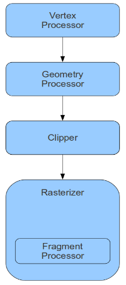

#OpenGL教程翻译  第四课 Shaders
##Background
从这一节开始，我们要加入的所有效果都会使用 Shaders 来实现，Shaders 是进行三维图形学编程的先进方法，从某种意义上来说 Shader 的出现是图形学中的一种”退步”，因为在这之前所有的功能都直接由固定管线提供，而开发人员只需要为其指定参数（如光照属性、旋转角度等），但是由于 Shader 的出现这些功能现在都需要开发者自己通过 Shader 实现。尽管如此，这种可编程性能够提供给开发者更多的灵活性和创造性。  
OpenGL的可编程管线如下图所示：  
  

顶点处理器负责对传入渲染管线的每个顶点执行顶点着色器中的内容，（传入的顶点的数量由绘制函数确定），顶点着色器并不关心所要渲染的基本图元的拓扑结构。此外，你不能在顶点处理器中丢弃任何一个顶点。每个顶点都只被顶点处理器处理一次，在经过矩阵变换之后继续进入接下来的流水线。  

下一个阶段是几何处理器，组成图元所需要的顶点以及其邻接关系都会被提供给着色器。这使得着色器能够考虑除顶点本身之外的其他信息。除此之外，几何处理器也可以将在绘制函数中确定的拓扑关系修改成另外一种拓扑关系。例如你可以通过创建一个顶点列表来生成两个三角形（如一个正方形）.除此之外，你也可以在每次调用几何着色器的时候对一个顶点进行多次引用，通过这样的方式我们可以按照我们在几何着色器中选定的拓扑结构来生成多个图元。  

渲染管线中的下一个阶段是裁剪，这是一个单一功能的固定功能单元——它通过我们前面课程中见过的规范化盒子对图元进行裁剪。同时它还通过近裁剪面和远裁剪面对其进行裁剪。同时他也支持用户自定义裁剪面对场景进行裁剪。未被裁剪掉的顶点会变换到屏幕坐标系之下，之后通过光栅化将顶点按照拓扑结构渲染到屏幕上。例如，如果我们要绘制一个三角形那就意味着要找出位于三角形内部的所有点。对于这样每一个点，在光栅化过程中都会调用片元处理器对其进行处理。在片元处理器中我们可以通过对纹理进行取样或者使用其他技术来确定像素的颜色。  

顶点着色器、片元着色器、几何着色器这三个可编程阶段是可选择的，如果我们不向其绑定 Shader 程序就会执行默认的固定管线的函数。  

着色器程序的创建与C/C++程序的创建相似。首先你需要编写着色器程序文本并使之对你的程序可见，我们可以直接将shader程序文本存放在一个字符串数组中并将其包含你的源码中或者从外部文本文件中导入（依然转化成字符串数组）即可。其次我们需要将Shader源程序逐个编译成 Shader 对象。之后可以将编译好的 Shader 对象链接到一个单独的程序对象中并将其载入到 GPU。对 Shader 程序进行链接使得驱动程序能够根据他们之间的关系对 Shader 程序进行裁剪和优化。例如，例如，你可以为一个传出法线信息的顶点着色器匹配一个不使用法线的片元着色器。这样的话驱动程序中的 GLSL 编译器就会将与法线有关的操作移除来提高顶点着色器的运行效率。如果同样是这个顶点着色器但是和另外一个需要使用法线信息的片元着色器链接到另外一个程序对象上，则顶点着色器中与法线相关的操作就不会被剔除。  

##Code Walkthru

```
GLuint ShaderProgram = glCreateProgram();
```

我们通过创建一个shader程序对象来开始我们的着色器工程，我们将会把所有的shader程序都链接到这个sahder程序对象上。  

```
GLuint ShaderObj = glCreateShader(ShaderType);
```

通过调用上面的函数我们创建了两个 Shader 对象，其中一个 Shader 对象的类型为 GL_VERTEX_SHADER，另一个为 GL_FRAGMENT_SHADER。这两个类型的 Shader对象的指定 Shader 源程序和编译 Shader 程序的过程是一样的。  

```
const GLchar* p[1];
p[0] = pShaderText;
GLint Lengths[1];
Lengths[0]= strlen(pShaderText);
glShadersource(ShaderObj, 1, p, Lengths);
```

在对 Shader 对象进行编译之前我们必须为其指定 Shader 源程序，glShadersource 函数需要一个 Shader 对象作为参数，这个函数为 Shader 源程序的指定提供了一种很灵活的方法。源程序可以分布在多个字符串数组中，你需要提供这些数组的指针数组以及一个用于存放对应数组长度的整数数组。为了简单起见，整个着色器代码我们仅使用一个字符串数组，源程序指针数组和和长度数组都只有一个元素。glShadersource(ShaderObj, 1, p, Lengths)的第二个参数是这两个数组的元素个数。  

```
glCompileShader(ShaderObj);
```

编译shader程序。  

```
GLint success;
glGetShaderiv(ShaderObj, GL_COMPILE_STATUS, &success);
if (!success) {
    GLchar InfoLog[1024];
    glGetShaderInfoLog(ShaderObj, sizeof(InfoLog), NULL,InfoLog);
    fprintf(stderr, "Error compiling shader type %d:'%s'\n", ShaderType, InfoLog);
}
```

很多时候，你会遇到一些编译错误。上面的代码能获得编译状态并且显示编译器遇到的错误。  

``` 
glAttachShader(ShaderProgram, ShaderObj);
```

最后，我们将编译之后的 Shader 对象附加到程序对象上，这和在 Makefile 中链接一个对象链表类似。因为我们这儿没有 Makefile 所以通过编程来实现这种功能。只有被附加到程序对象上的 Shader 对象才会参与链接过程。  

```
glLinkProgram(ShaderProgram);
```

在编译好所有 Shader 对象以及将他们附加到程序对象之后我们就可以进行链接操作。注意在链接程序对象之后你可以通过为每个 Shader 对象调用 glDetachShader 和 glDeleteShader 方法来删除其中的 Shader 对象。OpenGL驱动程序会为其生成的大部分对象维持一个引用计数。如果我们在创建一个 Shader 对象之后又将其删除则驱动程序会将这个 Shader 对象剔除掉，但是如果我们将 Shader 对象附加到程序对象之后调用 glDeleteShader 函数则只会将 Shader 对象标记为删除部分，你需要调用 glDetachShader 函数其引用计数才会下降到0之后才会被移除。  

```
glGetProgramiv(ShaderProgram, GL_LINK_STATUS,&Success);
if (Success == 0) {
    glGetProgramInfoLog(ShaderProgram, sizeof(ErrorLog), NULL,ErrorLog);
    fprintf(stderr, "Error linking shader program:'%s'\n", ErrorLog);
}
```

需要注意的是我们检查程序相关的错误（如链接错误）与检查 Shader 相关错误有些许不同。我们使用 glGetShaderiv 函数和 glGetShaderInfoLog 函数代替 glGetShaderiv 函数和 glGetShaderInfoLog 函数。  

```
glValidateProgram(ShaderProgram);
```

你也许会问既然我们都已经成功的链接了程序对象为什么还需要对其进行验证呢。它们之间的区别是链接主要检查基于着色器组合的错误，而上面调用的函数则是验证基于当前的管线状态程序是否能够成功执行。在一个有多个shader程序和很多状态变化的复杂程序中，在每次绘制之前都进行验证是更加明智的。在我们这个简单的程序中我们仅仅对其调用了一次。当然你也可以仅仅在开发过程中进行这样的验证而避免在最终产品中增加这个不必要的开销。  

```
glUseProgram(ShaderProgram);
```

最后，我们调用上面的函数将链接之后的 Shader 程序对象添加到渲染管线中。除非我们使用其他的 Shader 程序对象来替换当前的程序对象或者通过调用 glUseProgram（NULL）显式的禁用它的使用（并且启用固定管线），否则这个 Shader 程序对象会对每次的绘制都会产生效果。如果你创建的 Shader 程序对象只包含一种类型的 Shader 程序，那么其他阶段的操作会默认的调用固定管线中的功能。
我们已经介绍了 OpenGL 中与 Shader 程序管理相关的函数，本教程中剩下的就是与顶点着色器和片元着色器相关的内容了（包含在“pVS”和“pFS”变量中）。  

```
 #version 330
```

这告诉编译器我们的 Shader 程序是针对3.3版本的 GLSL，如果编译器不支持这个版本则会报错。

```
layout (location = 0) in vec3 Position;
```

这条语句出现在顶点着色器中，他声明了一个指定为顶点属性的float类型三维向量，这个向量在shader中被表示为‘Position’。‘顶点属性’意味着 GPU 中的 Shader 程序每调用一次，顶点缓冲区都会为其提供一个新的顶点数据。语句中的第一部分——layout (location = 0)将属性名称与缓冲区中的属性进行绑定。这在我们的顶点中包含多个属性（位置、法线、纹理坐标等）时显得尤为重要。我们必须要告诉编译器顶点缓冲区中的顶点属性与 Shader 中声明的属性的映射关系。有两种方法可以实现这个功能，首先我们可以显式的对其进行设置就和我们在这儿设置的一样（设置为0），这种情况下我们在应用程序中使用硬编码（正如我们调用 glVertexAttributePointer 函数时的第一个参数一样）；或者我们直接不管他（直接在 Shader 中声明‘in vec3 Position’），之后在应用程序运行过程中通过调用 glGetAttribLocation 获取其地址，在这种情况下我们需要将返回的地址传递给 glVertexAttributePointer 而不是使用硬编码值。在这里我们选择比较简单的方式来实现，但是对于比较复杂的应用程序在运行时确定属性索引会更加好。这使得在不用将多个 Shader 源程序调整到一个缓冲区布局的情况下更容易将其整合。  

```
void main()
```

我们可以通过将多个 Shader 对象链接到一起来创建你自己的着色器，但是在每个着色器阶段（VS，GS，FS）只能有一个 main 函数作为着色器的入口点。例如你可以通过多个函数创建一个灯光库，并且将它链接到你所提供的 Shader 程序对象上，其中一个函数名为 main 函数。  

```
gl_Position = vec4(0.5 * Position.x, 0.5 *Position.y, Position.z, 1.0);
```

在这里我们通过编码对传入的顶点位置进行变换，我们将顶点的 X、Y 分量的值减半而保持 Z 方向值不变，gl-Position 是一个特殊的内置变量，他能够存放齐次（包含X,Y,Z和W分量）顶点坐标。在光栅化过程中系统会寻找这个变量并使用它作为顶点在屏幕上的位置（需要经过一些矩阵变换）。将顶点的X,Y分量减半意味着我们将会看到一个面积只有前面教程中的四分之一的三角形。需要注意的是我们将W分量设置为1.0，这对于三角形的正确显示是非常重要的，实现从3D到2D的投影变换实际上是在两个不同的阶段实现的，首先你需要让所有的顶点都乘上投影矩阵（我们将在后面的教程中对此进行介绍），之后 GPU 在对其进行光栅化之前自动对位置属性（Position）执行透视分割。这意味着 gl-Position 中的所有分量都会除以W分量。在本节的顶点着色器中我们并没有进行任何与投影有关的操作，但是我们不能禁用透视分割阶段。不论我们从顶点着色器中输出 gl_Position 中的任何值都会被除以其W分量。为了得到我们所期望的结果我们需要记住这一点。为了避免透视分割对结果产生影响我们将W分量设置为1.0.除以1.0并不会影响 Position 向量中的其他分量，并使其依旧处于规范化盒子中。
如果所有部分都正确工作，那么这三个顶点(-0.5, -0.5), (0.5, -0.5) 和(0.0, 0.5)会进入光栅化阶段。由于所有点都正好处于规范化盒子之中，所以裁剪器并不需要做任何事。这些值会被映射到屏幕坐标系中，之后光栅化阶段开始遍历处于三角形内部的所有点。对于三角形中的每个点都会对其执行片元着色器，下面的代码就来自于片元着色器。  

``` 
out vec4 FragColor;
```

一般情况下片元着色器的作用就是确定片元的颜色，除此之外，片元着色器也完全可以丢弃片元或则改变其Z值（Z值的改变会对之后的深度测试产生影响）。输出颜色是通过声明上面的变量实现，四个分量分别表示R，G，B和A（alpha）。被写入到这个变量中的值会被光栅化程序接受并最终写入到帧缓存中。  

```
FragColor = vec4(1.0, 0.0, 0.0, 1.0);
```

在前面的教程中由于我们并没有使用片元着色器，所以所有的物体都被绘制成默认的白色。这里我们将颜色设置为红色。

##Operation Result

 

