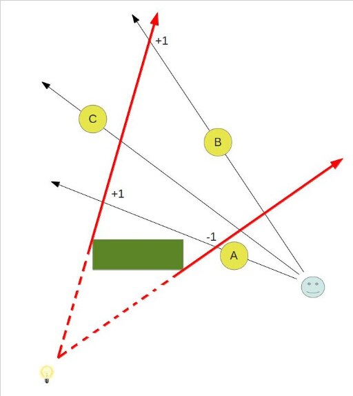
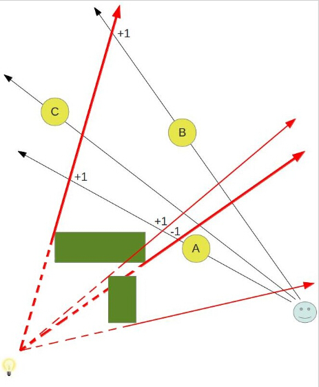
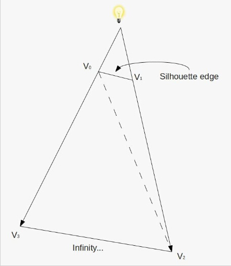
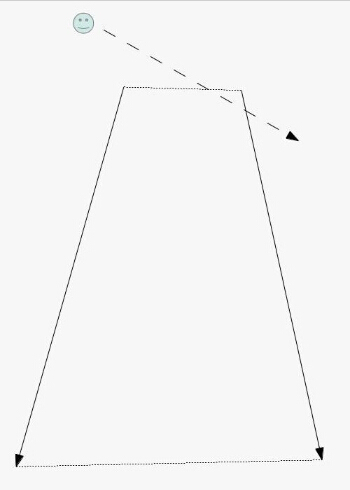
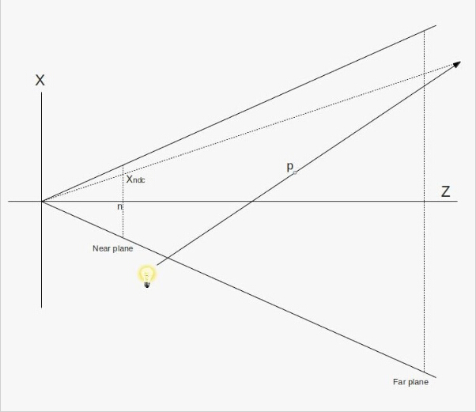
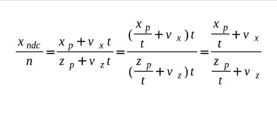
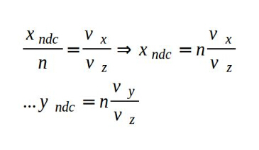
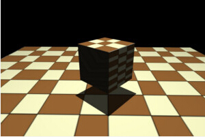

# 第四十课 模板阴影体

##背景

在 23 和 24 课中我们学习了阴影纹理，这是一个相对简单的在 3D 世界中实现阴影的方法。阴影纹理在处理点光源产生的阴影的时候有一些缺陷，因为在生成阴影纹理的时候我们需要一个方向向量，但是对于点光源来说它产生的光线的方向是朝向所有方向的，所以要得到这样一个向量比较困难。但是还有其他方法可以解决这个问题，这个方法会比较复杂一点但同时它也可以用于聚光灯光源上，这个方法就是模板阴影体，这个技术是由 William Bilodeau 和 Michael Songy 在 1998 年发明的，并在 John Carmack 的 Doom 3 引擎中大放异彩。   

如果你是跟着这个教程学下来的话，你之前应该在延迟渲染部分见过了这个技术的一个变形，在延迟渲染中我们需要一个方法来限制光源的影响，所以我们使用了光源体，这样我们只需要对光源体内部的像素进行处理即可。现在我们要做的则与之相反，我们会创建一个阴影体并且只对位于位于阴影体之外的像素进行光照计算。和光源体一样我们会借助于模板缓存作为这个算法的关键部分。  

阴影体算法的思想是将光线照射到对象上时所创建出的轮廓扩展成一个阴影体，之后使用一些简单的模板操作将它渲染到模板缓存中去，关键点就是当一个对象位于阴影体之中时（在阴影中）阴影体的正面在与这个对象的像素进行深度测试时会成功，而阴影体的背面在深度测试中会失败。  



在图片的左下角有一个灯泡，而且这个灯泡使得图中的绿色物体（遮挡器）后面产生了阴影。同样的在这个场景中我们渲染了 3 个对象，对象 B 位于阴影中而 A 和 C 不在。红色的箭头之间就是阴影覆盖的区域（虚线部分不属于这个区域）  

现在让我们看看如何利用模板缓存来产生阴影。首先我们像平常一样将场景对象（A, B，C 以及绿色的盒子）渲染到深度缓存中，完成之后我们就能得到场景中离相机最近的所有像素。之后我们遍历场景中的所有对象并为每个对象创建一个阴影体，上面的图例中只显示了绿色盒子的阴影体，但是在一个完整的程序中我们会为每个圆形对象都创建一个阴影体，因为他们也会产生阴影。阴影体的创建是根据检测出的轮廓（参考 39 课中的内容）并将其扩展到三维空间中。之后根据下面的一些简单规则将阴影体渲染到模板缓存中：  

- 在渲染阴影体反面时，如果深度测试失败则使模板缓存中的值加一；
- 在渲染阴影体正面时，如果深度测试失败则是模板缓存中的值减一；
- 在下面情况时我们不做任何处理：深度测试通过、模板测试失败。

让我们看看如果按照上面的方式设置模板操作模板缓存中的值会怎么变化，对于对象 A，不管是阴影体的正面还是反面在深度测试时都会失败，对于模板缓存中被对象 A 所覆盖的像素，他们里面的值都会进行一次加一操作和一次减一操作，所以这些像素里面的值依然是 0。对于对象 B 来说阴影体的正面在深度测试时会成功而背面会失败，因此模板缓存中被对象 B 所覆盖的像素中的值仅仅会进行一次加一操作。而对于对象 C，不论是阴影体的正面还是反面在深度测试时都会成功，因此模板缓存中的值不需要更新依旧会是 0.  

注意到目前为止我们还没有考虑颜色缓存中的情况，当我们完成了上面的所有工作之后，我们还会使用标准的光照着色器将场景中的所有对象再渲染一次，但是这次我们会对模板测试进行设置，使得只有模板值为 0 的像素才会被渲染。这意味着只有对象 A 和 C 才会被渲染到屏幕上。

这里是一个更加复杂的场景，它里面包含了两个遮挡物：

  

为了便于分辨出第二个遮挡器的阴影体范围，我们用两个更加细的红色箭头来表示，根据模板缓存中的值的变化（标记为 +1 和 -1 的地方）我们可以看到在多个遮挡物的情况下我们的算法依然可以很好的工作。和上一幅图片中的区别就是现在对象 A 也是处于阴影中。  

现在让我们将这些知识应用到实际程序中，正如我们之前提到的，我们需要对阴影体进行渲染，而这个阴影体是由遮挡物的轮廓扩展而来的，因此在程序中首先我们可以借助于上一课中的代码来进行轮廓检测，我们需要做的就是将这个轮廓扩展成一个阴影体。

阴影体的扩展可以在 GS 中将轮廓的每一个边都扩展成一个四边形（或者一个四个顶点的三角形带拓扑结构）。这个四边形的前两个顶点就是组成当前轮廓边缘的两个顶点，而另外两个顶点则可以通过将前两个顶点沿着光线到这两个顶点的向量继续延伸而生成，通过这样的无限延伸，我们能够确保阴影体能够将所有位于阴影中的对象都包含在内，这个四边形可以通过下面的图片进行描述：

   

当我们对组成轮廓的所有边都进行了上面的处理之后，阴影体就创建成功了，但这就足够了么？当然不是，现在这个阴影体就像是一个没有顶部的截锥体。由于我们的算法是要依赖于阴影体的正面和反面进行深度测试的结果，所以我们需要将它构成一个封闭的立方体，这样观察整个场景时视线才不会只是穿过阴影体的正面或者反面：  

   

解决这个问题的方法就是生成一个两端封闭的立方体，所以我们需要为这个阴影体创建上下两个底面（上图中的虚线部分）。创建上底面十分简单，所有朝向光源的三角形都可以作为上底面的一部分，这可能不是最有效率的办法，你可能也能用更少的三角形来创建出这个面，但是这个办法应该算的上是最简单的办法了。创建下底面也比较简单，我们只需要将朝向光源的三角形扩展到无限远处（沿着光源到每个顶点的向量）并反转他们的顺序即可（如果不这么做的话，得到的三角形就会朝向立方体内部）。  

“**无限远**”这几个字已经出现了很多次了，现在我们需要为这几个字做一个明确的定义，先看看下面的图片：  

  

上面的图片中是一个平头椎体，图中的灯泡发射出了一束光线穿过 P 点并延伸到无线远处。换句话说，P 被扩展到了无限远处。很明显，在无限远处，P 点的位置坐标就应该是（无限远，无限远，无限远）。但是我们并不关心这个，我们关注的是如何将阴影体的底面进行光栅化，即如何将这个顶点投影到投影平面上。这个投影平面实际上就是近裁剪面，虽然 P 点被沿着光线向量扩展到了无限远处，但是我们还是可以将它投影到近裁剪面上。我们可以参看从原点发出的与光线向量相交与某一点的那条虚线。现在我们需要的就是 Xp（扩展到无穷远处的 P 点投影到近裁剪面上时的 X 坐标）的值。  

我们可以使用  'p + vt'  来描述位于光线向量上的任意一点， 'v' 就是从光源指向 ‘p’ 点的向量，‘t’ 是一个范围在 0 到无穷大之间的一个缩放值，由上图以及相似三角形我们可以得出下面的结论：

   

‘n’ 即为近裁剪面的 Z 值， 随着 ‘t’ 趋近于无穷大我们可以得到下面的结论：

    

这样我们就能找到位于无限远处的 P 在近裁剪面上面的投影，这里还有一点需要特殊处理的地方——根据上面的计算方式要计算出 Xp 和 Yp 的值我们只需要用视图/投影矩阵乘上向量(Vx, Vy, Vz, 0)（向量 ‘V’ 是从光源处指向 ‘p’ 点的向量）并进行透视除法即可。这一部分我们在这里不做讲解，你们可以自己尝试并看看结果如何。所以结论就是当我们想光栅化一个包含着被沿着某一向量扩展到无穷远处的顶点的三角形时，我们只需要对这个向量进行视图/投影矩阵变换并添加一个值为 0 的 ‘w’ 分量。在下面的 GS 程序中，我们广泛的使用这一技术。  

## 代码

```
(glut_backend.cpp:83)
glutInitDisplayMode(GLUT_DOUBLE|GLUT_RGBA|GLUT_DEPTH|GLUT_STENCIL); 
```

在开始编写这一课的代码之前，你需要确保将上面这段代码添加到程序中，如果没有这段代码，默认的帧缓存创建时就不会创建模板缓存。

```
(tutorial40.cpp:146)
virtual void RenderSceneCB()
{ 
    CalcFPS();
    m_scale += 0.1f;
    m_pGameCamera->OnRender();
    glClear(GL_COLOR_BUFFER_BIT | GL_DEPTH_BUFFER_BIT | GL_STENCIL_BUFFER_BIT);
    RenderSceneIntoDepth();
    glEnable(GL_STENCIL_TEST);
    RenderShadowVolIntoStencil();
    RenderShadowedScene();
    glDisable(GL_STENCIL_TEST);
    RenderAmbientLight();
    RenderFPS();
    glutSwapBuffers();
} 
```

在主渲染循环中分成了三个渲染阶段，在第一个阶段中我们将整个场景渲染到深度缓存中（没有影响到颜色缓存）；之后我们将阴影体渲染到模板缓存中，并且按照‘背景’中的描述对模板测试进行设置；最后会根据模板缓存中的数据对整个场景再次进行渲染（只有当模板缓存中的值为 0 的像素才会被渲染）。

这个算法与阴影纹理之间最大的区别就是在模板阴影体算法中位于阴影中的像素都不会进入到片元着色器，当我们使用阴影纹理时我们能够对位于阴影中的像素进行环境光计算，但是这里不能，因此我们在模板测试之后添加了一个环境光阶段。 

```
(tutorial40.cpp:207)
void RenderSceneIntoDepth()
{
    glDrawBuffer(GL_NONE);
    glDepthMask(GL_TRUE);
    m_nullTech.Enable();
    Pipeline p;
    p.SetCamera(m_pGameCamera->GetPos(), m_pGameCamera->GetTarget(), m_pGameCamera->GetUp());
    p.SetPerspectiveProj(m_persProjInfo); 
    p.WorldPos(m_boxPos); 
    p.Rotate(0, m_scale, 0);
    m_nullTech.SetWVP(p.GetWVPTrans()); 
    m_box.Render(); 
    p.Scale(10.0f, 10.0f, 10.0f);
    p.WorldPos(0.0f, 0.0f, 0.0f);
    p.Rotate(90.0f, 0.0f, 0.0f);
    m_nullTech.SetWVP(p.GetWVPTrans());
    m_quad.Render(); 
}
```

在这个函数中我们将整个场景渲染到深度缓存中，同时我们禁止了向颜色缓存的写入。当你的场景中存在多个遮挡物时，你需要将他们一个接一个的渲染到模板缓存中，但是对于深度缓存我们只需要渲染一次就行了，因为深度信息对所有的遮挡物来说都是一样的。由于我们只关心深度信息所以我们使用一个特殊的着色器程序来进行渲染（ FS 为空）。  

```
(tutorial40.cpp:231)
void RenderShadowVolIntoStencil()
{
    glDrawBuffer(GL_NONE);
    glDepthMask(GL_FALSE);
    glDisable(GL_CULL_FACE);
    // We need the stencil test to be enabled but we want it
    // to succeed always. Only the depth test matters.
    glStencilFunc(GL_ALWAYS, 0, 0xff);
    glStencilOpSeparate(GL_BACK, GL_KEEP, GL_INCR_WRAP, GL_KEEP);
    glStencilOpSeparate(GL_FRONT, GL_KEEP, GL_DECR_WRAP, GL_KEEP); 
    m_ShadowVolTech.Enable();
    m_ShadowVolTech.SetLightPos(m_pointLight.Position);
    Pipeline p;
    p.SetCamera(m_pGameCamera->GetPos(), m_pGameCamera->GetTarget(), m_pGameCamera->GetUp());
    p.SetPerspectiveProj(m_persProjInfo); 
    p.WorldPos(m_boxPos); 
    m_ShadowVolTech.SetVP(p.GetVPTrans());
    m_ShadowVolTech.SetWorldMatrix(p.GetWorldTrans()); 
    m_box.Render(); 
    glEnable(GL_CULL_FACE); 
}
```

这里才是真正开始有意思的地方，这里我们使用了阴影体着色器（m_ShadowVolTech），它是基于前一课中的轮廓检测着色器的，它利用检测出的遮挡物的轮廓来生成阴影体（包括阴影体的两个底面）。首先我们禁用向颜色缓存和深度缓存的写入，我们只需要更新模板缓存中的数据。之后我们禁用了背面剔除，因为在我们的算法中需要渲染阴影体的所有三角形。接下来我们将模板测试设置为始终通过，并将根据深度测试的失败来设置正面和反面的模板操作。在这之后我们只需要设置好着色器参数并渲染遮挡物即可。  

```
(tutorial40.cpp:262)
void RenderShadowedScene()
{
    glDrawBuffer(GL_BACK);
    // prevent update to the stencil buffer
    glStencilOpSeparate(GL_BACK, GL_KEEP, GL_KEEP, GL_KEEP);
    glStencilFunc(GL_EQUAL, 0x0, 0xFF);
    m_LightingTech.Enable();
    m_pointLight.AmbientIntensity = 0.0f;
    m_pointLight.DiffuseIntensity = 0.8f;
    m_LightingTech.SetPointLights(1, &m_pointLight);
    m_pGroundTex->Bind(GL_TEXTURE0);
    Pipeline p;
    p.SetPerspectiveProj(m_persProjInfo);
    p.SetCamera(m_pGameCamera->GetPos(), m_pGameCamera->GetTarget(), m_pGameCamera->GetUp());
    p.WorldPos(m_boxPos);
    p.Rotate(0, m_scale, 0);
    m_LightingTech.SetWVP(p.GetWVPTrans());
    m_LightingTech.SetWorldMatrix(p.GetWorldTrans()); 
    m_box.Render();
    p.Scale(10.0f, 10.0f, 10.0f);
    p.WorldPos(0.0f, 0.0f, 0.0f);
    p.Rotate(90.0f, 0.0f, 0.0f);
    m_LightingTech.SetWVP(p.GetWVPTrans());
    m_LightingTech.SetWorldMatrix(p.GetWorldTrans());
    m_quad.Render(); 
} 
```

现在我们可以使用更新后的模板缓存了，基于我们的算法，我们对模板测试进行设置，使得只有当模板缓存中值为 0 的像素才能被渲染，因此现在我们就能够使用标准的光照着色器来渲染整个场景了。需要注意的是在渲染之前你需要启用向颜色缓存中的写入。  

```
(tutorial40.cpp:297)
void RenderAmbientLight()
{
    glDrawBuffer(GL_BACK);
    glDepthMask(GL_TRUE);
    glEnable(GL_BLEND);
    glBlendEquation(GL_FUNC_ADD);
    glBlendFunc(GL_ONE, GL_ONE);
    m_LightingTech.Enable();
    m_pointLight.AmbientIntensity = 0.2f;
    m_pointLight.DiffuseIntensity = 0.0f;
    m_LightingTech.SetPointLights(1, &m_pointLight);
    m_pGroundTex->Bind(GL_TEXTURE0);
    Pipeline p;
    p.SetPerspectiveProj(m_persProjInfo);
    p.SetCamera(m_pGameCamera->GetPos(), m_pGameCamera->GetTarget(), m_pGameCamera->GetUp());
    p.WorldPos(m_boxPos);
    p.Rotate(0, m_scale, 0);
    m_LightingTech.SetWVP(p.GetWVPTrans());
    m_LightingTech.SetWorldMatrix(p.GetWorldTrans()); 
    m_box.Render();
    p.Scale(10.0f, 10.0f, 10.0f);
    p.WorldPos(0.0f, 0.0f, 0.0f);
    p.Rotate(90.0f, 0.0f, 0.0f);
    m_LightingTech.SetWVP(p.GetWVPTrans());
    m_LightingTech.SetWorldMatrix(p.GetWorldTrans());
    m_quad.Render(); 
    glDisable(GL_BLEND);
} 
```

环境光阶段能帮助我们避免被模板测试丢弃的像素成为完全的黑色，在真实世界中我们不会见到这样极端的阴影，所以我们会对所有的像素添加一些环境光效果，这是在另外一个光照阶段中进行的，而且这个阶段中的渲染与模板测试无关。这里需要注意这些问题：我们将漫反射光照强度归零（光照强度都是由阴影来决定的）并且启用了混合（为了使这一阶段输出的颜色与前面阶段的结果合并在一起）。现在让我们看看它的着色器代码。  

```
(shadow_volume.vs)
 #version 330
layout (location = 0) in vec3 Position; 
layout (location = 1) in vec2 TexCoord; 
layout (location = 2) in vec3 Normal; 
out vec3 WorldPos; 
uniform mat4 gWVP; 
uniform mat4 gWorld; 
void main() 
{ 
    vec4 PosL = vec4(Position, 1.0);
    gl_Position = gWVP * PosL;
    WorldPos = (gWorld * PosL).xyz; 
} 
```

顶点着色器还是十分的简单——我们需要做的就是讲顶点位置信息变换到世界坐标系下，其他的都在 GS 中完成。  

```
(shadow_volume.gs)
 #version 330
layout (triangles_adjacency) in;
layout (triangle_strip, max_vertices = 18) out;
in vec3 WorldPos[];
uniform vec3 gLightPos;
uniform mat4 gVP;
float EPSILON = 0.01;
void EmitQuad(int StartIndex, vec3 StartVertex, int EndIndex, vec3 EndVertex)
{
    vec3 LightDir = normalize(StartVertex - gLightPos);
    vec3 l = LightDir * EPSILON;
    gl_Position = gVP * vec4((StartVertex + l), 1.0);
    EmitVertex();
    gl_Position = gVP * vec4(LightDir, 0.0);
    EmitVertex();
    LightDir = normalize(EndVertex - gLightPos);
    l = LightDir * EPSILON;
    gl_Position = gVP * vec4((EndVertex + l), 1.0);
    EmitVertex();
    gl_Position = gVP * vec4(LightDir, 0.0);
    EmitVertex();
    EndPrimitive(); 
}
void main()
{
    vec3 e1 = WorldPos[2] - WorldPos[0];
    vec3 e2 = WorldPos[4] - WorldPos[0];
    vec3 e3 = WorldPos[1] - WorldPos[0];
    vec3 e4 = WorldPos[3] - WorldPos[2];
    vec3 e5 = WorldPos[4] - WorldPos[2];
    vec3 e6 = WorldPos[5] - WorldPos[0];
    vec3 Normal = cross(e1,e2);
    vec3 LightDir = gLightPos - WorldPos[0];
    if (dot(Normal, LightDir) > 0.000001) {
        Normal = cross(e3,e1);
        if (dot(Normal, LightDir) <= 0) {
            vec3 StartVertex = WorldPos[0];
            vec3 EndVertex = WorldPos[2];
            EmitQuad(0, StartVertex, 2, EndVertex);
        }
        Normal = cross(e4,e5);
        LightDir = gLightPos - WorldPos[2];
        if (dot(Normal, LightDir) <= 0) {
            vec3 StartVertex = WorldPos[2];
            vec3 EndVertex = WorldPos[4];
            EmitQuad(2, StartVertex, 4, EndVertex);
        }
        Normal = cross(e2,e6);
        LightDir = gLightPos - WorldPos[4];
        if (dot(Normal, LightDir) <= 0) {
            vec3 StartVertex = WorldPos[4];
            vec3 EndVertex = WorldPos[0];
            EmitQuad(4, StartVertex, 0, EndVertex);
        }
        vec3 LightDir = (normalize(WorldPos[0] - gLightPos)) * EPSILON;
        gl_Position = gVP * vec4((WorldPos[0] + LightDir), 1.0);
        EmitVertex();
        LightDir = (normalize(WorldPos[2] - gLightPos)) * EPSILON;
        gl_Position = gVP * vec4((WorldPos[2] + LightDir), 1.0);
        EmitVertex();
        LightDir = (normalize(WorldPos[4] - gLightPos)) * EPSILON;
        gl_Position = gVP * vec4((WorldPos[4] + LightDir), 1.0);
        EmitVertex();
        EndPrimitive();
    }
} 
```

GS 着色器代码和轮廓着色器中的代码有很多相似之处，但是我们关注的仅仅是朝向光源的面。每当我们检测出了轮廓的一条边，我们对其进行扩展，记住在每一组顶点中，原始三角形的索引是 0， 2， 4，邻接三角形的顶点索引分别为 1， 3， 5（参考上一课中的图片）。在将每条边扩展成四边形之后我们需要考虑阴影体的两个底面了。需要注意的是对于上底面我们并不是直接使用原有的三角形，而是将它沿着光线向量移动一小段距离。这同样是考虑到浮点数的精度问题，防止阴影体与上底面之间的覆盖。  

对于下底面，我们只需将原始顶点沿着光向量扩展之后再进行投影，并反转他们的顺序即可。

为了从一个边扩展成一个四边形，我们将所有的顶点沿着光源向量扩展到无穷远处并生产一个三角形带。需要注意的是原始三角形的顶点也向着光线向量移动了一小段距离（为了配合上底面的移动）。   

最重要但是我们需要正确的设置从 GS 中输出的最大顶点数（参见 'max_vertices'  定义）。上底面有 3 个顶点，下底面也有三个顶点，每个轮廓边缘也会扩展成 4 个顶点。在刚开始的时候我将最大输出顶点数设置为 10 并导致了很多奇怪的错误，希望你们不会犯同样的错误。  

```
(glut_backend.cpp:111)
void GLUTBackendRun(ICallbacks* pCallbacks)
{
    ...
    glEnable(GL_DEPTH_CLAMP);
    ...
} 
```

最后但不是最终要的——我们启用了 GL\_DEPTH_CLAMP。这意味着当下底面被扩展到无穷远处时这个面不会因为超出远裁剪面而被视锥体裁剪掉，而是位于远裁剪面上。如果没有这一个调用，底面可能会被裁剪。

## 操作结果
   
