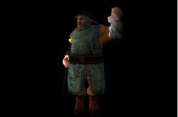

# 第四十一课 运动模糊

## 背景

运动模糊在现如今的 3D 游戏中是一项非常流行的技术，他主要是为运动的物体添加一个模糊效果，增强了玩家真实感。运动模糊有多种实现方式，有的是基于相机来实现，主要专注于相机的运动；有的是基于对象的，在这一课中会学习其中一种方法来完成这个功能。  

运动模糊背后的原理就是我们可以计算出两帧之间每个像素运动的向量（即运动矢量）。通过沿着这个运动矢量在当前颜色缓存中进行采样并对他们取平均值就能得到代表当前物体运动的像素。这就是我们需要完成的全部，下面我们总结一下实现运动模糊的具体步骤。

1. 整个过程可以分成两个阶段——渲染阶段和运动模糊阶段。  
2. 在渲染阶段我们将场景渲染到两个缓存中 —— 颜色缓存和一个运动矢量缓存。颜色缓存中保存原始的场景信息，运动矢量缓存中则为每个像素保存一个向量值，这个向量代表了当前像素从前一帧到当前帧在屏幕上的运动矢量。
3. 运动向量是通过将上一帧的 WVP 矩阵传入到 VS 中进而计算出来的，我们用当前的 WVP 矩阵和上一帧的 WVP 矩阵将位于局部坐标系下的每一个顶点分别变换到各自的裁剪空间中，并将这两个结果都传递到 FS 中去，这样我们就得到了经过插值之后位于裁剪空间中的顶点坐标，之后我们通过透视除法将他们变换到 NDC 空间中，这就完成了他们投射到屏幕的整个过程，现在我们就可以用这个顶点在当前帧中屏幕中的位置减去上一帧它在屏幕上的位置就能得到这个运动向量，这个向量之后会被写入到纹理中。
4. 运动模糊阶段则是通过渲染一个全屏幕的四边形实现的，在 FS 中我们通过采样得到每个像素的运动向量,再从颜色缓存中采样得到沿着这个向量的所有像素(从当前像素开始)。
5. 将采样得到的结果根据不同的权重加载一起（如当前像素的权重最大，离当前像素最远的权重最低（在这一课中我们是使用的这种方法，但是也可以使用其他方式达到相同的目的）。
6. 将上一步中得到的沿着运动向量的采样的平均值就能创造出一种模糊的感觉，很显然在两帧之间没有运动的像素不会发生任何变化，这就是我们想要的效果。

这一课中是基于骨骼动画（ 38 课）的，这里我们会回顾实现运动模糊所需要增加的代码。

## 代码

```
(tutorial41.cpp:157)
virtual void RenderSceneCB()
{ 
    CalcFPS();
    m_pGameCamera->OnRender();
    RenderPass();
    MotionBlurPass();
    RenderFPS(); 
    glutSwapBuffers();
} 
```

这是主渲染函数，而且这个函数十分简单，首先调用了渲染阶段函数用于将场景中的所有对象渲染到颜色缓存中，之后进入一个后处理阶段来进行运动模糊的计算。

```
(tutorial41.cpp:172)
void RenderPass()
{
    m_intermediateBuffer.BindForWriting();
    glClear(GL_COLOR_BUFFER_BIT | GL_DEPTH_BUFFER_BIT);
    m_pSkinningTech->Enable();
    vector Transforms;
    float RunningTime = (float)((double)GetCurrentTimeMillis() - (double)m_startTime) / 1000.0f;
    m_mesh.BoneTransform(RunningTime, Transforms);
    for (uint i = 0 ; i < Transforms.size() ; i++) {
        m_pSkinningTech->SetBoneTransform(i, Transforms[i]);
        m_pSkinningTech->SetPrevBoneTransform(i, m_prevTransforms[i]);
    } 
    m_pSkinningTech->SetEyeWorldPos(m_pGameCamera->GetPos());
    m_pipeline.SetCamera(m_pGameCamera->GetPos(), m_pGameCamera->GetTarget(), m_pGameCamera->GetUp());
    m_pipeline.SetPerspectiveProj(m_persProjInfo); 
    m_pipeline.Scale(0.1f, 0.1f, 0.1f); 
    Vector3f Pos(m_position);
    m_pipeline.WorldPos(Pos); 
    m_pipeline.Rotate(270.0f, 180.0f, 0.0f); 
    m_pSkinningTech->SetWVP(m_pipeline.GetWVPTrans());
    m_pSkinningTech->SetWorldMatrix(m_pipeline.GetWorldTrans()); 
    m_mesh.Render();  
    m_prevTransforms = Transforms;
} 
```
这个是我们渲染阶段的函数，这个函数与骨骼动画那一课中的代码没有什么大的区别，只有一些小的改动。m_intermediateBuffer 是一个对 FBO 进行了封装的类对象，它里面包含了一个颜色缓存、一个深度缓存和一个运动向量缓存。类似用法我们在延迟渲染中也使用过了（ 35 - 37 课），所以这里就不再赘述。它的基本思想是将场景渲染到一个 FBO 中而不是直接渲染到屏幕上。在运动模糊阶段我们需要使用 FBO 中的数据。  

除此之外你可以看到我们在 'Tutorial41' 类中添加了成员变量用于保存上一帧中的骨骼变换信息，我们同样会把这个数据传递到骨骼动画着色器中，在介绍到 GLSL 代码时我们就可以看到如何来使用这些信息的了。  

```
(tutorial41.cpp:209)
void MotionBlurPass()
{
    m_intermediateBuffer.BindForReading();
    glClear(GL_COLOR_BUFFER_BIT|GL_DEPTH_BUFFER_BIT);
    m_pMotionBlurTech->Enable();
    m_quad.Render();
} 
```

在运动模糊阶段我们将 m_intermediateBuffer 对象绑定为输入（这意味着渲染的结果将会输出到屏幕上）并且渲染了一个铺满屏幕的四边形。屏幕上的每个像素都会被进行处理一遍并计算出运动模糊的效果。  

```
(skinning.vs)
 #version 330 
layout (location = 0) in vec3 Position; 
layout (location = 1) in vec2 TexCoord; 
layout (location = 2) in vec3 Normal; 
layout (location = 3) in ivec4 BoneIDs;
layout (location = 4) in vec4 Weights;
out vec2 TexCoord0;
out vec3 Normal0; 
out vec3 WorldPos0; 
out vec4 ClipSpacePos0;
out vec4 PrevClipSpacePos0; 
const int MAX_BONES = 100;
uniform mat4 gWVP;
uniform mat4 gWorld;
uniform mat4 gBones[MAX_BONES];
uniform mat4 gPrevBones[MAX_BONES];
void main()
{ 
    mat4 BoneTransform = gBones[BoneIDs[0]] * Weights[0];
    BoneTransform += gBones[BoneIDs[1]] * Weights[1];
    BoneTransform += gBones[BoneIDs[2]] * Weights[2];
    BoneTransform += gBones[BoneIDs[3]] * Weights[3];
    vec4 PosL = BoneTransform * vec4(Position, 1.0);
    vec4 ClipSpacePos = gWVP * PosL;
    gl_Position = ClipSpacePos;
    TexCoord0 = TexCoord;
    vec4 NormalL = BoneTransform * vec4(Normal, 0.0);
    Normal0 = (gWorld * NormalL).xyz;
    WorldPos0 = (gWorld * PosL).xyz; 
    mat4 PrevBoneTransform = gPrevBones[BoneIDs[0]] * Weights[0];
    PrevBoneTransform += gPrevBones[BoneIDs[1]] * Weights[1];
    PrevBoneTransform += gPrevBones[BoneIDs[2]] * Weights[2];
    PrevBoneTransform += gPrevBones[BoneIDs[3]] * Weights[3];
    ClipSpacePos0 = ClipSpacePos;
    vec4 PrevPosL = PrevBoneTransform * vec4(Position, 1.0);
    PrevClipSpacePos0 = gWVP * PrevPosL; 
} 
```

上面是 VS 中的代码，在这一课中我们添加了一个一致变量数组用于传递上一帧的骨骼变换信息，我们可以用这些数据计算出当前顶点上一帧在裁剪空间的位置。这个顶底啊在当前帧的位置到这个位置的向量会被传递到 FS 中。  

```
(skinning.fs:123)
layout (location = 0) out vec3 FragColor;
layout (location = 1) out vec2 MotionVector;
void main()
{ 
    VSOutput In;
    In.TexCoord = TexCoord0;
    In.Normal = normalize(Normal0);
    In.WorldPos = WorldPos0;
    vec4 TotalLight = CalcDirectionalLight(In); 
    for (int i = 0 ; i < gNumPointLights ; i++) { 
        TotalLight += CalcPointLight(gPointLights[i], In); 
    } 
    for (int i = 0 ; i < gNumSpotLights ; i++) { 
        TotalLight += CalcSpotLight(gSpotLights[i], In); 
    } 
    vec4 Color = texture(gColorMap, TexCoord0) * TotalLight;
    FragColor = Color.xyz;
    vec3 NDCPos = (ClipSpacePos0 / ClipSpacePos0.w).xyz;
    vec3 PrevNDCPos = (PrevClipSpacePos0 / PrevClipSpacePos0.w).xyz;
    MotionVector = (NDCPos - PrevNDCPos).xy;
} 
```

FS 现在会输出两个向量到两个不同的缓存中（颜色缓存和运动向量缓存）。颜色缓存数据的计算与之前一样，为了计算运动向量，我们对位于裁剪空间的坐标数据执行透视除法，并通过相减获得这个向量。  

需要注意的是运动向量只是一个 2D 向量，因为他们是位于屏幕这个 2D 平面上的。对应的运动向量缓存的类型我们同样是设置为 GL\_RG 。  

```
(motion_blur.vs)
 #version 330
layout (location = 0) in vec3 Position;
layout (location = 1) in vec2 TexCoord; 
out vec2 TexCoord0;
void main()
{ 
    gl_Position = vec4(Position, 1.0);
    TexCoord0 = TexCoord;
} 
```

这是运动模糊着色器的 VS 代码，这段代码仅仅是将覆盖整个屏幕的这个四边形的顶点和纹理坐标传递到渲染管线的下一阶段。  

```
(motion_blur.fs)
 #version 330
in vec2 TexCoord0;
uniform sampler2D gColorTexture;
uniform sampler2D gMotionTexture;
out vec4 FragColor;
void main()
{ 
    vec2 MotionVector = texture(gMotionTexture, TexCoord0).xy / 2.0;
    vec4 Color = vec4(0.0);
    vec2 TexCoord = TexCoord0;
    Color += texture(gColorTexture, TexCoord) * 0.4;
    TexCoord -= MotionVector;
    Color += texture(gColorTexture, TexCoord) * 0.3;
    TexCoord -= MotionVector;
    Color += texture(gColorTexture, TexCoord) * 0.2;
    TexCoord -= MotionVector;
    Color += texture(gColorTexture, TexCoord) * 0.1;
    FragColor = Color;
} 
```

这才是真正进行模糊处理计算的地方，我们从 FBO 中的运动向量缓存中进行采样获得当前像素的运动向量，之后沿着这个向量从颜色缓存中采样获得 4 个纹素。首先我们用原始的纹理坐标采样得到当前像素的颜色值，这个像素值的权重最大（0.4）。之后我们将纹理坐标沿着运动向量移动并得到其他三个纹素的颜色值，并且乘上一个越来越小的权重值。将这 4 个值加在一起就得到最终的结果。  

## 操作结果

