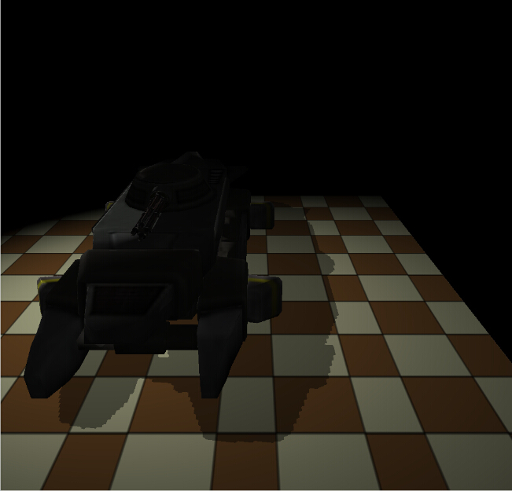
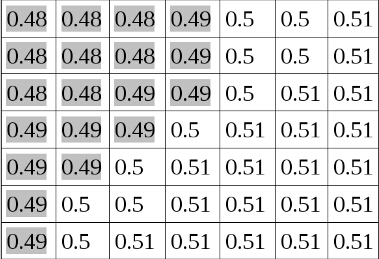
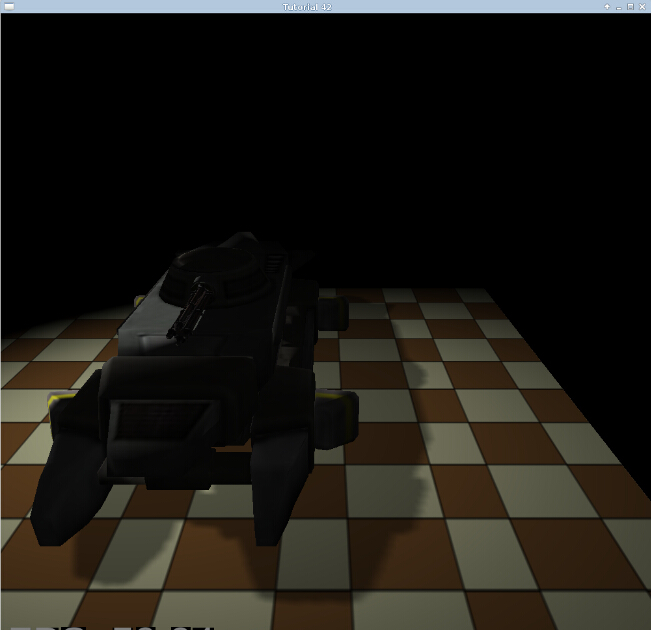

# 第四十二课 基于 PCF 的阴影优化

## 背景

在 24 课中我们学习了使用阴影纹理技术来实现阴影效果，但是阴影纹理实现的效果不是特别好，阴影边缘出现了很多锯齿，就像下面图片中这样：



这一课中我们会介绍一个优化这个问题的方法，这个方法就是 PCF，这个算法核心就是对阴影纹理中当前像素的周围进行多次采样，并将当前像素的深度值分别与所有采样结果比较，通过对最后的结果求平均值，这样我们就使得阴影的边缘显得更加平滑，例如像下面这个阴影纹理：

  

每个格子里面都保存了其对应像素的深度值（从光源处渲染时）。为了简单起见，我们假设从相机处渲染场景时，场景中所有像素的深度值都是 0.5，。根据 24 课所介绍的算法，阴影纹理中深度值小于 0.5 的像素都应该是处于阴影中的，而阴影纹理中深度值大于或等于 0.5 的像素都能接受到光照，这样就会在阴影边缘产生很硬的锯齿。  

现在考虑以下情况，当一个像素很靠近阴影边缘时，阴影纹理中这个像素周边的像素的深度值有的会比 0.5 小，有的则会大于等于 0.5。如果我们对这些附近的像素进行采样并对他们求平均，这样我们就能得到一个因子用于柔化阴影的边缘。当然我们并不知道到底哪些像素是处于阴影的边缘的，所以我们会对所有的像素都进行这样的处理。在这一课中我们会在每个像素周围采样 9 个像素点并对他们求平均。这将作为我们的阴影因子而不是我们在 24 课中使用的 0.5 或者 1.0。  

现在让我们看一下 PCF 的实现源码，我们会在 24 课的基础上进行改进以实现这一课中的内容，你可以对前面的所讲的内容做一个简单回顾以方便这一课的学习。

## 代码

```
(lighting.fs:64)
uniform sampler2DShadow gShadowMap;
 #define EPSILON 0.00001
float CalcShadowFactor(vec4 LightSpacePos)
{
    vec3 ProjCoords = LightSpacePos.xyz / LightSpacePos.w;
    vec2 UVCoords;
    UVCoords.x = 0.5 * ProjCoords.x + 0.5;
    UVCoords.y = 0.5 * ProjCoords.y + 0.5;
    float z = 0.5 * ProjCoords.z + 0.5;
    float xOffset = 1.0/gMapSize.x;
    float yOffset = 1.0/gMapSize.y;
    float Factor = 0.0;
    for (int y = -1 ; y <= 1 ; y++) {
        for (int x = -1 ; x <= 1 ; x++) {
            vec2 Offsets = vec2(x * xOffset, y * yOffset);
            vec3 UVC = vec3(UVCoords + Offsets, z + EPSILON);
            Factor += texture(gShadowMap, UVC);
        }
    }
    return (0.5 + (Factor / 18.0));
} 
```

这是更新之后的阴影因子的计算函数，函数的开始部分还是和之前一样，我们手动的对位于光源的裁剪空间中的顶点进行透视除法，并将他们变从（-1，+1）的范围变换到 （0， 1）纹理空间中。这样我们就可以用这个纹理坐标从阴影纹理中获得的结果与当前像素的 Z 值进行比较。之后的部分区别就比较大了，我们需要在当前像素周围取 3 x 3 一共9 个点，所以我们需要 9 个纹理坐标。由于 UV 坐标的范围是在 0 到 1 之间，而且映射到的纹素范围为 (0, Width-1) 和 (0, Height-1)，我们可以用 1 除以纹理的宽度和高度来获得每个纹素的大小，纹理的大小数据都是存放在 gMapSize 这个一致变量中的。这样我们就能得到纹理坐标系中两个相邻纹素之间的偏移量。  

之后我们在一个 for 循环中计算出所需要的每个纹素的偏移量，这个循环中的最后两行看起来可能就有点奇怪了。我们使用一个包含 3 个分量（UVC）的向量从阴影纹理中进行采样而不是两个分量。这个向量的最后一个分量包含了当前像素相对与光源的 Z 值，在 24 课中我们手动的将这个值和阴影纹理中的采样的值进行比较（我们对 Z 值加了一个精度值避免 Z 冲突）。这里主要的变化就是我们定义的 gShadowMap 变量是 sampler2DShadow 类型而不是 sampler2D 类型，当我们使用阴影类型的采样器时（sampler1DShadow, sampler2DShadow 等）GPU 会在采样得到的纹素值和我们提供的纹理坐标的最后一个分量之间进行一个比较，如果失败则返回结果为 0，如果比较成功就返回 1。这个比较操作可以通过 GL API 进行配置而不是在 GLSL 中进行设置，后面我会介绍它的设置。到目前为止我们只需要假设如果像素处于阴影中我们就获得 0， 否则就返回 1。我们将 9 个返回值累加在一起并除以 18，这样我们就会得到一个位于 0 到 0.5 之间的值，之后我们再加上 0.5 就得到了最终的阴影因子。

```
(shadow_map_fbo.cpp:39)
bool ShadowMapFBO::Init(unsigned int WindowWidth, unsigned int WindowHeight)
{
    // Create the FBO
    glGenFramebuffers(1, &m_fbo);
    // Create the depth buffer
    glGenTextures(1, &m_shadowMap);
    glBindTexture(GL_TEXTURE_2D, m_shadowMap);
    glTexImage2D(GL_TEXTURE_2D, 0, GL_DEPTH_COMPONENT32, WindowWidth, WindowHeight, 0, GL_DEPTH_COMPONENT, GL_FLOAT, NULL);
    glTexParameteri(GL_TEXTURE_2D, GL_TEXTURE_MIN_FILTER, GL_LINEAR);
    glTexParameteri(GL_TEXTURE_2D, GL_TEXTURE_MAG_FILTER, GL_LINEAR);
    glTexParameteri(GL_TEXTURE_2D, GL_TEXTURE_COMPARE_MODE, GL_COMPARE_REF_TO_TEXTURE);
    glTexParameteri(GL_TEXTURE_2D, GL_TEXTURE_COMPARE_FUNC, GL_LEQUAL);
    glTexParameteri(GL_TEXTURE_2D, GL_TEXTURE_WRAP_S, GL_CLAMP_TO_EDGE);
    glTexParameteri(GL_TEXTURE_2D, GL_TEXTURE_WRAP_T, GL_CLAMP_TO_EDGE);
    glBindFramebuffer(GL_FRAMEBUFFER, m_fbo);
    glFramebufferTexture2D(GL_DRAW_FRAMEBUFFER, GL_DEPTH_ATTACHMENT, GL_TEXTURE_2D, m_shadowMap, 0);
    // Disable writes to the color buffer
    glDrawBuffer(GL_NONE);
    // Disable reads from the color buffer
    glReadBuffer(GL_NONE);
    GLenum Status = glCheckFramebufferStatus(GL_FRAMEBUFFER);
    if (Status != GL_FRAMEBUFFER_COMPLETE) {
        printf("FB error, status: 0x%x\n", Status);
        return false;
    }
    return true;
} 
```

这里我们对阴影纹理的设置进行了一些修改，因为现在我们是使用阴影采样器而不是之前的普通采样器，这个函数中新加了两行代码，首先我们将纹理比较模式设置为' GL\_COMPARE\_REF\_TO\_TEXTURE '，默认情况下这个模式被设置为 GL\_NONE (只有这两个模式可选)，这样的话采样器的操作会和处理非阴影纹理一样。之后我们调用 glTexParameteri 函数将比较函数设置为 GL\_LEQUAL (小于或等于)，这意味着当引用结果小于或等于从阴影纹理中采样得到的值时就返回 1，否则返回 0。你也可以使用 GL\_GEQUAL, GL\_LESS, GL\_GREATER, GL\_EQUAL, GL\_NOTEQUAL 等操作进行相似的比较运算，当然也有 GL\_ALWAYS 使得返回值始终为 1，而 GL\_NEVER 使得始终返回 0。  


```
(tutorial42.cpp:174)
void ShadowMapPass()
{
    glCullFace(GL_FRONT);
    ...
}
void RenderPass()
{
    glCullFace(GL_BACK);
    ...
} 
```

最后需要指出的一点是为了避免自我遮挡，自我遮挡在几乎所有的阴影技术中都是一个很大的问题，这都是因为深度缓存的精度造成的（即使是 32 位也会出现），在阴影纹理渲染阶段我们将能接受到光照的像素的深度信息都记录在阴影纹理中，在渲染阶段我们当前像素的深度值与阴影纹理中的值进行比较，由于深度值的精度问题经常会导致 Z 冲突，使得某些本应该处于光照中的像素却到了阴影中，为了减少这个问题，我们将剔除函数进行了反转，在进行阴影纹理渲染阶段我们剔除正面（只渲染背面的多边形不渲染正面）。在渲染阶段我们还是像之前一样进行背面剔除。由于真实世界中的遮挡物一般都是封闭的立方体，所有使用背面进行进行深度比较也是可行的。你可以注释掉上面的代码来看看效果。

## 操作结果

  
