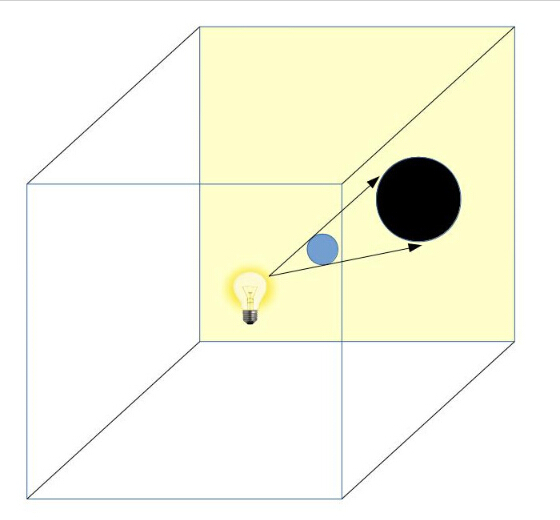
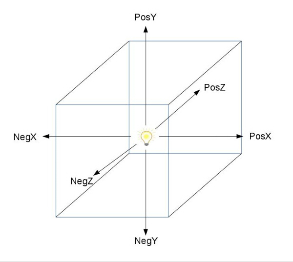
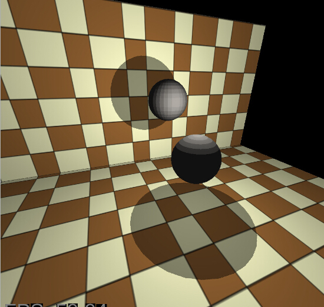

# 第四十三课 点光源的多通道阴影映射

## 背景

在 24 课中我们介绍了阴影纹理的基础 —— 首先在一个渲染通道中在光源的视角处渲染整个场景，之后再另一个渲染通道中从相机视角渲染整个场景并利用前一个通道的渲染结果进行阴影计算。对于这一点，很多程序员可能会问：这个方法对于平行光光源或者聚光灯光源是可行的，但是如何生成点光源的阴影呢？因为对点光源来说光照没有特定的方向，解决这个问题的方法就是本课所讨论的主题。   

这个问题的解决方法就是要认识到点光源发出的光照是朝向所有方向的，所以我们不应该将阴影投影到一个矩形的阴影纹理中（这样只能接受到一部分光照）而是应该将光源放在一个立方体纹理中间。现在我们就有了 6 个矩形的阴影纹理光源的所有方向的光照都能够记录下来了。每一个光束都会照射到六个阴影纹理中的一个之上，我们可以使用和之前一样的方法从这个阴影纹理上进行采样并进行阴影计算。我们在实现天空盒那一课中早已见过立方体纹理，所有应该不会陌生了。  

为了模拟点光源朝不同方向发射光线的特点我们会在光源周围创建六个阴影纹理渲染通道，但是每个通道都针对不同方向的光线，为了简单起见我们将使不同的每个面于下列坐标轴对其： X 轴正方向和负方向，Y 轴正方向和负方向，Z 轴正方向和负方向。 最终立方体纹理的每个面都会包含场景中离光源最近的像素的深度信息（在光源视口之下）。在光照阶段通过对每个像素到光源的距离的比较就能知道当前像素是否是处于阴影中。   

看看下面的图片：  



我们的场景中包含一个蓝色的球体，在它的附近有一个点光源（黄色的灯泡）。在第一个渲染通道中我们使用一个立方体纹理作为帧缓存，需要记住的是在这个阶段我们并不关心相机的位置和朝向，我们将相机放置在点光源处这样相机就像是始终位于立方体纹理的中心。在上面的例子中我们可以看到当前相机朝向的是 Z 轴镇方向（朝向黄色的面）。到了这里我们又回到了之前的阴影纹理处理过程，通过使用黄色阴影纹理中的深度值我们就能得到蓝色球体的阴影（球体的深度值都存放在黑色的圆形内，在第二阶段才会真正将阴影渲染出来）。  

下面这个图片中展示了我们在第一个渲染阶段会使用到的六个相机的朝向：

  

由于在第一阶段我们需要对同样的场景渲染 6 次，所以我们将这个技术叫做多通道阴影映射。

## 代码

```
(shadow_map_fbo.h)
class ShadowMapFBO
{
public:
    ShadowMapFBO();
    ~ShadowMapFBO();
    bool Init(unsigned int WindowWidth, unsigned int WindowHeight);
    void BindForWriting(GLenum CubeFace);
    void BindForReading(GLenum TextureUnit);
private:
    GLuint m_fbo;
    GLuint m_shadowMap;
    GLuint m_depth;
};
```

首先让我们看一下我们对阴影纹理的 FBO 做出的修改，这里面主要修改了两个地方： BindForWriting() 函数现在需要一个定义立方体面的枚举变量，由于我们需要在多个阶段中对立方体纹理进行渲染，所以我们需要告诉 GL 具体需要渲染立方体的哪个面；第二个不同的地方是添加了一个额外的深度缓存，之前我们使用 m\_shadowMap 作为阴影纹理对象（这个对象实际上就是一个深度缓存）。现在 m\_shadowMap 的类型是作为一个立方体纹理，所以我们需要一个专门的深度缓存对象，在渲染到立方体纹理中的每一个面的时候我们都会使用这个深度缓存（当然在每个通道开始之前我们也会清空这个缓存）。  

```
(shadow_map_fbo.cpp:46)
bool ShadowMapFBO::Init(unsigned int WindowWidth, unsigned int WindowHeight)
{
    // 创建 FBO
    glGenFramebuffers(1, &m_fbo);
    // 创建深度缓存
    glGenTextures(1, &m_depth);
    glBindTexture(GL_TEXTURE_2D, m_depth);
    glTexImage2D(GL_TEXTURE_2D, 0, GL_DEPTH_COMPONENT32, WindowWidth, WindowHeight, 0, GL_DEPTH_COMPONENT, GL_FLOAT, NULL);
    glTexParameteri(GL_TEXTURE_2D, GL_TEXTURE_MIN_FILTER, GL_LINEAR);
    glTexParameteri(GL_TEXTURE_2D, GL_TEXTURE_MAG_FILTER, GL_LINEAR);
    glTexParameteri(GL_TEXTURE_2D, GL_TEXTURE_WRAP_S, GL_CLAMP_TO_EDGE);
    glTexParameteri(GL_TEXTURE_2D, GL_TEXTURE_WRAP_T, GL_CLAMP_TO_EDGE);
    glBindTexture(GL_TEXTURE_2D, 0);
    // 创建立方体纹理
    glGenTextures(1, &m_shadowMap);
    glBindTexture(GL_TEXTURE_CUBE_MAP, m_shadowMap);
    glTexParameteri(GL_TEXTURE_CUBE_MAP, GL_TEXTURE_MIN_FILTER, GL_LINEAR);
    glTexParameteri(GL_TEXTURE_CUBE_MAP, GL_TEXTURE_MAG_FILTER, GL_LINEAR);
    glTexParameteri(GL_TEXTURE_CUBE_MAP, GL_TEXTURE_WRAP_S, GL_CLAMP_TO_EDGE);
    glTexParameteri(GL_TEXTURE_CUBE_MAP, GL_TEXTURE_WRAP_T, GL_CLAMP_TO_EDGE);
    glTexParameteri(GL_TEXTURE_CUBE_MAP, GL_TEXTURE_WRAP_R, GL_CLAMP_TO_EDGE);
    for (uint i = 0 ; i < 6 ; i++) {
        glTexImage2D(GL_TEXTURE_CUBE_MAP_POSITIVE_X + i, 0, GL_R32F, WindowWidth, WindowHeight, 0, GL_RED, GL_FLOAT, NULL);
    }
    glBindFramebuffer(GL_FRAMEBUFFER, m_fbo);
    glFramebufferTexture2D(GL_FRAMEBUFFER, GL_DEPTH_ATTACHMENT, GL_TEXTURE_2D, m_depth, 0);
    // 禁止向颜色缓存的写入
    glDrawBuffer(GL_NONE);
    // 禁止从颜色缓存的读取
    glReadBuffer(GL_NONE);
    GLenum Status = glCheckFramebufferStatus(GL_FRAMEBUFFER);
    if (Status != GL_FRAMEBUFFER_COMPLETE) {
        printf("FB error, status: 0x%x\n", Status);
        return false;
    }
    glBindFramebuffer(GL_FRAMEBUFFER, 0);
    return GLCheckError();
} 
```

这个是阴影纹理的初始化函数，首先我们创建了深度缓存并对其进行了设置，之后是立方体纹理，GL\_TEXTURE\_CUBE\_MAP 作为纹理绑定的目标。 这里有意思的部分就是立方体的 6 个面的初始化方式， OpenGL 为每个都提供了一个宏定义： GL\_TEXTURE\_CUBE\_MAP\_POSITIVE\_X, GL\_TEXTURE\_CUBE\_MAP\_NEGATIVE\_X 等等。 他们都是连续的定义的所以我们可以像上面那样进行循环设置（参考 glew.h 头文件中的宏定义，在我使用的版本中他们定义在 1319 行）。每一个面的每个纹素都是用一个 32 位的单精度浮点数进行初始化的。  

```
(tutorial43.cpp:183)
virtual void RenderSceneCB()
{ 
  CalcFPS();
  m_scale += 0.05f;
  m_pGameCamera->OnRender();
  ShadowMapPass();
  RenderPass();
  RenderFPS();
  glutSwapBuffers();
} 
```

这是场景的主渲染函数，与之前阴影纹理那一课中相比并没有变化，在这个层次来说我们同样有两个渲染阶段，即阴影纹理的生成和场景的渲染。  

```
(tutorial43.cpp:200)
void ShadowMapPass()
{
    glCullFace(GL_FRONT);
    m_shadowMapEffect.Enable();
    PersProjInfo ProjInfo;
    ProjInfo.FOV = 90.0f;
    ProjInfo.Height = WINDOW_HEIGHT;
    ProjInfo.Width = WINDOW_WIDTH;
    ProjInfo.zNear = 1.0f;
    ProjInfo.zFar = 100.0f; 
    Pipeline p;
    p.SetPerspectiveProj(m_persProjInfo); 
    glClearColor(FLT_MAX, FLT_MAX, FLT_MAX, FLT_MAX);
    for (uint i = 0 ; i < NUM_OF_LAYERS ; i++) {
        m_shadowMapFBO.BindForWriting(gCameraDirections[i].CubemapFace);
        glClear(GL_DEPTH_BUFFER_BIT | GL_COLOR_BUFFER_BIT); 
        p.SetCamera(m_pointLight.Position, gCameraDirections[i].Target, gCameraDirections[i].Up);
        p.Orient(m_mesh1Orientation);
        m_shadowMapEffect.SetWorld(p.GetWorldTrans());
        m_shadowMapEffect.SetWVP(p.GetWVPTrans());
        m_mesh.Render();
        p.Orient(m_mesh2Orientation);
        m_shadowMapEffect.SetWorld(p.GetWorldTrans());
        m_shadowMapEffect.SetWVP(p.GetWVPTrans());
        m_mesh.Render();
    } 
} 
```

这是阴影纹理阶段，这里有一些与普通阴影纹理不同的地方需要我们注意，首先视野角这里我们设置为 90 度，这是因为我们希望将整个场景都渲染到立方体纹理中，为了使相机完美的对上每个面，我们将其设置为四分之一个圆（360 度）。

之后立方体纹理的默认值设置为浮点类型的最大值（FLT\_MAX），在渲染的时候每个纹素中的值实际上会小的多，“真正的”像素中的值会比没有渲染的像素中的值。  

最后，我们遍历立方体贴图的每个面，使用 gCameraDirections （看下面）指定要渲染到的 FBO 中的面，并使得相机朝向这个面。  

```
(tutorial43.cpp:45)
struct CameraDirection
{
    GLenum CubemapFace;
    Vector3f Target;
    Vector3f Up;
};
CameraDirection gCameraDirections[NUM_OF_LAYERS] = 
{
    { GL_TEXTURE_CUBE_MAP_POSITIVE_X, Vector3f(1.0f, 0.0f, 0.0f), Vector3f(0.0f, -1.0f, 0.0f) },
    { GL_TEXTURE_CUBE_MAP_NEGATIVE_X, Vector3f(-1.0f, 0.0f, 0.0f), Vector3f(0.0f, -1.0f, 0.0f) },
    { GL_TEXTURE_CUBE_MAP_POSITIVE_Y, Vector3f(0.0f, 1.0f, 0.0f), Vector3f(0.0f, 0.0f, -1.0f) },
    { GL_TEXTURE_CUBE_MAP_NEGATIVE_Y, Vector3f(0.0f, -1.0f, 0.0f), Vector3f(0.0f, 0.0f, 1.0f) },
    { GL_TEXTURE_CUBE_MAP_POSITIVE_Z, Vector3f(0.0f, 0.0f, 1.0f), Vector3f(0.0f, -1.0f, 0.0f) },
    { GL_TEXTURE_CUBE_MAP_NEGATIVE_Z, Vector3f(0.0f, 0.0f, -1.0f), Vector3f(0.0f, -1.0f, 0.0f) }
}; 
```

这个数组包含了 GL 定义的用于指定立方体某个表面的枚举变量，同时也包含了相机朝向这个面时的朝向信息。  

```
(shadow_map_fbo.cpp:96)
void ShadowMapFBO::BindForWriting(GLenum CubeFace)
{
    glBindFramebuffer(GL_DRAW_FRAMEBUFFER, m_fbo);
    glFramebufferTexture2D(GL_DRAW_FRAMEBUFFER, GL_COLOR_ATTACHMENT0, CubeFace, m_shadowMap, 0);
    glDrawBuffer(GL_COLOR_ATTACHMENT0);
} 
```

上面这个函数用于在阴影纹理阶段指定需要渲染的立方体的表面，首先我们将 FBO 绑定为当前目标，之后我们将这个面绑定到 FBO 的第一个颜色挂载点上并向它写入。  

```
(tutorial43.cpp:237)
void RenderPass()
{
    glCullFace(GL_BACK);
    glBindFramebuffer(GL_FRAMEBUFFER, 0);
    glClearColor(0.0f, 0.0f, 0.0f, 0.0f);
    glClear(GL_COLOR_BUFFER_BIT | GL_DEPTH_BUFFER_BIT);
    m_lightingEffect.Enable();
    m_shadowMapFBO.BindForReading(SHADOW_TEXTURE_UNIT);
    m_lightingEffect.SetEyeWorldPos(m_pGameCamera->GetPos());
    Pipeline p;
    p.SetPerspectiveProj(m_persProjInfo); 
    p.SetCamera(*m_pGameCamera);
    // Render the quads
    m_pGroundTex->Bind(COLOR_TEXTURE_UNIT);
    p.Orient(m_quad1Orientation);
    m_lightingEffect.SetWorldMatrix(p.GetWorldTrans());
    m_lightingEffect.SetWVP(p.GetWVPTrans()); 
    m_quad.Render();
    p.Orient(m_quad2Orientation);
    m_lightingEffect.SetWorldMatrix(p.GetWorldTrans());
    m_lightingEffect.SetWVP(p.GetWVPTrans()); 
    m_quad.Render(); 
    // Render the meshes
    p.Orient(m_mesh1Orientation);
    m_lightingEffect.SetWorldMatrix(p.GetWorldTrans());
    m_lightingEffect.SetWVP(p.GetWVPTrans()); 
    m_mesh.Render(); 
    p.Orient(m_mesh2Orientation);
    m_lightingEffect.SetWorldMatrix(p.GetWorldTrans());
    m_lightingEffect.SetWVP(p.GetWVPTrans()); 
    m_mesh.Render(); 
} 
```

这是光照阶段的实现，所有的代码都和之前差别不大——我们将场景渲染到默认的帧缓存中，将立方体纹理绑定为输入，并根据相机位置设置相机参数。以上就是 C++ 部分的全部代码，接下来我们看一看着色器程序。  

```
(shadow_map.vs)
 #version 330
layout (location = 0) in vec3 Position;
layout (location = 1) in vec2 TexCoord;
layout (location = 2) in vec3 Normal;
uniform mat4 gWVP;
uniform mat4 gWorld;
out vec3 WorldPos;
void main()
{
    vec4 Pos4 = vec4(Position, 1.0);
    gl_Position = gWVP * Pos4;
    WorldPos = (gWorld * Pos4).xyz; 
} 
```

我们将会从光源的视口处渲染整个场景并且相机的朝向沿着一个坐标轴，将要被写入到立方体纹理中的数据是对象离光源的距离，所以在 FS 中我们需要对象的世界坐标系坐标才能够计算出来这个数据。  

```
(shadow_map.fs)
 #version 330
in vec3 WorldPos;
uniform vec3 gLightWorldPos;
out float FragColor;
void main()
{
    vec3 LightToVertex = WorldPos - gLightWorldPos;
    float LightToPixelDistance = length(LightToVertex);
    FragColor = LightToPixelDistance;
} 
```

现在在 FS 中我们有了片元在世界坐标系下的坐标和世界坐标系下光源的位置，我们可以计算出光源到像素的向量并获得其长度输出到颜色缓存中。  

```
(lighting.vs)
 #version 330
layout (location = 0) in vec3 Position;
layout (location = 1) in vec2 TexCoord;
layout (location = 2) in vec3 Normal;
out vec2 TexCoord0;
out vec3 Normal0;
out vec3 WorldPos0;
uniform mat4 gWVP;
uniform mat4 gWorld;
void main()
{ 
    gl_Position = gWVP * vec4(Position, 1.0); 
    TexCoord0 = TexCoord; 
    Normal0 = (gWorld * vec4(Normal, 0.0)).xyz; 
    WorldPos0 = (gWorld * vec4(Position, 1.0)).xyz; 
} 
```

这是更新之后的光照着色器的 VS 代码，有趣的是这里面少了一些代码——我们不用像之前的阴影纹理算法那样计算顶点在光源坐标系下的坐标，因为现在我们只需要找到世界坐标系下光源到像素的向量并以此从立方体纹理中进行采样即可。  

```
(lighting.fs)
...
uniform samplerCube gShadowMap;
...
float CalcShadowFactor(vec3 LightDirection)
{
    float SampledDistance = texture(gShadowMap, LightDirection).r;
    float Distance = length(LightDirection);
    if (Distance <= SampledDistance + EPSILON)
        return 1.0; // Inside the light
    else
        return 0.5; // Inside the shadow
} 
```

上面是光照着色器中 FS 主要的变化部分，阴影纹理采样器在这里使用了 samplerCube 而不是 sampler2D（24 课中使用的采样器）或者 sampler2DShadow （42 课中使用）。为了从纹理中进行采样我们使用计算出的从光源到像素的光照方向向量，需要注意的是我们需要使用光照方向向量的三个分量（X，Y，Z）进行采样，因为一个立方体是三维的所有我们需要一个三维向量来从对应的面上获得纹素。通过将采样得到的值与当前像素到光源的距离进行比较我们就能判断出这个像素是否位于阴影中。  


## 操作结果

