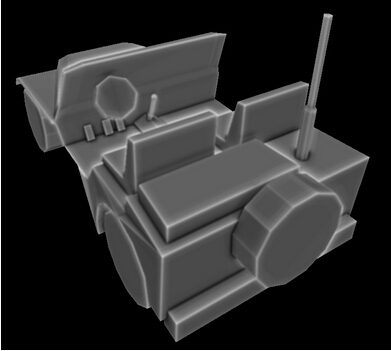
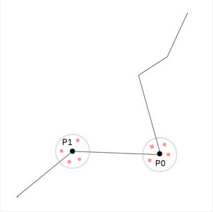
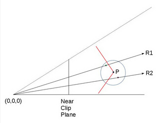
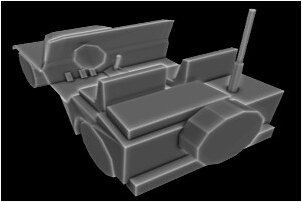

# 第四十五课 屏幕空间环境光遮挡

## 背景

你还记得我们的光照模型是如何推导出来的吗，回到 17 课我们先来看看我们之前的光照模型。首先是环境光，环境光是用于模拟一种普遍的感受——在光照充足或白天的情况下所有物体都是被点亮的，它的实现是为每个光源定义一个单精度浮点数（作为环境光强度），然后用这个浮点数乘上当前表面的纹理采样的颜色值。所有你可以只在场景中定义一个光源，其作用就相当于太阳，而且你可以通过调节这个光源的环境光强度来控制整个场景的大体亮度 —— 强度值越接近于 0，场景越暗，值越靠近于 1 场景越亮。  

在之后的课程中我们实现了漫反射光和镜面反射光效果，这有助于提升场景的整体效果但是基本的环境光照还是一样的。在近几年中出现了一个新的技术 —— 环境光遮挡，在这个技术中并不是为每个像素设置一个特定的环境光强度值，而是计算每个像素在环境光光源中的曝光情况。一个位于房间中间的地板上的像素通常会比位于角落里的像素曝光度更高，这意味着房间角落的像素会比其他像素更加暗，这就是环境光遮挡的核心思想。所以为了实现这个算法我们需要找到一个区分 “ 位于角落的像素 ” 和 “ 位于开放空间的像素 ” 的方法，通过这个方法计算出来的结果应该是一个环境光遮挡因子，这个因子会在最后的光照计算阶段控制环境光的计算。下面是这个环境光因子的可视化表现。  



你可以看到模型的边缘部分是最亮的，而那些处于更加角落的地方的像素我们认为其曝光度也较少，因而也更加暗。  

目前对环境光遮挡的研究也不少，而且也开发出了很多算法对其进行不断的完善，在这一课中我们将学习这些算法中的一个分支 —— 屏幕空间环境光遮挡，即 SSAO，这个算法是由 Crytek 公司开发，并随着游戏《孤岛危机》 的发行而大受欢迎。现在很多游戏中都实现了 SSAO 并且在这个基础上做了很多改进，这一课中我们要学习的是 John Chapman 的 SSAO 教程中的一个简化版本的算法。  

环境光遮挡十分耗费计算资源，Crytek 公司想出了一个折中的办法，为每个像素计算一次遮挡因子。这个算法名中的前缀“屏幕空间”，这意味着会依次遍历屏幕空间中的每一个像素，并提取每个像素在视图空间下的坐标信息，并在这个坐标点周围随机采样一些点，判断这些随机点位于几何体内部还是外部。如果许多点都是位于几何体内部，这就表示原始像素应该是位于角落中的因而接收到的光照也较少；如果大部分点都位于几何体之外，这就表示原始像素被 “高度曝光” ，因此接收到的光照也较多。例如下面这个图片：



在上面的图中有两个点 P0 和 P1，假设我们是从图像坐上角的某个地方进行观察。我们会在每个点周围随机采样一些点，并判断这些点是否位于几何体内部。对于 P0 来说它周围的随机点落在几何体内部的几率更大，而 P1 则相反。因此我们希望 P1 的环境光因子应该更大，这表示在最后的渲染结果中 P1 看起来会更加明亮。

接下来我们介绍更细节的部分。在我们的主渲染函数中的光照阶段之前，我们还需要添加一个环境光遮挡阶段（我们需要计算环境光因子）。环境光遮挡阶段会对屏幕上每个像素都进行一次计算。对于这每一个像素我们需要得到他再视图空间下的位置坐标，并在这个点附近生成一些随机点。最简单的办法就是将场景中所有几何体（当然只有离相机最近的像素才会在深度测试中保留下来）的视图空间坐标都保存在一个纹理中，因此在环境光遮挡阶段之前我们还需要有一个类似于延迟渲染中的几何阶段，这个几何阶段的作用就是将每个像素的视图坐标信息填充到一个类似于 GBuffer 的缓存中（这里我们不需要法线或者颜色信息）。这样在环境光遮挡阶段要得到像素的视图坐标信息就只需要进行一次采样操作即可。  

所以现在我们在片元着色器中就可以得到当前像素在视图空间下的位置坐标，要在这个位置坐标周围生成随机点就十分简单了。我们会向着色器程序中传入一个随机向量数组（作为一致变量）并分别将这些向量与当前片元在视图空间下的坐标相加，这样就能得到一系列的随机点，之后我就要判断这些随机点是否位于几何体内部了。记住这些随机点都是不是真实存在的点，所以也没有与之对应的片元，对这些点的判断就和阴影纹理中的类似了，将随机点的 Z 分量值与场景中离相机最近的实际点的 Z 值进行比较，当然实际的点一定是位于从相机到虚拟点的射线之上。参考下面的图片：

  

P 点位于红色表面上，P 点周围的红色点（位于射线 R2 上）和绿色点（位于射线 R1 上）都是 P 点周围生成的随机点。绿点位于几何体之外，红点位于几何体之内（因此会增加 P 点被遮挡的程度）。圆圈表示随机点生成的范围（我们不希望随机点离原始顶点太远）。 R1 和 R2 是从相机（位于 0，0，0 点）分别到红点和绿点的两条射线。他们与几何体相交于一点。为了计算出环境光遮挡因子我们需要分别将红点和绿点的 Z 值与他们对应的几何体顶点（分别是射线 R1 和 R2 与几何体的交点）的 Z 值进行比较。对于红点和绿点的 Z 值我们可以直接得到（在视图空间下，毕竟我们直接生成了这些点的坐标），但是我们如何才能得到上面的交点的 Z 值呢？

当然有很多方法可以解决这个问题，但是因为我们已经将整个场景的视图空间坐标都渲染到了纹理中，所以最简单的办法就是从这个纹理中找到它就行了。为了达到这个目的我们需要另外一个纹理坐标，这样我们就可以为射线 R1、R2 与场景几何体的交点提取他们在视图空间中的坐标。  

现在我们先对视图空间的位置坐标纹理的创建做一个快速的回顾。在将顶点坐标从模型的局部坐标系变换到视图坐标系之后，还需要乘上透视投影矩阵（实际上整个变换过程都是通过一个矩阵实现的）。这些都发生在顶点着色器中，在将它们传入到片元着色器时 GPU 会自动进行透视除法来完成整个投影过程。通过投影之后视图空间所有顶点都被投影到了近裁剪面上，而且所有位于视锥体中的顶点的 XYZ 分量都位于（-1，1）的范围之间。在片元着色器中将视图空间中的坐标信息写出到纹理中时（上面的计算只会作用于 gl\_Position 中的存放的数据，而要写入到纹理中的数据则是被存放在另一个变量中），当前像素的 XY 分量会被变换到（0，1）的范围中，这个结果就是视图坐标数据被写入到纹理中时的纹理坐标。

你是否可以通过相似的步骤计算出红点和绿点的纹理坐标？当然他们的数学思想都是一样的，我们需要做的就是向着色器程序中传入透视投影矩阵并用这个矩阵将红点和绿点投影到近裁剪面上并手动执行投影除法。之后我们需要将结果变换到 （0，1）的范围中去，这样就能得到纹理坐标。之后我们就能通过采样操作从纹理中获得与射线的相交的顶点的 Z 值，并通过这个值来判断我们生成的随机点是否位于几何体内部。接下来让我们看看代码。

## 代码

```
(tutorial45.cpp:156)
virtual void RenderSceneCB()
{ 
    m_pGameCamera->OnRender(); 
    m_pipeline.SetCamera(*m_pGameCamera);
    GeometryPass();
    SSAOPass();
    BlurPass();
    LightingPass(); 
    RenderFPS(); 
    CalcFPS();
    OgldevBackendSwapBuffers();
}
```

首先我们看一下主渲染函数，在主渲染函数中除了添加了在 “背景” 中提到的那些之外，我们还添加了一个模糊阶段，在这个阶段中我们 SSAO 阶段生成的环境光遮挡因子纹理进行了模糊处理，这个阶段会对环境光效果进行一些光滑处理但并不是整个算法的核心，你也可以选择不使用这个阶段。

```
(tutorial45.cpp:177)
void GeometryPass()
{
    m_geomPassTech.Enable(); 
    m_gBuffer.BindForWriting();
    glClear(GL_COLOR_BUFFER_BIT | GL_DEPTH_BUFFER_BIT);
    m_pipeline.Orient(m_mesh.GetOrientation());
    m_geomPassTech.SetWVP(m_pipeline.GetWVPTrans()); 
    m_geomPassTech.SetWVMatrix(m_pipeline.GetWVTrans());
    m_mesh.Render(); 
}
```

在几何阶段我们将整个场景渲染到纹理中，在这个例子中我们场景中只有一个模型，真实场景中可能会有很多模型。

```
(geometry_pass.vs)
 #version 330
layout (location = 0) in vec3 Position;
uniform mat4 gWVP;
uniform mat4 gWV;
out vec3 ViewPos;
void main()
{ 
    gl_Position = gWVP * vec4(Position, 1.0);
    ViewPos = (gWV * vec4(Position, 1.0)).xyz;
}
```
```
(geometry_pass.fs)
 #version 330
in vec3 ViewPos;
layout (location = 0) out vec3 PosOut; 
void main()
{
    PosOut = ViewPos;
}
```

这是几何阶段的顶点着色器和片元着色器，在顶点着色器中我们向往常一样计算出 gl\_position 并通过另外一个变量将当前顶点在视图空间下的坐标传入到片元着色器中。记住这个变量不会进行透视除法，但是在光栅化阶段会对其进行插值。  

在片元着色器中我们将插值之后的视图空间坐标写入到纹理中。

```
(tutorial45.cpp:192)
void SSAOPass()
{
    m_SSAOTech.Enable();
    m_SSAOTech.BindPositionBuffer(m_gBuffer);
    m_aoBuffer.BindForWriting();
    glClear(GL_COLOR_BUFFER_BIT);
    m_quad.Render();
}
```

这是 SSAO 阶段的代码，在输入数据方面我们需要使用上一个阶段生成的视图空间的坐标数据，经过计算之后我们将结果写入到一个 AO 缓存中。在渲染过程中我们使用了一个覆盖整个屏幕的四边形，这样我们会对屏幕中每个像素都生成一个 AO 因子，其主要逻辑都在着色器程序中实现。

```
(ssao.vs)
 #version 330
layout (location = 0) in vec3 Position; 
out vec2 TexCoord;
void main()
{ 
    gl_Position = vec4(Position, 1.0);
    TexCoord = (Position.xy + vec2(1.0)) / 2.0;
}
```

正如许多基于屏幕空间的实现的技术那样，在顶点着色器中我们只需要将全屏四边形的坐标传递到 gl\_Position 变量中即可。需要记住的是全屏四边形的坐标范围在 （-1，-1） 到 （1，1）之间，屏幕上所有像素都会在片元着色器中进行处理。由于纹理坐标是位于 （0，1）之间的，所以在将其传入到片元着色器之前我们对其进行了变换。  

```
(ssao.fs)
 #version 330
in vec2 TexCoord;
out vec4 FragColor;
uniform sampler2D gPositionMap;
uniform float gSampleRad;
uniform mat4 gProj;
const int MAX_KERNEL_SIZE = 128;
uniform vec3 gKernel[MAX_KERNEL_SIZE];
void main()
{
    vec3 Pos = texture(gPositionMap, TexCoord).xyz;
    float AO = 0.0;
    for (int i = 0 ; i < MAX_KERNEL_SIZE ; i++) {
        vec3 samplePos = Pos + gKernel[i]; // generate a random point
        vec4 offset = vec4(samplePos, 1.0); // make it a 4-vector
        offset = gProj * offset; // project on the near clipping plane
        offset.xy /= offset.w; // perform perspective divide
        offset.xy = offset.xy * 0.5 + vec2(0.5); // transform to (0,1) range
        float sampleDepth = texture(gPositionMap, offset.xy).b;
        if (abs(Pos.z - sampleDepth) < gSampleRad) {
            AO += step(sampleDepth,samplePos.z);
        }
    }
    AO = 1.0 - AO/128.0;
    FragColor = vec4(pow(AO, 2.0));
}
```
 
这里才是 SSAO 算法的核心部分，我们根据从顶点着色器中传入的纹理坐标从位置图中进行采样，得到当前像素在视图空间中的位置。之后我们在一个 for 循环中在当前顶点周围生成随机点，这是通过传入的一个随机变量数组 (gKernel) 实现的，这个数组中存放的都是范围在 （-1，1）之间的随机向量，它的实现是在 ssao\_technique.cpp 文件中（详细实现可以参考这个文件）。现在我们需要找到与随机点对应的几何体上的点的纹理坐标，来得到它的 Z 值。我们使用透视投影矩阵将随机点从视图空间投影到近裁剪面上，并在执行透视除法之后将其变换到（0，1）的范围之间。现在我们就可以使用这个结果作为纹理坐标来采样得到实际点在视图空间中坐标并将其 Z 值与随机点进行比较。但是在我们实现这些之前我们需要确保原始顶点与我们刚刚得到的这个顶点的距离不会相差太远，我们可以通过 gSampleRad 变量来进行调节。

之后我们要对随机点和随机点对应的真实点的深度值（Z 值）进行比较，GLSL 提供的 step(x,y) 函数在会在  y < x 的时候返回 0，反之则返回 1。这意味着越多的随机点落在几何体之后，那么局部变量 AO 的值也越大。我们计划是用像素的颜色值乘上这个结果，所以我们对 AO 变量进行了一个取反操作 'AO = 1.0 - AO/128.0'。最后的结果会被写入到一个缓存中，注意在写出之前我对 AO 值进行了平方运算，只是我们主观上觉得这样做的效果更好。  

```
(tutorial45.cpp:205)
void BlurPass()
{
    m_blurTech.Enable();
    m_blurTech.BindInputBuffer(m_aoBuffer);
    m_blurBuffer.BindForWriting();
    glClear(GL_COLOR_BUFFER_BIT); 
    m_quad.Render(); 
}
```

模糊阶段的程序代码与 SSAO 阶段几乎相同，这个阶段的输入缓存是在 SSAO 阶段计算出的环境光遮挡因子，之后我们将模糊之后的结果输出到另一个缓存中。  

```
(blur.vs)
 #version 330
layout (location = 0) in vec3 Position; 
out vec2 TexCoord;
void main()
{ 
    gl_Position = vec4(Position, 1.0);
    TexCoord = (Position.xy + vec2(1.0)) / 2.0;
}
```
```
(blur.fs)
 #version 330
in vec2 TexCoord;
out vec4 FragColor;
uniform sampler2D gColorMap;
float Offsets[4] = float[]( -1.5, -0.5, 0.5, 1.5 );
void main()
{
    vec3 Color = vec3(0.0, 0.0, 0.0);
    for (int i = 0 ; i < 4 ; i++) {
        for (int j = 0 ; j < 4 ; j++) {
            vec2 tc = TexCoord;
            tc.x = TexCoord.x + Offsets[j] / textureSize(gColorMap, 0).x;
            tc.y = TexCoord.y + Offsets[i] / textureSize(gColorMap, 0).y;
            Color += texture(gColorMap, tc).xyz;
        }
    }
    Color /= 16.0;
    FragColor = vec4(Color, 1.0);
}
```

这只是一个十分简单的模糊算法，顶点着色器代码与 SSAO 阶段一样，在片元着色器中我们在原始像素周围采集了 16 个点并将他们的平均值作为最后的结果。  

```
(tutorial45.cpp:219)
void LightingPass()
{
    m_lightingTech.Enable();
    m_lightingTech.SetShaderType(m_shaderType); 
    m_lightingTech.BindAOBuffer(m_blurBuffer);
    glBindFramebuffer(GL_FRAMEBUFFER, 0); 
    glClear(GL_COLOR_BUFFER_BIT | GL_DEPTH_BUFFER_BIT);
    m_pipeline.Orient(m_mesh.GetOrientation());
    m_lightingTech.SetWVP(m_pipeline.GetWVPTrans()); 
    m_lightingTech.SetWorldMatrix(m_pipeline.GetWorldTrans()); 
    m_mesh.Render(); 
}
```

光照阶段的代码就十分普通了，唯一不同的就是将 AO 因子缓存绑定为了输入。

```
(lighting.fs)
vec2 CalcScreenTexCoord()
{
    return gl_FragCoord.xy / gScreenSize;
}
vec4 CalcLightInternal(BaseLight Light, vec3 LightDirection, vec3 Normal)
{
    vec4 AmbientColor = vec4(Light.Color * Light.AmbientIntensity, 1.0f);
    if (gShaderType == SHADER_TYPE_SSAO) {
        AmbientColor *= texture(gAOMap, CalcScreenTexCoord()).r;
    }
    ...
```

这里我们并没有将光照着色器的所有着色器代码都包括进来，因为大部分代码都是相似的，环境光颜色会由从 AO 纹理中采样得到的环境光遮挡因子进行调节，由于这里我们渲染的是一个真实的几何体而不是一个全屏的四边形，所以我们需要通过系统提供的 gl\_FragCoord 变量来计算纹理坐标。gShaderType 变量则用于在 SSAO 、非 SSAO 以及只有环境光遮挡这三种渲染模式下进行切换，可以按 ‘A’ 键进行切换。 

## 操作结果
 