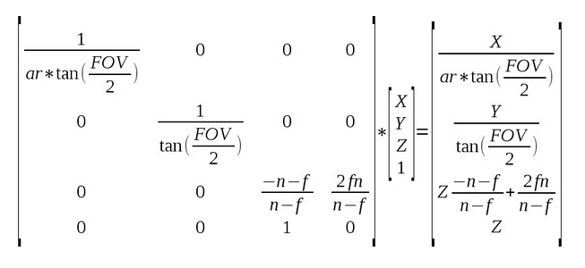
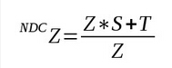
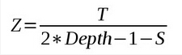
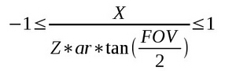
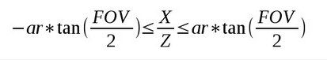
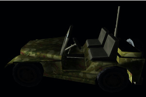

# 第四十六课 SSAO 与深度重构

## 背景

在上一课中我们学习了屏幕空间环境光遮挡算法，在这个算法中首先我们使用了一个缓存来存放每个像素在视图空间中的坐标信息。在这一课中我们要自我挑战一下，直接通过深度缓存来计算像素在视图空间中的位置坐标。这个方法的优点就在于更少的内存占用，因为这样的话我们只需要为每个像素保存一个浮点类型的深度值即可，而不是像之前那样的一个完整的三维向量。这一课的内容很大部分上都依赖于上一课的内容，所以在学习这一课之前要确保已经完全理解了上一课的内容。  

在 SSAO 算法中我们遍历窗口中的每一个像素，对于每个像素都在其视图空间坐标的周围生成一系列的随机点，对于每个随机点我们都将其投影到近裁剪面上，并对随机点的 Z 值与实际位于这个位置的像素的 Z 值进行比较。视图空间的位置坐标都是在主渲染循环开始时执行的几何阶段生成的，为了在缓存中保存正确的像素的视图空间坐标，我们同样需要深度缓存（否则像素的更新只基于绘制的先后顺序而不是深度信息）。但实际上我们可以只使用这个深度缓存中的数据来计算出每个像素在视图空间中的坐标，以此来减少内存空间的使用（当然还需要一些逐像素的算法）。

让我们回顾一下如何填充深度缓存（如果你想更加深入的回顾这个知识点，你可以参考 12 课中的内容）。首先我们使用 WVP 矩阵将位于模型局部坐标系下的顶点变换到裁剪空间中，其结果是一个 4D 向量而且其位于视图空间中的位置坐标的 Z 分量被保存到这个向量的第四个分量中。在顶点着色器中我们将位于裁剪空间的坐标存放到 gl\_Position 输出变量中，之后 GPU 对场景进行裁剪，并保留前三个分量在 （-W, W）之间的顶点（W 是顶点坐标的第四个分量，这个分量中存放的是当前顶点在视图空间中坐标的 Z 值）。之后 GPU 执行透视除法这意味着用这个向量除以其 W 分量，这样这个向量的前三个分量都位于（-1，1）之间了，而其最后一个分量变为了 1。这时候我们称这个向量位于 NDC (Normalized Device Coordinates)空间中。

顶点着色器中每次处理的顶点只是组成三角形的三个顶点中的一个，所以 GPU 都是在 NDC 空间下对组成三角形的三个向量之间进行插值并对得到的每个片元执行片元着色器。在片元着色器执行完成的时候 GPU 会根据 NDC 空间中向量的 Z 分量来更新深度缓存（基于正确配置的深度测试算法等）。还有非常重要的一点就是在将 Z 分量写入到深度缓存之前 GPU 会将其从（-1，1）的范围变换到（0，1）的范围之间，这一点我们必须十分小心否则又会出现一些异常。  

上面就是与深度缓存的操作有关数学相关知识，现在我们就介绍一下如何根据像素的深度信息来重新构建其在视图空间中的坐标。所有我需要的知识都可以从上面的描述中找到，但是在我们进一步讨论之前我们还是先来看看上面这个过程的矩阵表示而不是文字叙述。由于我们关注的是视图空间坐标，所有我们直接来看透视投影矩阵即可（因为投影矩阵就是作用在视图空间坐标上的）：  



上面的图片中就是从试图空间变换到裁剪空间的投影矩阵（右边是结果）。有一些细节需要注意：

- ar = 屏幕宽高比 (width/height)
- FOV = 视野角
- n = 近裁剪面
- f = 远裁剪面

为了在后面的使用中更加简单，我们将矩阵中位置（3，3）处的值定义为 ‘S’，位置（3，4）处的值定义为 ‘T’。这样在 NDC 空间中的 Z 值就可表示为（记住还有透视除法）：



由于我们会将 NDC 空间中的 Z 分量从 （-1，1）的范围变换到 （0，1）的范围中，所以实际写入到深度缓存中的值应该是：

  

现在我们就可以很容易的从上面的公式中得到视图空间下的 Z 坐标。结果如下：

  

现在我们得到了视图空间中坐标的 Z 分量，现在我们看看如何能求得 X 和 Y 分量。需要记住的是我们在将顶点的 X 分量和 Y 分量变换到裁剪空间之后对其进行了裁剪，并进行透视除法（除以其 W 分量，W 分量实际上就是视图空间中坐标的 Z 分量）。现在所有顶点的 X、Y 分量现在都位于（-1，1）的范围之间的 NDC 空间中 ，实际上 -1 和 1 分别对应于屏幕的左、右，同样也对应于屏幕的底部和顶部，这意味着对于屏幕中的每一个像素的坐标下面的等式成立（下面只写出了 X 分量的等式，同样的这个等式在去掉 ‘ar’ 后也对 Y 分量成立）：

  

同样也可以写成下面这种形式：

  

注意这个不等式的左边部分和右边部分都是常量数据，都可以在绘制之前在应用程序中计算出来，这样我们就可以借助于一个覆盖全屏的四边形以及 GPU 的插值计算出每个像素在视图空间中 X 或者 Y 分量与 Z 分量的关系，这样在计算出 Z 分量之后就能求得在视图空间中的 XY 分量了。

## 代码

```
(tutorial46.cpp:101)
float AspectRatio = m_persProjInfo.Width / m_persProjInfo.Height;
m_SSAOTech.SetAspectRatio(AspectRatio);
float TanHalfFOV = tanf(ToRadian(m_persProjInfo.FOV / 2.0f));
m_SSAOTech.SetTanHalfFOV(TanHalfFOV); 
```

正如我之前说的那样，在这一课我们只会介绍与前一课中不同的部分，首先不同的就是我们需要向 SSAO 着色器传递屏幕的宽高比信息和视野角的二分之一角正切值。

```
(tutorial46.cpp:134)
if (!m_depthBuffer.Init(WINDOW_WIDTH, WINDOW_HEIGHT, true, GL_NONE)) {
    return false;
}
```

之后我们需要初始化几何缓存（类变量名也从 m\_gBuffer 改为了 m\_depthBuffer）并将其内部格式设置为 GL\_NONE，这样就只会创建深度缓存。具体实现可以参见 Common 项目中的 io\_buffer.cpp 文件。

```
(tutorial46.cpp:181)
void GeometryPass()
{
    m_geomPassTech.Enable(); 
    m_depthBuffer.BindForWriting();
    glClear(GL_DEPTH_BUFFER_BIT);
    m_pipeline.Orient(m_mesh.GetOrientation());
    m_geomPassTech.SetWVP(m_pipeline.GetWVPTrans());
    m_mesh.Render(); 
}
void SSAOPass()
{
    m_SSAOTech.Enable(); 
    m_SSAOTech.BindDepthBuffer(m_depthBuffer); 
    m_aoBuffer.BindForWriting();
    glClear(GL_COLOR_BUFFER_BIT); 
    m_quad.Render(); 
}
```

在几何阶段和 SSAO 阶段我们可以看到现在都使用了 m\_depthBuffer，并且我们也不需要再调用 glClear 函数来清空颜色缓存因为 m\_depthBuffer 中本来就不包含颜色缓冲区。到这里主程序中的变化就基本上是这些了，你会发现这一部分的改动很少，大部分变化都在着色器代码中。

```
(geometry_pass.vs/fs)
 #version 330
layout (location = 0) in vec3 Position; 
uniform mat4 gWVP;
// uniform mat4 gWV;
// out vec3 ViewPos; 
void main()
{ 
    gl_Position = gWVP * vec4(Position, 1.0);
    // ViewPos = (gWV * vec4(Position, 1.0)).xyz;
}
 #version 330
// in vec3 ViewPos;
// layout (location = 0) out vec3 PosOut; 
void main()
{
    // PosOut = ViewPos;
}
```

上面就是经过修改之后的几何阶段的顶点着色器代码和片元着色器代码，这里面很多东西都不再需要我们输出了，因为我们现在只需要将深度数据输出即可，其他与视图空间坐标相关的数据都不再需要了。实际上片元着色器现在已经是空的了。

```
(ssao.vs)
 #version 330
layout (location = 0) in vec3 Position; 
uniform float gAspectRatio;
uniform float gTanHalfFOV;
out vec2 TexCoord;
out vec2 ViewRay;
void main()
{ 
    gl_Position = vec4(Position, 1.0);
    TexCoord = (Position.xy + vec2(1.0)) / 2.0;
    ViewRay.x = Position.x * gAspectRatio * gTanHalfFOV;
    ViewRay.y = Position.y * gTanHalfFOV;
}
```

根据上面提到的数学知识（“背景” 中的最后部分）我们需要在 SSAO 的顶点着色器中生成一个叫做 ViewRay 的变量，结合在片元着色器中生成的计算出的片元在视图空间中的 Z 坐标，我们就能够得到当前像素在视图空间中坐标的 X 分量和 Y 分量。注意这里我们是如何根据传入的全屏四边形来生成最终的需要的数据的。  

```
(ssao.fs)
 #version 330
in vec2 TexCoord;
in vec2 ViewRay;
out vec4 FragColor;
uniform sampler2D gDepthMap;
uniform float gSampleRad;
uniform mat4 gProj;
const int MAX_KERNEL_SIZE = 64;
uniform vec3 gKernel[MAX_KERNEL_SIZE];
float CalcViewZ(vec2 Coords)
{
    float Depth = texture(gDepthMap, Coords).x;
    float ViewZ = gProj[3][2] / (2 * Depth -1 - gProj[2][2]);
    return ViewZ;
}
void main()
{
    float ViewZ = CalcViewZ(TexCoord);
    float ViewX = ViewRay.x * ViewZ;
    float ViewY = ViewRay.y * ViewZ;
    vec3 Pos = vec3(ViewX, ViewY, ViewZ);
    float AO = 0.0;
    for (int i = 0 ; i < MAX_KERNEL_SIZE ; i++) {
        vec3 samplePos = Pos + gKernel[i];
        vec4 offset = vec4(samplePos, 1.0);
        offset = gProj * offset;
        offset.xy /= offset.w;
        offset.xy = offset.xy * 0.5 + vec2(0.5);
        float sampleDepth = CalcViewZ(offset.xy);
        if (abs(Pos.z - sampleDepth) < gSampleRad) {
            AO += step(sampleDepth,samplePos.z);
        }
    }
    AO = 1.0 - AO/64.0;
    FragColor = vec4(pow(AO, 2.0));
}
```

在片元着色器中我们做的第一件事就是计算当前像素在视图空间中的坐标的 Z 分量，它的计算公式与我们在 ‘背景’ 中提到的一样。在上一课中我们也用到的投影矩阵，在这一课中我们只需要访问矩阵中位于（3，3）处的 ‘S’ 变量和位于 （3，4） 处的 ‘T’ 变量即可。需要小心的是矩阵的索引是在 0 到 3 之间的，而且由于矩阵被转置了，所以我们也要对 ‘T’ 变量的位置进行转置。

只要计算出了 Z 分量，我们就能得到其 X 分量和 Y 分量。之后我们像之前一样生成随机点并对这些随机点进行投影，这里我们也使用同样的技巧来计算投影点的深度值。

## 操作结果
  