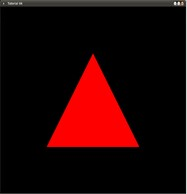

#第五课 Uniform Variables
##Background  
在本教程中我们将接触到一个新的着色器变量类型——一致变量。属性变量与一致变量之间的区别：属性变量包含顶点特性数据所以每次调用shader都会从顶点缓冲区中重新导入新的数据，而一致变量中的值在整个绘制过程中都保持不变。这意味着我们在绘制过程之前就为一致变量赋值并且在着色器的每次调用中都可以访问这个相同的值。一致变量对于保存光照参数（光源位置和光照方向等），变换矩阵、纹理对象句柄等都是非常有用的。

在此教程中我们最终实现的功能是使某些东西在屏幕上不停的运动。要实现这个功能，我们需要使用一个一致变量和 GLUT 库提供的 idle() 回调函数，一致变量的值在每一帧中都会被改变。问题在于 GLUT 并不会反复调用我们的渲染回调函数——除非它不得不调用。GLUT 只有在如下列事件发生时才会强制调用渲染回调函数：最大化或者最小化窗口、被另一个窗口遮挡，遮挡窗口移除等。如果我们在程序运行之后对窗口的布局不做任何变化则渲染回调函数只会调用一次。你可以通过在渲染函数中添加一个打印函数来验证，你会看到打印函数只执行一次，如果你将窗口最大化或者最小化你可以发现打印函数会再次被执行。在 GLUT 中只注册一个渲染回调函数对于前面的教程来说是合适的，但是现在我们想要不断的改变变量的值，要实现这个功能我们需要注册一个 idle() 回调。Idle函数会在窗口系统未接收到事件的时候被GLUT调用，你可以为 idle() 回调函数设计一个专用功能函数用于做一些与时间更新类似的记录工作，或者简单的将渲染回调函数注册为idle回调函数即可。在本教程中我们直接将渲染函数注册为idle回调函数并且在渲染函数中对一直变量进行更新。  

##Code Walkthru

```
glutIdleFunc(RenderSceneCB);
```

这里我们将渲染函数注册为 idle() 回调函数，需要注意的是如果你想使用一个专用的 idle() 回调函数那么你就需要在函数的最后调用 glutPostRedisplay() 函数，否则idle函数会被一次又一次的重复调用但是渲染函数却不会被重复调用。glutPostRedisplay() 将当前窗口标记为需要重新显示而且在 GLUT 的下一次仿真循环中渲染回调函数会被再一次调用。  

```
gScaleLocation = glGetUniformLocation(ShaderProgram, "gScale");
assert(gScaleLocation != 0xFFFFFFFF);
```

在对 Shader 程序对象进行链接之后我们需要从 Shader 程序对象中获取指向一致变量的地址。这是 C/C++ 应用程序执行环境需要映射 Shader 执行环境的另一个例子。当你编译 Shader 程序时 GLSL 会自动为每个一致变量分配一个索引，在 Shader 内部编译器就是通过索引来解决变量的访问问题的。通过使用程序对象句柄和变量的名字来调用 glGetUniformLocation 函数，应用程序同样可以获取这个索引，如果出现错误的话，这个函数会返回-1。所以错误检查是非常重要的（正如我们上面通过调用 assert() 函数一样）,否则如果出现错误，则更新之后的变量就不会被传递到 Shader 中去。调用这个函数失败的原因有两个：其一是你弄错了变量名，其二是变量被编译器优化掉了。如果 GLSL 编译器发现变量在 Shader 中并没有被使用，则编译器会将其剔除。在这种情况下调用 glGetUniformLocation 函数就会失败。  

```
static float Scale = 0.0f;
Scale += 0.001f;
glUniform1f(gScaleLocation, sinf(Scale));
```

我们定义一个静态 float 变量并且在每次调用渲染函数的时候使其值增加一点（如果它在你的机器上运动的太快或者太慢，你可以将0.001改得小一点或者大一点），实际上传递到 Shader 中的值是 Scale 变量的 sin 值，这是为了创建一个在 -1.0 和 1.0 之间的循环。需要注意的是 sinf（）使用弧度值而不是角度值作为参数，而在这里我们并没有过多关注这一点，我们只是需要 sin（）函数产生的这个波动值。Sinf（）所产生的结果通过 glUniform1f 函数传递到 Shader 中。OpenGL 提供了多个形如 glUniform{1234}{if} 的函数，你可以使用这些函数将值传递到 1D，2D，3D 或者 4D（由位于glUniform后面的数字确定）向量中，这些值可以是浮点数也可以是整数（由后缀‘i’和‘f’确定）。类似的我们也可以使用向量地址或者矩阵地址作为参数来传递一个向量或者矩阵。这个函数的第一个参数是我们通过 glGetUniformLocation() 获得的变量的索引地址。  

现在我们可以看看VS中的一些改变（FS没有进行任何改动）。  

```
uniform float gScale;
```

这里我们在 Shader 中声明一个一致变量  

```
gl_Position = vec4(gScale * Position.x, gScale * Position.y, Position.z,1.0);
```

在每一帧中，我们都让位置向量的 X 分量和 Y 分量乘上从应用程序中传入的值。你能解释下为什么三角形总是在旋转正负90度之间循环吗？  

##Operation Result  

