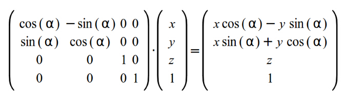
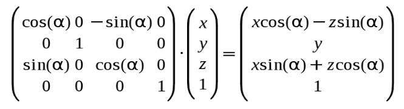
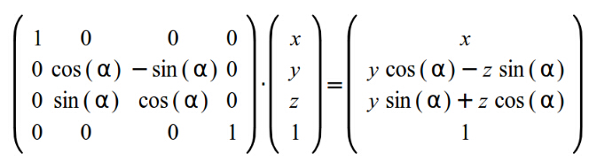
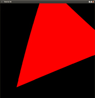

#第七课 旋转变换

##背景  
接下来的变换是旋转变换，就是说给定一个角度和点，我们将点绕着一个坐标轴旋转。在旋转过程中发生变化的总是ｘ，ｙ，ｚ三个坐标里面的其中两个，而不让第三个坐标值变化。这意味着，旋转路径总在三个坐标轴平面中的一个之中：绕 Z 轴的是 xy 面、绕 X 轴的是 yz 面、绕 Y 轴的是 xy 面。还有许多复杂的旋转变换可以让你绕任意一个向量旋转，但是眼下我们并不需要讨论这些。  

让我们概括地定义这个问题这个问题。看看下面的这个图：  

  

我们想沿着圆圈从（x1,y1）移动到（x2,y2）。也就是说我们让向量（x1,y1）转过a2角度。我们假设这个圆的半径是1。这意味着下列成立：

x1=cos(a1)  
y1=sin(a1)  
x2=cos(a1+a2)  
y2=sin(a1+a2)  

我们用下面的三角恒等式来产生 x2 和 y2 ：

cos(a+b) = cosacosb - sinasinb  
sin(a+b) = sinacosb+cosasinb

通过面的式子我们可以推导出：

x2=cos(a1+a2) = cosa1cosa2- sina1sina2 = x1cosa2- y1sina2  
y2=sin(a1+a2) = sina1cosa2+ cosa1sina2 = y1cosa2+ x1sina2

在上面的图中我们看向 xy 平面，Z 轴指向屏幕内部！如果 X 分量和 Y 分量是四维向量的一部分，那样上面的等式可以写成下面的矩阵形式（不影响 Z 和 W ）为：  

  

如果我们想创建一个绕着 Y 轴或者绕着 Z 轴的旋转变换矩阵，那么方程基本相同但是矩阵的安排却略有不同！这是绕Y轴旋转的矩阵：  

  

绕X轴的旋转矩阵为：  

  

##代码

在本节中程序的变化非常小，在编码中我们只改变其中旋转变换矩阵的内容：  

```
World.m[0][0]=cosf(Scale);               World.m[0][1]=-sinf(Scale);World.m[0][2]=0.0f;　　　　　　　　　　　World.m[0][3]=0.0f;
World.m[1][0]=sinf(Scale);　World.m[1][1]=cosf(Scale);  World.m[1][2]=0.0f;World.m[1][3]=0.0f;
World.m[2][0]=0.0f;       World.m[2][1]=0.0f;        World.m[2][2]=1.0f;　　　　　　　World.m[2][3]=0.0f;
World.m[3][0]=0.0f;       World.m[3][1]=0.0f;        World.m[3][2]=0.0f;　　　　　　　 World.m[3][3]=1.0f;
```

正如你所看到的，通过上面的程序我们将绘制的三角形绕 Z 轴不断的旋转。你也可以尝试其他的旋转变换，但是我认为这时候由于没有真正的从3D到2D的投影变换，所以旋转看起来有点奇怪。我们将在之后的章节中用一个完整的变换管线类来完成他们。

##操作结果
 


