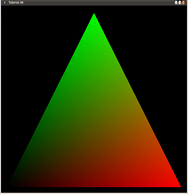

#第九课 插值
##背景
本章讲述三维渲染管线中的一个非常重要的部分——插值，它是光栅器对从顶点着色器中输出的变量所做的操作。正如你已经看到的，为了在屏幕上得到一些有意义的东西，你需要在顶点着色器（VS）中为 OpengGL 的一个内置变量 “gl_Position” 指定值。这个变量是一个四维向量，它里面存放的是顶点的其次坐标。这个变量中的 X、Y、Z 分量分别被除以其 W 分量（这个过程被称作透视除法，后面的教程会对其进行详细介绍）并且任何超出规范化空间（X Y介于【-1,1】间；Z 介于【0,1】之间）的成分都将被减掉。裁剪之后的结果会被转换到屏幕空间坐标系中，然后光栅器将此三角形（或其他任何 OpenGL 支持的图元类型）渲染到屏幕上。

光栅器在三角形的三个顶点之间执行插值（比如说扫描线算法或者其他技术），并且通过执行片元着色器来“访问”三角形内的每一个像素点。片元着色器会返回此片元的颜色值，光栅器会将这个颜色值更新到颜色缓冲区内并最终显示出来（在通过一些其他测试例如深度测试之后），而从顶点着色器中传出的其他任何变量都不会经历上述步骤。如果片元着色器没有明确的表示要使用那个变量（对于同一个顶点着色器，我们可以有多个片元着色器与之对应），那么一个驱动优化程序将对 VS 进行优化，并丢弃 VS 中的任何只影响该变量的指令（这个特定的程序指的是由一个 VS 和 FS 组合成的 Shader 程序）。然而如果 FS 确实用到这个变量，那么光栅器在光栅化过程会对这个变量进行插值。这通常意味着紧挨着的两个像素之间的值会有一点差异（尽管三角形离相机越远，这种现象会越来越不明显）。

常见的两个依赖于这种插值的变量是三角形的顶点法线和纹理坐标。顶点法线的值通常通过计算包含此顶点的所有三角形的顶点法线的平均值来得到。如果该对象不是平整的，这通常意味着这个三角形的三个顶点的法线值都是不同的。在这种情况下我们依靠插值来计算每一个像素的特定法线值。计算出来的顶点法线值用于在光照计算中使用，为的是使得光照效果更加逼真（每个像素的法线值都不一样，产生渐变的效果）。纹理坐标插值与此类似。这些坐标是模型的一部分，我们会为每一个顶点都指定一个纹理坐标。为了用纹理“覆盖”三角形，你需要对每一个像素点做同样的处理，并为其指定正确的纹理坐标。这些坐标是插值的结果。

在这一节中我们将会通过对三角形表面的颜色进行差值，使三角形表面产生渐变的效果。我们会在 VS 中计算得到各个顶点的颜色值，并将其传入片元着色器中，这样光栅器就会对其进行差值以得到渐变的效果。通常，我们还有其他的办法：比如让顶点缓存提供颜色。但一般情况下我们不会直接从顶点缓冲区中获取颜色。我们只是提供每个顶点的纹理坐标，最后根据纹理坐标从纹理中采样来获得顶点的颜色值，而这个颜色值会在后面的光照计算中进行处理。


##代码
```
out vec4 Color;
```

当我们要从着色器中传出一个变量时，必须用“out”关键字进行声明，并且必须是着色器中的全局变量。颜色是一个四维向量，因为 X、Y、Z 分量（分别）携带 RGB 值，而 W 是 alpha 值（像素的透明度）。

```
Color = vec4(clamp(Position, 0.0, 1.0), 1.0);
```

在渲染管线中的颜色通常用一个在【0.0 - 1.0】范围内的浮点值表示。对于每一个颜色通道其颜色值都会从【0.0 - 1.0】映射到【0 - 255】（共计有16M颜色）。我们通过一个与顶点位置相关的函数来为顶点生成颜色。首先我们用内置的clamp()函数来确保这些值始终位于 0.0 - 1.0 的范围。原因是三角形左下方的顶点位于-1，-1.如果我们不进行clamp()转换，那么这个值就会被光栅化程序插值，并且当三角形的 X 和 Y 坐标值都小于零的时候，三角形的那部分会被渲染成黑色，因为每一个小于或等于 0 的值都会被渲染为黑色。通过 clamping，我们使仅三角形左下角的顶点为黑色，而离它越远的地方颜色很快变得越来越亮。试着修改 clamp 函数，你可以将他全部删除或者改变其参数查看相应的效果。

Clamp 函数的结果不直接作为输出的颜色变量，因为颜色变量是一个四维向量而位置是一个三维向量（ clamp不会改变分量的个数，只改变他们的值）。对于 GLSL 来说这是不会进行默认的变换的，对此我们必须清楚明白。因而我们使用 “vec4(vec3,W)”，它通过将三维向量和用户提供的 W 值来创建一个四维向量。本例中我们使用 1.0，因为它作为颜色的 alpha 部分，用于确定像素的透明度，而我们想要像素点是完全不透明的。

```
in vec4 Color;
```

VS 输出的颜色变量是 FS 的输入变量。这个变量通过光栅化程序进行插值，所以每一个 FS(可能)会获得不同的颜色。

```
FragColor = Color;
```

我们用经过插值的颜色直接作为片元着色器的颜色而没有进一步的改变,本章到此结束。

##操作结果

